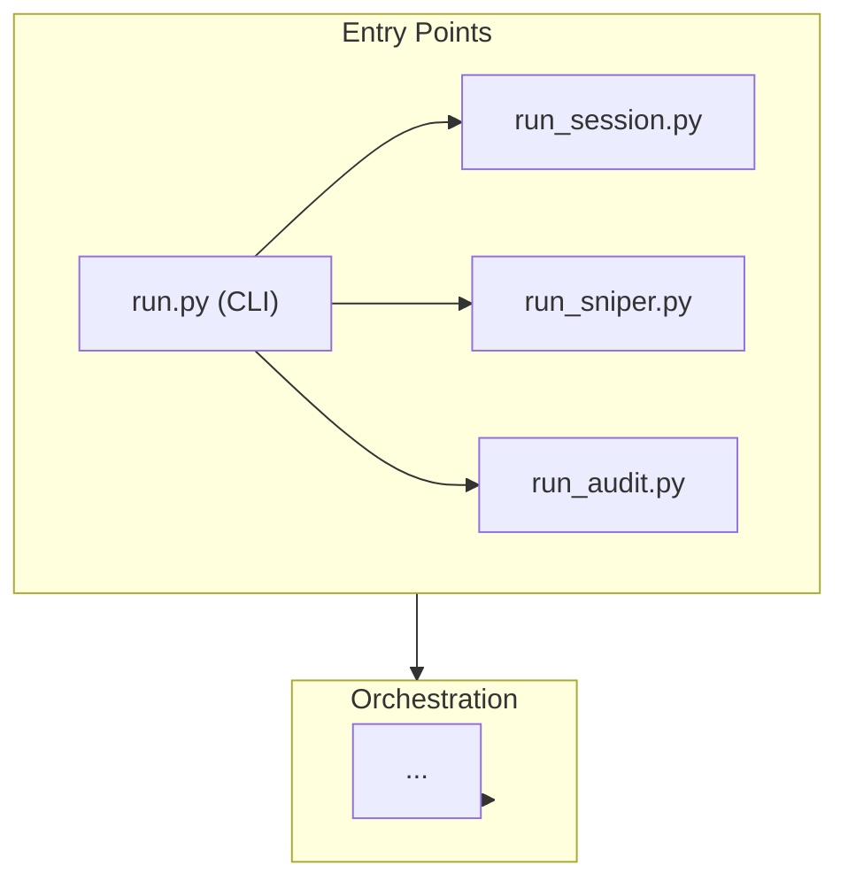
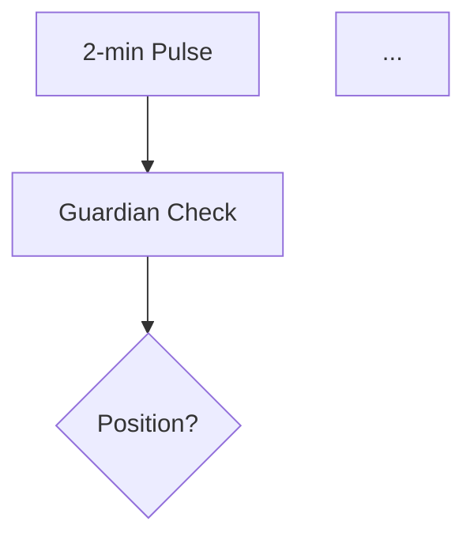
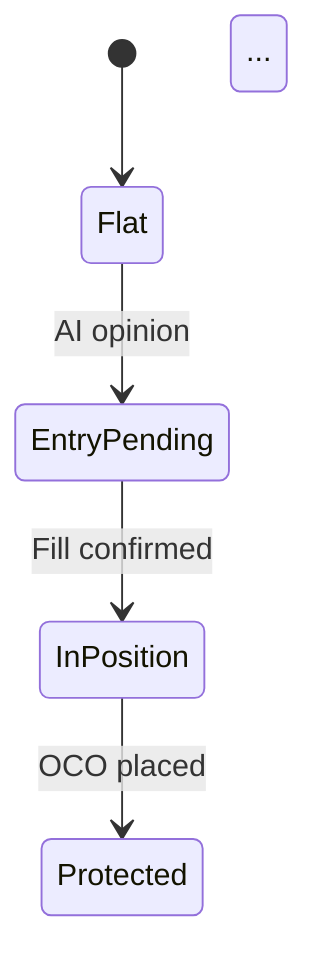
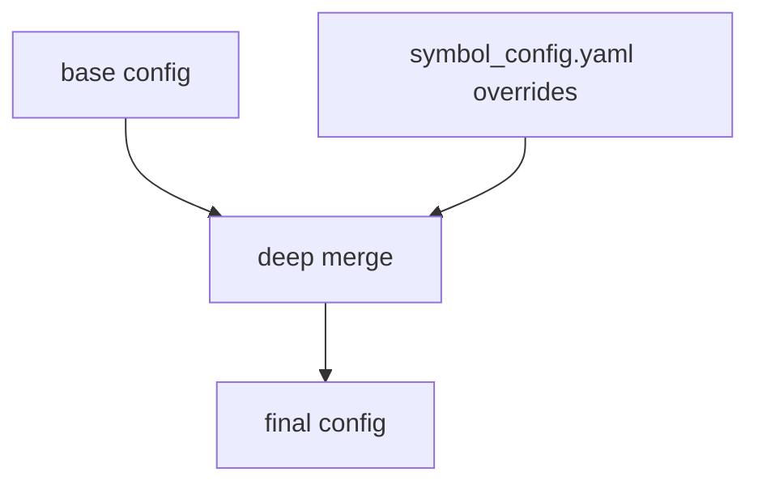

# Update README

Update the project README.md by scanning the codebase for current commands,
architecture, processes, and configuration — then generating accurate,
diagram-rich documentation.

## Workflow

### Step 0: Determine Update Mode

**Always start by asking the user which mode they want.** Present these options:

1. **🔄 完全重写 (Full Rewrite)** — scan entire codebase, regenerate all sections from scratch, overwrite README.md
2. **✏️ 部分更新 (Partial Update)** — update only selected sections, preserve everything else unchanged
3. **📋 仅更新 Commands (Commands Only)** — quick refresh of the commands/scripts reference section only

For option 2, also ask which sections to update:
- Architecture & Layer Stack
- Binary Star Protocol (debate flow, audit dimensions)
- Sniper System (signals, pulse flow, order lifecycle, Guardian)
- AI Providers
- Config System
- Commands & Scripts
- Installation & Setup
- Key Invariants

Let the user pick one or more, or "all of the above". If they pick "all", treat it as a full rewrite (option 1).

### Step 1: Scan the Codebase

Based on the selected mode/sections, scan the corresponding parts of the codebase.

#### Commands & Entry Points

```
→ Read run.py — extract all subcommands, their arguments, help text
→ Read each run_*.py — extract argparse definitions, standalone usage
→ List scripts/*.py — for each, extract argparse or parse docstring for usage
→ Check setup.py / pyproject.toml for console_scripts entry points
```

For each command, capture:
- The exact CLI invocation (e.g., `python run.py session --symbol BTC -p data/prod`)
- Required vs optional arguments
- A one-line description of what it does
- Any variants (live vs historical vs backtest)

#### Architecture

```
→ List src/ directory tree (depth 2-3)
→ For each top-level package: identify its role and key classes
→ Map inter-package dependencies (look at imports)
→ Identify the layer stack: entry points → orchestration → agents → analysis → infrastructure
```

#### Binary Star Protocol

```
→ Read src/agent/binary_star_orchestrator.py — extract execute_flow() logic
→ Read src/agent/debate_loop.py — extract debate round mechanics
→ Read src/agent/session_agent.py — understand what the session agent does
→ Read src/agent/critic_agent.py — understand critique dimensions
→ Read src/analyzer/math_fact_checker.py — understand physical verification
```

#### Sniper System

```
→ Read src/sniper/trigger.py — extract signal categories, types, thresholds
→ Read src/sniper/scout.py — understand market data harvesting
→ Read src/agent/order_executor.py — extract:
  - sync_with_opinion() logic (position cross-reference table)
  - guardian_check() logic (protection steps: partial TP + dynamic trailing SL)
  - _try_partial_tp() and _migrate_dynamic_sl() logic
  - get_avg_entry_price() FIFO entry calculation (margin_client.py)
  - Entry/exit flow
→ Read config/global_config.yaml — extract current sniper parameters (sniper.*, guardian.* sections)
→ Read config/symbol_config.yaml — extract per-symbol overrides
```

#### AI Providers

```
→ Read src/infrastructure/ai_client.py — AbstractAIClient contract
→ Read src/infrastructure/ai_factory.py — provider registry
→ Read each adapter in src/infrastructure/ai/ — capabilities, models
→ Check global_config.yaml for current provider settings
```

#### Config System

```
→ List config/ directory
→ Read src/config/sub_configs.py — config dataclass names
→ Read src/config/symbol_resolver.py — resolution logic
→ Read src/config/loader.py — load order
```

#### Key Invariants

```
→ Scan critical modules for docstrings mentioning invariants/contracts
→ Read src/utils/exceptions.py for error hierarchy
→ Check CLAUDE.md for documented invariants
```

### Step 2: Generate Content

For each section being updated, follow the formatting rules below.

#### General Principles

- **Tables over paragraphs** — whenever comparing or listing structured data
- **Mermaid diagrams over ASCII art** — for flows, sequences, states, relationships
- **Minimize crossed relationship lines** — diagram flow should be unidirectional where possible. Place nodes to avoid edge crossings: group related nodes, separate clean paths (e.g. emergency-close branch to one side), prefer `graph TB`/`stateDiagram-v2` linear layouts
- **One-line descriptions** — each module/class gets one crisp line, not a paragraph
- **Copyable command blocks** — every command should be directly copyable
- **Developers as audience** — assume technical competence, don't over-explain concepts

#### Mermaid Diagram Templates

**Architecture Layer Stack** — use a flowchart:


**Binary Star Debate** — use a sequence diagram:
```mermaid
sequenceDiagram
    participant MO as MarketObserver
    participant BSO as BinaryStarOrchestrator
    participant SA as SessionAgent
    participant MFC as MathFactChecker
    participant CA as CriticAgent
    ...
```

**Sniper Pulse Flow** — use a state diagram or flowchart:


**Order Lifecycle** — use a state diagram:


**Config Resolution** — use a flowchart:


#### Section-Specific Templates

Each section has a preferred format. See `references/templates.md` for full templates.

### Step 3: Assemble README

1. Generate each section independently
2. For full rewrite: assemble in this order:
   - Title + badges + one-liner description
   - Architecture (mermaid diagram + layer descriptions)
   - Binary Star Protocol (mermaid sequence + audit table)
   - Sniper System (signal table + pulse flow diagram + Guardian table + order lifecycle diagram)
   - Installation & Setup
   - Commands (grouped by category)
   - AI Providers (comparison table)
   - Config System (tree + resolution diagram)
   - Key Invariants (bullet list)
3. For partial update: replace only the selected sections in the existing README
4. For commands only: replace only the Commands section

### Step 4: Review & Finalize

1. Show the user a summary of changes (what sections were updated, key differences)
2. Ask: "Does this look correct? Any sections you want me to adjust?"
3. Make any requested adjustments
4. Write the final README.md

## Important Rules

1. **Never guess CLI arguments** — always read them from the actual argparse/add_argument calls in the source code
2. **Never hardcode tier levels** — read trailing stop tiers, thresholds, and parameters from the actual config YAML files
3. **Verify module existence** — before listing a module in architecture, confirm the file exists
4. **Keep mermaid syntax valid** — test that diagram syntax is correct (balanced brackets, valid node IDs, proper arrow syntax)
5. **Preserve manual content** — in partial update mode, never touch sections the user didn't select
6. **Match writing style** — the current README uses clean, technical English. Maintain that tone.
7. **Use git to check for new files** — `git diff --name-only HEAD~10` can surface recently added modules the scan might miss
