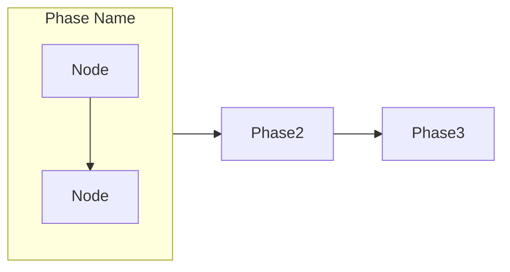
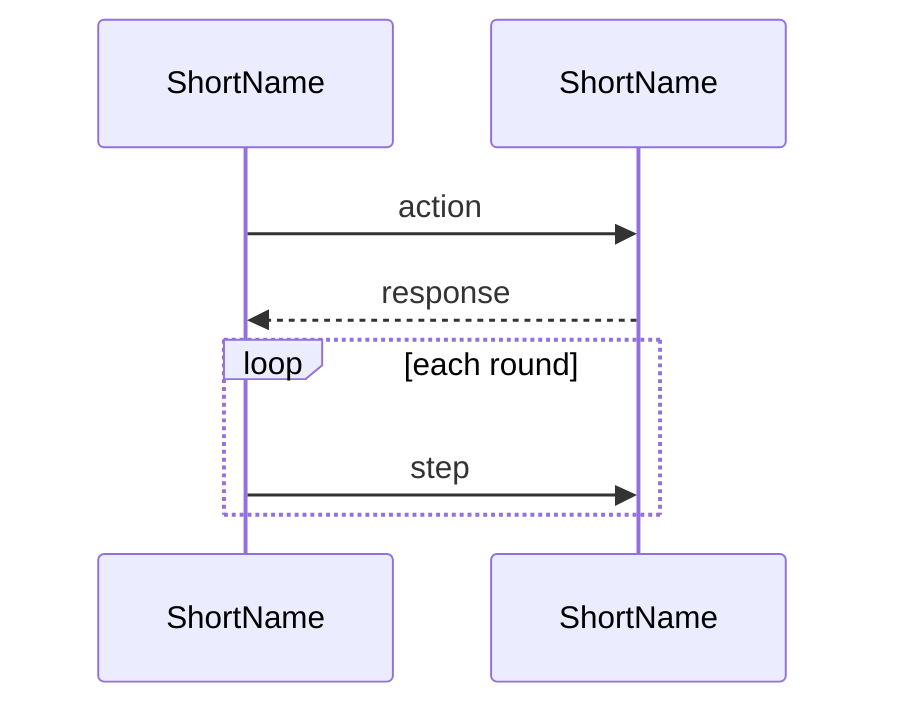
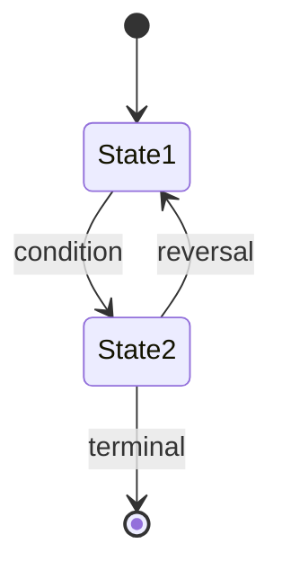
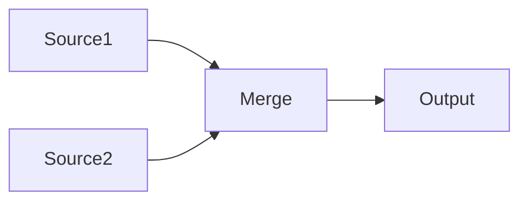

# Update README

Update the project README.md by scanning the codebase for current commands,
architecture, processes, and configuration — then generating accurate,
diagram-rich documentation.

## Workflow

### Step 0: Determine Update Mode

**Always start by asking the user which mode they want.** Present these options:

1. **🔄 完全重写 (Full Rewrite)** — scan entire codebase, regenerate all sections from scratch, overwrite README.md
2. **✏️ 部分更新 (Partial Update)** — update only selected sections, preserve everything else unchanged
3. **📋 仅更新 Commands (Commands Only)** — quick refresh of the commands/scripts reference section only

For option 2, also ask which sections to update:
- Architecture & Layer Stack
- Binary Star Protocol (debate flow, audit dimensions)
- Sniper System (signals, pulse flow, order lifecycle, Guardian)
- AI Providers
- Config System
- Commands & Scripts
- Installation & Setup
- Key Invariants

Let the user pick one or more, or "all of the above". If they pick "all", treat it as a full rewrite (option 1).

### Step 1: Scan the Codebase

Based on the selected mode/sections, scan the corresponding parts of the codebase.

#### Commands & Entry Points

```
→ Read run.py — extract all subcommands, their arguments, help text
→ Read each run_*.py — extract argparse definitions, standalone usage
→ List scripts/*.py — for each, extract argparse or parse docstring for usage
→ Check setup.py / pyproject.toml for console_scripts entry points
```

For each command, capture:
- The exact CLI invocation (e.g., `python run.py session --symbol BTC -p data/prod`)
- Required vs optional arguments
- A one-line description of what it does
- Any variants (live vs historical vs backtest)

#### Architecture

```
→ List src/ directory tree (depth 2-3)
→ For each top-level package: identify its role and key classes
→ Map inter-package dependencies (look at imports)
→ Identify the layer stack: entry points → orchestration → agents → analysis → infrastructure
```

#### Binary Star Protocol

```
→ Read src/agent/binary_star_orchestrator.py — extract execute_flow() logic
→ Read src/agent/debate_loop.py — extract debate round mechanics
→ Read src/agent/session_agent.py — understand what the session agent does
→ Read src/agent/critic_agent.py — understand critique dimensions
→ Read src/analyzer/math_fact_checker.py — understand physical verification
```

#### Sniper System

```
→ Read src/sniper/trigger.py — extract signal categories, types, thresholds
→ Read src/sniper/scout.py — understand market data harvesting
→ Read src/agent/order_executor.py — extract:
  - sync_with_opinion() logic (position cross-reference table)
  - guardian_check() logic (protection steps: exit ladder + SL lock)
  - _try_exit_ladder() and _apply_sl_lock() logic
  - get_avg_entry_price() FIFO entry calculation (margin_client.py)
  - Entry/exit flow
→ Read config/global_config.yaml — extract current sniper parameters (sniper.*, guardian.* sections)
→ Read config/symbol_config.yaml — extract per-symbol overrides
```

#### AI Providers

```
→ Read src/infrastructure/ai_client.py — AbstractAIClient contract, VisualMode enum, VisualPart, AIResponse, begin_session/end_session lifecycle
→ Read src/infrastructure/ai_factory.py — provider registry
→ Read each adapter in src/infrastructure/ai/ — capabilities, models, visual_mode
→ Check global_config.yaml for current provider settings (active_provider, model, reasoning_effort)
→ Check global_config.yaml binary_star + evolver sections for temperature config (no longer per-provider)
```

#### Config System

```
→ List config/ directory
→ Read src/config/sub_configs.py — config dataclass names
→ Read src/config/symbol_resolver.py — resolution logic
→ Read src/config/loader.py — load order
```

#### Key Invariants

```
→ Scan critical modules for docstrings mentioning invariants/contracts
→ Read src/utils/exceptions.py for error hierarchy
→ Check CLAUDE.md for documented invariants
```

### Step 2: Generate Content

#### General Principles

- **High-level, not tutorial** — assume a technically competent reader. One paragraph per section, then tables/diagrams. Skip implementation detail unless it is architecturally significant.
- **Tables over paragraphs** — compare, list, contrast
- **Diagrams over tables** — flows, sequences, states go in mermaid
- **One-liner descriptions** — each module/class gets one crisp line
- **Copyable commands** — every command directly copyable
- **Low word count** — if a section exceeds a table + 3 sentences, it is too long

#### Diagram Principles (CRITICAL)

- **ZERO crossing lines** — the strongest signal of a well-structured diagram. If ANY two edges cross, restructure or split
- **One diagram, one story** — if a single diagram tries to tell two stories (e.g. signal flow AND evolution), split them. Multiple smaller diagrams are ALWAYS better than one complex one
- **`graph LR` for linear pipelines** — left-to-right flow with unidirectional arrows
- **`sequenceDiagram` for time-ordered flows** — when participants exchange messages in order
- **`stateDiagram-v2` for state machines** — when an entity transitions between states
- **No backtracking arrows** — every arrow should move forward. Side-loops (like debate rounds) use `loop` blocks in sequence diagrams or separate subgraphs
- **Group with subgraphs** — related nodes go in `subgraph` containers; never let edges cross subgraph boundaries diagonally

#### Diagram Types

**Linear pipeline** (`graph LR`):


**Time-based protocol** (`sequenceDiagram`):


**State machine** (`stateDiagram-v2`):


**Config / data flow** (`graph LR`):


#### Section-Specific Templates

Each section has a preferred format. See `references/templates.md` for full templates.

### Step 3: Assemble README

1. Generate each section independently
2. For full rewrite: assemble in this order:
   - Title + badges + one-liner description
   - Architecture (mermaid diagram + layer descriptions)
   - Binary Star Protocol (mermaid sequence + audit table)
   - Sniper System (signal table + pulse flow diagram + Guardian table + order lifecycle diagram)
   - Installation & Setup
   - Commands (grouped by category)
   - AI Providers (comparison table)
   - Config System (tree + resolution diagram)
   - Key Invariants (bullet list)
3. For partial update: replace only the selected sections in the existing README
4. For commands only: replace only the Commands section

### Step 4: Review & Finalize

1. Show the user a summary of changes (what sections were updated, key differences)
2. Ask: "Does this look correct? Any sections you want me to adjust?"
3. Make any requested adjustments
4. Write the final README.md

## Important Rules

1. **Read from source** — CLI args from argparse, config values from YAML, module names from filesystem. Never guess.
2. **Keep mermaid valid** — balanced brackets, valid syntax, ZERO crossing lines. Split before crossing.
3. **Preserve existing content** — in partial update mode, never touch unselected sections.
4. **Conciseness is correctness** — every sentence must earn its place. If a section exceeds a table + 3 sentences, cut it. Prefer one crisp line over a paragraph.
5. **Grounded in code** — `git diff --name-only HEAD~10` for recent additions; verify file existence before referencing.
