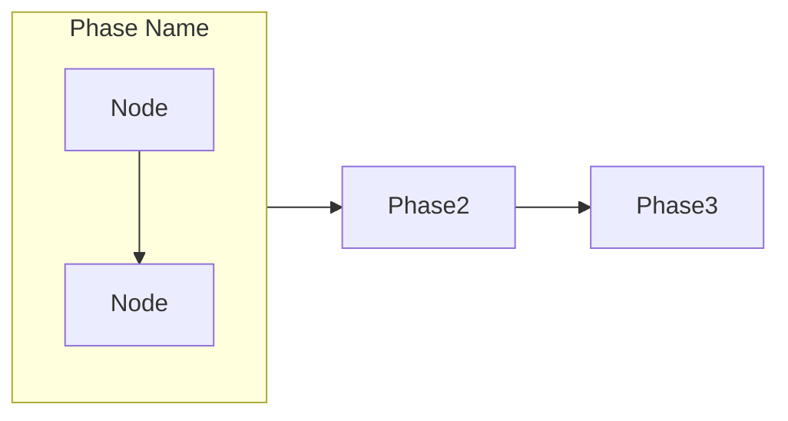
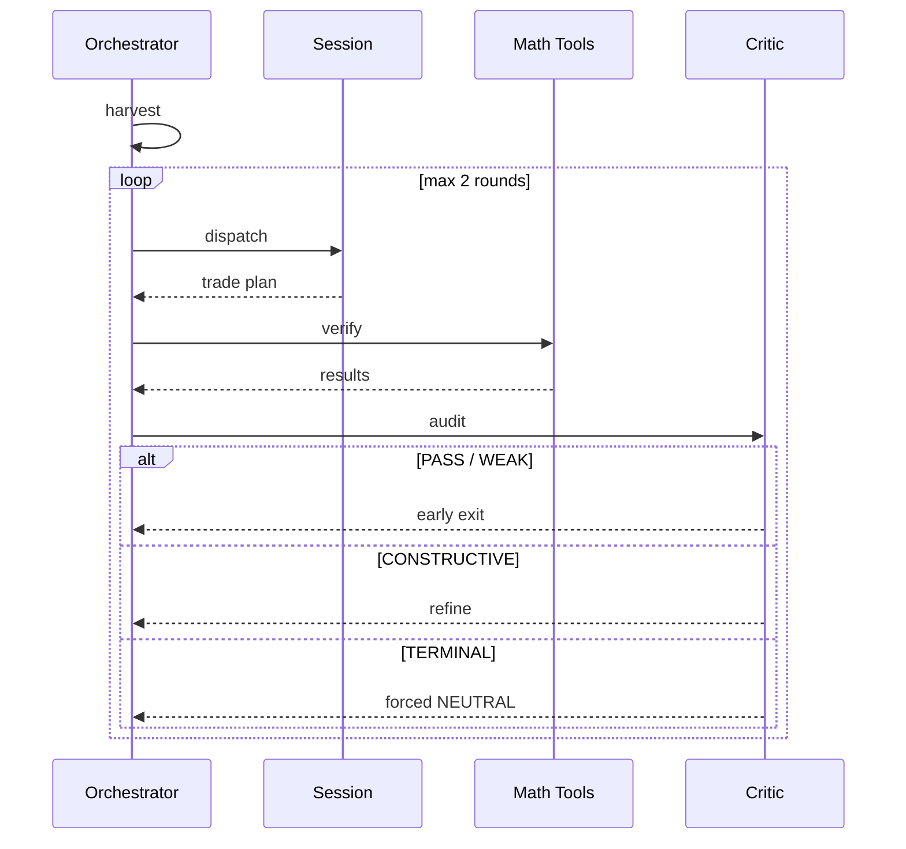
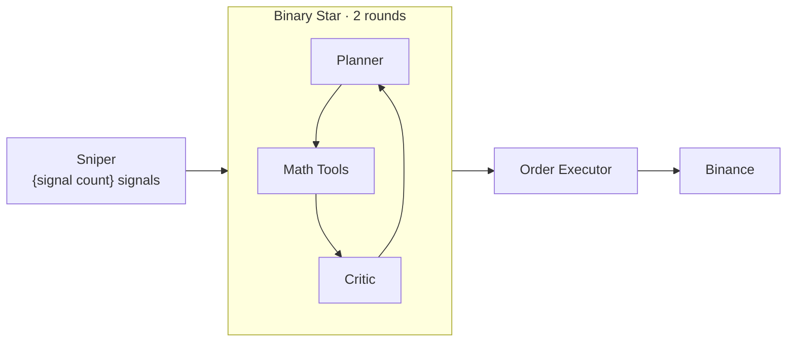
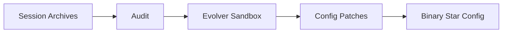

# Update README

Update the project README.md by scanning the codebase for current commands,
architecture, processes, and configuration — then generating accurate,
diagram-rich documentation.

## Content Priorities

The README tells this story, in this order:

1. **Opening** (hook) — one punchy paragraph. Lead with Binary Star: "two LLMs debate your trade." Not a feature list.
2. **Binary Star** (hero) — debate protocol: Planner, Critic, Math Tools, veto levels. AI providers and confidence scoring are mentioned inline here — no separate sections for them.
3. **Architecture** — TWO diagrams: runtime pipeline + offline evolution loop (see Architecture Rules below)
4. **Sniper** (minimal) — signal stack provides timing
5. **Order Management** (minimal) — one table
6. **Evolution** (minimal) — one paragraph
7. **Installation** — two lines: `pip install -e .` + `.env.example`
8. **Commands** (last) — 4 groups: Sessions, Sniper, Backtest, Audit & Evolution

**DO NOT** include: code layer stacks, file paths, implementation details, backtest descriptions, standalone AI Provider or Config System sections, signal weight tables, prerequisites lists, or "Utilities" command groups. The reader came to see Binary Star, not the build system.

## Workflow

### Step 0: Determine Update Mode

**Always start by asking the user which mode they want.** Present these options:

1. **🔄 完全重写 (Full Rewrite)** — scan entire codebase, regenerate all sections from scratch, overwrite README.md
2. **✏️ 部分更新 (Partial Update)** — update only selected sections, preserve everything else unchanged
3. **📋 仅更新 Commands (Commands Only)** — quick refresh of the commands/scripts reference section only

For option 2, also ask which sections to update:
- Opening (hook paragraph)
- Binary Star Protocol (debate flow, veto levels — AI providers + confidence scoring mentioned inline)
- Architecture (overview diagram)
- Sniper (signal stack overview)
- Order Management (OTOCO, OCO, exit ladder, trailing SL)
- Evolution (sandbox + patch generation)
- Installation
- Commands (Sessions, Sniper, Backtest, Audit & Evolution)

Let the user pick one or more, or "all of the above". If they pick "all", treat it as a full rewrite (option 1).

### Step 1: Scan the Codebase

Based on the selected sections, scan only what's needed.

#### Binary Star Protocol (PRIMARY — deep scan)

```
→ Read src/agent/binary_star_orchestrator.py — overall flow, entry point
→ Read src/agent/debate_loop.py — round mechanics, convergence criteria
→ Read src/agent/session_agent.py — Session agent (the Planner role): what it sees, what it produces
→ Read src/agent/critic_agent.py — Critic agent: veto levels, audit dimensions
→ Read src/analyzer/math_fact_checker.py — Math Tools: deterministic RR, ATR, structural checks
```

Extract the multi-agent architecture:
- Which agents participate, in what role
- How debate rounds work (plan → verify → audit → converge or loop)
- Early exit criteria vs max-rounds resolution (TERMINAL → NEUTRAL if unresolved)
- The critic's veto system — ALL FOUR levels: PASS, WEAK, CONSTRUCTIVE, TERMINAL
- Confidence scoring dimensions (topographical armor, regime sync, temporal physics)
- Math Tools is NOT an LLM agent — it's a deterministic Python-side verifier (RR, ATR, structural shielding). Use "Math Tools" not "Math Auditor" to avoid confusion with the Critic role.

#### Architecture (light scan)

```
→ List src/ directory top-level packages only (depth 1)
→ Identify the major system boundaries: trigger → debate → execution
→ Identify the offline loop: session archives → audit → evolution → config patches
```

Produce TWO diagrams:
1. **Runtime pipeline** — Sniper → Binary Star Debate (subgraph) → Order Executor → Binance
2. **Evolution loop** — Session Archives → Audit → Evolver Sandbox → Config Patches → Binary Star Config

**Architecture Rules:**
- Only Binary Star Debate gets a `subgraph` wrapper — it's the hero. Other nodes are standalone.
- Subgraph labels must be short: `"Binary Star · 2 rounds"`, not `"Binary Star Debate — max 2 rounds"`.
- The Evolution loop does NOT connect to Sniper — it feeds into Binary Star Config, which is outside the signal pipeline scope.

#### Sniper System (minimal scan)

```
→ Read src/sniper/trigger.py — count registered signal detectors (currently 9, grouped into FLOW/SIZE/ENERGY/STRUCTURAL/POSITIONING categories)
→ Read config/global_config.yaml — extract sniper.signal_stack trigger_threshold, regime_modifiers, cooldown
```

Capture only: "{signal count from code} signals in 5 categories, regime-adaptive threshold (base threshold × per-regime modifier from config), emergency override, adaptive cooldown." Always read actual threshold values from `config/global_config.yaml` — do NOT hardcode them. The Sniper's job is to find good entry timing for Binary Star — nothing more.

#### Order Management (minimal scan)

```
→ Read src/agent/order_executor.py — confirm guardian_check has three cases:
  Case 1 (entry pending), Case 3 (place OCO), Case 4 (exit ladder + trailing)
→ Read config/global_config.yaml — guardian.exit_ladder levels (just count them)
```

Capture only: "OTOCO atomic entry, Guardian OCO protection, breakeven + trailing exit ladder (partial TP + TP-relative trailing), dynamic trailing SL."

#### Evolution (minimal scan)

```
→ Read src/agent/evolver_agent.py — confirm it runs as a sandboxed evolution loop
→ Read config/global_config.yaml — evolution parameters (population, generations)
```

Capture only: "Sandboxed strategy evolution that outputs config patches consumed by Binary Star."

#### AI Providers + Config (inline, not standalone sections)

```
→ Count adapters in src/infrastructure/ai/ (just the number — 2)
→ Note active_provider from config/global_config.yaml
```

These get a one-line mention inside the Binary Star section. No separate sections.

#### Commands (4 groups only)

```
→ Read run.py — extract subcommands for: session, sniper, backtest-run, audit, evolution, patch
→ Ignore scripts/*.py entirely
```

Capture one representative invocation per group. Groups: Sessions, Sniper, Backtest, Audit & Evolution.
Include `patch` as a subcommand within the Audit & Evolution group — it applies evolution proposals to config.
Sniper example MUST include `--llm` and `--trade`. Do NOT include a Dashboard command unless it actually exists in `run.py`.

### Step 2: Generate Content

#### Design Philosophy

The README must be **scannable at a glance** — a reader who spends 10 seconds scrolling should already understand what this project does and whether it is interesting. Every design decision flows from this:

- **Visual hierarchy**: diagram first, then table, then text. The eye lands on the diagram, reads the table for detail, skips the text.
- **Breathing room**: generous whitespace between sections. Short paragraphs (2-3 sentences). No walls of text.
- **Progressive disclosure**: architecture diagram → deep-dive sections for those who scroll further.
- **Low cognitive load**: if a section makes the reader stop and re-read, it is too complex. Split it or simplify it.

#### Content Rules

- **Diagram > table > paragraph** — a picture first, then structured data, then prose only if nothing else works
- **One-liner descriptions** — each agent, signal, or concept gets exactly one crisp line
- **Assume competence** — the reader is technical; skip tutorial-level exposition
- **Hard word budget** — any section longer than a table + 3 sentences is too long. Cut it

#### Diagram Principles (CRITICAL)

- **ZERO crossing lines** — the strongest signal of a well-structured diagram. If ANY two edges cross, restructure or split
- **One diagram, one story** — if a single diagram tries to tell two stories (e.g. signal flow AND evolution), split them. Multiple smaller diagrams are ALWAYS better than one complex one. This project specifically needs TWO architecture diagrams: runtime pipeline + offline evolution loop.
- **`graph LR` for linear pipelines** — left-to-right flow with unidirectional arrows
- **`sequenceDiagram` for time-ordered flows** — when participants exchange messages in order. Every agent gets its own `participant` column — never hide an agent as a self-loop on another participant. The Binary Star diagram MUST have 4 participants: Orchestrator, Session, Math Tools, Critic.
- **`stateDiagram-v2` for state machines** — when an entity transitions between states
- **No backtracking arrows** — every arrow should move forward. Side-loops (like debate rounds) use `loop` blocks in sequence diagrams or separate subgraphs
- **Subgraphs are selective** — only highlight the hero component (Binary Star Debate). Don't wrap every node in a subgraph. If a node stands alone, let it be a standalone node.
- **Subgraph labels must be short** — `"Binary Star · 2 rounds"` not `"Binary Star Debate — max 2 rounds"`. Long labels overflow and look broken.

#### Diagram Types

**Linear pipeline** (`graph LR`):


**Time-based protocol** (`sequenceDiagram`) — every agent is an explicit column:


**Runtime pipeline** (`graph LR`) — only the hero component gets a subgraph:


**Evolution loop** (`graph LR`) — offline, separate from runtime:


#### Section-Specific Templates

Each section has a preferred format. See `references/templates.md` for full templates.

### Step 3: Assemble README

1. Generate each section independently
2. Assemble in this order:
   - Title + badges + opening hook (punchy, Binary Star focus)
   - Binary Star Protocol (4-participant sequenceDiagram + 4-row veto table — AI providers + confidence scoring mentioned inline)
   - Architecture (TWO diagrams: runtime pipeline + evolution loop)
   - Sniper (one paragraph with actual threshold values)
   - Order Management (one table)
   - Evolution (one paragraph)
   - Installation (two lines: pip install + .env.example, mention exchange + LLM keys)
   - Commands (4 groups + patch, placed last)
3. For partial update: replace only the selected sections in the existing README
4. For commands only: replace only the Commands section

### Step 4: Review & Finalize

1. Show the user a summary of changes (what sections were updated, key differences)
2. Ask: "Does this look correct? Any sections you want me to adjust?"
3. Make any requested adjustments
4. Write the final README.md

## Important Rules

1. **Read from source** — CLI args from argparse, config values from YAML, module names from filesystem. Never guess.
2. **Verify signal count** — count registered detectors in `trigger.py` (currently 9). `leader_sync` is a separate mechanism, not a detector.
3. **Veto levels are 4, not 3** — PASS, WEAK, CONSTRUCTIVE, TERMINAL. Check `config/prompts/critic.md` for the full 18-condition code table.
4. **Math Tools, not Math Auditor** — it's a deterministic Python verifier, not an LLM agent. Using "Auditor" confuses it with the Critic role.
5. **Architecture is TWO diagrams** — runtime pipeline (Sniper → Binary Star → Executor → Binance) and evolution loop (Archives → Audit → Evolver → Config → Binary Star Config). Do NOT merge them. Only Binary Star gets a subgraph wrapper.
6. **Subgraph labels must be short** — max ~20 characters. Use `"Binary Star · 2 rounds"` not `"Binary Star Debate — max 2 rounds"`.
7. **Sequence diagram needs all 4 columns** — Orchestrator, Session, Math Tools, Critic. Never hide an agent as a self-loop.
8. **Keep mermaid valid** — balanced brackets, valid syntax, ZERO crossing lines. Split before crossing.
9. **Preserve existing content** — in partial update mode, never touch unselected sections.
10. **Conciseness is correctness** — every sentence must earn its place. Prefer one crisp line over a paragraph.
11. **Grounded in code** — verify file existence before referencing. Run `git diff --name-only HEAD~10` for recent additions.
12. **No code paths** — never mention file names, line numbers, or class names in the README output.
