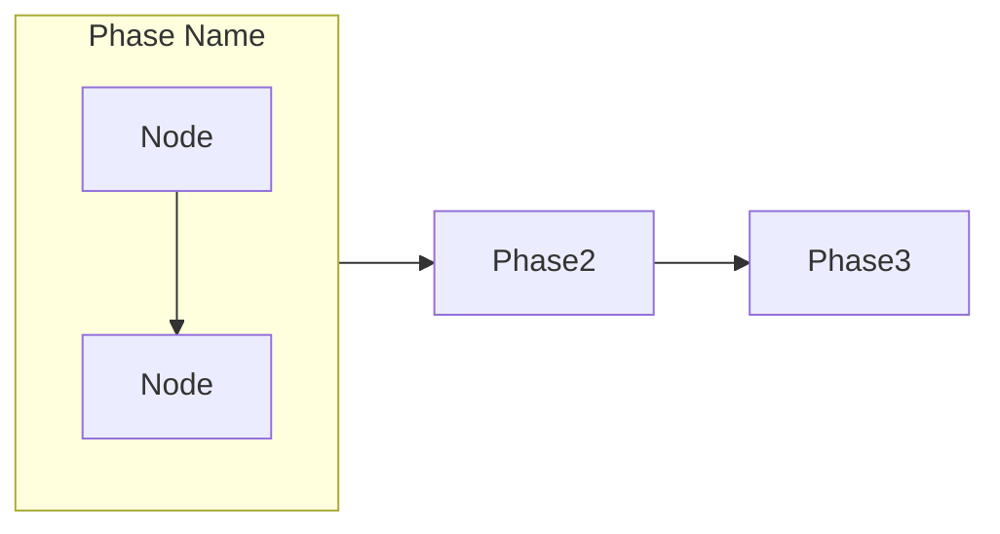
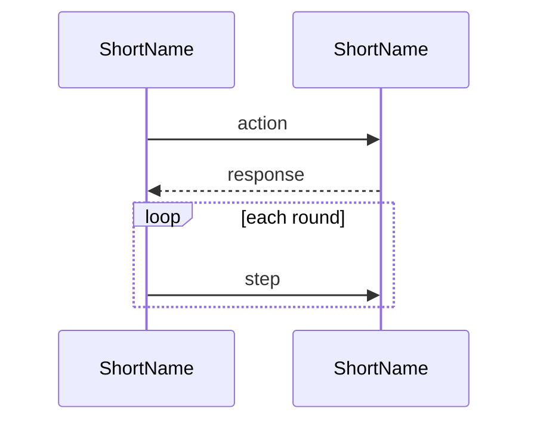
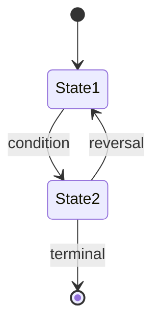
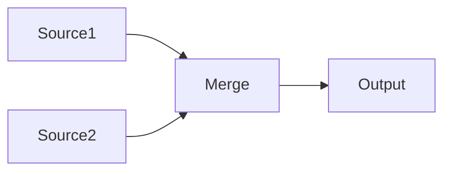

# Update README

Update the project README.md by scanning the codebase for current commands,
architecture, processes, and configuration — then generating accurate,
diagram-rich documentation.

## Content Priorities

The README tells this story, in this order:

1. **Binary Star** (hero) — multi-agent debate protocol: how Planner, Critic, and Math Auditor collaborate to produce a physically-verified trading decision
2. **Architecture** (context) — one clean diagram showing how the pieces connect
3. **Sniper** (minimal) — local signal stack that provides timing/trigger context for Binary Star
4. **Order Management** (minimal) — position protection: partial TP + trailing SL
5. **Evolution** (minimal) — sandbox that generates strategy/config patches for Binary Star
6. **AI Providers** — which models power which agents
7. **Config System** — how configuration flows from files to agents
8. **Commands** — what the operator actually runs

**DO NOT** include: code layer stacks, file paths, implementation details, or backtest descriptions. The reader came to understand the architecture, not the codebase.

## Workflow

### Step 0: Determine Update Mode

**Always start by asking the user which mode they want.** Present these options:

1. **🔄 完全重写 (Full Rewrite)** — scan entire codebase, regenerate all sections from scratch, overwrite README.md
2. **✏️ 部分更新 (Partial Update)** — update only selected sections, preserve everything else unchanged
3. **📋 仅更新 Commands (Commands Only)** — quick refresh of the commands/scripts reference section only

For option 2, also ask which sections to update:
- Binary Star Protocol (debate flow, multi-agent architecture, audit dimensions)
- Architecture (overview diagram)
- Sniper (signal stack overview, trigger timing)
- Order Management (position protection, partial TP, trailing SL)
- Evolution (sandbox + patch generation)
- AI Providers
- Config System
- Commands & Scripts
- Installation & Setup

Let the user pick one or more, or "all of the above". If they pick "all", treat it as a full rewrite (option 1).

### Step 1: Scan the Codebase

Based on the selected sections, scan only what's needed.

#### Binary Star Protocol (PRIMARY — deep scan)

```
→ Read src/agent/binary_star_orchestrator.py — overall flow, entry point
→ Read src/agent/debate_loop.py — round mechanics, convergence criteria
→ Read src/agent/session_agent.py — Planner agent: what it sees, what it produces
→ Read src/agent/critic_agent.py — Critic agent: veto levels, audit dimensions
→ Read src/analyzer/math_fact_checker.py — Math Auditor: RR, betweenness, ATR checks
```

Extract the multi-agent architecture:
- Which agents participate, in what role
- How debate rounds work (plan → audit → converge or loop)
- Early exit criteria vs forced convergence
- The critic's veto system (PASS / CONSTRUCTIVE / TERMINAL)
- Confidence scoring dimensions (D1 topographical, D2 regime, D3 temporal)

#### Architecture (light scan)

```
→ List src/ directory top-level packages only (depth 1)
→ Identify the major system boundaries: trigger → debate → execution → evolution
```

Produce ONE clean diagram showing these boundaries, nothing more.

#### Sniper System (minimal scan)

```
→ Read src/sniper/trigger.py — count signal categories and types (don't list them all)
→ Read config/global_config.yaml — extract sniper.signal_stack trigger_threshold, cooldown
```

Capture only: "13 signals in 5 categories, regime-adaptive threshold, adaptive cooldown." The Sniper's job is to find good entry timing for Binary Star — nothing more.

#### Order Management (minimal scan)

```
→ Read src/agent/order_executor.py — confirm guardian_check has three cases:
  Case 1 (entry pending), Case 3 (place OCO), Case 4 (exit ladder + trailing)
→ Read config/global_config.yaml — guardian.exit_ladder levels (just count them)
```

Capture only: "OTOCO atomic entry, Guardian OCO protection, 3-level partial TP, dynamic trailing SL."

#### Evolution (minimal scan)

```
→ Read src/agent/evolver.py or equivalent — confirm it runs as a sandbox
→ Read config/global_config.yaml — evolution parameters (population, generations)
```

Capture only: "Sandboxed strategy evolution that outputs config patches consumed by Binary Star."

#### AI Providers

```
→ Read src/infrastructure/ai_factory.py — provider registry
→ List adapters in src/infrastructure/ai/ — capabilities, models, vision support
→ Check config/global_config.yaml for active_provider, model, temperature settings
```

#### Config System

```
→ List config/ directory (top level only)
→ Note resolution order: global → strategy → symbol → session opinion
```

#### Commands

```
→ Read run.py — extract all subcommands, their arguments, help text
→ Read each run_*.py — extract argparse definitions
→ List scripts/*.py — for each, extract argparse or parse docstring for usage
```

For each command, capture:
- The exact CLI invocation
- Required vs optional arguments
- A one-line description
- Any variants (live vs historical vs backtest)

### Step 2: Generate Content

#### Design Philosophy

The README must be **scannable at a glance** — a reader who spends 10 seconds scrolling should already understand what this project does and whether it is interesting. Every design decision flows from this:

- **Visual hierarchy**: diagram first, then table, then text. The eye lands on the diagram, reads the table for detail, skips the text.
- **Breathing room**: generous whitespace between sections. Short paragraphs (2-3 sentences). No walls of text.
- **Progressive disclosure**: architecture diagram → deep-dive sections for those who scroll further.
- **Low cognitive load**: if a section makes the reader stop and re-read, it is too complex. Split it or simplify it.

#### Content Rules

- **Diagram > table > paragraph** — a picture first, then structured data, then prose only if nothing else works
- **One-liner descriptions** — each agent, signal, or concept gets exactly one crisp line
- **Assume competence** — the reader is technical; skip tutorial-level exposition
- **Hard word budget** — any section longer than a table + 3 sentences is too long. Cut it

#### Diagram Principles (CRITICAL)

- **ZERO crossing lines** — the strongest signal of a well-structured diagram. If ANY two edges cross, restructure or split
- **One diagram, one story** — if a single diagram tries to tell two stories (e.g. signal flow AND evolution), split them. Multiple smaller diagrams are ALWAYS better than one complex one
- **`graph LR` for linear pipelines** — left-to-right flow with unidirectional arrows
- **`sequenceDiagram` for time-ordered flows** — when participants exchange messages in order
- **`stateDiagram-v2` for state machines** — when an entity transitions between states
- **No backtracking arrows** — every arrow should move forward. Side-loops (like debate rounds) use `loop` blocks in sequence diagrams or separate subgraphs
- **Group with subgraphs** — related nodes go in `subgraph` containers; never let edges cross subgraph boundaries diagonally

#### Diagram Types

**Linear pipeline** (`graph LR`):


**Time-based protocol** (`sequenceDiagram`):


**State machine** (`stateDiagram-v2`):


**Config / data flow** (`graph LR`):


#### Section-Specific Templates

Each section has a preferred format. See `references/templates.md` for full templates.

### Step 3: Assemble README

1. Generate each section independently
2. Assemble in this order:
   - Title + badges + one-liner description
   - Binary Star Protocol (hero — multi-agent debate diagram + audit dimensions)
   - Architecture (one clean pipeline diagram, no layer table)
   - Sniper (minimal — signal stack triggers Binary Star timing)
   - Order Management (minimal — OTOCO entry + OCO protection + exit ladder)
   - Evolution (minimal — sandbox that outputs config patches)
   - AI Providers (comparison table)
   - Config System (tree + resolution diagram)
   - Installation & Setup (3 steps)
   - Commands (grouped code blocks, placed last)
3. For partial update: replace only the selected sections in the existing README
4. For commands only: replace only the Commands section

### Step 4: Review & Finalize

1. Show the user a summary of changes (what sections were updated, key differences)
2. Ask: "Does this look correct? Any sections you want me to adjust?"
3. Make any requested adjustments
4. Write the final README.md

## Important Rules

1. **Read from source** — CLI args from argparse, config values from YAML, module names from filesystem. Never guess.
2. **Keep mermaid valid** — balanced brackets, valid syntax, ZERO crossing lines. Split before crossing.
3. **Preserve existing content** — in partial update mode, never touch unselected sections.
4. **Conciseness is correctness** — every sentence must earn its place. If a section exceeds a table + 3 sentences, cut it. Prefer one crisp line over a paragraph.
5. **Grounded in code** — `git diff --name-only HEAD~10` for recent additions; verify file existence before referencing.
6. **No code paths** — never mention file names, line numbers, or class names in the README output. The reader did not come for a code tour.
