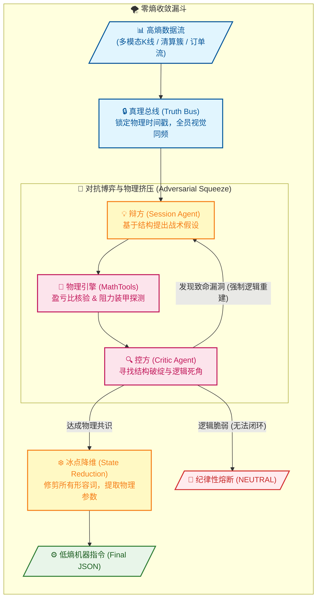

# Singularity 跨代交易会话引擎

[](https://www.python.org/downloads/)

---

## ⚖️ 零熵架构：双子星对抗协议 (The Binary Star Protocol)

Singularity 是一个高保真、多智能体量化架构。它的内核模拟了极高标准的法庭辩论与审判过程，通过 **对抗式推理 (Adversarial Reasoning)** 来彻底消除人类交易员的主观偏见与 AI 智能体的数据幻觉。

每一次最终输出的交易指令，都必须在这场高压的生存游戏中，经历从复杂的市场混沌状态，到冷静、确定性的低熵参数的提纯。其核心机制如下：

- **统一场 (Truth Bus)**：**数据一致性锚定。** 将多维市场数据（K线、订单流、情绪等）硬性锚定在同一秒的物理切片上。系统采用 **DTO-First (数据传输对象优先)** 架构，通过标准的 `KlineData` / `OpenInterestData` 模型进行物理级灌装，杜绝大模型的解析幻觉，确保博弈全员视觉同频。
- **物理挤压 (The Squeeze)**：**逻辑一致性核验。** 辩方 (Session Agent) 负责提出战略蓝图，而控方 (Critic Agent) 执行致命交叉盘问。在 v7.1 架构中，这一过程被强化为“战略审查”，AI 不再参与算术细节。
- **零熵对齐 (Zero-Entropy Alignment)**：**[v7.1 核心升级]** 系统通过后端“数据清洗网关 (Sanitization Gateway)”实现了 100% 的物理一致性。Session Agent 的计算权被彻底剥夺并托管给物理引擎。无论 AI 是否产生幻觉，Orchestrator 都会强制将 tactical_parameters 覆盖为 Python 计算出的物理真理，确保最终指令集 (JSON) 的绝对确定性。
- **状态降维 (State Reduction)**：**执行一致性冷凝。** 当对抗各方逼近“数学交集”后，系统将抛弃 LLM 的人文修饰词，在绝对理性的低温度下，将共识瞬间冷凝为可直接执行的低熵机器参数 (JSON)。



### 🧠 零熵逻辑阵列 (The Zero-Entropy Logic Matrix)

为了实现物理级的“强制逼近”，系统不再区分传统的主观分析流派，而是将所有多通道数据统一映射为一套严格的**逻辑考察点与熔断条款**：

| 审查维度 (Audit Dimension) | 触发条件与核心 Tags | 物理意义与执行协议 (Physical Meaning & Execution Rules) |
| :--- | :--- | :--- |
| **物理极点与装甲** | `[ANCHOR_VIOLATION]` | **结构重压约束**。止损位必须由极点（HVN/POC/Wick）全遮蔽。严禁在平坦地带裸露止损。 |
| **真空与流动性流失** | `[STRUCTURAL_TRAP]` <br> `[LIQUIDITY_VOID]` | **滑点与真空保护**。入场点离 HVN 太近，或将止损摆在没有任何订单簿厚度保护的真空区，必须进行退让。 |
| **数学盈亏底线** | `[MATH_VIOLATION]` | **无情数学核验**。Python 引擎硬核算盈亏比 (RR) 与 ATR。只有数学过关的提案才有资格进入下一轮辩论。 |
| **微观订单流向** | `[FLOW_VIOLATION]` | **流动性顺应**。强制跟随大户 Taker 净流向，严禁在没有吸收迹象时逆势强接飞刀。|
| **冰山吸收陷阱** | `[CVD_ABSORPTION]` | **墙体探测**。发现极端 CVD 脉冲被完全吸收，证明遭遇冰山挂单堵截，强制要求在远端结构区部署 DLE。 |
| **散户挤压/清算** | `[RETAIL_LONG_SQUEEZE]` <br> `[RETAIL_SHORT_SQUEEZE]` | **反向极性收割**。探测到散户持仓极度失衡（如 80% 做多），严禁随波逐流送死，强制发动相反方向的“极性反转”。 |
| **宏观政体/时间轴** | `[VOLATILITY_CHOP]`, `[VOLATILITY_CLIMAX]`<br>`Highway / Dead Water` | **动态时间止损**。依据波动率判定政体（死水/标准/高速公路/高潮）缩放持仓周期。无方向绞肉机行情直接触发熔断。 |
| **均值引力极限** | `[GRAVITY_EXHAUSTION]` <br> `[OVER_EXTENSION]` | **钟摆引力判定**。判定价格是否已经过度逃离核心价值区 (POC)。禁止在引力极限处追突破，强制寻求均值回归。 |
| **懦弱与踏空惩罚** | `[INACTION_BIAS]` <br> `[OPPORTUNITY_DENIAL]` | **机会损失矫正**。当大趋势爆发、结构依然清晰时，若系统给出无理由的退缩，强行责令其入场！在 v7.1 中，该逻辑受“大赦条款”保护，防止逻辑死锁。 |
| **局部极端衰竭** | `wick_skew_instant` | **针尖探测**。捕捉当前单根 K 线的影线反转信号，用于定位极短线的流动性真空与反转点。 |
| **吸筹/派发状态** | `wick_skew_regime` | **波段趋势背景**。统计最近根数内的影线偏差，判断市场处于持续性的“高位压制”还是“低位支撑”制度中。 |
| **趋势爆发前奏** | `squeeze_factor` <br> `volume_participation` | **共识确认**。探测流动性弹簧的极限压缩状态，用于提前预伏阵地；并在突破时通过成交参与率验证真实性。 |
| **演化死循环** | `[PROTOCOL_VIOLATION]` | **逻辑死锁保护**。严禁系统在被证伪的废墟上重复提出同一个错误方案。逼迫系统发生强制的“范式转移”。 |
| **收敛绿灯状态** | `[PRISTINE]` <br> `[JUSTIFIED_INACTION]` | **合法终局**。经过交叉盘问后确认为完全合规的结构性进场（绿灯执行），或基于明确事实纪律性放弃（战略撤退）。 |

---

## 🛠 安装与操作手册

### 0. 环境准备 (重要)

```bash
# crypto 是 Conda 环境名称
conda activate crypto
# pip install -r requirements.txt
```

<!-- pytest -vs ./tests -->

### 1. 市场推理 (Session Engine)

*   **单次/批量分析 (Prod)**：对当前市场或指定时间点进行对抗推理。结果存入 `data/prod/sessions`。
```bash
python run_session.py
python run_session.py -ts 2026-01-24T15:42:00Z
```

*   **智联回测 (Backtest)**：在历史样本点上进行采样推理。推荐使用 `--sampling-mode sniper` 以捕捉异动。
```bash
python run_session.py --start T-30d --end T-2d --samples 7 --sampling-mode sniper
python run_session.py --start T-30d --end T-2d --samples 7 --sampling-mode spaced
python run_session.py --start T-30d --end T-23d --samples 7 --sampling-mode sniper
python run_session.py --start T-23d --end T-16d --samples 7 --sampling-mode sniper
python run_session.py --start T-16d --end T-9d --samples 7 --sampling-mode sniper
python run_session.py --start T-9d --end T-2d --samples 7 --sampling-mode spaced
```

*   **实时监控 (Sniper Mode)**：基于 **v7.1 零熵三类觉醒探测器**（TYPE_A 势能 / TYPE_B 动能 / TYPE_C 结构）捕捉异动。系统参数已在 `global_config.yaml` 中实现垂直硬化，实现 1:1 的工程映射备份。
```bash
python run_sniper.py --trigger --email
```

### 2. 取证审计 (Forensic Audit)
对 Session(s) 进行深度审计并生成报告。通过 `forensic_resolution` 进行微秒级回溯，核验执行质量。
```bash
python run_audit.py -p data/prod
python run_audit.py -p data/backtest --file data/backtest/sessions/{symbol}_session_{timestamp}.json
```

### 3. 账本看板 (Ledger Dashboard)
系统的可视化看板。它支持对“Audit(s) 审计报告” 或 “Sandbox 报告”进行 HTML 渲染，展示 MAE/MFE 物理特征：
```bash
python scripts/session_ledger.py -p data/backtest
python scripts/session_ledger.py -p data/backtest --f .../{symbol}_evolution_sandbox_{timestamp}.json
```

### 4. DNA 引擎 (Meta-Evolution)
基于 Audit 报告对逻辑进行“基因突变”式优化。评估体系采用 **Fitness Scoring Ladder**，综合考量 MAE、结果偏差及“聪明避战”奖励（补丁存入 `data/backtest/evolution/proposals`）。
```bash
python run_evolution.py -p data/backtest
```

### 5. 物理同步 (Patching)
正式将补丁“硬化”到系统。它会自动同步更新系统的配置文件与提示词。
```bash
python run_patch.py -f .../{symbol}_evolution_{timestamp}.json
```

---