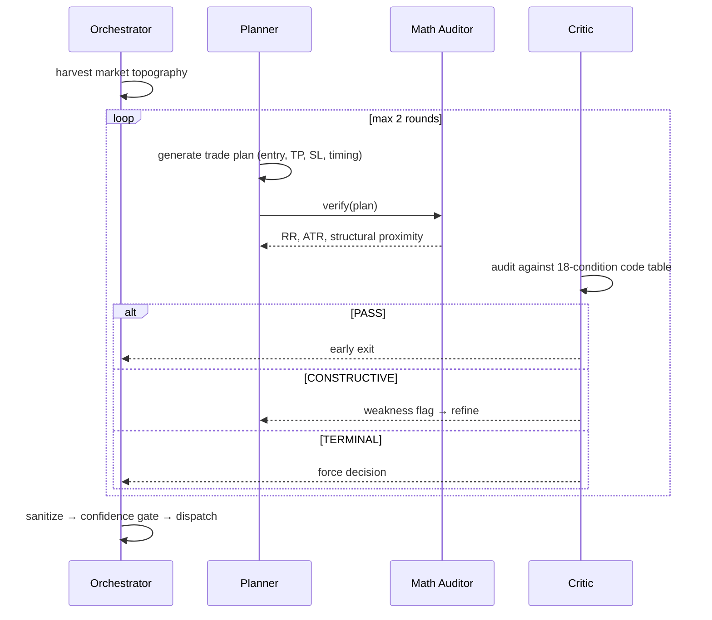
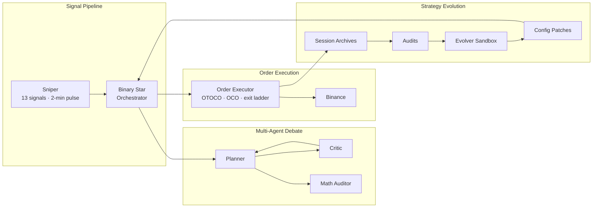

# Singularity

[](https://www.python.org/downloads/)

What if two LLMs debated your trade before it hit the market? **Binary Star** pits a Planner against a Critic — one proposes, the other tears it apart. A Math Auditor (no LLM, pure computation) anchors both to physical reality. The debate converges in at most 2 rounds; if they can't agree, the system forces a decision. Below the confidence threshold, the trade never fires.

---

## Binary Star Protocol



### Veto Levels

| Veto | Effect |
|------|--------|
| **PASS** | Plan is sound — early exit, no further rounds |
| **CONSTRUCTIVE** | Fixable flaws — feedback loop, Planner refines |
| **TERMINAL** | Unfixable — forced convergence, plan accepted as-is |

Every plan carries a 0-100 confidence score across three dimensions (topographical armor, regime sync, temporal physics). Scores below threshold are rejected — the debate produces a decision, but the gate refuses to act on it. Two LLM adapters (DeepSeek, Gemini) power Planner and Critic via a shared config.

---

## Architecture



---

## Sniper

A local signal stack (13 signals, 5 categories) monitors the market at 2-minute pulses. A regime-adaptive confluence engine decides when to activate Binary Star. Its sole job is timing — it does not trade.

---

## Order Management

| Phase | Mechanism |
|-------|-----------|
| Entry | OTOCO — atomic limit entry with nested TP/SL |
| Protection | Guardian OCO — every position wrapped in TP+SL |
| Profit-taking | 3-level exit ladder (44/64/84% TP progress) |
| Stop migration | Dynamic trailing SL as ladder levels fire |

---

## Evolution

An offline sandbox evaluates strategy variants against historical sessions. Winners produce config patches that feed back into Binary Star.

---

## Installation

```bash
pip install -e .
cp .env.example .env  # add your provider API key
```

---

## Commands

```bash
# ── Sessions ────────────────────────────────────────────
python run.py session --symbol BTC -p data/prod

# ── Sniper ──────────────────────────────────────────────
python run.py sniper --symbol BTC,XAUT -p data/prod --trade 640

# ── Backtest ────────────────────────────────────────────
python run.py backtest-run --symbol BTCUSDT --start 2026-01-01 --samples 100

# ── Audit & Evolution ───────────────────────────────────
python run.py audit -p data/prod
python run.py evolution --symbol BTC --samples 50 -p data/prod

# ── Dashboard ───────────────────────────────────────────
python run.py dashboard -p data/prod
```
