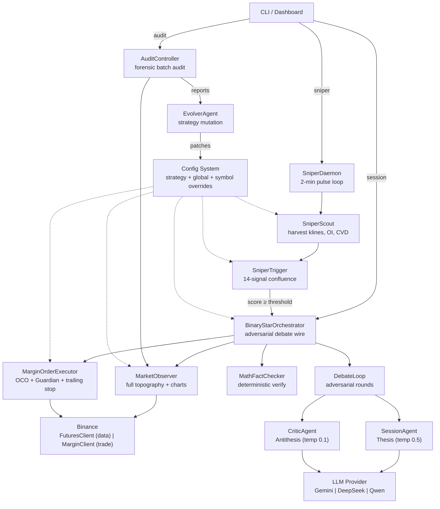
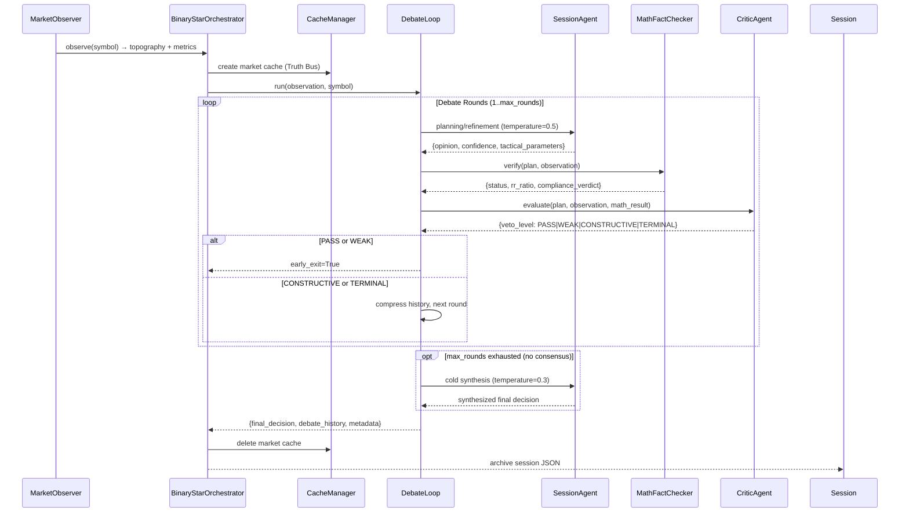
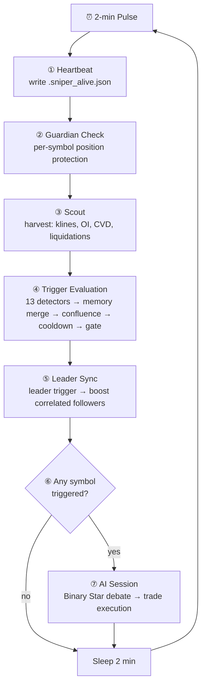
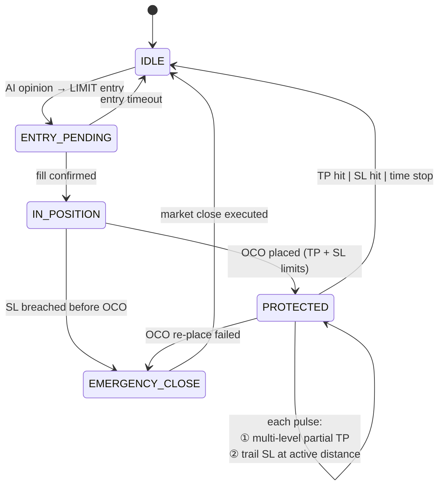
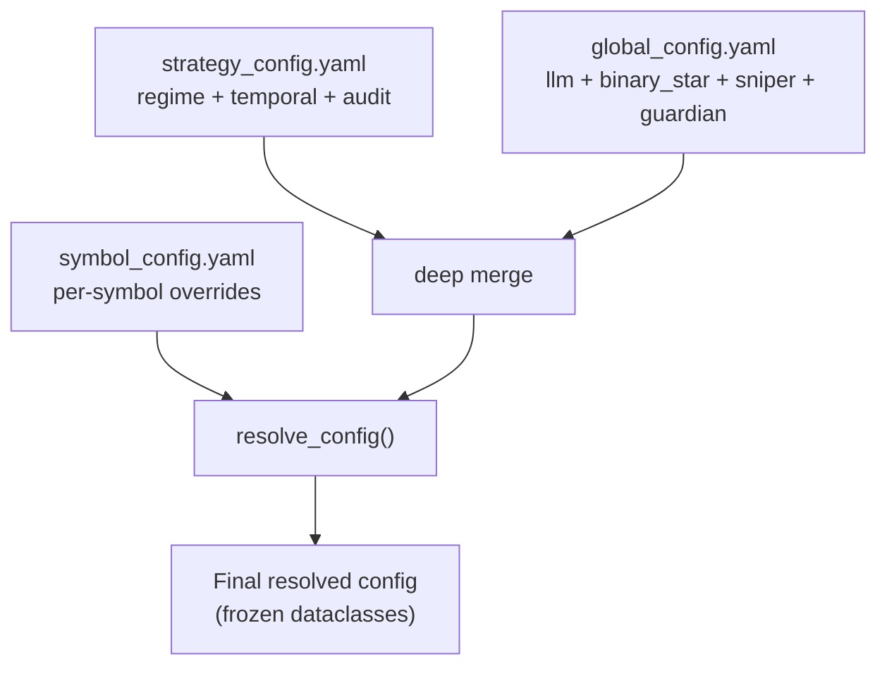

# Singularity

[](https://www.python.org/downloads/)

AI-driven crypto quantitative trading engine. Its core innovation is the **Binary Star adversarial protocol**: two LLM agents (Session Analyst proposing trades, Critic Agent auditing them) debate in rounds to converge on zero-entropy trade decisions. A third agent (Evolver) uses forensic audit results to mutate strategy parameters via sandbox-validated evolutionary patches.

A lightweight **Sniper daemon** monitors market topography at 2-minute pulses. Its 14-signal confluence engine only activates the heavyweight Binary Star reasoning engine when signal stacking exceeds a regime-adaptive threshold — saving LLM tokens during quiet markets.

---

## Architecture



### Layer Descriptions

| Layer | Module | Role |
|-------|--------|------|
| **Entry Points** | `run.py`, `run_*.py` | CLI + standalone scripts; each `run_*.py` is independently invocable |
| **Dashboard** | `src/dashboard/` | FastAPI server, Jinja2 templates, REST API for session/sniper/audit/backtest |
| **Orchestration** | `binary_star_orchestrator.py`, `debate_loop.py` | Wires MarketObserver → DebateLoop → MathFactChecker → SessionAgent → CriticAgent |
| **AI Agents** | `session_agent.py`, `critic_agent.py`, `evolver_agent.py` | LLM agents for trade thesis, adversarial critique, and strategy evolution |
| **Sniper** | `src/sniper/` | Lightweight pulse monitor: Scout harvests market data, Trigger evaluates 14-signal confluence |
| **Trade Execution** | `src/agent/order_executor.py` | MarginOrderExecutor: position cross-referencing, synthetic OCO, Guardian multi-level partial TP + tiered dynamic trailing SL, FIFO entry-price calculation |
| **Market Analysis** | `src/analyzer/` | Volume profile, regime detection, math fact-checking, forensic audit assembly, topography |
| **AI Backend** | `src/infrastructure/ai_client.py`, `ai_factory.py`, `ai/` | Provider-agnostic `AbstractAIClient` → Gemini, DeepSeek, Qwen adapters |
| **Exchange** | `src/infrastructure/binance/` | Futures (market data) + Margin (trade execution, `get_avg_entry_price` via FIFO, OCO, market close) |
| **Config** | `src/config/` | Frozen dataclasses (sub_configs.py), YAML loaders, symbol-aware resolution + patching |
| **Utilities** | `src/utils/` | Math tools, datetime, evolution patching, fitness evaluation, rate limiting, logging |

---

## The Binary Star Protocol

Every final trade instruction must survive adversarial debate — purifying chaotic market conditions into deterministic low-entropy parameters.



### Debate Mechanics

1. **Pre-Flight**: MarketObserver harvests klines, OI, liquidations, funding rates. ChartGenerator renders annotated chart images. Regime benchmarks (effective velocity, temporal dilation) are pre-calculated and injected into the observation.

2. **Debate Rounds** (max 2 by default):
   - **Round 1** — SessionAgent proposes a trade blueprint at temperature 0.5 (creative exploration)
   - **MathFactChecker** verifies the geometry deterministically (RR, ATR distances, structural shielding)
   - **CriticAgent** audits the plan at temperature 0.1 (cold logic) against its CRITIC_CODES table
   - **Round 2+** — SessionAgent refines based on critique tags, Critic re-audits
   - **Early Exit** — PASS or WEAK veto terminates the loop immediately

3. **Finalization**: If max_rounds exhausted without consensus, a cold synthesis call (temperature 0.3) processes compressed debate history for hardened output. The result is always run through MathFactChecker one final time to sanitize hallucinated values.

4. **Output**: Structured trade decision with opinion, entry/TP/SL levels, confidence score, and debate history.

### Critic Audit Dimensions (18 Codes)

The CriticAgent applies a structured CRITIC_CODES table. When multiple codes fire, the most severe veto level dominates: **TERMINAL > CONSTRUCTIVE > WEAK > PASS**.

| # | Category | Tag | Veto | What It Checks |
|---|----------|-----|------|----------------|
| 1 | Pristine | `[PRISTINE]` | PASS | SL shielded behind structural anchor AND RR valid |
| 2 | Justified Inaction | `[JUSTIFIED_INACTION]` | PASS | Neutral stance is defensible (prior terminal veto or unsolvable contradiction) |
| 3 | Order Physics | `[ORDER_PHYSICS]` | TERMINAL | Entry on wrong side of current price OR SL on wrong side of entry |
| 4 | Structural Trap | `[STRUCTURAL_TRAP]` | TERMINAL | Entry sits in a volume vacuum zone |
| 5 | Anchor/Shield Failure | `[ANCHOR_VIOLATION]` | TERMINAL | SL not behind structural anchor, or anchor not between entry and SL |
| 6 | Logic Loop | `[PROTOCOL_VIOLATION]` | TERMINAL | Session repeated a failed plan pattern without paradigm shift |
| 7 | Retail Long Squeeze | `[RETAIL_LONG_SQUEEZE]` | TERMINAL | Bearish sentiment + bullish plan at resistance with retail long crowding |
| 8 | Retail Short Squeeze | `[RETAIL_SHORT_SQUEEZE]` | TERMINAL | Bullish sentiment + bearish plan at support with retail short crowding |
| 9 | Math Violation | `[MATH_VIOLATION]` | CONSTRUCTIVE | RR below minimum threshold, or entry-to-SL exceeds POC gravity distance |
| 10 | Inaction Bias | `[INACTION_BIAS]` | CONSTRUCTIVE | Market is squeezable or price extreme — neutral stance may be cowardly |
| 11 | Opportunity Denial | `[OPPORTUNITY_DENIAL]` | CONSTRUCTIVE | Strong directional CVD flow exists without absorption risk |
| 12 | Trend Starvation | `[TREND_STARVATION]` | CONSTRUCTIVE | Clear trend with momentum — neutral is forfeiting alpha |
| 13 | Gravity Exhaustion | `[GRAVITY_EXHAUSTION]` | CONSTRUCTIVE | Trading toward distant POC without momentum backing |
| 14 | Volatility Chop | `[VOLATILITY_CHOP]` | CONSTRUCTIVE | High noise regime — targets should tighten |
| 15 | Flow Violation | `[FLOW_VIOLATION]` | CONSTRUCTIVE | CVD flow opposes trade direction without mitigation |
| 16 | Over-Extension | `[OVER_EXTENSION]` | CONSTRUCTIVE | Projected holding time exceeds regime-adjusted maximum |
| 17 | Liquidity Void | `[LIQUIDITY_VOID]` | CONSTRUCTIVE | SL sits in a liquidity vacuum (near LVN) |
| 18 | Absorption Trap | `[CVD_ABSORPTION]` | WEAK | CVD absorption against trade direction (smart money absorbing opposite flow) |

### MathFactChecker: Deterministic Verification

A pure-Python engine that validates AI-generated coordinates before any exchange action:

| Check | Method | What It Verifies |
|-------|--------|-----------------|
| **RR Ratio** | `calculate_risk_reward()` | `abs(tp - entry) / abs(entry - sl)` ≥ regime-adjusted minimum |
| **ATR Normalization** | `calculate_atr_metrics()` | SL/TP distances in ATR units; SL must be within `poc_gravity_atr_distance` (3.5 ATR) |
| **Structural Shielding** | `calculate_structural_proximity()` | SL must be anchored behind POC, VAH/VAL, or HVN with buffer ≥ `structural_buffer_atr` (0.84 ATR) |
| **Holding Time** | `project_holding_time()` | Flight time × temporal dilation; used for entry expiry and time-based stops |

Regime-adaptive minimum RR:
| Regime | Min RR | Notes |
|--------|--------|-------|
| Trending | 1.12 | Higher bar — trend has inertia, demand better payout |
| Ranging | 1.00 | Standard — noise is symmetric |
| Chaos | 0.65 (discounted) | Survival mode — allow low-RR plans, tight stops |

---

## Sniper System

The Sniper is a lightweight daemon that monitors market topography at 2-minute pulses. It only activates the heavyweight Binary Star reasoning engine when signal confluence exceeds a regime-adaptive threshold — saving LLM tokens during quiet markets.

### Signal Stack (14 Detectors × 5 Categories)

| # | Signal | Category | Weight | Half-Life | Description |
|---|--------|----------|--------|-----------|-------------|
| 1 | `cvd_momentum` | FLOW | 0.65 | 6 min | CVD intensity exceeds threshold, growing vs previous pulse |
| 2 | `cvd_divergence` | FLOW | 0.70 | 4 min | Price-CVD divergence: smart money vs retail direction mismatch |
| 3 | `cvd_absorption` | FLOW | 0.65 | 10 min | Extreme CVD with flat price — iceberg absorption detected |
| 4 | `taker_imbalance` | FLOW | 0.60 | 4 min | Taker buy/sell ratio derived from CVD intensity (>0.60 ratio) |
| 5 | `volatility_surge` | ENERGY | 0.55 | 20 min | VII > baseline + volume surge — breakout energy (no inherent direction) |
| 6 | `squeeze` | ENERGY | 0.75 | 20 min | BB squeeze below threshold — compressed spring, breakout precursor |
| 7 | `boundary_test` | STRUCTURAL | 0.50 | 10 min | Price within 0.70 ATR of VAH/VAL with volume participation |
| 8 | `poc_gravity` | STRUCTURAL | 0.55 | 10 min | Price within 0.50 ATR of POC — mean-reversion magnet |
| 9 | `liquidation_hunt` | STRUCTURAL | 0.60 | 10 min | Price within 0.40 ATR of liquidation cluster — sweep incoming |
| 10 | `trend_pullback` | STRUCTURAL | 0.75 | 10 min | Price pulling back to HVN in strong trend (intensity ≥ 0.35) |
| 11 | `retail_extreme` | POSITIONING | 0.42 | 60 min | LS ratio >1.5 or <0.6, or funding extreme — contrarian |
| 12 | `oi_divergence` | POSITIONING | 0.70 | 15 min | OI and price moving opposite directions — positioning reversal signal |
| 13 | `oi_surge` | POSITIONING | 0.55 | 20 min | OI and price moving same direction — trend continuation |
| 14 | `leader_sync` | CROSS_SYMBOL | 0.40 | 8 min | Correlated leader symbol triggered — boost follower signals |

### Confluence Engine

Signals stack directionally using **1 − ∏(1 − sᵢ · wᵢ)**, with noise cancellation via cross-direction product (`noise_factor = 1 − bullish × bearish`). Single signals below 0.15 strength are ignored. Regime-adaptive thresholds:

| Regime | Modifier | Effective Threshold | Rationale |
|--------|----------|--------------------|-----------|
| `squeeze` | 0.75 | 0.26 | Lowest — compression is breakout precursor, position early |
| `trending` | 0.85 | 0.30 | Trend has inertia — lower bar for high-conviction signals |
| `ranging` | 1.00 | 0.35 | Neutral — noise is symmetric, no bias |
| `chaos` | 1.50 | 0.53 | Near-lockout — only emergency override (strength ≥ 0.80) breaks through |

### Pulse Flow



### Pre-AI Gate (Deterministic Filters)

Before spending LLM tokens, four hard checks validate tradability:

| Gate | Check | Rejects |
|------|-------|---------|
| **Entry Feasibility** | Distance to nearest HVN ≤ `max_price_to_structure_atr` (4.0 ATR) | Plans too far from structural support |
| **Directional Sanity** | Counter-trend trades require CVD confirmation | Fading strong trends without flow backing |
| **Chaos Survival** | Directional momentum signals blocked in chaos unless squeeze/absorption present | Momentum-based entries in chaotic markets |
| **RR Feasibility** | Minimum price distance exists for valid RR setup | Trades where stop distance makes RR impossible |

### Adaptive Cooldown

After a trigger, cooldown prevents spam. Duration adapts to regime:

| Regime | Cooldown | Break Conditions |
|--------|----------|-----------------|
| `trending` | 25 min | 3+ stacked signals, or strength > last × 1.8 |
| `ranging` | 45 min | Same break conditions |
| `squeeze` | 25 min | Same break conditions |
| `chaos` | 60 min | Emergency override only (strength ≥ 0.80) |

Absolute minimum gap between triggers: **10 minutes**.

### Leader Sync (Cross-Symbol Cascade)

When a leader symbol triggers, its correlated followers get a signal boost:
- **ETHUSDT**: correlation 0.75, boost factor 0.30
- **XAUTUSDT**: correlation 0.40, boost factor 0.30

Followers only trigger if the boosted confluence exceeds their regime threshold.

### Guardian: Position Protection

Every pulse cycle, Guardian checks and protects open positions — no AI involvement. All decisions derive from exchange live data. Position entry price via FIFO from `margin_myTrades`, cached per symbol on net-qty change.

| State | Action |
|-------|--------|
| **Flat, no trade state** | No-op |
| **Restart gap** (trade_state empty, position + OCO exist) | Reconstruct minimal trade_state from exchange (direction, TP/SL). Next pulse: `find_level_and_sync_sl()` determines partial TP level from SL-entry relationship + `|price−entry|` scan, syncs trailing distance. |
| **Entry pending, not expired** | Wait (elapsed < projected_waiting_hours) |
| **Entry expired** | Cancel entry order, clear trade state |
| **Position filled, unprotected** | Check SL not already breached → place synthetic OCO (TP limit + SL limit). If price already crossed SL: emergency market close |
| **Position filled, protected** | **Step 2:** Multi-level partial TP — loop config levels from `current_level`; triggers at `|price−entry| ≥ atr_threshold×ATR`, market-sells `tp_ratio` of current qty, SL→entry. **Step 3:** Dynamic trailing SL at the last triggered level's `sl_distance_atr` (0 = breakeven, no trailing). Monotonic — never retreats. |
| **OCO qty mismatch** | Re-align OCO legs to match position qty (handles partial SL fill / pivot scenarios A & C) |
| **SL breached** | Emergency market close |
| **Position flat** (was filled) | Cancel all orders, clear state |

### Multi-Level Partial TP + Tiered Dynamic Trailing

Config-driven, loop-based. **No persistence** — level tracked in daemon memory (`_symbol_level: dict[str, int]`). Levels defined in `global_config.yaml` → `guardian.partial_tp.levels[]`; add/remove/reorder without code changes.

**Level Index Convention (0-based, "next to check"):**

| Value | Meaning |
|:---|:---|
| 0 | Check L1 next (no TP yet) |
| 1 | L1 done, check L2 next |
| 2 | L2 done, check L3 next |
| 3 | All levels exhausted, trailing only |

**Step 2 — Multi-Level Partial TP (`_try_partial_tp`):**

Loops levels sequentially from `start_level` (= `current_level`):

```
for i in range(start_level, len(levels)):
    if |price − avg_entry| < levels[i].atr_threshold × ATR → break (sequential)
    market-sell: qty × levels[i].tp_ratio   (of CURRENT remaining qty)
    place OCO on remainder: SL = entry, TP = original TP
    state_update["partial_tp_level"] = i + 1   (next level to check)
```

- Multiple levels CAN fire in one pulse if price has moved far enough
- Between each level: cancel → close → re-verify position → re-place OCO
- Any step fails → emergency market close

**Step 3 — Dynamic Trailing SL (`_migrate_dynamic_sl`):**

```
LONG:  new_sl = max(current_sl, price − sl_distance_atr × ATR)
SHORT: new_sl = min(current_sl, price + sl_distance_atr × ATR)
```

- Distance from **last triggered level's** `sl_distance_atr`; `active_idx = new_level − 1`
- `sl_distance_atr = 0` → no trailing (SL fixed at entry/breakeven)
- Monotonic: SL only moves forward; no-op when `abs(new_sl − current_sl) < 1e-8`
- Cancel → re-verify position → re-place OCO; failure → emergency market close
- After all levels exhausted, trailing continues at the last level's distance

**Restart / Qty-Change Recovery (`find_level_and_sync_sl`):**

Called by daemon when level memory is uninitialized (startup, qty change):

1. SL outside entry → L1 not yet fired → return 0 (check L1 next)
2. SL at/beyond entry → scan `|price−entry|` against level thresholds
3. Sync SL to the highest triggered level's `sl_distance_atr` (cancel + re-place OCO)
4. Return first un-triggered level index (1/2/3). Does NOT execute TP closes — next pulse does.

**Daemon Tracking (`run_sniper.py`):**

| Mechanism | Detail |
|:---|:---|
| `_symbol_level[symbol]: int` | Next level to check (absent = uninitialized → call `find_level_and_sync_sl`) |
| `_symbol_last_qty[symbol]: float` | Detect external qty changes → reset level to uninitialized |
| Level update | After `guardian_check` returns new level ≠ current |
| Level clear | On position close (`updated_state == {}`) |

**Config** (`global_config.yaml` → `guardian.partial_tp.levels[]`):

| Field | Type | Description |
|:---|:---|:---|
| `atr_threshold` | float | Trigger when `|price−entry| ≥ N × ATR` |
| `tp_ratio` | float | Fraction of **current** remaining qty to close |
| `sl_distance_atr` | float | Trailing distance after this level (0 = breakeven) |

Current levels:

| Level | atr_threshold | tp_ratio | sl_distance_atr | Effect |
|:---|:---|:---|:---|:---|
| L1 | 1.5 | 0.20 | 0.0 | Close 20%, SL→entry, no trailing |
| L2 | 3.5 | 0.20 | 1.0 | Close 20% of remainder, start 1.0 ATR trailing |
| L3 | 5.5 | 0.20 | 0.75 | Close 20% of remainder, tighten to 0.75 ATR |

Cumulative lock-in: after L3, 48.8% of original qty closed; remaining 51.2% trails at 0.75 ATR.

**Time Stop** (ATR-adaptive): `max_hold = (projected_holding_hours / atr_ratio) × time_stop_multiplier` (1.5).

### Position × Opinion Cross-Reference

`sync_with_opinion()` resolves new AI opinions against existing positions:

| Current Position | AI Opinion | Action |
|-------------------|------------|--------|
| Flat | NEUTRAL | No action |
| Flat | BULLISH/BEARISH | Cancel stale orders → place new LIMIT entry |
| LONG/SHORT | Same direction | Optimize: merge TP (max of both), tighten SL, replace OCO. Returns state_update dict → merged into trade_state |
| LONG | BEARISH (has SL) | **Pivot-Preserve**: align TP to entry, keep original SL, place new SHORT LIMIT entry |
| LONG | BEARISH (no SL) | **Force Close**: market close, cancel all orders, place new SHORT LIMIT entry |
| SHORT | BULLISH (has SL) | **Pivot-Preserve**: align TP to entry, keep original SL, place new LONG LIMIT entry |
| SHORT | BULLISH (no SL) | **Force Close**: market close, cancel all orders, place new LONG LIMIT entry |

### Order Lifecycle



---

## AI Providers

`AbstractAIClient` defines the provider-agnostic contract. `AIFactory.create_client()` resolves the active provider from `global_config.yaml` → `llm.active_provider`.

| Provider | Adapter | Default Model | Vision | Context Cache | Reasoning Content | Notes |
|----------|---------|---------------|--------|---------------|-------------------|-------|
| **DeepSeek** | `deepseek_adapter.py` | `deepseek-v4-pro` | No | No | Yes | OpenAI-compatible; `reasoning_content` extracted from responses |
| **Gemini** | `gemini_adapter.py` | `gemini-3.5-flash` | Yes | Yes | No | Context cache (Truth Bus) for multi-turn debate efficiency |
| **Qwen** | `qwen_adapter.py` | `qwen3.7-max` | Configurable | No | Yes | OpenAI-compatible; set `supports_vision: true` for VL models |

### Provider-Agnostic Data Types

```python
@dataclass
class AIResponse:
    text: str
    tool_calls: list[ToolCall] | None
    usage: UsageMetadata | None
    reasoning_content: str | None  # DeepSeek/Qwen thinking models

@dataclass
class VisualPart:           # Provider-agnostic image/chart
    mime_type: str
    data: bytes
    label: str | None
```

### Agent Temperature Strategy

| Role | Temperature | Purpose |
|------|------------|---------|
| SessionAgent (planning rounds) | 0.5 | Creative hypothesis generation |
| SessionAgent (cold synthesis) | 0.3 | Hardened logic, final structural hardening |
| CriticAgent (all rounds) | 0.1 | Cold deterministic audit |
| EvolverAgent | 0.0 | Pure deterministic evolution |

### Current Settings (`global_config.yaml`)

- **Active Provider**: `deepseek` (model: `deepseek-v4-pro`)
- **API Timeout**: 180s
- **Max Tool Iterations**: 5
- **Retry**: 3 attempts, exponential backoff (5s → 40s)
- **Circuit Breaker**: 3 consecutive failures → halt session cycle

---

## Config System

### File Tree

```
config/
├── global_config.yaml       # LLM providers, binary_star, sniper, guardian, trade_management
├── strategy_config.yaml     # Regime detection, temporal physics, audit thresholds, topography
├── symbol_config.yaml       # Per-symbol trade params + overrides (BTC, ETH, XAUT)
├── visual_config.yaml       # Chart rendering colors, DPI
├── auth/                    # Exchange API credentials
└── prompts/
    ├── binary_star.md       # Shared system instruction (Truth Bus, Logic Macros)
    ├── session.md           # SessionAgent role prompt (heuristics, Shield Law, repair patterns)
    ├── critic.md            # CriticAgent role prompt (CRITIC_CODES table, Neutrality Paradox)
    └── evolver.md           # EvolverAgent role prompt (mutation patterns, fitness interpretation)
```

### Resolution Order



**Rule**: Symbol overrides win on conflict. Resolution deep-copies via `copy.deepcopy()` — original config is never mutated.

### Sub-Config Dataclasses (Frozen)

| Dataclass | Source Section | Key Fields | Count |
|-----------|---------------|------------|-------|
| `RegimeConfig` | `regime_parameters` | trend thresholds, volatility ratios, squeeze, CVD, imbalance, structural buffers | 25 |
| `TemporalConfig` | `temporal_parameters` | velocity floor, regime-specific dilation factors + weights | 9 |
| `RiskConfig` | `regime_parameters.risk` | min RR (trending/ranging), chaos discount, max holding hours, stop buffers | 9 |
| `AuditConfig` | `audit_review` | MAE thresholds (pinpoint/standard/luck), missed opportunity | 4 |
| `VisualConfig` | `visual_config.yaml` | render DPI, up/down/POC/VAH/VAL colors | 8 |

### Per-Symbol Overrides

```yaml
# symbol_config.yaml
XAUTUSDT:
  precision_qty: 3
  precision_price: 1
  min_order_qty: 0.01
  sl_slippage_buffer: 1.0
  overrides:
    regime_parameters:
      trend:
        trend_intensity_min_expansion: 0.08    # Lower than default 0.12 (XAUT volatility)
      structural:
        breakout_frontrun_atr: 0.2             # Tightened from 0.24
    sniper:
      probes:
        cvd_divergence_tick_delta: 0.18         # Lower than default 0.25 (weaker signals)
      signal_stack:
        gate:
          max_price_to_structure_atr: 2.0       # Lower than default 4.0 (XAUT ATR ~26)
```

---

## Installation & Setup

```bash
# Clone
git clone <repo-url> && cd crypto

# Virtual environment
python -m venv venv && source venv/bin/activate

# Install
pip install -e .

# Configure
cp .env.example .env
# Edit .env — set at least one API key:
#   DEEPSEEK_API_KEY=sk-...
#   GEMINI_API_KEY=...
#   QWEN_API_KEY=...

# Set active provider in config/global_config.yaml → llm.active_provider

# Exchange credentials in config/auth/ (Binance API key + secret)

# Verify setup
python run.py --version
```

---

## Commands

All commands support both `python run.py <command>` (unified CLI) and direct `python run_<module>.py` invocation. The `run_*.py` scripts are independent entry points — they do not import `run.py`.

A `singularity` console command is also available after `pip install -e .`:

```bash
singularity session --symbol BTC -p data/prod
singularity sniper --symbol BTC,ETH --llm -p data/prod
```

### Session

Run a single Binary Star analysis cycle with live market data.

```bash
# Via unified CLI
python run.py session --symbol BTC -p data/prod

# Via standalone script
python run_session.py --symbol BTC

# With status file for dashboard polling
python run.py session --symbol BTC --write_status -p data/prod
```

| Flag | Required | Default | Description |
|------|----------|---------|-------------|
| `--symbol` | Yes | — | Trading pair prefix (`BTC`, `ETH`, `XAUT`) |
| `-p` / `--path` | No | `data/prod` | Data root directory |
| `--write_status` | No | `false` | Write progress to `.session_run_status.json` |

### Sniper

Run the real-time monitoring daemon. 2-min pulse → signal evaluation → AI session only on trigger.

```bash
# Observe-only (signals logged, no LLM spend)
python run.py sniper --symbol BTC,ETH,XAUT -p data/prod

# Enable AI sessions on trigger
python run.py sniper --symbol BTC,ETH,XAUT --llm -p data/prod

# Enable automated trading (implies --llm)
python run.py sniper --symbol BTC,ETH,XAUT --trade -p data/prod

# With manual balance override
python run.py sniper --symbol BTC,ETH,XAUT --trade 1000 -p data/prod
```

| Flag | Required | Default | Description |
|------|----------|---------|-------------|
| `--symbol` | Yes | — | Trading pair prefix(es), CSV for multiple |
| `--llm` | No | `false` | Enable AI session dispatch on trigger |
| `--trade` | No | `false` | Enable automated margin trading (implies `--llm`). Optional float value = manual balance USDT |
| `-p` / `--path` | No | `data/prod` | Data root directory |

### Backtest

Run session cycles against historical timestamps. Three mutually exclusive modes:

```bash
# Dashboard mode (reads timestamps from .backtest_status.json)
python run.py backtest-run --symbol BTCUSDT --write-status -p data/prod

# Single historical point
python run.py backtest-run --symbol BTCUSDT --timestamp "2026-06-15T14:00:00Z" -p data/prod

# Batch range with sniper-based sampling
python run.py backtest-run --symbol BTCUSDT --start T-30d --samples 20 -p data/prod

# Batch with custom end date
python run.py backtest-run --symbol BTCUSDT --start 2026-01-01 --end 2026-06-01 --samples 50 -p data/prod
```

| Flag | Required | Default | Description |
|------|----------|---------|-------------|
| `--symbol` | Yes | — | Trading pair (e.g. `BTCUSDT`) |
| `--write-status` | Mode A | — | Dashboard mode: read timestamps from `.backtest_status.json` |
| `--timestamp` / `-ts` | Mode B | — | Single ISO-8601 timestamp |
| `--start` | Mode C | — | Start date (`YYYY-MM-DD` or `T-30d`) |
| `--end` | No | `now` | End date for batch range |
| `--samples` | With `--start` | — | Number of historical samples |
| `-p` / `--path` | No | `data/prod` | Data root directory |

### Audit

Forensic audit on completed sessions. Batch mode (all sessions in directory) or single file. Parallel execution via `ProcessPoolExecutor`.

```bash
# Audit a single session file
python run.py audit -f data/prod/sessions/BTCUSDT_20260615_140000.json -p data/prod

# Batch audit all sessions for a symbol
python run.py audit --symbol BTC -p data/prod

# Force re-audit (bypass dedup + maturity checks)
python run.py audit --symbol BTC --force -p data/prod
```

| Flag | Required | Default | Description |
|------|----------|---------|-------------|
| `-f` / `--file` | No | — | Path to a specific session JSON |
| `--symbol` | No | — | Filter batch by symbol prefix |
| `--force` | No | `false` | Bypass deduplication and maturity checks |
| `-p` / `--path` | **Yes** | — | Data root directory |

### Evolution

Meta-evolution cycle: ingest audit reports → AI proposes mutations → sandbox validates → generates proposal JSON.

```bash
python run.py evolution --symbol BTC --samples 10 -p data/prod
```

| Flag | Required | Default | Description |
|------|----------|---------|-------------|
| `--symbol` | Yes | — | Trading pair prefix |
| `--samples` | Yes | — | Number of audit reports to ingest |
| `-p` / `--path` | **Yes** | — | Data root directory |

### Patch

Apply a validated evolution proposal to config files and prompt templates.

```bash
# Patch strategy_config.yaml (no symbol — base config)
python run.py patch -f data/prod/evolution/proposals/BTCUSDT_evolution_20260615.json

# Patch symbol_config.yaml overrides for a specific symbol
python run.py patch -f proposal.json --symbol XAUT
```

| Flag | Required | Default | Description |
|------|----------|---------|-------------|
| `-f` / `--file` | Yes | — | Path to validated evolution proposal JSON |
| `--symbol` | No | — | Target symbol for symbol_config.yaml override patching |

### Dashboard

Start the FastAPI dashboard server for visualizing sessions, audits, and backtest results.

```bash
# Start dashboard (default port 8080)
python src/dashboard/server.py -p data/prod

# Custom port and host
python src/dashboard/server.py -p data/prod --port 3000 --host 0.0.0.0

# Production data root
python src/dashboard/server.py -p data/v26.6.28
```

| Flag | Required | Default | Description |
|------|----------|---------|-------------|
| `-p` / `--data-root` | **Yes** | — | Data directory root (e.g. `data/prod`, `data/v26.6.28`) |
| `--port` | No | `8080` | Server port |
| `--host` | No | `127.0.0.1` | Server bind address |

The server also respects the `SINGULARITY_DATA_ROOT` environment variable:

```bash
export SINGULARITY_DATA_ROOT=data/prod
python src/dashboard/server.py
```

**Pages**: `/performance` (dashboard), `/live` (live sessions), `/development` (dev tools), `/sessions/{filename}` (session detail), `/audits/{filename}` (audit detail).

### Utility Scripts

| Script | Usage | Description |
|--------|-------|-------------|
| `scripts/calculate_qty.py` | `-f session.json -b 1000` | Position size calculator: equity × risk% ÷ (entry − SL) |
| `scripts/check_margin_state.py` | `--symbol BTC` | Inspect current Binance margin account state |
| `scripts/archive_sessions.py` | `-p data/prod -v 26.6.29 [--symbol BTC] [--dry-run]` | Move session files into a versioned archive folder |
| `scripts/clean_neutral_sessions.py` | `-p data/prod [--symbol BTC] [--dry-run]` | Batch-delete NEUTRAL session files from data directory |
| `scripts/export_session.py` | `-f audit.json -p data/prod` | Extract original session from forensic audit report |
| `scripts/market_recon.py` | `--symbol BTC [-ts ISO] [--email] -p data/prod` | Standalone market topography snapshot (POC, VAH, VAL, ATR) |
| `scripts/render_email_html.py` | `-f session.json -p data/prod [--open]` | Render session result as email-safe HTML |
| `scripts/sandbox_offline.py` | `-f sandbox.json -p data/prod` | Offline sandbox: replay audit with patch, no live API calls |
| `scripts/sandbox_online.py` | `-f proposal.json -p data/prod` | Online sandbox: full Binary Star replay with live AI validation |

---

## Key Invariants

These are hard constraints enforced at runtime — violations trigger aborts or emergency closes, not warnings.

### Guardian: Position Protection

- **Never Naked Position** — the core invariant. Between cancelling old OCO orders and placing new ones, the position is briefly naked. If any re-place step fails (pivot-preserve, same-direction optimize, partial TP, or dynamic SL migration), Guardian performs an emergency market close. The `_EMERGENCY_CLOSED_SENTINEL = -1` signals the SniperDaemon that the position was force-closed.

- **Emergency Close Paths** — enforced in `MarginOrderExecutor`:

  | Trigger | Location | Recovery |
  |---------|----------|----------|
  | SL already breached on Guardian pulse | `guardian_check` → `execute_market_close` | Clear trade state |
  | Position has no TP/SL prices | `guardian_check` → `execute_market_close` | Clear trade state |
  | OCO placement fails (first protect) | `guardian_check` → `execute_market_close` | Clear trade state |
  | OCO re-place fails (pivot-preserve) | `sync_with_opinion` → `execute_market_close` | Place new entry |
  | OCO re-place fails (same-direction) | `_optimize_same_direction` → `execute_market_close` | Return sentinel `-1` |
  | OCO re-place fails (partial TP) | `_try_partial_tp` → `execute_market_close` | Clear trade state |
  | OCO re-place fails (dynamic trailing) | `_migrate_dynamic_sl` → `execute_market_close` | Clear trade state |
  | Position vanishes during migration | `_migrate_dynamic_sl` → `execute_market_close` | Clear trade state |
  | Partial market-close fails | `_try_partial_tp` → `execute_market_close` | Clear trade state |

- **Forward-Only SL Migration**: Dynamic trailing uses `max(current_sl, price − N×ATR)` for LONG and `min` for SHORT. SL never moves backward — mathematically enforced.

- **Stateless Design**: All Guardian decisions derive from exchange live data. Entry price via FIFO from `margin_myTrades` (cached, refreshed on qty change only). SL/TP prices from active OCO orders. Trade state reconstructed on restart when position + OCO detected. Partial TP level tracked in daemon memory only (lost on restart, recovered via `find_level_and_sync_sl`). No file-based persistence.

- **Multi-Level Partial TP**: Config-driven, loop-based. Levels trigger sequentially at `|price−entry| ≥ atr_threshold × ATR`. `current_level` parameter ensures idempotency (already-completed levels are skipped). Level recovered on restart by scanning SL position and `|price−entry|` deviation against level thresholds.

- **Orientation Conflict Detection**: Guardian verifies reality's net_qty direction matches intent (LONG/SHORT). Mismatch is logged and protection is skipped — the position is not force-closed.

### Session & Lifecycle

- **Symbol Whitelist**: `MarginOrderExecutor._get_trade_config()` raises `KeyError` if the symbol lacks `precision_qty` in `symbol_config.yaml`. No trade can execute for unconfigured symbols.

- **Entry Expiry**: Guardian cancels entry orders when `elapsed_hours > projected_waiting_hours`. Expired entries clear trade state.

- **Time Stop** (ATR-adaptive): Positions held beyond `(projected_holding_hours / atr_ratio) × time_stop_multiplier` (1.5) are market-closed. `atr_ratio = current_ATR / entry_ATR` — a 2× ATR increase halves the allowed holding time.

- **Circuit Breaker**: `SessionEngine` halts after `llm.max_consecutive_failures` (default: 3) consecutive cycle failures in live mode. Raises `RuntimeError` and sends an alert email. Historical/simulation mode is exempt.

- **Config Immutability**: `resolve_config()` deep-copies via `copy.deepcopy()` — never mutates the original dict. Sub-config dataclasses (`RegimeConfig`, `RiskConfig`, `TemporalConfig`, `AuditConfig`, `VisualConfig`) are `frozen=True`.

### Math & Signal Integrity

- **Non-finite Price Rejection**: `MathFactChecker` rejects `NaN`, `Inf`, `-Inf`, and non-positive values in tactical parameters before any exchange-facing action.

- **Tactical Parameters Completeness**: `MathFactChecker` requires `entry`, `stop_loss`, and `take_profit` keys — returns `VERIFICATION_FAILURE` if missing.

- **Structural Shielding**: Stop-loss must be anchored behind at least one structural level (POC, VAH/VAL, HVN). Enforced by `MathFactChecker` → `compliance_verdict.sl_is_shielded`. Buffer: `structural_buffer_atr` = 0.84 ATR.

- **Chaos Survival**: Directional momentum signals (`cvd_momentum`, `volatility_surge`) are blocked by the Pre-AI Gate in chaos regime unless accompanied by squeeze or absorption signals. Confluence threshold scales by 1.50×.

- **Regime-Gated RR**: Minimum RR adapts to market regime — trending uses `min_rr_trending` (1.12), ranging uses `min_rr_ranging` (1.0). Chaos applies `chaos_rr_discount` (35%) to allow low-RR survival plans.

- **Adaptive Cooldown**: Sniper cannot re-trigger within the cooldown window unless emergency override (single signal strength ≥ 0.80) or stacked break (3+ fresh signals, or strength > last trigger × 1.8). Absolute minimum gap between any two triggers: 10 minutes.

---

## Development

```bash
# Run full test suite
python -m pytest tests/ -v

# Run specific test file
python -m pytest tests/unit/test_sniper_daemon.py -v

# Run with coverage
python -m pytest tests/ --cov=src --cov-report=term-missing
```

**Test suite**: 172 tests across unit, integration, system, and analyzer layers. All tests use mocked external dependencies (exchange clients, AI adapters). Live API tests are skipped unless real API keys are configured.
