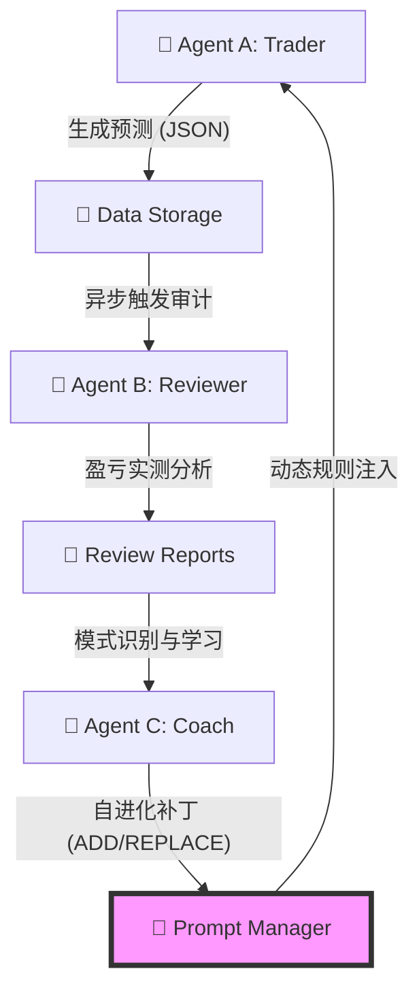

# 🚀 Crypto Triple-Agent Trading Analysis System (V2.0-Audit)

> **基于 Google Gemini 多模态 AI 的闭环自进化交易系统**

本项目是一个模拟对冲基金决策链的 **三智能体 (Triple-Agent)** 系统。通过 **Trader (交易)**、**Reviewer (审计)**、**Coach (战略调整)** 的协同工作，实现了从“实时决策”到“历史复盘”再到“策略自动进化”的全闭环。

---

## 🏗 系统架构 (The Triple-Agent Loop)

系统由三个核心 AI 代理构成，旨在消除交易中的系统性偏差：



### 1. **Agent A (Trader) - 前线指战员**
*   **职责**: 实时市场扫描、视觉图表分析、Red Team 自我博弈。
*   **自进化引擎**: 集成 **PromptManager**，在运行时自动从 Agent C 的报告中提取并应用 `ADD/REPLACE/REMOVE` 逻辑补丁。
*   **核心能力**: 1500根 K 线、双周期 Volume Profile、持仓量 (OI)、多空比、清算地图。

### 2. **Agent B (Reviewer) - 后方审计师**
*   **职责**: 严格结算。通过 Binance 历史数据判断预测的“触碰顺序”（止盈 vs 止损）。
*   **逻辑**: 根据配置的 `minimum_review_age_hours` 自动识别已到期订单进行盈亏诊断。
*   **核心价值**: 消除幸存者偏差，识别 Trader 在解析复杂结构时的系统性误判。

### 3. **Agent C (Coach) - 战略导师**
*   **职责**: **宏观调控**。横向扫描批量 Review 报告，识别 Agent A 的盈亏规律。
*   **产出**: 生成结构化的 `master_prompt_patch` 指令。这是一种“软更新”，无需重启系统即可优化 Trader 的思考维度。

---

## 🌟 审计与稳定性特性 (Audit Highlights)

1.  **SSoT (唯一真实数据源) 与零默认值**: 
    - 废除代码中所有“偷偷使用”的硬编码默认值。
    - 强制执行 **Pre-flight Config Check**，任何配置缺失将在启动时被拦截，确保系统行为 100% 可预测。
2.  **资源与内存安全审计**: 
    - **Resource Management**: 所有 API 客户端（Binance/Sentiment）均实现了 `finally` 资源回收机制。
    - **Memory Guard**: 绘图引擎（Matplotlib）强制执行 `plt.close()` 保护，防止长期运行导致的内存泄漏。
3.  **统一时区与原子性**: 
    - 对齐全局 `timezone` 配置，通知、日志、复盘逻辑在同一时间维度运行。
    - 引入 `PromptManager` 确保逻辑注入的原子性（ADD/REPLACE/REMOVE）。

---

## 🛠 快速开始

### 1. 环境准备
```bash
# 获取源码后安装依赖
pip install -r requirements.txt
```

### 2. 核心配置 (`config/config.yaml`)
```yaml
timezone: "Pacific/Auckland" # 全局时区对齐
review:
  minimum_review_age_hours: 12.0 # 复盘等待时间（由用户定义）
automation:
  prediction_interval_hours: 4.0
  review_interval_hours: 12.0
```

### 3. 三步走工作流
| 步骤 | 指令 | 说明 |
| :--- | :--- | :--- |
| **1. 预测 (Trader)** | `python main.py` | 执行分析并发送信号 |
| **2. 审计 (Reviewer)** | `python review.py` | 对符合时间的订单进行对账复盘 |
| **3. 策略进化 (Coach)** | `python coach.py --batch 10` | 模式识别并生成策略补丁 |

> [!TIP]
> 复盘与进化的频率完全由 `config.yaml` 或手动调用的时机决定，系统具有极高的灵活性。

---

## 🧪 自动化测试
运行完整且经过审计的测试套件（目前 11/11 通过）：
```bash
pytest tests/
```

---
## 许可证
MIT © 2026 Crypto Triple-Agent Team
