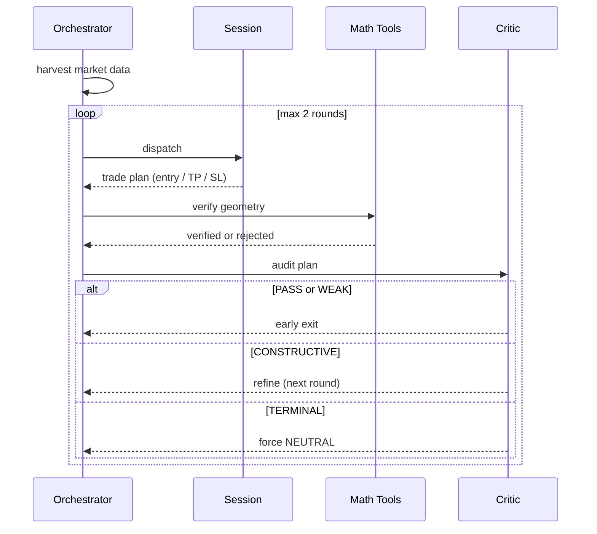
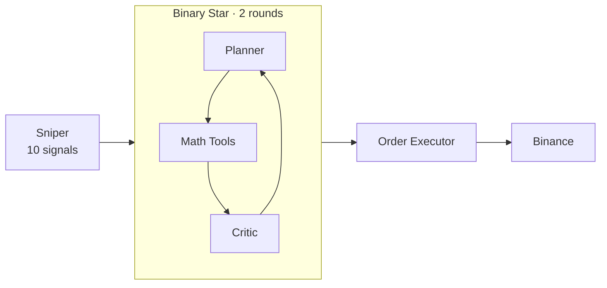
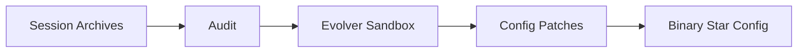

# BinaryStar

[](https://www.python.org/downloads/)

What if two LLMs debated your trade before it hit the market? **Binary Star** pits a Planner against a Critic — one proposes, the other tears it apart. Math Tools (deterministic, no LLM) anchors both to reality. The debate converges in at most two rounds; if they can't agree and the Critic's last verdict is TERMINAL, the system aborts to NEUTRAL rather than forcing a broken trade.

## Binary Star Protocol



**Session** proposes a trade thesis with entry, TP, SL, and regime analysis. **Math Tools** deterministically verifies the geometry — RR ratio, ATR distance, structural shielding — before the Critic ever sees it. **Critic** audits across four veto levels:

| Veto | Tags | Effect |
|------|------|--------|
| **PASS** | `PRISTINE`, `JUSTIFIED_INACTION` | Debate ends — trade approved or NEUTRAL accepted |
| **WEAK** | `CVD_ABSORPTION` | Debate ends — minor concern, not worth another round |
| **CONSTRUCTIVE** | `MATH_VIOLATION`, `INACTION_BIAS`, `TREND_STARVATION`, `RETAIL_SQUEEZE`, … | Plan needs revision — another round |
| **TERMINAL** | `ORDER_PHYSICS`, `STRUCTURAL_TRAP`, `ANCHOR_VIOLATION`, `PROTOCOL_VIOLATION` | Plan is unsafe — force NEUTRAL |

Confidence scoring is Python-computed (not LLM-generated), factoring in math verification results, debate history, and the final verdict. NEUTRAL always scores 0.

The system supports DeepSeek and Gemini as AI providers, configured via `global_config.yaml`.

## Architecture

**Runtime pipeline** — Sniper finds the moment, Binary Star debates the trade, Guardian protects it:



**Evolution loop** — offline: sessions are audited, patterns are learned, config is improved:



## Sniper

10 signals across 5 categories (FLOW, SIZE, ENERGY, STRUCTURAL, POSITIONING, CROSS-SYMBOL) combine via a confluence engine: `1 − ∏(1 − s)` per direction, with noise cancellation. Regime-adaptive thresholds (trending 0.29, ranging 0.34, squeeze 0.26, chaos 0.51) gate trigger decisions. Any single signal at ≥ 0.80 bypasses all cooldown. Adaptive cooldown scales with market regime (20–60 min).

Sniper's job is entry timing. Binary Star decides the trade.

## Order Management

| Phase | Trigger | Action |
|-------|---------|--------|
| Entry | Binary Star → LONG/SHORT | OTOCO: limit entry + nested TP/SL (atomic) |
| Protection | Entry filled, no OCO yet | Guardian places OCO with TP + SL |
| Breakeven | RR ≥ 1.0 | Dynamic partial close — SL stays at original risk |
| Exit Ladder | 85% TP progress | Close 20% of remaining, SL → entry + 10% TP |
| Trailing | Level active, price advances | SL ratchets toward TP (never loosens) |

Breakeven dynamically computes the close ratio per trade from `rr_target`, entry price, SL distance, and taker fee — guaranteeing true breakeven after all fees if the remainder hits SL.

## Evolution

Sandboxed meta-evolution ingests audit reports, scores fitness (TP_HIT: 100, NEUTRAL: 50, SL_HIT: 30, plus forensic modifiers for logic failures, luck, slow locks), and emits config patches consumed by Binary Star. Each proposal includes a semantic refinement for prompt templates.

## Installation

```bash
pip install -e .
cp .env.example .env   # add BINANCE_API_KEY, BINANCE_SECRET_KEY, DEEPSEEK_API_KEY
```

## Commands

### Sessions

```bash
python run.py session --symbol BTC -p data/prod
python run.py session --symbol XAUT --write_status -p data/prod   # with dashboard polling
```

### Sniper

```bash
python run.py sniper --symbol BTC,XAUT --llm -p data/prod         # monitor + AI
python run.py sniper --symbol XAUT --trade -p data/prod           # full auto-trading
python run.py sniper --symbol BTC --trade 1000 --risk-per-trade 0.01 -p data/prod
```

### Backtest

```bash
python run.py backtest-run --symbol BTCUSDT --timestamp "2025-06-15T14:30:00Z" -p data/prod
python run.py backtest-run --symbol XAUTUSDT --start T-7d --samples 20 -p data/prod
```

### Audit & Evolution

```bash
python run.py audit -p data/prod                                  # batch audit all sessions
python run.py audit -f sessions/BTCUSDT_20250615.json --force -p data/prod
python run.py evolution --symbol BTC --samples 20 -p data/prod
python run.py patch -f proposals/proposal_20250615.json --symbol XAUT
```

### Dashboard

```bash
python -m src.dashboard.server -p data/prod --port 8080
```
