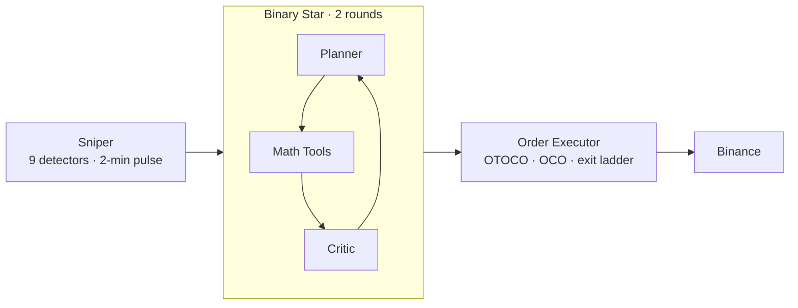
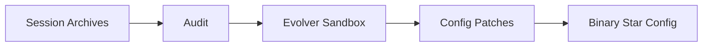

# Singularity

[](https://www.python.org/downloads/)

What if two LLMs debated your trade before it hit the market? **Binary Star** pits a Planner against a Critic — one proposes, the other tears it apart. A Math Tools (no LLM, pure computation) anchors both to reality. The debate converges in at most two rounds; if they can't agree and the Critic's last verdict is TERMINAL, the system aborts to NEUTRAL rather than forcing a broken trade.

---

## Binary Star Protocol


### Veto Levels

| Veto | Effect |
|------|--------|
| **PASS** | Plan is sound — early exit, no further rounds |
| **WEAK** | Minor concern — early exit, plan accepted as-is |
| **CONSTRUCTIVE** | Fixable flaws — feedback loop, Planner refines |
| **TERMINAL** | Fatal — structurally invalid. If unresolved at max rounds, forces NEUTRAL |

A deterministic 0–100 survival score is computed in Python after the debate — evaluating 13 dimensions across topographical armor, regime synchronization, and temporal convexity. Two LLM backends (DeepSeek, Gemini) power the debate via a shared config.

> **Full protocol**: [docs/adversarial-debate-protocol.md](docs/adversarial-debate-protocol.md) — Session/Critic prompts, veto system, confidence scoring, repair patterns, deadlock analysis.

---

## System Topology





---

## Sniper

A local signal stack (**9 detectors** + 1 cross-symbol boost) monitors the market every 2 minutes. A regime-adaptive confluence engine weights directional agreement and cancels opposing noise, adjusting its effective threshold per regime (config: `trigger_threshold × regime_modifiers`). Any single signal exceeding the `emergency_threshold` overrides cooldown and threshold entirely. Its sole job is timing — it does not trade.

---

## Order Management

| Phase | Mechanism |
|-------|-----------|
| Entry | OTOCO — atomic limit entry with nested TP/SL |
| Protection | Guardian OCO — every position wrapped in TP + SL |
| Profit-taking | 2-phase exit ladder — breakeven (RR 1:1) → 2-level trailing partial close |
| Stop migration | Dynamic trailing SL as ladder levels fire |

---

## Evolution

An offline sandbox replays audited sessions against evolved config patches, scoring fitness against actual outcomes. Winning patches feed into Binary Star's debate thresholds and the Sniper's signal stack — the loop tightens with every generation.

---

## Installation

```bash
pip install -e .
cp .env.example .env  # add your exchange + LLM API keys
```

---

## Commands

```bash
# ── Sessions ────────────────────────────────────────────
python run.py session --symbol XAUT

# ── Sniper ──────────────────────────────────────────────
python run.py sniper --symbol XAUT,BTC --llm --trade 500

# ── Backtest ────────────────────────────────────────────
python run.py backtest-run --symbol XAUTUSDT --start 2025-01-01 --samples 100

# ── Audit & Evolution ───────────────────────────────────
python run.py audit --symbol XAUT -p data/prod
python run.py evolution --symbol XAUT --samples 50 -p data/prod
python run.py patch -f proposals/evolution.json --symbol XAUT
```
