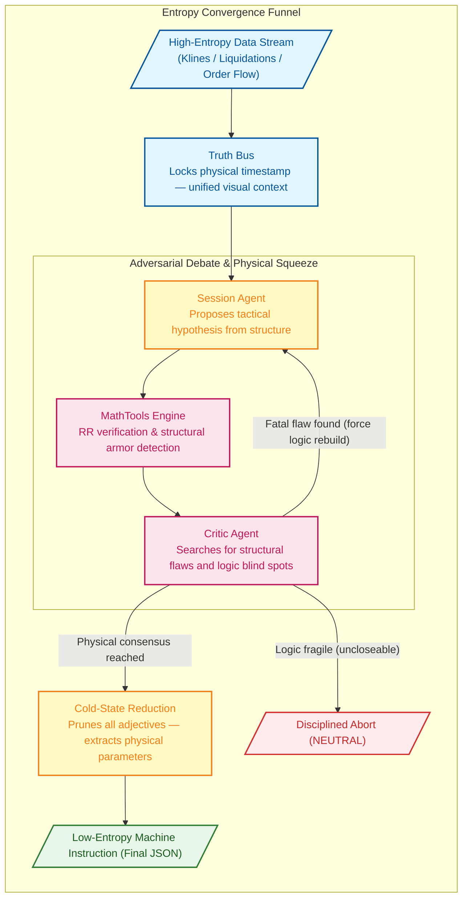

# Singularity

[](https://www.python.org/downloads/)

AI-driven crypto quantitative trading engine. Its core innovation is the **Binary Star adversarial protocol**: two LLM agents (Session Analyst proposing trades, Critic Agent auditing them) debate in rounds to converge on zero-entropy trade decisions. A third agent (Evolver) uses audit results to mutate strategy parameters.

---

## Architecture

```
Entry Points (run.py)
  → Dashboard (src/dashboard/)           FastAPI + HTML, reads session JSON
  → Orchestration (src/agent/)           DebateLoop, BinaryStarOrchestrator
  → Agents (src/agent/)                  SessionAgent, CriticAgent, EvolverAgent
  → AI Backend (src/infrastructure/ai/)  AbstractAIClient → Gemini/DeepSeek/Qwen/Ollama adapters
  → Market Analysis (src/analyzer/)      MarketObserver, VolumeProfile, MarketRegime, LiquidationRadar
  → Data Layer (src/infrastructure/)     AbstractExchangeClient → Binance, models (KlineData, etc.)
  → Config (src/config/)                 Sub-config dataclasses + YAML loaders
```

### AI backend (key design pattern)

`AbstractAIClient` is the contract — mirrors the `AbstractExchangeClient` pattern for LLM providers. All agents depend on the interface, not any SDK. `AIFactory.create_client()` returns the right adapter based on `global_config.yaml` → `llm.active_provider`.

OpenAI-compatible providers (DeepSeek, Qwen) share a single `OpenAICompatibleAdapter` base class. Only `GeminiAdapter` touches Gemini SDK types — the orchestrator and agents use provider-agnostic `VisualPart` for multimodal content.

### Adversarial debate flow

1. `MarketObserver.observe()` collects klines, OI, liquidations, CVD → `observation` dict
2. `BinaryStarOrchestrator.execute_flow()`:
   - Injects regime benchmarks into observation
   - Optionally creates Gemini context cache (Truth Bus)
   - `DebateLoop.run()` alternates: SessionAgent proposes → MathFactChecker verifies → CriticAgent audits → repeat until PASS/TERMINAL or `max_rounds`
   - Final synthesis at cold temperature, sanitized against math truth
3. Result archived as JSON in `<data_root>/sessions/`

---

## The Binary Star Protocol

Binary Star is a high-precision, multi-agent quantitative analysis engine. Its kernel simulates a rigorous debate process, eliminating trading bias and hallucination through **adversarial reasoning**.

Every final trade instruction must survive this high-pressure game — purifying chaotic market conditions into calm, deterministic low-entropy parameters.

- **Truth Bus**: Multimodal market topography is cached once and shared across the reasoning triad to eliminate context drift and cost.
- **Physical Verification**: AI proposals are cross-referenced against Python-native math fact-checks to prevent hallucination in trade geometry.
- **Adversarial Hardening**: Iterative debate rounds ensure the final trade blueprint is logically sound and structurally shielded.



### The Zero-Entropy Logic Matrix

To achieve physically-enforced convergence, all multi-channel data is mapped into a strict set of **logical checkpoints and abort conditions**:

| Audit Dimension | Identifier | Core Logic |
| :--- | :--- | :--- |
| **Order Physics** | `[ORDER_PHYSICS]` | Entry legality: verify entry price hasn't been breached; stop-loss direction is physically correct. |
| **Anchor Violation** | `[ANCHOR_VIOLATION]` | Stop-loss must be shielded by HVN/POC or liquidation clusters. No "naked" stops. |
| **Structural Trap** | `[STRUCTURAL_TRAP]` | Avoid volume vacuums (LVN zones) where price can frictionlessly slide. |
| **Math Violation** | `[MATH_VIOLATION]` | RR ratio and ATR tolerance enforced by the physics engine. Sub-threshold proposals are downgraded. |
| **Gravity Exhaustion** | `[GRAVITY_EXHAUSTION]` | Mean-reversion pressure: prohibit chasing price beyond the gravity limit of the value area. |
| **CVD Absorption** | `[CVD_ABSORPTION]` | Wall detection: extreme CVD pulses absorbed without price movement signal iceberg orders. |
| **Retail Squeeze** | `[RETAIL_LONG_SQUEEZE]` `[RETAIL_SHORT_SQUEEZE]` | Polar reversal: when retail positioning is heavily one-sided, seek the opposite opportunity. |
| **Opportunity Cost** | `[INACTION_BIAS]` `[OPPORTUNITY_DENIAL]` | Missed-move penalty: when consensus is confirmed and structure is clear, unjustified retreat is prohibited. |
| **Trend Starvation** | `[TREND_STARVATION]` | Trend capture: detect expanding volatility with strong trend when the system is flat. |
| **Liquidity Void** | `[LIQUIDITY_VOID]` | Proximity check: nearest LVN distance is too close — risk of violent price movement. |
| **Protocol Violation** | `[PROTOCOL_VIOLATION]` | Dead-loop protection: prohibit repeating the same failed proposal on the same evidence. |
| **Endgame** | `[PRISTINE]` `[JUSTIFIED_INACTION]` | Holy grail: fully compliant entry (green light), or disciplined abstention based on physical facts. |

---

## Installation

### Prerequisites

- Python 3.12+
- A supported LLM provider API key (Gemini, DeepSeek, Qwen, or local Ollama)

### Setup

```bash
git clone <repo-url> && cd singularity
pip install -e .              # core dependencies
pip install -e ".[dev]"       # include pytest, coverage
```

Or with Conda:

```bash
conda activate ai
pip install -e .
```

### Configuration

1. Copy `.env.example` (or create `.env`) with your API key:
   ```bash
   GEMINI_API_KEY="your-key-here"    # or DEEPSEEK_API_KEY / QWEN_API_KEY
   ```

2. Edit `config/global_config.yaml` to set your active provider:
   ```yaml
   llm:
     active_provider: "gemini"  # gemini | deepseek | qwen | ollama
   ```

3. Review `config/strategy_config.yaml` for trading parameters, regime thresholds, and analysis windows.

---

## Commands

All entry points are consolidated under `run.py`:

```bash
# Live analysis
python run.py session

# Single historical snapshot
python run.py session -ts 2026-01-24T15:42:00Z

# Backtest (sampled historical points)
python run.py session --start T-30d --end T-2d --samples 14 --sampling-mode sniper
python run.py session --start T-30d --end T-2d --samples 14 --symbol XAUTUSDT -p data/backtest/xautusdt

# Real-time monitoring daemon
python run.py sniper --trigger --email
python run.py sniper --trigger --email --trade

# Forensic audit
python run.py audit -p data/prod
python run.py audit -p data/backtest --file data/backtest/sessions/BTCUSDT_session_20260101_120000.json

# Meta-evolution (strategy optimization from audit results)
python run.py evolution -p data/backtest --samples 20

# Apply evolution patch
python run.py patch -f data/backtest/evolution/proposals/BTCUSDT_evolution_20260101_120000.json

# Start dashboard (http://localhost:8080)
python -m src.dashboard.server
python -m src.dashboard.server -p data/prod --port 8080

```

### Running tests

```bash
python -m pytest tests/ -v
python -m pytest tests/ --cov=src --cov-report=term-missing
```

---

## AI Providers

The system supports 4 providers through a unified `AbstractAIClient` interface. Switch providers by changing `active_provider` in `global_config.yaml` — no code changes needed.

| Provider | Adapter | Vision | Context Cache | Cost |
|----------|---------|--------|---------------|------|
| **Gemini** | `GeminiAdapter` | Yes | Yes (Truth Bus) | $$$ |
| **DeepSeek** | `DeepSeekAdapter` → `OpenAICompatibleAdapter` | — | — | $ |
| **Qwen** | `QwenAdapter` → `OpenAICompatibleAdapter` | Yes (VL models) | — | $ |
| **Ollama** | `OllamaAdapter` | Model-dependent | — | Free |

All providers support function calling + JSON mode. DeepSeek and Qwen share a single `OpenAICompatibleAdapter` base class — adding a new OpenAI-compatible provider is a ~10-line subclass.

### Provider-specific setup

**Gemini** (default — only provider with context caching):
```yaml
llm:
  active_provider: "gemini"
  gemini:
    context_cache:
      enable: true
      expiration_minutes: 10
```

**DeepSeek** (best cost-performance ratio):
```yaml
llm:
  active_provider: "deepseek"
  deepseek:
    base_url: "https://api.deepseek.com"
    model: "deepseek-v4-flash"
```

**Qwen** (Alibaba Cloud — strong Chinese-language understanding):
```yaml
llm:
  active_provider: "qwen"
  qwen:
    base_url: "https://dashscope.aliyuncs.com/compatible-mode/v1"
    model: "qwen-plus"
```

**Ollama** (local — fully offline, privacy-preserving):
```yaml
llm:
  active_provider: "ollama"
  ollama:
    base_url: "http://localhost:11434"
    model: "gemma4:e4b"
```

---

## Config System

- `config/strategy_config.yaml` — trading parameters, regime thresholds, analysis windows
- `config/global_config.yaml` — system settings, LLM provider config, visuals, sniper
- `config/prompts/*.md` — LLM system prompts (sensitive system logic)
- `src/config/sub_configs.py` — `RegimeConfig`, `TemporalConfig`, `RiskConfig`, `AuditConfig`, `VisualConfig` (frozen dataclasses)
- `src/config/loader.py` — builds sub-configs from YAML dicts

---

## Key Invariants

- `BinaryStarOrchestrator.execute_flow(observation, symbol)` — public signature must not change
- `GeminiCacheManager` requires `GeminiAdapter` (only Gemini supports context caching); gated by `enable_context_cache`
- `run_evolution.py` must use `AIFactory.create_client()`, not raw SDK clients
- Non-Gemini adapters return `False` for `supports_context_cache`
