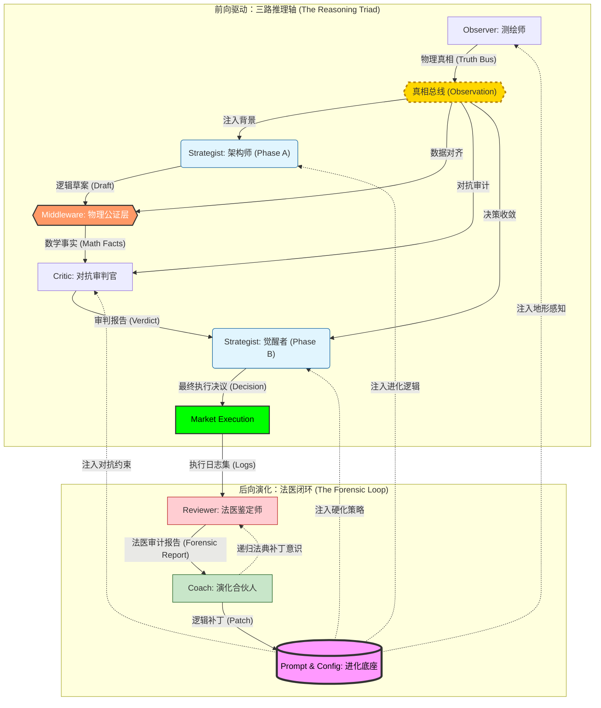

# ⚖️ 真相 · 逻辑 · 审计

> **“不预测行情，只测绘逻辑。”**

这是一个基于 **物理真相** 与 **对抗性演化** 构建的多智能体交易系统。它通过“三路推理 (Reasoning Triad)”架构，将极度不确定的市场博弈转化为确定性的物理地形测绘与逻辑审计。每一张单子都是物理事实与对抗性逻辑的结晶，是对市场脆弱性的精确爆破。

---

## 🗺️ 物理地形 · 演化枢纽

系统通过 **前向推理 (Forward Reasoning)** 与 **后向演化 (Backward Evolution)** 构建了一个具备自我修复能力的闭环生态：

---

## 🧬 逻辑审计 · 共识协议

基于明确的物理地形边界与逻辑主权隔离，各组件在协作交接中始终维持着不可逾越的“法医级”逻辑严谨度：

| 智能实体 | 职能模型 | 枢纽逻辑 | 演化产物 |
| :--- | :--- | :--- | :--- |
| **Observer** | **测绘师** | **物理景观聚合**：识别宏微观地形共振，构建“真相总线” | 地形全景数据 |
| **Strategist (A)** | **架构师** | **交易蓝图构建**：锚定高成交量节点 (HVN) 并预设物理执行轨迹 | 逻辑草案 |
| **Middleware** | **真理校验门** | **物理解耦公证**：通过真相总线锁定 RR 与 ATR 参数，彻底消除幻觉 | 物理事实底座 |
| **Critic** | **对抗审判官** | **生存压力测试**：基于真相总线识别流动性陷阱，进行对抗性审计 | 审计判决书 |
| **Strategist (B)** | **觉醒者** | **风险硬化收敛**：整合审计意见，执行深度入场防御 (DLE) 或强制弃权 | 最终决议 |
| **Reviewer** | **法医鉴定师** | **尸检溯源对比**：精准对齐成交事实，捕捉逻辑与现实的“真值偏离” | 法医复盘报告 |
| **Coach** | **演化合伙人** | **认知偏差修正**：诊断系统性盲区，合成多智能体进化的底层逻辑补丁 | 逻辑补丁 |

---

## 🛡️ 逻辑盾牌

为了确保系统在极高波动的加密市场中生存，我们部署了五层“物理保护伞”：

### 第一层：物理真实网关 (Physical Realism)
**核心逻辑：剥离 AI 的数学解释权。** 强制由后端 Python 计算确定性的盈亏比 (RR)、波动幅度 (ATR) 与时间价值，作为系统唯一法定事实注入。彻底消除 LLM 在复算中的幻觉。

### 第二层：信息主权等级 (Information Sovereignty)
**核心逻辑：地形决定论。** 系统在冲突信号中遵循：1. 物理地形 (POC/VAH) > 2. 流动性形态 (Flow/CVD) > 3. AI 感知。确保即使博弈信号混乱，也能基于物理边界进行攻击。

### 第三层：法医审计隔离 (Forensic Isolation)
**核心逻辑：忽略中间态，只审计物理终态。** Reviewer 强制忽略中间过程的草案和草稿数字。Reviewer 直接使用 `[Pass-3 SYNTHESIS]` 最终执行坐标与 `T0` 环境原件进行重新建模，防止“过程幸存者偏差”。

### 第四层：多模态视觉证伪 (Visual Verification)
**核心逻辑：特征引用与视觉存证。** 拒绝纯数字漂移的盲目决策。所有推理必须显式引用视觉快照（Snapshot）中的地形特征（如“特定价格坐标的影线阻力”）。这建立了一种**“证据对齐”**机制，确保决策逻辑在物理空间中是有迹可循的。

### 第五层：递归状态机 (Atomic Switch)
**核心逻辑：原子化状态切换。** 废弃复杂的会话状态管理。系统根据 Draft 的存在与否自动触发职能相位探测。真相总线（Observation）作为唯一上下文，确保从草稿到审计、再到终稿的逻辑一致性。

---

## 💎 参数大师课 · 全量工业级配置

> ⚙️ **时域缩放 (Temporal Scaling) 是参数演化的核心动力源。**
> 当你修改了 Macro 时间周期（如 1h -> 4h）时，下列 10 个模块的参数必须产生联动效应。

### 1. 基础时域与全局采样 (Observer Core)
| 变量名 | 大白话解释 | 时域联动影响 |
| :--- | :--- | :--- |
| `time_interval` | **采样颗粒度**。15m 看细节，1h 看结构。 | 联动：修改后，所有基于周期 (period) 的绝对时间都会改变。 |
| `historical_lookback_candles` | **记忆深度**。往回看多少根线来计算成交量分布 (VP)。 | 越长则历史支撑位越“硬”，越不容易被短时波动击穿。 |
| `order_flow_lookback_hours` | **流量窗口**。回看 CVD 和影线偏见的绝对时长。 | **关键**：日内设 1h 保证敏捷，长线应拉长。决定了 Sentiment 的时效性。 |
| `average_true_range_period` | **波动标尺**。ATR 计算周期。 | 整个系统（止损、止盈、DLE）的通用度量衡。 |
| `trend_intensity_duration_hours` | **趋势惯性窗口**。 | 判定趋势是否具备“高效持续性”的时间基准。 |
| `volatility_intensity_lookback` | **波动烈度回溯**。 | 联动：必须与 `macro_analysis_context` 对齐，防止跨周期误判。 |
| `funding_rate_lookback_hours` | **费率成本窗**。回看多久的资金费率。 | |

### 2. 地形分辨率 (Volume Topography)
| 变量名 | 大白话解释 | 时域联动影响 |
| :--- | :--- | :--- |
| `volume_profile_price_bucket_count` | **地形分辨率**。价格轴切分的格子数。 | **强联动**：周期越大波动越大，需调高 (800+)，否则 POC 定位会偏差。 |
| `volume_profile_value_area_width` | **价值区宽度**。POC 周围覆盖多少成交量算 Value Area。 | 默认 75%。越窄则价值定义越严苛，越容易触发突破信号。 |
| `min_price_gap_between_nodes` | **节点隔离距离**。节点太近就合并。 | Macro 周期越大，间距应成倍放大，防止目标定位过碎。 |
| `high_volume_node_detection_threshold` | **主力节点判别线**。成交量占比超过此值认定为 HVN。 | 过滤细碎噪音，锁定真正的主力阵地。 |
| `low_volume_node_detection_threshold` | **真空带判别线**。成交量占比低于此值认定为 LVN。 | 识别“价格滑梯”的关键逻辑门。 |
| `volume_moving_average_period` | **成交量平滑期**。用于判定放量还是缩量。 | 直接决定了 `volume_breakout_ratio` 的敏感度。 |
| `top_structural_node_count` | **核心结构数**。地图上显示的头部关键价位。 | |

### 3. 技术波动因子 (TA Channels)
| 变量名 | 大白话解释 | 时域联动影响 |
| :--- | :--- | :--- |
| `wick_skewness_period` | **插针采样期**。最近几根线影线的物理偏差。 | 越短越能捕捉高频反转，越长越平滑。影线单核心。 |
| `wick_skew_fallback` | **影线缺失代偿**。当数据不足时的默认偏移。 | |
| `bollinger_bands_std_dev` | **离群门槛**。判定极端波动的统计学标准。 | 指导系统在超买/超卖真空区的逻辑收敛。 |
| `keltner_channels_multiplier` | **物理边界倍率**。基于 ATR 的波动通道。 | 与布林带配合判断“挤压 (Squeeze)”状态。 |
| `bollinger_bands_period` / `keltner_channels_period` | **通道计算周期**。价格波动包络的时间基准。 | |

### 4. 流动性与爆仓热图 (Liquidity & Clusters)
| 变量名 | 大白话解释 | 时域联动影响 |
| :--- | :--- | :--- |
| `liquidation_cluster_atr_multiplier` | **爆仓磁吸半径**。寻找清算密集区的范围。 | **联动**：采样时间跨度越大，洗盘深度越深，该倍率需放大。 |
| `max_liquidation_events_to_fetch` | **爆仓采样规模**。从 API 获取的样本总数。 | |
| `max_liquidation_events_for_context` | **爆仓焦点数**。喂给 AI 深度分析的头部爆仓点。 | |
| `max_liquidation_clusters` | **爆仓簇上限**。地图上最多显示的爆仓集结地。 | |
| `liquidation_cluster_fallback_percentage` | **爆仓兜底阈值**。无量行情时的最小探测幅度。 | |

### 5. 市场态势判定阈值 (Regime Detection)
| 变量名 | 大白话解释 | 逻辑暗示 |
| :--- | :--- | :--- |
| `regime_trend_intensity_threshold` | **趋势启动门槛**。 | 想要更稳，就调高这个值以过滤随机波动。 |
| `regime_poc_gravity_atr_distance` | **POC 磁力半径**。判断价格是否被均值吸住。 | 强趋势下调大它，否则系统由于贪恋均值而不敢追单。 |
| `regime_volatility_expansion_ratio` | **波动爆发倍率**。判断行情是否“失控”。 | 15m 级别的爆发属于常见，4h 级别这属于天劫。 |
| `regime_volume_breakout_threshold` | **放量确认线**。突破时的标准动作。 | 入场不仅看价格，必须配合该倍数的成交量确认。 |
| `regime_long_short_imbalance_ratio` | **多空失衡线**。散户多空比超过此值触发警报。 | 超过 2.0+ 触发“零售端反向清算 (Retail Flush)”逻辑。 |
| `regime_vacuum_risk_score` | **真空暴露分**。 | 止损位若落在高分真空区，Critic 会强制 Veto。 |
| `regime_wick_skewness_exhaustion` | **影线衰竭值**。 | 判定当前推力是否已到达“油尽灯枯”的阈值。 |
| `regime_min_rr_ranging / trending` | **动态生存 RR**。 | 震荡市允许 1.2+，趋势市严求 1.8+。 |
| `regime_cvd_slope_threshold` | **买卖意愿斜率**。 | 衡量 Taker 攻击的垂直烈度。 |
| `regime_squeeze_threshold` | **挤压临界值**。 | 判定能量蓄积是否到达爆发临界。 |

### 6. 执行与风险硬化 (Execution Law)
| 变量名 | 大白话解释 | 执行逻辑 |
| :--- | :--- | :--- |
| `min_trade_velocity` | **跑得够不够快**。预期成交的斜率。 | 短线追求爆发 (0.5+)，长线可容忍阴跌/磨损 (0.1)。 |
| `stop_loss_buffer_min / max` | **物理冗余厚度**。 | 锚点后的冗余空间，防止被市场随机毛刺扫掉。 |
| `regime_balanced_atr_multiplier` | **平衡态探测半径**。 | 决定了系统界定“震荡区间”物理边界的范围。 |

### 7. 大脑思维配置 (Agent Models)
| 变量名 | 大白话解释 | 调参指南 |
| :--- | :--- | :--- |
| `model_temperature_draft` | **直觉发射温度**。 | 建议 0.7。给系统捕捉不完美机会的灵感。 |
| `model_temperature_synthesis` | **执行冷峻度**。 | 建议 0.3。确保最终决策逻辑是向紧缩靠拢。 |
| `model` | **各职能位的大脑选型**。 | 根据任务复杂度分配（如 Critic 用 pro 模型，Draft 用 flash）。 |

### 8. 对抗性审计红线 (Critic Skepticism)
| 变量名 | 大白话解释 | 调参指南 |
| :--- | :--- | :--- |
| `threshold_skepticism_clear` | **完全通过线**。低于此分不质疑。 | 保持在 40 左右，给予 Strategist 基本的独立主权。 |
| `threshold_skepticism_weak` | **弱反思线**。触发微调。 | |
| `threshold_skepticism_constructive` | **强制重构线**。 | 高过此分 Critic 会逼 Strategist 改方案。 |

### 9. 法医评分法典 (Reviewer Scoring)
| 变量名 | 大白话解释 | 法医逻辑 |
| :--- | :--- | :--- |
| `execution_timeframe_interval` | **法医分辨率**。 | 复盘必须用 1m，无论你大方向看多长，都要看微观瞬间。 |
| `score_mae_pinpoint_limit` | **精准入场红线**。 | 判定你进场那一刻是不是被行情反复打脸 (MAE)。 |
| `score_mae_standard_limit / logic_failure_limit` | **风险承受边界**。 | |
| `score_mfe_optimal_lower` | **盈利补全比例**。 | 判断止盈是否发生在行情最高点附近。 |
| `score_opportunity_cost_limit` | **踏空惩罚门槛**。 | 衡量行情飞了而系统空仓时的逻辑失分。 |
| `score_time_efficiency_limit` | **时间价值窗**。 | 判断单子在场内占压资金但无产出的效率。 |
| `penalty_compliance_breach` | **协议死刑**。 | 违反写死的硬性法律（如 RR）直接归零 (-100)。 |
| `point_penalty_logic_failure / temporal_failure` | **思维偏差处罚**。 | |
| `point_bonus_structural_insight` | **地形天赋奖励**。 | AI 成功捕捉到 DLE 或清算共振时的加分。 |
| `score_mae_extra_buffer` | **MAE 归一化冗余**。 | 允许在精准度判定中存在的微小物理误差。 |

### 10. 系统演化感知 (Evolution / Coach)
| 变量名 | 大白话解释 | 联动影响 |
| :--- | :--- | :--- |
| `coach.model` | **教练的“核心大脑”**。 | 决定了逻辑补丁的生成质量和系统的进化上限。 |
| `coach.model_parameters` | **教练的“洞见水平”**。 | 控制进化过程中的随机性与稳定性。 |

---

## ⏳ 时域硬化 · 缩放实例库

系统通过“法医审计”不断沉淀在不同时间跨度下的最优配置。

#### 微观：日内高频波动中的物理插针 (Intraday)
| 变量 | 演化参考 | 逻辑目标 |
| :--- | :--- | :--- |
| `macro/micro` | `1h / 15m` | 环境快速刷新 |
| `vp_bucket_count` | `300` | 聚焦单根节点 |
| `sl_buffer_min` | `0.2` | 防守层极窄 |

#### 宏观：波段与结构反转 (Swing)
| 变量 | 演化参考 | 逻辑目标 |
| :--- | :--- | :--- |
| `macro/micro` | `4h / 1h` | 对齐大周期结构 |
| `vp_bucket_count` | `800` | 宏观地图精度 |
| `sl_buffer_min` | `0.6` | 允许震荡洗盘 |

---

## 🚀 运行手册

### Phase 1: 策略执行与回测验证
*   **实时预测**: `python3 strategist.py prod --symbol BTCUSDT`
*   **抽样回测**: `python3 backtest.py backtest --sampling 12`
*   **策略演化回放**: `python3 strategist_replay.py backtest --file [JSON_PATH]`

### Phase 2: 法医调查与看板分析
*   **全量尸检**: `python3 reviewer.py prod`
*   **定向法医复盘**: `python3 reviewer_replay.py prod --file [JSON_PATH]`
*   **策略逆向导出**: `python3 export_strategy.py prod --file [REVIEW_JSON_PATH]`
*   **可视化看板**: `python3 forensic_dashboard.py prod --symbol BTCUSDT`

### Phase 3: 自动化演化循环
*   **全自动化编排**: `python3 pipeline_orchestrator.py live --symbol BTCUSDT --pulse 60`
*   **诊断与进化合成**: `python3 coach.py prod --symbol BTCUSDT`
*   **应用逻辑补丁**: `python3 apply_patch.py --file [PATCH]`
