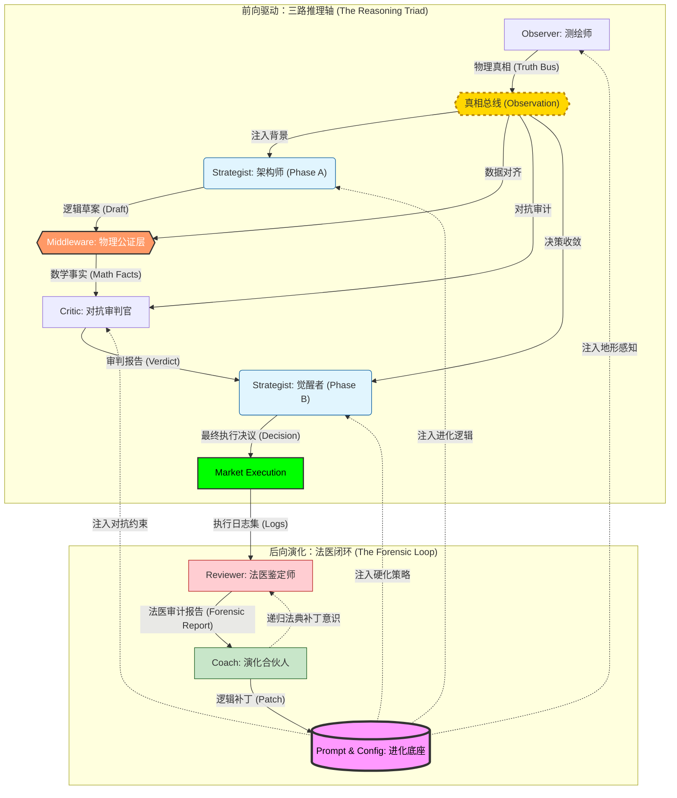

# ⚖️ 真相 · 逻辑 · 审计

> **“不预测行情，只测绘逻辑。”**

这是一个基于 **物理真相** 与 **对抗性演化** 构建的多智能体交易系统。它通过“三路推理 (Reasoning Triad)”架构，将极度不确定的市场博弈转化为确定性的物理地形测绘与逻辑审计。每一张单子都是物理事实与对抗性逻辑的结晶，是对市场脆弱性的精确爆破。

---

## 🗺️ 物理地形 · 演化枢纽

系统通过 **前向推理 (Forward Reasoning)** 与 **后向演化 (Backward Evolution)** 构建了一个具备自我修复能力的闭环生态：

---

## 🧬 逻辑审计 · 共识协议

基于明确的物理地形边界与逻辑主权隔离，各组件在协作交接中始终维持着不可逾越的“法医级”逻辑严谨度：

| 智能实体 | 职能模型 | 枢纽逻辑 | 演化产物 |
| :--- | :--- | :--- | :--- |
| **Observer** | **测绘师** | **物理景观聚合**：识别宏微观地形共振，构建“真相总线” | 地形全景数据 |
| **Strategist (A)** | **架构师** | **交易蓝图构建**：锚定高成交量节点 (HVN) 并预设物理执行轨迹 | 逻辑草案 |
| **Middleware** | **真理校验门** | **物理解耦公证**：通过真相总线锁定 RR 与 ATR 参数，彻底消除幻觉 | 物理事实底座 |
| **Critic** | **对抗审判官** | **生存压力测试**：基于真相总线识别流动性陷阱，进行对抗性审计 | 审计判决书 |
| **Strategist (B)** | **觉醒者** | **风险硬化收敛**：整合审计意见，执行深度入场防御 (DLE) 或强制弃权 | 最终决议 |
| **Reviewer** | **法医鉴定师** | **尸检溯源对比**：精准对齐成交事实，捕捉逻辑与现实的“真值偏离” | 法医复盘报告 |
| **Coach** | **演化合伙人** | **认知偏差修正**：诊断系统性盲区，合成多智能体进化的底层逻辑补丁 | 逻辑补丁 |

---

## 🛡️ 逻辑盾牌

为了确保系统在极高波动的加密市场中生存，我们部署了五层“物理保护伞”：

### 第一层：物理真实网关 (Physical Realism)
**核心逻辑：剥离 AI 的数学解释权。** 强制由后端 Python 计算确定性的盈亏比 (RR)、波动幅度 (ATR) 与时间价值，作为系统唯一法定事实注入。彻底消除 LLM 在复算中的幻觉。

### 第二层：信息主权等级 (Information Sovereignty)
**核心逻辑：地形决定论。** 系统在冲突信号中遵循：1. 物理地形 (POC/VAH) > 2. 流动性形态 (Flow/CVD) > 3. AI 感知。确保即使博弈信号混乱，也能基于物理边界进行攻击。

### 第三层：法医审计隔离 (Forensic Isolation)
**核心逻辑：忽略中间态，只审计物理终态。** Reviewer 强制忽略中间过程的草案和草稿数字。Reviewer 直接使用 `[Pass-3 SYNTHESIS]` 最终执行坐标与 `T0` 环境原件进行重新建模，防止“过程幸存者偏差”。

### 第四层：多模态视觉证伪 (Visual Verification)
**核心逻辑：特征引用与视觉存证。** 拒绝纯数字漂移的盲目决策。所有推理必须显式引用视觉快照（Snapshot）中的地形特征（如“特定价格坐标的影线阻力”）。这建立了一种**“证据对齐”**机制，确保决策逻辑在物理空间中是有迹可循的。

### 第五层：递归状态机与隔离 (Atomic Switch & Isolation)
**核心逻辑：原子化状态切换。** 彻底废弃长文本记忆博弈。系统根据基于 `draft_plan = NULL` 自动阻断大模型的视野。Phase A 严禁写复盘，Phase B 强行带入法医上下文，确保“草稿 -> 审计 -> 终稿”处于彻底互斥的状态机循环中，消除“边写边改”的思维混乱。

### 第六层：致命霸权与否决绑定 (Fatal Supremacy & Veto Coupling Law)
**核心逻辑：逻辑互斥底线。** Critic 的 `is_veto: true` (开关) 与 `FATAL` (级别) 进行物理硬拉绑。一旦触发 FATAL（如逆宏观趋势、盈亏比为负），大语言模型的“缝补圣母心”会被立即强制短路，系统严禁进行后续深层挂单尝试（DLE），即刻执行 Mandatory Abort（安全投降）。

### 第七层：动态立场翻转与退守 (Pivot & Defensive Limit Protocol)
**核心逻辑：政权适应性生存。** 当 Critic 识别出结构性陷阱（如流动性空洞）且级别判定为 `CONSTRUCTIVE`（可修复）时，Strategist 被强制执行**逆向风险工程 (Inverse Risk Engineering)**。系统不会在死地扩大止损硬扛，而是主动让出高潮入场点位，向深水区退守进场，以此换取足以抵御倍数级微观波动的物理缓冲地带，并死守动态 RR 底线。

### 第八层：定向审计与猎手悖论 (Directional Audit & Hunting Law)
**核心逻辑：识破散户与主力的伪装。** Critic 的 `[RETAIL_SQUEEZE]` 审计现在仅在 Strategist 的建议与散户仓位方向**一致**时触发。当市场极度狂热且散户做多时，如果系统建议做空，这被视为“逆向猎杀”，不仅不会被 Veto，反而会获得逻辑加成。解决了“审计员误杀前线将军”的逻辑死锁，让系统具备在崩盘前夜顺应主力清算的直觉。

### 第九层：价格发现自主权 (Price Discovery Autonomy)
**核心逻辑：无人区的物理投影。** 当市场进入历史新高 (ATH) 或新低 (ATL) 等无历史成交量锚点的“真空区”时，系统授权 Strategist 使用 `{regime_poc_gravity_atr_distance} * atr_macro` 自动合成止盈位 (Synthetic TP)。这确保了在极端波动中，系统不会因为“看不见目标”而陷入瘫痪，始终具备量化盈亏比的能力。

### 第十层：突破死锁豁免 (Breakout Paradox Resolution)
**核心逻辑：动量参与权。** 当 `volatility_ratio` 超过 `{regime_volatility_expansion_ratio}` 时，系统自动解除“必须回撤挂单”的禁令。允许 Strategist 直接发起顺势突破（Breakout）单。这标志着系统从单纯的“接飞刀/摸顶”进化为具备捕捉单边暴力趋势能力的动态政权，不再错过高波动扩张期的快速利润。

### 第十一层：物理核心数学熔断 (Triple-Loophole Hardening)
**核心逻辑：黑天鹅熔断地板。** 在极端市场（如 519 级别行情）下，为了防止波动率异常激增导致 SL 缓冲区无限放大，系统在底层逻辑中引入了 `Min()` 函数强制封顶。止损乘数被物理锁死在 `{regime_poc_gravity_atr_distance}` (4.0 ATR) 以内。彻底终结由于波动率溢出导致的“幽灵订单”与数学逻辑崩溃。

### 第十二层：零魔术数字政策 (Zero Magic Number Policy)
**核心逻辑：语义解耦与中央集权。** 严禁在 Prompt 中直接书写任何硬编码数字（如 `0.8`, `75%`, `-30`）。所有逻辑阈值、评分系数、衰减范围必须全部由 `agent_config.yaml` 统筹并动态注入。确保系统在不触动“大脑 DNA (Prompt)”的前提下，具备通过参数配置调整全局性格（激进 vs 保守）的能力。

---

## 💎 参数大师课 · 全量工业级配置

> ⚙️ **时域缩放 (Temporal Scaling) 是参数演化的核心动力源。**

### 1. 核心意图与系统总纲 (System Directives)
| 变量名 | 大白话解释 | 逻辑核心 |
| :--- | :--- | :--- |
| `strategy_intent` | **系统主权宣言**。定义交易的核心灵魂与风险边界。 | 决定了 Agent 在模糊地带的决策倾向性（如保护本金 vs 激进获利）。 |

### 2. 基础时域与全局采样 (Observer Core)
| 变量名 | 大白话解释 | 时域联动影响 |
| :--- | :--- | :--- |
| `macro_analysis_context / time_interval` | **宏观采样颗粒度**。1h 看结构，4h 看趋势。 | 修改后，所有基于周期 (period) 的绝对时间都会改变。 |
| `macro_analysis_context / historical_lookback_candles` | **宏观记忆深度**。往回看多少根线来计算成交量分布 (VP)。 | 决定了历史支撑位（VAH/VAL/POC）的稳固程度。 |
| `micro_analysis_context / time_interval` | **微观细节颗粒度**。抓取进场点位的精度。 | 影响信号的敏捷度。建议 macro 的 1/4 左右。 |
| `micro_analysis_context / historical_lookback_candles` | **微观记忆深度**。 | 影响短期成交量节点和形态的识别。 |
| `order_flow_lookback_hours` | **流量窗口**。回看 CVD 和影线偏见的绝对时长。 | **关键**：日内设 1h 保证敏捷。决定了 Sentiment 的时效性。 |
| `average_true_range_period` | **波动标尺**。ATR 计算周期。 | 整个系统（止损、止盈、DLE）的通用度量衡。 |
| `trend_intensity_duration_hours` | **趋势惯性窗口**。 | 判定趋势是否具备“高效持续性”的时间基准。 |
| `volatility_intensity_lookback` | **波动烈度回溯**。 | 采样宏观波动率基准的时间长度。 |
| `funding_rate_lookback_hours` | **费率成本窗**。 | 识别市场多空情绪成本的周期。 |
| `volume_moving_average_period` | **成交量平滑期**。 | 用于判定当前是否处于异常放量状态。 |

### 3. 地形分辨率与结构识别 (Volume Topography)
| 变量名 | 大白话解释 | 时域联动影响 |
| :--- | :--- | :--- |
| `volume_profile_price_bucket_count` | **地形分辨率**。价格轴切分的格子数。 | **强联动**：波动越大需调越高 (500+)，否则定位会偏移。 |
| `volume_profile_value_area_width` | **价值区宽度**。POC 周围覆盖多少成交量算 Value Area。 | 默认 75%。越窄则价值定义越严苛，越容易触发突破信号。 |
| `min_price_gap_between_nodes` | **节点隔离距离**。节点太近就合并。 | Macro 周期越大，间距应成倍放大，防止目标定位过碎。 |
| `high_volume_node_detection_threshold` | **主力节点判别线**。成交量占比超过此值认定为 HVN。 | 过滤细碎噪音，锁定真正的主力阵地。 |
| `low_volume_node_detection_threshold` | **真空带判别线**。成交量占比低于此值认定为 LVN。 | 识别“价格滑梯”的关键逻辑门。 |
| `top_structural_node_count` | **核心结构数**。地图上显现点关键价位数量。 | 决定了策略引用的“锚点”丰富度。 |
| `max_high_volume_node_count` / `max_low_volume_node_count` | **节点容量限制**。 | 限制 AI 分析的复杂度，聚焦最核心的博弈区。 |

### 4. 技术波动因子 (TA Channels)
| 变量名 | 大白话解释 | 时域联动影响 |
| :--- | :--- | :--- |
| `wick_skewness_period` | **插针采样期**。最近几根线影线的物理偏差。 | 越短越能捕捉高频反转，越长越平滑。影线单核心。 |
| `wick_skew_fallback` | **影线缺失代偿**。当数据不足时的默认偏移。 | 保证系统在冷启动或极端行情下的逻辑稳定性。 |
| `bollinger_bands_std_dev` | **离群门槛**。判定极端波动的统计学标准。 | 指导系统在超买/超卖真空区的逻辑收敛。 |
| `keltner_channels_multiplier` | **物理边界倍率**。基于 ATR 的波动通道。 | 与布林带配合判断“挤压 (Squeeze)”状态。 |
| `bollinger_bands_period` / `keltner_channels_period` | **通道计算周期**。 | 锚定波动包络线的时间基准。 |

### 5. 流动性与爆仓热图 (Liquidity & Clusters)
| 变量名 | 大白话解释 | 时域联动影响 |
| :--- | :--- | :--- |
| `liquidation_cluster_atr_multiplier` | **爆仓磁吸半径**。寻找清算密集区的范围。 | **联动**：采样时间跨度越大，洗盘深度越深，该倍率需放大。 |
| `max_liquidation_events_to_fetch` | **爆仓采样规模**。从 API 获取的样本总数。 | 决定了流动性地图的细腻程度。 |
| `max_liquidation_events_for_context` | **爆仓焦点数**。喂给 AI 深度分析的头部爆仓点。 | |
| `max_liquidation_clusters` | **爆仓簇上限**。地图上最多显示的爆仓集结地。 | |
| `liquidation_cluster_fallback_percentage` | **爆仓兜底阈值**。无量行情时的最小探测幅度。 | |

### 6. 市场态势判定阈值 (Regime Detection)
| 变量名 | 大白话解释 | 逻辑暗示 |
| :--- | :--- | :--- |
| `regime_trend_intensity_threshold` | **趋势启动门槛** | 判定行情由“震荡”转为“趋势”的最低动能。 |
| `regime_trend_intensity_strong` | **强趋势判别线** | 触发系统进入“强趋势防御”模式，对 SL/TP 的要求更苛刻。 |
| `regime_volatility_baseline_ratio` | **常规波动基准** | 判定市场是否处于平稳的统计学基准。 |
| `regime_volatility_expansion_ratio` | **波动爆发倍率** | 判断行情是否“失控”。超过此值触发 **突破死锁豁免 (Breakout Participation)**，允许直接追单。 |
| `regime_volatility_extreme_ratio` | **极端黑天鹅阈值** | 判定行情进入 519 级别崩溃/暴拉模式。 |
| `regime_volume_baseline_ratio` | **常规成交量基准** | 用于与当前成交量对比。 |
| `regime_volume_breakout_threshold` | **放量确认线** | 入场不仅看价格，必须配合该倍数的成交量确认。 |
| `regime_long_short_imbalance_ratio` | **多空失衡线** | 散户多空比超过此值触发 **定向审计 (Directional Audit)**。 |
| `regime_poc_gravity_atr_distance` | **POC 磁力半径 / 无人区投影尺** | 强趋势下作为 SL 的最大硬顶 (4.0 ATR)；在无历史锚点 (ATH/ATL) 时作为 Synthetic TP 的投影基准。 |
| `regime_vacuum_risk_score` | **真空暴露分** | 止损位若落在高分真空区，Critic 会强制 Veto。 |
| `regime_wick_skewness_exhaustion` | **影线衰竭值** | 判定当前推力是否已到达“油尽灯枯”的阈值。 |
| `regime_wick_skewness_momentum_bullish/bearish` | **吸收陷阱/动力反转阈值** | 捕捉 V 型反转时的物理分界点。**Anti-Hardcode Patch (v1.2.2)**。 |
| `regime_min_rr_ranging / trending` | **动态生存 RR** | 震荡市允许 1.2+，趋势市严求 1.8+。 |
| `regime_cvd_slope_threshold` | **买卖意愿斜率** | 衡量 Taker 攻击的垂直烈度。 |
| `regime_poc_magnet_atr_threshold` | **POC 利润锁定阈值** | 均值回归中，偏离度超过此值时 TP 强制锁定在 POC。 |
| `regime_squeeze_threshold / audit_threshold` | **挤压临界/审计阈值** | 判定能量蓄积是否到达爆发临界，触发 Critic 的生存压力测试。 |
| `regime_breakout_buffer_atr` | **突破入场缓冲距离** | 防止在假突破边缘反复摩擦。 |
| `regime_structural_proximity_threshold` | **结构接近判定阈值** | 判定价格是否已到达有效“地形锚点”的感知范围。 |

### 6. 执行与风险硬化 (Execution Law)
| 变量名 | 大白话解释 | 执行逻辑 |
| :--- | :--- | :--- |
| `min_trade_velocity` | **跑得够不够快**。预期成交的斜率。 | 短线追求爆发 (0.5+)，长线可容忍阴跌/磨损 (0.1)。 |
| `stop_loss_buffer_min / max` | **物理冗余厚度**。基于 `volatility_ratio` 的动态缩放因子。 | 公式：`({min} to {max} * volatility_ratio) * ATR`。**硬顶封死在 4.0 ATR (Regime Gravity)。** |
| `regime_balanced_atr_multiplier` | **平衡态探测半径** | 决定了系统界定“震荡区间”物理边界的范围。 |
| `score_confidence_base` | **信心基准线**。策略生成的起始分数。 | 设定为 75。强制 AI 承认 25% 的不可知熵，建立“减法思维模型”。 |
| `score_confidence_decay_min` | **最小逻辑损耗**。处理市场噪音的处罚。 | 针对微小瑕疵（影线斜率、量能波动）的黄牌警告。 |
| `score_confidence_decay_max` | **最大逻辑损耗**。结构性风险的处罚。 | 针对核心矛盾（CVD 背离、HVN 击穿）的逻辑红牌。 |

### 7. 大脑思维配置 (Agent Models)
| 变量名 | 大白话解释 | 调参指南 |
| :--- | :--- | :--- |
| `model_temperature_draft` | **直觉发射温度**。 | 建议 0.7。给系统捕捉不完美机会的灵感。 |
| `model_temperature_synthesis` | **执行冷峻度**。 | 建议 0.3。确保最终决策逻辑是向紧缩靠拢。 |
| `model` | **各职能位的大脑选型**。 | 根据任务复杂度分配（如 Critic 用 pro 模型，Draft 用 flash）。 |

### 8. 对抗性审计红线 (Critic Skepticism)
| 变量名 | 大白话解释 | 调参指南 |
| :--- | :--- | :--- |
| `threshold_skepticism_clear` | **完全通过线**。低于此分不质疑。 | 保持在 40 左右，给予 Strategist 基本的独立主权。 |
| `threshold_skepticism_weak` | **弱反思线**。触发微调。 | |
| `threshold_skepticism_constructive` | **强制重构线**。 | 高过此分 Critic 会逼 Strategist 改方案。 |

### 9. 法医评分法典 (Reviewer Scoring)
| 变量名 | 大白话解释 | 法医逻辑 |
| :--- | :--- | :--- |
| `execution_timeframe_interval` | **法医分辨率** | 复盘必须用 1m，无论你大方向看多长，都要看微观瞬间。 |
| `score_mae_pinpoint_limit / standard_limit` | **精准入场/风险红线** | 判定你进场那一刻是不是被行情反复打脸 (MAE)。**Survival Audit (v1.2.1)**：动态使用 `max(T0, T1)` 波动率。 |
| `score_mae_logic_failure_limit` | **逻辑崩溃线** | 超过此值认为策略方向与地形完全解构，直接判定为 Logic Failure。 |
| `score_mfe_optimal_upper / lower` | **盈利补全比例** | 判断止盈是否发生在行情最高点附近。 |
| `score_opportunity_cost_limit` | **踏空惩罚门槛** | 衡量行情飞了而系统空仓时的逻辑失分。 |
| `score_time_efficiency_limit` | **时间价值窗** | 判断单子在场内占压资金但无产出的效率。 |
| `penalty_compliance_breach` | **协议死刑** | 违反写死的硬性法律（如 RR）直接归零 (-100)。 |
| `point_penalty_logic_failure / temporal_failure` | **思维偏差处罚** | |
| `point_bonus_structural_insight` | **地形天赋奖励** | AI 成功捕捉到 DLE 或清算共振时的加分。 |
| `score_mae_extra_buffer` | **MAE 归一化冗余** | 允许在精准度判定中存在的微小物理误差。 |
| `POC Magnet Exemption` | **纪律免罚协议** | **核心豁免**：若止盈动作是根据 `regime_poc_magnet_atr_threshold` 锁定在 POC 而导致的后期 MFE (盈利回吐) 飙升，系统不再判定为“由于懦弱而早退”，保护了 Agent 遵守纪律的积极性。 |

### 10. 系统演化感知 (Evolution / Coach)
| 变量名 | 大白话解释 | 联动影响 |
| :--- | :--- | :--- |
| `coach.model` | **教练的“核心大脑”**。 | 决定了逻辑补丁的生成质量和系统的进化上限。 |
| `coach.model_parameters` | **教练的“洞见水平”**。 | 控制进化过程中的随机性与稳定性。 |

---

## ⏳ 时域硬化 · 缩放实例库

系统通过“法医审计”不断沉淀在不同时间跨度下的最优配置。

#### 微观：日内高频波动中的物理插针 (Intraday)
| 变量 | 演化参考 | 逻辑目标 |
| :--- | :--- | :--- |
| `macro/micro` | `1h / 15m` | 环境快速刷新 |
| `vp_bucket_count` | `300` | 聚焦单根节点 |
| `sl_buffer_min` | `0.2` | 防守层极窄 |

#### 宏观：波段与结构反转 (Swing)
| 变量 | 演化参考 | 逻辑目标 |
| :--- | :--- | :--- |
| `macro/micro` | `4h / 1h` | 对齐大周期结构 |
| `vp_bucket_count` | `800` | 宏观地图精度 |
| `sl_buffer_min` | `0.6` | 允许震荡洗盘 |

---

## 🚀 运行手册

### 0. 环境准备 (VENV)
在执行任何命令前，请确保处于项目的虚拟环境中：
*   **激活环境**: `source venv/bin/activate`
*   **直接运行 (推荐)**: 也可以直接使用 `./venv/bin/python` 代替 `python` 命令。

### Phase 1: 策略执行与回测验证 (The Strategist Axis)
*   **实时生产执行**: 捕获当前时刻的物理视角并生成决策。
    `python strategist.py prod`
*   **分层回测 (Regime-based Sampling)**: 在指定时间内按市场环境权重采样（过去24天到今天）。
    `python backtest.py backtest --start T-24d --end now --sampling 12 --mode regime`
*   **等距回测 (Timeline Spaced)**: 在指定时间内按等距时间点均匀分布采样（过去24天到7天前）。
    `python backtest.py backtest --start T-24d --end T-7d --sampling 12 --mode spaced`
*   **特定快照逻辑演化回放**: 针对某个特定的策略 JSON 进行逻辑复盘。
    `python strategist_replay.py backtest --file [STRATEGY_JSON_PATH]`

### Phase 2: 法医调查与看板分析 (The Forensic Axis)
*   **全量尸检**: 对所有已结束的单子进行法医级对齐与评分。
    `python reviewer.py prod`
*   **定向法医复盘**: 针对特定失败/成功案例进行深度因果链回溯。
    `python reviewer_replay.py prod --file [STRATEGY_JSON_PATH]`
*   **策略逆向导出**: 将 Review 后的逻辑补丁导出为可读格式。
    `python export_strategy.py prod --file [REVIEW_JSON_PATH]`
*   **可视化法医看板**: 启动本地 UI，可视化查看所有执行结果与 MAE/MFE 回撤。
    `python forensic_dashboard.py prod`

### Phase 3: 自动化演化循环 (The Evolutionary Axis)
*   **全自动化编排**: 开启循环扫描模式，自动执行从 Observer 到 Strategist 的全链路。
    `python pipeline_orchestrator.py live --pulse 60 --mode scan`
*   **市场诊断服务 (静默监视)**: 仅在后台持续刷新真相总线，不消耗 Agent API 成本。
    `python market_scanner_service.py live --pulse 30`
*   **诊断与进化合成**: 开启系统“自我反思”模式，由 Coach 自动合成逻辑补丁。
    `python coach.py live`
*   **应用逻辑补丁**: 将 Coach 生成的 `.patch` 物理硬化到 Prompt 或 Config 中。
    `python apply_patch.py --file [PATCH_PATH]`
