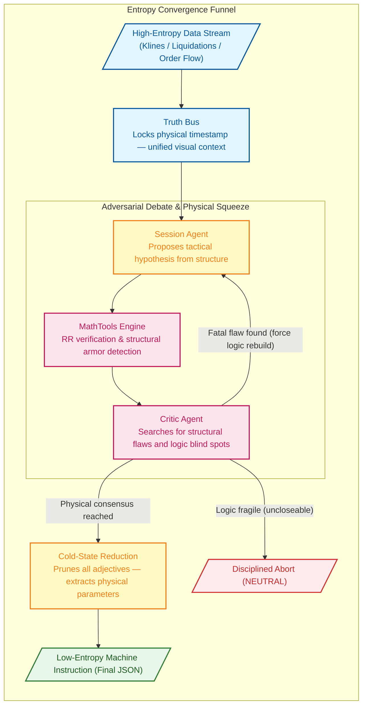

# Singularity

[](https://www.python.org/downloads/)

AI-driven crypto quantitative trading engine. Its core innovation is the **Binary Star adversarial protocol**: two LLM agents (Session Analyst proposing trades, Critic Agent auditing them) debate in rounds to converge on zero-entropy trade decisions. A third agent (Evolver) uses audit results to mutate strategy parameters.

---

## Architecture

```
Entry Points (run.py + standalone run_*.py)
  → Dashboard (src/dashboard/)           FastAPI + Jinja2 templates, API routers, SessionRenderer (HTML email)
  → Sniper (src/sniper/)                 SniperScout (market harvest), SniperTrigger + ConfluenceEngine (14-signal stack)
  → Orchestration (src/agent/)           DebateLoop, BinaryStarOrchestrator
  → Agents (src/agent/)                  SessionAgent, CriticAgent, EvolverAgent, EvolverSandbox
  → Trade Execution (src/agent/)         MarginOrderExecutor (order lifecycle + Guardian position protection)
  → AI Backend (src/infrastructure/)     AbstractAIClient + AIFactory at root; adapters in ai/ (Gemini, DeepSeek, Qwen)
  → Exchange (src/infrastructure/)       AbstractExchangeClient → Binance (binance/), models (exchange/models.py)
  → Notifications (src/infrastructure/)  SessionNotifier, EmailDispatcher, AlertEmailTemplate
  → Market Analysis (src/analyzer/)      MarketObserver, VolumeProfile, MarketRegime, LiquidationEstimator,
                                         MathFactChecker, AuditAssembler, AuditController, ChartVisualRenderer,
                                         TopographyEngine, SniperSampler
  → Config (src/config/)                 Sub-config dataclasses + YAML loaders
  → Utilities (src/utils/)               CongestionController, FitnessEvaluator,
                                         ConfigPatcher + PromptDistiller, exceptions, math tools
```

### AI backend (key design pattern)

`AbstractAIClient` (in `src/infrastructure/ai_client.py`) is the contract — mirrors the `AbstractExchangeClient` pattern for LLM providers. All agents depend on the interface, not any SDK. `AIFactory.create_client()` (in `src/infrastructure/ai_factory.py`) returns the right adapter based on `global_config.yaml` → `llm.active_provider`. Adapter implementations live in `src/infrastructure/ai/`.

OpenAI-compatible providers (DeepSeek, Qwen) share a single `OpenAICompatibleAdapter` base class. Only `GeminiAdapter` touches Gemini SDK types — the orchestrator and agents use provider-agnostic `VisualPart` for multimodal content.

### Adversarial debate flow

1. `MarketObserver.observe()` collects klines, OI, liquidations, CVD → `observation` dict
2. `BinaryStarOrchestrator.execute_flow()`:
   - Injects regime benchmarks into observation
   - Optionally creates Gemini context cache (Truth Bus)
   - `DebateLoop.run()` alternates: SessionAgent proposes → MathFactChecker verifies → CriticAgent audits → repeat until PASS/WEAK (early exit) or `max_rounds`
   - If max rounds reached without PASS/WEAK, cold synthesis produces final decision
3. Result archived as JSON in `<data_root>/sessions/`

---

## The Binary Star Protocol

Binary Star is a high-precision, multi-agent quantitative analysis engine. Its kernel simulates a rigorous debate process, eliminating trading bias and hallucination through **adversarial reasoning**.

Every final trade instruction must survive this high-pressure game — purifying chaotic market conditions into calm, deterministic low-entropy parameters.

- **Truth Bus**: Multimodal market topography is cached once and shared across the reasoning triad to eliminate context drift and cost.
- **Physical Verification**: AI proposals are cross-referenced against Python-native math fact-checks to prevent hallucination in trade geometry.
- **Adversarial Hardening**: Iterative debate rounds ensure the final trade blueprint is logically sound and structurally shielded.



### The Zero-Entropy Logic Matrix

To achieve physically-enforced convergence, all multi-channel data is mapped into a strict set of **logical checkpoints and abort conditions**:

| Audit Dimension | Identifier | Core Logic |
| :--- | :--- | :--- |
| **Order Physics** | `[ORDER_PHYSICS]` | Entry legality: verify entry price hasn't been breached; stop-loss direction is physically correct. |
| **Anchor Violation** | `[ANCHOR_VIOLATION]` | Stop-loss must be shielded by HVN/POC or liquidation clusters. No "naked" stops. |
| **Structural Trap** | `[STRUCTURAL_TRAP]` | Avoid volume vacuums (LVN zones) where price can frictionlessly slide. |
| **Math Violation** | `[MATH_VIOLATION]` | RR ratio and ATR tolerance enforced by the physics engine. Sub-threshold proposals are downgraded. |
| **Gravity Exhaustion** | `[GRAVITY_EXHAUSTION]` | Mean-reversion pressure: prohibit chasing price beyond the gravity limit of the value area. |
| **CVD Absorption** | `[CVD_ABSORPTION]` | Wall detection: extreme CVD pulses absorbed without price movement signal iceberg orders. |
| **Retail Squeeze** | `[RETAIL_LONG_SQUEEZE]` `[RETAIL_SHORT_SQUEEZE]` | Polar reversal: when retail positioning is heavily one-sided, seek the opposite opportunity. |
| **Opportunity Cost** | `[INACTION_BIAS]` `[OPPORTUNITY_DENIAL]` | Missed-move penalty: when consensus is confirmed and structure is clear, unjustified retreat is prohibited. |
| **Trend Starvation** | `[TREND_STARVATION]` | Trend capture: detect expanding volatility with strong trend when the system is flat. |
| **Liquidity Void** | `[LIQUIDITY_VOID]` | Proximity check: nearest LVN distance is too close — risk of violent price movement. |
| **Protocol Violation** | `[PROTOCOL_VIOLATION]` | Dead-loop protection: prohibit repeating the same failed proposal on the same evidence. |
| **Endgame** | `[PRISTINE]` `[JUSTIFIED_INACTION]` | Holy grail: fully compliant entry (green light), or disciplined abstention based on physical facts. |

---

## Sniper Trading System

The Sniper is a two-phase monitoring and trading automaton: a fast, lightweight market scanner identifies "noteworthy" conditions (Phase 1), and an on-demand AI reasoning engine generates precise trade blueprints (Phase 2). Trade execution is managed by a deterministic state machine that cross-references current positions against the AI's fresh opinion.

### Architecture

```
run.py sniper (SniperDaemon)
  ├── SniperScout (src/sniper/scout.py)         Lightweight market data harvester
  ├── SniperTrigger (src/sniper/trigger.py)     Signal Stack confluence engine (14 signals, 5 categories)
  ├── SessionEngine (run.py session)            Binary Star AI reasoning (on-demand)
  └── MarginOrderExecutor (src/agent/order_executor.py)  Order lifecycle + Guardian
```

### Signal Types (Phase 1: Trigger)

Every 2 minutes, `SniperTrigger.evaluate()` detects up to 14 signal types across 5 categories. Signals produce continuous 0–1 strength scores with per-signal confidence weights. The **ConfluenceEngine** stacks signals directionally — two moderate signals reinforcing each other carry more weight than one strong signal alone. Contradictory signals create a noise penalty.

| Category | Signal | Direction | Detection |
|----------|--------|-----------|-----------|
| **FLOW** | CVD Momentum | Sign of CVD | `abs(cvd) > 0.10` AND growing pulse-over-pulse |
| **FLOW** | CVD Divergence | Opposite to price | Price↑ CVD↓ → BEARISH / Price↓ CVD↑ → BULLISH |
| **FLOW** | CVD Absorption | Opposite to CVD | Extreme CVD with flat price → iceberg orders |
| **FLOW** | Taker Imbalance | Sign of CVD | Derived from `cvd_intensity_ratio` (mathematically equivalent) |
| **ENERGY** | Volatility Surge | From CVD/trend | VII > 1.25 + volume confirmation + accelerating |
| **ENERGY** | Squeeze | NEUTRAL | BB-KC squeeze intensifying pulse-over-pulse |
| **STRUCTURAL** | Boundary Test | Toward VAH/VAL | Within 0.70 ATR + volume + approaching |
| **STRUCTURAL** | POC Gravity | Toward POC | Within 0.50 ATR + approaching |
| **STRUCTURAL** | Liquidation Hunt | Toward cluster | Within 0.40 ATR + moving toward liq cluster |
| **STRUCTURAL** | Trend Pullback | Trend direction | Strong trend + price retracing to HVN — highest quality |
| **POSITIONING** | Retail Extreme | Contrarian | LS ratio > 1.5 or < 0.6; or funding extreme |
| **POSITIONING** | OI Divergence | Opposite to price | OI↓ + Price↑ = short squeeze exhaustion → BEARISH |
| **POSITIONING** | OI Surge | Price direction | OI spike aligned with price → continuation fuel |
| **CROSS-SYMBOL** | Leader Sync | Inherited | Leader symbol triggers → boost correlated followers |

**Trigger fires when:** `confluence_score ≥ trigger_threshold × regime_modifier`, or any single signal exceeds `emergency_threshold` (0.85). Cooldown is adaptive (25–60 min by regime) and breaks on 3+ stacked signals. A **Pre-AI Gate** filters untradeable setups before spending LLM tokens.

**CLI modes:**
```bash
python run.py sniper --symbol BTC,XAUT               # observe only (signal log, zero LLM cost)
python run.py sniper --symbol BTC,XAUT --llm         # + AI sessions on trigger
python run.py sniper --symbol BTC,XAUT --trade       # + AI + trade (--trade implies --llm)
```

### Complete Decision Tree (Phase 2: AI + Execution)

```
                        ┌──────────────────────────┐
                        │  Pulse every 2 minutes   │
                        │  Guardian runs FIRST     │
                        └────────────┬─────────────┘
                                     │
                  ┌──────────────────▼───────────────────┐
                  │  GUARDIAN: Protect open positions    │
                  │  • Entry expired? → Cancel + clear   │
                  │  • Filled, no OCO? → Place OCO       │
                  │  • Has OCO? → Trailing stop migrate  │
                  │  • Time-stop? → Market close         │
                  └──────────────────┬───────────────────┘
                                     │
                  ┌──────────────────▼───────────────────┐
                  │  SniperTrigger.evaluate()            │
                  │  ConfluenceEngine → 14 signals       │
                  └────────┬───────────────┬─────────────┘
                           │               │
                      No trigger      Trigger hit
                           │               │
               ┌───────────▼──┐  ┌─────────▼──────────────┐
               │ SLEEP        │  │ Has active position?   │
               │ until next   │  └──────┬────────────┬────┘
               │ pulse        │         │ YES        │ NO
               └──────────────┘         │            │
                          ┌─────────────▼────┐  ┌─────▼──────────────────┐
                          │ Skip AI session  │  │ Binary Star AI session │
                          │ Guardian manages │  │ Debate → decision      │
                          │ trailing stop    │  └─────────┬──────────────┘
                          └──────────────────┘            │
                                            ┌─────────────▼──────────────┐
                                            │ Trade Gates (3 checks):    │
                                            │  Gate 1: BULLISH/BEARISH?  │
                                            │  Gate 2: Confidence ≥ 50%? │
                                            │  Gate 3: Entry + TP + SL?  │
                                            └──────┬──────────┬──────────┘
                                                   │ PASS     │ FAIL
                                                   │          │
                                    ┌──────────────▼──┐  ┌────▼─────┐
                                    │ sync_with_      │  │ SKIP     │
                                    │ opinion()       │  │ No trade │
                                    └──────┬──────────┘  └──────────┘
                                           │
                         ┌─────────────────┼─────────────────┐
                         │                 │                 │
                    FLAT │  SAME DIRECTION │           PIVOT │
                         │                 │                 │
           ┌─────────────▼──┐  ┌───────────▼────────┐  ┌─────▼──────────────┐
           │ Cancel stale   │  │ Pick best TP/SL    │  │ Protected (has SL)?│
           │ Place LIMIT    │  │ Wrap net qty → OCO │  │ Yes: preserve +    │
           │ Return order_id│  │ Return None        │  │   adjust TP + new  │
           └────────────────┘  └────────────────────┘  │ No: force close +  │
                                                       │   new entry        │
                                                       └────────────────────┘
```

### Position State Machine (`sync_with_opinion()`)

| Current State | AI Opinion | Action |
|---------------|------------|--------|
| **FLAT** (no position) | BULLISH/BEARISH | Cancel stale orders → Place LIMIT entry → Return `order_id` for Guardian tracking |
| **LONG** | BULLISH (same) | Merge best TP (higher) + best SL (higher) → Wrap entire net qty in new OCO → Return `None` |
| **SHORT** | BEARISH (same) | Merge best TP (lower) + best SL (lower) → Wrap entire net qty in new OCO → Return `None` |
| **LONG** | BEARISH (pivot) | **Protected** (has SL): Adjust existing TP to new entry price → Re-hang OCO → Place new SHORT LIMIT entry. **Unprotected** (no SL): Market-close LONG → Place new SHORT LIMIT entry |
| **SHORT** | BULLISH (pivot) | **Protected** (has SL): Adjust existing TP to new entry price → Re-hang OCO → Place new LONG LIMIT entry. **Unprotected** (no SL): Market-close SHORT → Place new LONG LIMIT entry |

**Pivot-Preserve mechanism**: When pivoting a protected position, the existing position's take-profit is moved to the new entry price. This creates a seamless flip — when the old position hits breakeven, the new entry fills at the same price, achieving net-zero-slippage reversal.

### Guardian: Per-Pulse Position Protection

The Guardian runs **every** pulse (regardless of trigger state) and manages the full position lifecycle:

```
trade_state empty? ────────────────────────► Return (nothing to protect)

Has position (net qty)?
  ├── NO (entry pending):
  │     • Elapsed > projected_waiting_hours? → Cancel order, clear state
  │     • Otherwise → Still waiting, do nothing
  │
  ├── YES, but direction mismatch (manual position):
  │     • Robot does NOT adopt — keeps tracking its own entry
  │
  ├── YES, direction matches, NO OCO:
  │     • Price breached SL? → EMERGENCY market close
  │     • Otherwise → Cancel stale entry orders → Place OCO (TP + SL-Limit)
  │     • Record entry_filled_at for time-stop tracking
  │
  └── YES, direction matches, HAS OCO:
        • Check time-stop: elapsed > projected_holding × 1.5 / (current_ATR / entry_ATR)? → Market close (adaptive to volatility)
        • Progressive trailing stop migration (forward-only):
          Level 1 (≥1.5 ATR profit): SL → entry (breakeven)
          Level 2 (≥2.5 ATR profit): SL → entry + 0.5 ATR (LONG) / entry - 0.5 ATR (SHORT)
          Level 3 (≥4.0 ATR profit): SL → entry + 1.5 ATR (LONG) / entry - 1.5 ATR (SHORT)
        • On OCO re-place failure → EMERGENCY market close (never stay naked)
```

### Position Sizing

```
qty = (Total Equity × 0.4%) / |entry_price - stop_loss|
```

Risk per trade is capped at 0.4% of total equity. Quantity is precision-rounded and floored at the symbol's minimum order size.

### Emergency Close Fallback (Risk Control)

When OCO re-placement fails after cancelling existing orders (in Pivot-Preserve and Same-Direction paths), the position would be left **naked** — all protective orders cancelled with no new OCO in place. The system now performs an **emergency market close** in this scenario:

| Path | Failure Point | Recovery |
|------|--------------|----------|
| **Pivot-Preserve** | OCO re-place fails after cancel | Emergency close existing position → still place new entry (AI opinion still valid) |
| **Same-Direction** | OCO re-place fails after cancel | Emergency close position → return sentinel (-1) → clear `trade_state` |

This matches the existing emergency-close pattern in the **Trailing Stop Migration** path, ensuring no position ever sits unprotected.

### Order Management: Complete Scenario Matrix

Every AI-generated trade opinion flows through `sync_with_opinion()`, which cross-references the opinion against the current exchange state (position, active orders) and branches into one of four top-level scenarios. Same-direction positions then pass through `_optimize_same_direction()` for TP/SL arbitration. The Guardian runs independently every pulse to manage the full position lifecycle.

#### TP/SL Arbitration Rule (Same-Direction Optimization)

When a new AI opinion matches the existing position direction, the system picks the **best of both worlds** — it never blindly replaces existing protection:

| Direction | TP Rule | SL Rule |
|-----------|---------|---------|
| **LONG** | `max(current_TP, new_TP)` → wider TP = more profit | `max(current_SL, new_SL)` → higher SL = tighter stop (less loss) |
| **SHORT** | `min(current_TP, new_TP)` → lower TP = more profit | `min(current_SL, new_SL)` → lower SL = tighter stop (less loss) |

**Design rationale**: The system is greedy in both directions — it always takes the most profitable TP and the least-risky SL from all available opinions. A new session can only **widen** the TP (more reward) or **tighten** the SL (less risk). It can never widen the SL or narrow the TP. This is the **one-way ratchet**: protection only improves, never degrades.

**Example** (your XAUT scenario):
```
Existing OCO: TP=4020, SL=3927
New session:  TP=4049, SL=3925

LONG → max(4020, 4049)=4049 ✅ TP updated (wider, more profit)
LONG → max(3927, 3925)=3927 ✅ SL kept     (tighter, less loss than 3925)
```

#### sync_with_opinion() — Full Scenario Matrix

| # | Current State | AI Opinion | Key Condition | Action | OCO Re-place Failure | Returns |
|---|---------------|------------|---------------|--------|---------------------|---------|
| **C1** | FLAT | BULLISH/BEARISH | No active orders | Place LIMIT entry at `entry_price` | N/A (entry only) | `order_id` |
| **C2** | FLAT | BULLISH/BEARISH | Has stale active orders | Cancel all → place LIMIT entry | N/A (entry only) | `order_id` |
| **C3** | FLAT | NEUTRAL | — | No action | N/A | `None` |
| **C4** | FLAT | BULLISH/BEARISH | Symbol not in whitelist | Abort — no action | N/A | `None` |
| **B1** | LONG | BULLISH | New TP better, new SL better | Cancel all OCO → re-wrap entire net qty with `max(TP)`, `max(SL)` | Emergency market close | `None` (or `-1` sentinel) |
| **B2** | LONG | BULLISH | New TP better, new SL worse | Cancel all OCO → re-wrap with `max(TP)`, old tighter SL kept | Emergency market close | `None` (or `-1` sentinel) |
| **B3** | LONG | BULLISH | New TP worse, new SL better | Cancel all OCO → re-wrap with old wider TP, `max(SL)` | Emergency market close | `None` (or `-1` sentinel) |
| **B4** | LONG | BULLISH | Neither improved | Still cancels + re-wraps (atomic refresh over current net qty) | Emergency market close | `None` (or `-1` sentinel) |
| **B5** | SHORT | BEARISH | (mirror of B1–B4) | Same logic with `min()` for TP and SL | Emergency market close | `None` (or `-1` sentinel) |
| **A1** | LONG | BEARISH | **No SL** (unprotected) | Cancel all → market close LONG → place SHORT LIMIT entry | N/A (force-close, then entry) | `order_id` |
| **A2** | LONG | BEARISH | **Has SL** (protected) + price not past entry | Preserve existing SL trigger → set TP to `entry_price` (seamless flip) → re-hang OCO → place SHORT LIMIT entry | Emergency close LONG → still place SHORT entry | `order_id` |
| **A3** | LONG | BEARISH | **Has SL** but price already ≥ entry (overshot) | Cancel all → market close LONG → place SHORT LIMIT entry | N/A (force-close, then entry) | `order_id` |
| **A4** | SHORT | BULLISH | (mirror of A1–A3) | Same logic, reversed directions | Same fallback paths | `order_id` |

**Key detail for scenario B (Same-Direction)**: The system cancels ALL existing orders and re-wraps the **entire current net quantity** into a single unified OCO. This atomic replacement eliminates spider-web OCO fragmentation from partial fills — the position always has exactly one TP order and one SL order covering its full size.

#### Pivot-Preserve: The Seamless Flip

When pivoting a **protected** position (scenarios A2/A4), the existing position's TP is moved to the new entry price rather than being force-closed:

```
Example: LONG 0.5 XAUT, SL=3927, Opinion flips to BEARISH with entry=3982

Before pivot:                  After pivot:
  LONG 0.5 XAUT                  LONG 0.5 XAUT (preserved)
  TP: 4049                       TP: 3982 ← moved to new entry (breakeven flip)
  SL: 3927                       SL: 3927 ← original trigger preserved
                                 SHORT LIMIT entry @ 3982 ← new opinion

When price hits 3982:
  → LONG TP fills (breakeven) + SHORT entry fills simultaneously
  → Net result: zero-slippage reversal
```

If the price has already moved past the entry point at pivot time (scenario A3), the system skips the preserve step and force-closes immediately — the flip opportunity has already been missed.

#### Guardian: Per-Pulse Protection Lifecycle

The Guardian runs **every 2-minute pulse** regardless of trigger state. It is the sole mechanism that places and migrates OCO protection — `sync_with_opinion()` only places entry orders and optimizes existing OCOs.

| # | Position | OCO Active | Condition | Action | Failure Fallback |
|---|----------|------------|-----------|--------|-----------------|
| **G1** | None | — | `trade_state` empty or no direction | Return — nothing to protect | N/A |
| **G2** | None | — | Entry order pending, within `projected_waiting_hours` | Wait — log elapsed time | N/A |
| **G3** | None | — | Entry order pending, **timed out** (> `projected_waiting_hours`) | Cancel entry order → clear `trade_state` | N/A |
| **G4** | None | — | No entry order, but `entry_filled_at` set (was filled, now flat) | Cancel any stray orders → clear `trade_state` | N/A |
| **G5** | Yes | — | Direction mismatch (manual position ≠ robot intent) | **Do nothing** — robot does not adopt manual positions | N/A |
| **G6** | Yes | No | Price **breached SL** | Cancel all → emergency market close → clear `trade_state` | N/A |
| **G7** | Yes | No | Price safe, no OCO | Cancel stale entry orders → place OCO (TP + SL from `trade_state`) → record `entry_filled_at` | Log critical error (position stays unprotected) |
| **G8** | Yes | Yes | **Time-stop exceeded**: `elapsed > projected_holding × time_stop_multiplier / (current_ATR / entry_ATR)` | Cancel all → market close → clear `trade_state` | N/A |
| **G9** | Yes | Yes | Unrealized PnL ≥ **1.5 ATR** (Level 1) | Migrate SL → entry price (breakeven) | Emergency market close |
| **G10** | Yes | Yes | Unrealized PnL ≥ **2.5 ATR** (Level 2) | Migrate SL → entry + 0.5 ATR (LONG) / entry − 0.5 ATR (SHORT) | Emergency market close |
| **G11** | Yes | Yes | Unrealized PnL ≥ **4.0 ATR** (Level 3) | Migrate SL → entry + 1.5 ATR (LONG) / entry − 1.5 ATR (SHORT) | Emergency market close |
| **G12** | Yes | Yes | Trailing level ≤ current level | No migration — SL only moves forward | N/A |
| **G13** | Yes | Yes | Cancel succeeds but OCO re-place fails (during migration) | Emergency market close → clear `trade_state` | N/A |

**Trailing stop invariant**: The SL only migrates **forward** (toward profit). If `target_level ≤ current_level`, the migration is skipped — the SL never moves backward. The time-stop is adaptively scaled by `current_ATR / entry_ATR`: rising volatility shortens the maximum hold time.

#### Edge Cases & Failure Modes

| Edge Case | Where Handled | Behavior |
|-----------|---------------|----------|
| **Partial SL fill** (e.g., 0.028 residual after SL triggers) | Guardian G7 | Detects position exists but no OCO → places new OCO over remaining net qty using original TP/SL from `trade_state` |
| **Partial TP fill** (residual position after TP triggers) | `_optimize_same_direction` (scenario B) | Next same-direction opinion cancels all + re-wraps entire remaining net qty into a fresh unified OCO |
| **OCO re-place failure after cancel** (any path) | `_optimize_same_direction`, `_migrate_trailing_stop`, Pivot-Preserve | Emergency market close — position is never left naked. Sentinel `-1` returned to clear `trade_state` |
| **Cancel failure** (can't clear old orders) | `_optimize_same_direction` | Abort optimization — original OCOs remain intact, position stays protected |
| **Entry order never fills** | Guardian G3 | Timed out after `projected_waiting_hours` → cancelled, state cleared |
| **Manual position conflict** (user traded outside robot) | Guardian G5 | Robot ignores the position — does not adopt, protect, or close it |
| **Symbol not configured** | `sync_with_opinion` C4 | Hard abort before any exchange call |
| **Price gaps through SL** (SL not triggered, price below SL limit) | Guardian G6 | Detects `current_price ≤ sl` → emergency market close |
| **Multiple same-direction sessions** in quick succession | `_optimize_same_direction` | Each call cancels + re-wraps atomically — last writer wins, no order fragmentation |
| **Exchange returns zero/invalid price** | Pivot-Preserve, Guardian | Abort operation — do not act on bad data |
| **ATR drops to near-zero** (low volatility) | Guardian trailing stop | Skip migration — prevents division-by-zero and nonsensical SL targets |
| **Bidirectional exposure** (both LONG and SHORT net qty) | Not possible with cross-margin | Cross-margin nets positions automatically; `net_qty` is always unidirectional |

### Order Lifecycle: Entry → Protection → Exit

Every AI-generated trade decision flows through a deterministic lifecycle managed by two cooperating subsystems: the **Trade Gate** (fires once per trigger, produces order intent) and the **Guardian** (runs every 2-minute pulse, manages the position until exit). They communicate through an in-memory `trade_state` dictionary keyed by symbol.

```
TRIGGER → AI Session → Trade Gate → sync_with_opinion()
                                          │
                                          │
                                          ▼
                        ┌──────────────────────────────┐
                        │  PHASE 1: ENTRY PENDING      │
                        │                              │
                        │  trade_state:                │
                        │    direction, entry_price,   │
                        │    tp_price, sl_price,       │
                        │    entry_order_id,           │
                        │    entry_placed_at (UTC),    │
                        │    projected_waiting_hours,  │
                        │    projected_holding_hours,  │
                        │    entry_atr                 │
                        │                              │
                        │  Guardian each pulse:        │
                        │    elapsed < waiting? → wait │
                        │    elapsed > waiting? →      │
                        │      cancel + clear state    │
                        └──────────────┬───────────────┘
                                       │  Order FILLED
                                       ▼
                        ┌──────────────────────────────┐
                        │  PHASE 2: OCO PROTECTED      │
                        │                              │
                        │  Guardian detects:           │
                        │    has_position=True         │
                        │    has_oco=False             │
                        │  → Check SL not breached     │
                        │  → Place synthetic OCO       │
                        │    (TP LIMIT + SL STOP_LIMIT)│
                        │  → Record entry_filled_at    │
                        │  → Remove entry_order_id     │
                        │                              │
                        │  Guardian each pulse:        │
                        │    ├─ Time-stop check        │
                        │    ├─ Trailing stop migrate  │
                        │    └─ Orientation check      │
                        └──────────────┬───────────────┘
                                       │
                              ┌────────┴──────────┐
                              ▼                   ▼
                      ┌──────────────┐    ┌──────────────┐
                      │ NORMAL EXIT  │    │ EMERGENCY    │
                      │ TP/SL filled │    │ Market close │
                      │ Time-stop    │    │ OCO re-place │
                      │              │    │ failure      │
                      └──────────────┘    └──────────────┘
```

#### Phase 1: Entry Pending — Waiting Time Logic

After `sync_with_opinion()` places a LIMIT entry order, the Guardian takes over on the very next pulse. It checks whether the order has filled by examining actual net quantity from the exchange:

- **Order pending, within time limit**: Guardian logs `"Entry order {id} still pending ({elapsed}h / {timeout}h)"` and returns the trade state unchanged. No action taken.
- **Order pending, timed out** (`elapsed > projected_waiting_hours`): Guardian cancels the LIMIT order and returns `{}` to clear the trade state. The trading opportunity is abandoned — a fresh sniper trigger will be needed for a new entry.
- **Order filled, position detected**: Guardian transitions to Phase 2 (OCO placement).

The `projected_waiting_hours` value is generated by the AI during the session — it estimates how long the LIMIT order will sit before the market reaches the entry price. A value of `0.0` means the AI expects immediate fill; in this case Guardian falls back to a 24-hour default (`trade_state.get("projected_waiting_hours", 24.0)`).

**Real example from production** (XAUTUSDT, 2026-06-26):
```
21:30:18 → LIMIT BUY XAUT @ 4034.0, Qty=0.042, projected_waiting=0.4h
21:32:20 → Guardian: pending (0.0h / 0.4h)
21:34:25 → Guardian: pending (0.1h / 0.4h)
   ...
21:53:14 → Guardian: pending (0.4h / 0.4h)
21:55:20 → Guardian: expired (0.4h > 0.4h). Cancelling order 131542830.
```

#### Phase 2: OCO Protected — Holding Time & Trailing Stop

Once the position is filled and OCO is placed, the Guardian manages three dimensions every pulse:

**Dimension 1 — Time-Stop (adaptive to volatility)**

The position has a maximum holding time, adaptively scaled by volatility changes:

```
time_limit = projected_holding_hours × 1.5 / (current_ATR / entry_ATR)
```

- **ATR unchanged**: `time_limit = projected_holding × 1.5`. Example: 17.7h projected → max 26.5h.
- **ATR doubled** (volatility spike): `time_limit = 17.7 × 1.5 / 2.0 = 13.3h` — rising volatility shortens the hold to reduce risk exposure.
- **ATR halved** (calm market): `time_limit = 17.7 × 1.5 / 0.5 = 53.1h` — falling volatility allows longer hold for the trade to mature.

The `time_stop_multiplier` (default 1.5) and `projected_holding_hours` are configurable. When elapsed time exceeds the limit, Guardian cancels all orders and market-closes the position.

**Dimension 2 — Trailing Stop (progressive, forward-only)**

SL migrates in three tiers based on unrealized profit measured in ATR units:

| Level | Threshold (ATR profit) | SL Target | Configuration |
|-------|----------------------|-----------|---------------|
| **Level 1** (breakeven) | ≥ 1.5 ATR | Entry price | `trailing_profit_atr_level_1: 1.5` |
| **Level 2** (lock-in) | ≥ 2.5 ATR | Entry + 0.5 ATR | `trailing_profit_atr_level_2: 2.5`, `trailing_sl_offset_atr_level_2: 0.5` |
| **Level 3** (aggressive) | ≥ 4.0 ATR | Entry + 1.5 ATR | `trailing_profit_atr_level_3: 4.0`, `trailing_sl_offset_atr_level_3: 1.5` |

The SL only migrates **forward** — `if target_level <= current_level: skip`. It can never retreat.

**Migration procedure (synthetic OCO re-wrap)**:
1. Cancel all existing orders (TP + old SL)
2. Place new OCO with migrated SL + original TP
3. If step 2 fails → **emergency market close** (position must never sit naked between cancel and re-place)

**Dimension 3 — Orientation Conflict Detection**

If the exchange reports a position direction that contradicts the robot's `trade_state` direction (e.g., robot intends LONG but exchange shows SHORT net qty), the Guardian **refuses to adopt** the manual position. It continues tracking its own entry order independently.

#### Synthetic OCO Architecture

The system uses **synthetic OCO** (two independent LIMIT orders cross-managed by Guardian) rather than native exchange OCO. This is because Binance Spot Margin (SAPI) does not expose native OCO/OTOCO endpoints.

```
Synthetic OCO = TP (LIMIT order) + SL (STOP_LOSS_LIMIT order)

Guardian cross-management:
  TP fills → cancel SL
  SL fills → cancel TP
  Trailing migration → cancel old SL → place new SL
```

**Critical risk**: Between cancelling old orders and placing new OCO legs, the position is briefly naked. Every migration path has an emergency fallback — if OCO re-placement fails, Guardian immediately market-closes the position. This invariant is enforced in 5 code paths: same-direction optimization, pivot-preserve, trailing stop migration, initial OCO placement, and post-cancel position-verification.

#### trade_state Lifecycle Summary

| State | Key Fields | Guardian Action | Exit Condition |
|-------|-----------|----------------|----------------|
| **Entry Pending** | `entry_order_id`, `entry_placed_at`, `projected_waiting_hours` | Wait, log elapsed | `elapsed > projected_waiting_hours` → cancel, clear state |
| **Filled, No OCO** | `direction`, `entry/tp/sl`, `entry_filled_at` | Place OCO (check SL not breached first) | SL breached → emergency close; OCO fail → emergency close |
| **OCO Protected** | Above + `trailing_sl_level` | Time-stop check + trailing migration | TP filled, SL filled, time-stop, or OCO re-place failure |
| **Cleared** | `{}` | Return immediately (G1) | Position closed or entry expired |

### Multi-Symbol Architecture

The system supports any number of trading pairs from a single config. Symbols are provided at runtime via `--symbol` (prefix format, e.g., `BTC,XAUT`), and the sniper daemon runs an independent scout → trigger → guardian loop for each. Cross-symbol **Leader Sync** amplifies follower signals when a correlated leader triggers. Core analysis parameters in `strategy_config.yaml` are instrument-agnostic — CVD ratios, ATR-normalized distances, and volume participation ratios apply identically across instruments.

| Parameter | Value | Notes |
|-----------|-------|-------|
| **Confluence Threshold** | **0.35** | Base trigger threshold, modulated by regime (×0.85 trending, ×1.50 chaos) |
| **Emergency Override** | **0.85** | Fire immediately if any single signal exceeds this |
| **Adaptive Cooldown** | **25–60 min** | Trending 25min, Ranging 45min, Squeeze 20min, Chaos 60min |
| **State Lockout** | **8.0 hours** | Prevents structural/sentiment trigger spam |
| **Signal Stack** | **14 signals** | FLOW(4) + ENERGY(2) + STRUCTURAL(4) + POSITIONING(3) + CROSS-SYMBOL(1) |

**Why most thresholds are instrument-agnostic — and when they aren't:**

Most parameters (CVD ratios, ATR-normalized distances, squeeze multipliers) are instrument-agnostic because they're already normalized. However, instruments with fundamentally different character (e.g., BTC's volatility vs. XAUT's calm mean-reversion) benefit from per-symbol tuning via `symbol_config.yaml`:

```yaml
# config/symbol_config.yaml
XAUTUSDT:
  precision_qty: 3
  overrides:
    regime_parameters:
      trend:
        trend_intensity_min_expansion: 0.08    # lower bar for XAUT trend detection
      structural:
        breakout_frontrun_atr: 0.2             # tighter front-run for thinner books
    sniper:
      probes:
        cvd_divergence_tick_delta: 0.18        # thinner books → smaller CVD swings
      signal_stack:
        gate:
          max_price_to_structure_atr: 2.0      # XAUT structure typically closer than BTC
```

Per-symbol overrides are deep-merged at config resolution time and never touched by evolution — they're fixed operational tuning. Evolution patches `strategy_config.yaml` defaults only.

### Key Configuration

| Parameter | Value | Purpose |
|-----------|-------|---------|
| `pulse_interval_minutes` | 2.0 | Scan frequency |
| `signal_stack.trigger_threshold` | 0.35 | Base confluence score to fire AI session |
| `signal_stack.emergency_threshold` | 0.85 | Single-signal override trigger |
| `signal_stack.weights.*` | 0.40–0.75 | Per-signal confidence (14 signals, evolvable) |
| `signal_stack.gate.max_price_to_structure_atr` | 4.0 | Max current price distance to nearest HVN (sniper-specific, independent of strategy-layer `max_entry_distance_atr`) |
| `signal_stack.cooldown.stacked_break_count` | 3 | Signals needed in same direction to break cooldown |
| `muting.pulse_cooldown_multiplier` | 2.5 | Fallback cooldown (15m × 2.5 = 37.5 min) |
| `muting.state_lockout_hours` | 8.0 | Structural/sentiment repeat suppression |
| `binary_star.session_confidence_threshold` | 50 | Minimum AI confidence for trade execution |
| `risk_per_trade` | 0.004 | Maximum loss per trade (0.4% equity) |
| `trailing_profit_atr_level_1/2/3` | 1.5/2.5/4.0 | Trailing stop migration thresholds |
| `time_stop_multiplier` | 1.5 | Max hold time = projected_holding × 1.5 |

---

## Installation

### Prerequisites

- Python 3.12+
- A supported LLM provider API key (Gemini, DeepSeek, or Qwen)

### Setup

```bash
git clone <repo-url> && cd crypto
pip install -e .              # core dependencies
pip install -e ".[dev]"       # include pytest, coverage
```

Or with Conda:

```bash
conda activate ai
pip install -e .
```

### Configuration

1. Create a `.env` file with your API key:
   ```bash
   GEMINI_API_KEY="your-key-here"    # or DEEPSEEK_API_KEY / QWEN_API_KEY
   ```

2. Edit `config/global_config.yaml` to set your active provider:
   ```yaml
   llm:
     active_provider: "gemini"  # gemini | deepseek | qwen
   ```

3. Review `config/strategy_config.yaml` for trading parameters and `config/symbol_config.yaml` for per-instrument precision and overrides.

---

## Commands

All entry points are consolidated under `run.py`:

```bash
# --symbol accepts prefix format (BTC, XAUT, ETH); quote currency from global_config.yaml appended (default: USDT)

# Live analysis
python run.py session -p data/prod --symbol BTC

# Single historical snapshot
python run.py session -p data/prod --symbol BTC -ts 2026-06-01T12:34:00Z

# Backtest (sniper-sampled historical points)
python run.py session --start T-15d --end T-1d --samples 14 --symbol BTC -p data/backtest/v26.6.24_r14

# Real-time monitoring daemon (real balance or fixed balance)
python run.py sniper -p data/prod --symbol BTC,XAUT --trade       # llm=true, trade=true
python run.py sniper -p data/prod --symbol BTC,XAUT --trade 1000  # llm=true, trade=true, balance=$1000
python run.py sniper -p data/prod --symbol BTC,XAUT --llm         # llm=true, trade=false
python run.py sniper -p data/prod --symbol BTC,XAUT               # llm=false, trade=false (observe only)

# Forensic audit
python run.py audit -p data/prod
python run.py audit -p data/backtest --file data/backtest/v26.6.24_r14/sessions/BTCUSDT_session_20260101_120000.json

# Meta-evolution (strategy optimization from audit results)
python run.py evolution -p data/prod --symbol BTC --samples 100 
python run.py evolution -p data/backtest/v26.6.24_r14 --symbol BTC --samples 100 

# Apply evolution patch (add --symbol for per-symbol override patching)
python run.py patch -f data/prod/evolution/proposals/BTCUSDT_evolution_20260101_120000.json
python run.py patch -f data/backtest/v26.6.24_r14/evolution/proposals/XAUTUSDT_evolution_20260624_060954.json --symbol XAUT

# Start dashboard server (http://0.0.0.0:8080)
python -m src.dashboard.server --host 0.0.0.0 --port 8080 -p data/prod

# Calculate order qty based on the balance for a session
python scripts/calculate_qty.py -b 1000 -f data/prod/sessions/XAUTUSDT_session_20260622_090935.json

# Clean NEUTRAL session reports
python scripts/clean_neutral_sessions.py -p data/prod --symbol BTC,XAUT

# Market reconnaissance snapshot
python scripts/market_recon.py --symbol BTC -p data/prod

# Render session as HTML email
python scripts/render_email_html.py -p data/test -f data/prod/sessions/BTCUSDT_session_20260625_104702.json  

# Reverse-engineer strategy from session
python scripts/export_session.py -p data/test -f data/prod/audits/BTCUSDT_audit_20260101_120000.json

# Check Binance cross-margin state
python scripts/check_margin_state.py

# Offline/online shadow sandbox backtesting
python scripts/sandbox_offline.py -p data/prod --symbol BTC --samples 20
python scripts/sandbox_online.py -p data/prod --symbol BTC

# LLM connectivity diagnostic
python scripts/diagnostic_models.py

```

### Running tests

```bash
python -m pytest tests/ -v
python -m pytest tests/ --cov=src --cov-report=term-missing
```

---

## AI Providers

The system supports 3 providers through a unified `AbstractAIClient` interface. Switch providers by changing `active_provider` in `global_config.yaml` — no code changes needed.

| Provider | Adapter | Vision | Context Cache | Cost |
|----------|---------|--------|---------------|------|
| **Gemini** | `GeminiAdapter` | Yes | Yes (Truth Bus) | $$$ |
| **DeepSeek** | `DeepSeekAdapter` → `OpenAICompatibleAdapter` | — | — | $ |
| **Qwen** | `QwenAdapter` → `OpenAICompatibleAdapter` | Yes (VL models) | — | $ |

All providers support function calling + JSON mode. DeepSeek and Qwen share a single `OpenAICompatibleAdapter` base class — adding a new OpenAI-compatible provider is a ~10-line subclass.

### Provider-specific setup

**Gemini** (default — only provider with context caching):
```yaml
llm:
  active_provider: "gemini"
  gemini:
    context_cache:
      enable: true
      expiration_minutes: 10
```

**DeepSeek** (best cost-performance ratio):
```yaml
llm:
  active_provider: "deepseek"
  deepseek:
    base_url: "https://api.deepseek.com"
    model: "deepseek-v4-flash"
```

**Qwen** (Alibaba Cloud — strong Chinese-language understanding):
```yaml
llm:
  active_provider: "qwen"
  qwen:
    base_url: "https://dashscope.aliyuncs.com/compatible-mode/v1"
    model: "qwen-plus"
```

---

## Config System

```
config/
├── strategy_config.yaml    # trading parameters, regime thresholds, analysis windows (evolvable)
├── global_config.yaml      # system settings, LLM provider config, sniper, guardian, sandbox
├── visual_config.yaml      # chart appearance, color themes, visual rendering options
├── symbol_config.yaml      # per-instrument params (precision, overrides) — NOT evolved
├── prompts/                # LLM system prompts
│   ├── binary_star.md
│   ├── session.md
│   ├── critic.md
│   └── evolver.md
└── auth/
    └── users.json          # dashboard access control (roles + permissions)
```

- `src/config/sub_configs.py` — `RegimeConfig`, `TemporalConfig`, `RiskConfig`, `AuditConfig`, `VisualConfig` (frozen dataclasses)
- `src/config/loader.py` — builds sub-configs from YAML dicts
- `src/config/symbol_resolver.py` — per-symbol config resolution, symbol-aware patching, startup validation

**Config resolution** (every access path — session, sniper, evolution):

1. Load base configs (`strategy_config.yaml`, `global_config.yaml`)
2. Load `symbol_config.yaml → <SYMBOL>.overrides`
3. Deep-merge: base + overrides → resolved config (symbol overrides win)

Overrides can target any config section (`regime_parameters`, `sniper`, etc.) and the override structure mirrors the original config exactly. See the Multi-Symbol Architecture section above for an example.

**Evolution patching:** `--symbol XAUT` patches `symbol_config.yaml` overrides first, then falls back to `strategy_config.yaml`. Per-symbol overrides in `symbol_config.yaml` are never touched by evolution — they're fixed operational tuning.

---

## Key Invariants

- `BinaryStarOrchestrator.execute_flow(observation, symbol)` — public signature must not change
- `GeminiCacheManager` requires `GeminiAdapter` (only Gemini supports context caching); gated by `enable_context_cache`
- `run_evolution.py` must use `AIFactory.create_client()`, not raw SDK clients
- Non-Gemini adapters return `False` for `supports_context_cache`
