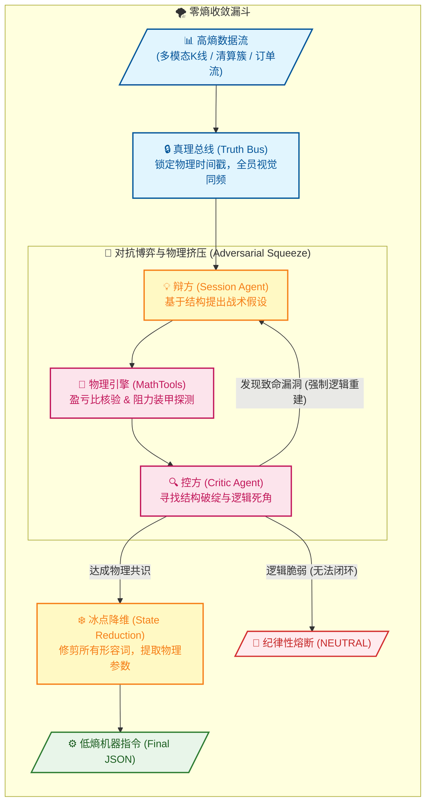

# Singularity

[](https://www.python.org/downloads/)

---

## ⚖️ 零熵架构：双子星对抗协议 (The Binary Star Protocol)

Binary Star 是一个高精度、多智能体量化分析引擎。其内核模拟了极高标准的辩论过程，通过 **对抗式推理 (Adversarial Reasoning)** 彻底消除交易偏见与幻觉。

每一次最终输出的交易指令，都必须在这场高压的生存游戏中，经历从复杂的市场混沌状态，到冷静、确定性的低熵参数的提纯。其核心机制如下：

- **统一场 (Truth Bus)**：**数据一致性锚定。** 将多维市场数据（K线、订单流、情绪等）硬性锚定在同一秒的物理切片上。系统采用 **DTO-First (数据传输对象优先)** 架构，通过标准的 `KlineData` / `OpenInterestData` 模型进行物理级灌装，杜绝大模型的解析幻觉，确保博弈全员视觉同频。
- **物理挤压 (The Squeeze)**：**逻辑一致性核验。** 辩方 (Session Agent) 负责提出战略蓝图，而控方 (Critic Agent) 执行“战略审查”。
- **零熵对齐 (Zero-Entropy Alignment)**：系统通过后端“数据清洗网关 (Sanitization Gateway)”实现了 100% 的物理一致性。
- **状态降维 (State Reduction)**：**执行一致性冷凝。** 当对抗各方逼近“数学交集”后，系统将抛弃 LLM 的人文修饰词，在绝对理性的低温度下，将共识瞬间冷凝为可直接执行的低熵机器参数 (JSON)。



### 🧠 零熵逻辑阵列 (The Zero-Entropy Logic Matrix)

为了实现物理级的“强制逼近”，系统不再区分传统的主观分析流派，而是将所有多通道数据统一映射为一套严格的**逻辑考察点与熔断条款**：

| 审查维度 (Audit Dimension) | 标识符 (Identifier) | 核心逻辑与进化目标 (Core Logic & Evolution) |
| :--- | :--- | :--- |
| **物理秩序** | `[ORDER_PHYSICS]` | **进场合法性核验**。强制检查入场位是否已被跌破/突破，以及止损逻辑是否符合物理方向（做多止损在中轴之下）。 |
| **地形屏蔽** | `[ANCHOR_VIOLATION]` | **锚点防护罩**。止损位必须由 HVN/POC 或清算簇进行物理覆盖。严禁“裸露”止损，防止流动性突刺。 |
| **结构陷阱** | `[STRUCTURAL_TRAP]` | **真空区规避**。严禁在成交密集区之外的“成交真空区” (Volume Vacuum) 建立阵地，防止价格无摩擦滑落。 |
| **无情数学** | `[MATH_VIOLATION]` | **盈亏比底线**。由物理引擎强制复核 RR 比与 ATR 容错空间。不满足最小数学期望的提案将被降级处理。 |
| **引力极限** | `[GRAVITY_EXHAUSTION]` | **均值回归压力**。判定价格是否已过度逃离核心价值区 (POC)。禁止在引力极限处追涨杀跌，强制寻求回归。 |
| **冰山吸收** | `[CVD_ABSORPTION]` | **墙体探测**。发现极端 CVD 脉冲被完全吸收（价格不涨反跌/不跌反涨），证明遭遇大户冰山挂单拦截。 |
| **散户挤压/清算** | `[RETAIL_LONG_SQUEEZE]` <br> `[RETAIL_SHORT_SQUEEZE]` | **反向极性收割**。探测到散户持仓极度失衡（如 80% 做多），严禁随波逐流，强制寻找“极性反转”机会。 |
| **机会损失修正** | `[INACTION_BIAS]` <br> `[OPPORTUNITY_DENIAL]` | **踏空惩罚**。当共识确认且结构清晰时，若系统给出无理由退缩，强制责令入场。在 v15 中保护“合法撤退”。 |
| **趋势饥饿** | `[TREND_STARVATION]` | **趋势捕获补遗**。检测波动率扩张且趋势强度达标但系统未参与的情况，防止在高确定性波段中“装死”。 |
| **流动性空洞** | `[LIQUIDITY_VOID]` | **防微杜渐**。探测距离最近的低成交区 (LVN) 过近的风险，防止价格在阻力最小路径上发生剧烈波动。 |
| **演化死循环** | `[PROTOCOL_VIOLATION]` | **逻辑死锁保护**。严禁系统在被证伪的废墟上重复提出同一个错误方案。逼迫系统发生强制的“范式转移”。 |
| **合规终局** | `[PRISTINE]` <br> `[JUSTIFIED_INACTION]` | **圣杯状态**。经过交叉盘问确认为完全合规的进场（绿灯），或基于物理事实的纪律性放弃（战略撤退）。 |

---

## 🛠 安装与操作手册

### 0. 环境准备 (重要)

```bash
# ai 是 Conda 环境名称
conda activate ai
# pip install -r requirements.txt
```

### 1. 核心指令集

### 1. 市场推理 (Session Engine)

*   **单次/批量分析 (Prod)**：对当前市场或指定时间点进行对抗推理。结果存入 `data/prod/sessions`。
```bash
python run_session.py
python run_session.py -ts 2026-01-24T15:42:00Z

python run_session.py --start T-30d --end T-2d --samples 14 --sampling-mode sniper --symbol XAUTUSDT -p data/backtest/v20_r14_xautusdt

python run_session.py --start T-30d --end T-2d --samples 14 --sampling-mode sniper
python run_session.py --start T-30d --end T-23d --samples 7 --sampling-mode sniper
python run_session.py --start T-23d --end T-16d --samples 7 --sampling-mode sniper
python run_session.py --start T-16d --end T-9d --samples 7 --sampling-mode sniper
python run_session.py --start T-9d --end T-2d --samples 7 --sampling-mode spaced
python run_session.py --start T-30d --end T-2d --samples 50 --sampling-mode sniper
```

*   **实时监控 (Sniper Mode)**：基于 **v15 零熵三类觉醒探测器**（TYPE_A 势能 / TYPE_B 动能 / TYPE_C 结构）捕捉异动。系统参数已在 `global_config.yaml` 中实现垂直硬化，实现 1:1 的工程映射备份。
```bash
python run_sniper.py --trigger --email
python run_sniper.py --trigger --email --trade
```

### 2. 取证审计 (Forensic Audit)
对 Session(s) 进行审计并生成报告，核验执行质量。
```bash
python run_audit.py -p data/prod
python run_audit.py -p data/backtest --file data/backtest/sessions/{symbol}_session_{timestamp}.json
python run_audit.py -p data/backtest/v18_r50
```

### 3. 账本看板 (Ledger Dashboard)
系统的可视化看板。它支持对“Audit(s) 审计报告” 或 “Sandbox 报告”进行 HTML 渲染，展示 MAE/MFE 物理特征：
```bash
python scripts/session_ledger.py -p data/backtest
python scripts/session_ledger.py -p data/backtest --f .../{symbol}_evolution_sandbox_{timestamp}.json
```

### 4. DNA 引擎 (Meta-Evolution)
基于 Audit 报告对逻辑进行“基因突变”式优化。综合考量 MAE、结果偏差及“聪明避战”奖励（补丁存入 `data/backtest/evolution/proposals`）。
```bash
python run_evolution.py -p data/backtest
```

### 5. 物理同步 (Patching)
正式将补丁“硬化”到系统。它会自动同步更新系统的配置文件与提示词。
```bash
python run_patch.py -f .../{symbol}_evolution_{timestamp}.json
```

---

## 🤖 AI Provider 配置

系统支持 **4 种 AI Provider**，可根据需求灵活切换：

| Provider | 特点 | 适用场景 | 成本 |
|----------|------|----------|------|
| **Gemini** | 多模态、Context Cache、1M 上下文 | 图像分析、超长文档 | 💰💰💰 |
| **DeepSeek** | OpenAI 兼容、国内直连、极速响应 | 日常推理、高频调用 | 💰 |
| **Qwen** | 中文优化、支持图像/视频、阿里云生态 | 中文场景、图表分析 | 💰 |
| **Ollama** | 本地部署、完全离线、隐私保护 | 数据敏感、无网络环境 | 🆓 |

### ⚙️ 切换步骤

#### 1. 配置 API Key

编辑 `.env` 文件（根据选择的 Provider）：
```bash
# Gemini（默认）
GEMINI_API_KEY="your-key-here"

# DeepSeek
DEEPSEEK_API_KEY="sk-your-key-here"

# Qwen
QWEN_API_KEY="sk-your-key-here"

# Ollama（无需 API Key，需本地运行 Ollama 服务）
```

#### 2. 安装依赖（如需要）
```bash
# DeepSeek / Qwen 需要
pip install openai

# Ollama 需要
pip install ollama
```

#### 3. 修改配置文件

编辑 [`config/global_config.yaml`](config/global_config.yaml)：
```yaml
llm:
  active_provider: "gemini"  # 可选: gemini / deepseek / qwen / ollama
```

#### 4. 重启程序
```bash
python run_session.py --email --symbol XAUTUSDT
```

### 📋 Provider 详细配置

**Gemini**（默认）
```yaml
llm:
  active_provider: "gemini"
  gemini:
    context_cache:
      enable: true
      expiration_minutes: 10
```
- ✅ 唯一支持 Context Cache 的 Provider
- ✅ 原生多模态（图像/视频）
- ❌ 需要 VPN（国内）

**DeepSeek**
```yaml
llm:
  active_provider: "deepseek"
  deepseek:
    base_url: "https://api.deepseek.com"
    model: "deepseek-v4-flash"  # 或 deepseek-v4-pro
```
- ✅ 性价比最高（便宜 96%）
- ✅ 国内直连，速度快
- ❌ 不支持图像

**Qwen**
```yaml
llm:
  active_provider: "qwen"
  qwen:
    base_url: "https://dashscope.aliyuncs.com/compatible-mode/v1"
    model: "qwen-plus"  # 或 qwen-vl-max（需图像）
```
- ✅ 中文理解能力强
- ✅ 支持图像/视频（qwen-vl-max）
- ✅ 阿里云生态集成

**Ollama**
```yaml
llm:
  active_provider: "ollama"
  ollama:
    base_url: "http://localhost:11434"
    model: "gemma4:e4b"  # 或其他本地模型
```
- ✅ 完全离线，隐私保护
- ✅ 免费使用
- ❌ 需要 GPU 和本地部署

### ⚠️ 注意事项

- **无缝切换**：切换 Provider 无需修改任何业务代码
- **功能兼容**：所有 Provider 均支持 Function Calling + JSON Mode
- **Context Cache**：仅 Gemini 支持，其他 Provider 会自动禁用
- **多模态**：Gemini ✅ / Qwen-VL ✅ / DeepSeek ❌ / Ollama（取决于模型）

---
