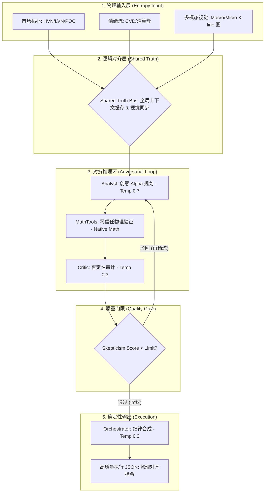

# 🌌 Singularity 跨代交易会话引擎 (v6.5)

[](https://www.python.org/downloads/)

> **"交易不是预测未来的游戏，而是生存于当下的博弈。"**
> 
> Singularity 是一个高保真、多智能体的量化架构，旨在通过 **对抗式推理 (Adversarial Reasoning)** 消除人类偏见。它能将复杂的市场混沌状态转化为冷静、确定性的执行指令。

---

## ⚖️ 系统架构：对抗式辩论协议 (The Binary Star Protocol)

Singularity 的内核是一个多智能体对抗系统，模拟了严苛的法庭审判过程。一个交易提案必须在“真理总线”的物理锚定下，通过多轮交叉盘问与逻辑硬化，最终收敛为执行指令。

### 🛡️ 推理三元组 (The Reasoning Triad)
1.  **📂 证人 (Market Observer)**：**事实驱动**。负责实时捕捉市场拓扑结构（成交量分布、ATR 波动率、CVD 情绪），并生成不可篡改的多模态物理快照。
2.  **🤺 辩方 (Session Analyst)**：**创意驱动**。基于观察快照提出交易假设（Temp 0.7）。它负责寻找隐藏在混沌中的 Alpha 机会。
3.  **🔍 控方 (Skeptical Critic)**：**逻辑驱动**。执行“否定性审计”（Temp 0.3）。它以零信任态度搜索提案中的数学漏洞、结构性风险和情绪化偏见。

---

## 🛠 核心功能与技术模块

该平台提供了一套完整的端到端取证与优化流水线：

*   **⚡ 实时市场取证 (High-Fidelity Forensics)**：深度分析市场拓扑结构（支撑/阻力节点）和情绪强度（CVD/清算簇），构建确定性的分析语境。
*   **🔄 对抗式博弈协议 (Adversarial Debate)**：通过 Critic 智能体自动识别 Analyst 提案中的数学逻辑漏洞、结构性风险和情绪化偏见。
*   **🧪 自动化后期取证审计 (Post-Mortem)**：交易结束后，系统会自动比对“交易假设”与“实际市场物理走势”，识别是“合理的放弃”还是“灾难性的遗漏”。
*   **🧬 元进化 DNA 引擎 (Meta-Evolution)**：基于后期审计的反馈，由 Evolver 智能体自动更新系统的“DNA”（配置参数与提示词逻辑），实现自我进化。
*   **📊 专业级可视化报告**：生成交互式 HTML 仪表盘和执行账本，包含卡玛比率 (Calmar)、最大回撤 (MDD) 和权益增长曲线。

---

## 🌟 双子星系统 (Binary Star System): 深度逻辑与收敛机制

双子星系统是 Singularity 的心脏，旨在通过多智能体的对抗博弈，将模糊的市场状态收敛为高质量、高确定性的执行方案。

### 1. 核心架构：共享真理总线 (Shared Truth Bus)
为了防止智能体在推理过程中产生“逻辑漂移”，系统引入了 **Truth Bus**：
- **物理锚定**：基于 `observed_at` 的高精度时间戳（ISO-8601 Zulu），确保所有智能体共享同一秒的物理现实快照。
- **视觉一致性**：所有智能体同时观察完全相同的 Macro/Micro K 线图资产，消除数据非对称性。

### 2. 熵减过程：从混沌到高品质结果 (The Convergence Engine)
系统的决策逻辑是一个通过迭代不断硬化（Hardening）的过程，将市场高熵状态提纯为低熵执行指令：



### 3. 温度差策略 (Temperature-Shift Strategy)
这是实现逻辑收敛的关键：
- **Planning (0.7)**：在博弈初期允许“创造性 Alpha”，激发寻找隐藏模式的潜能。
- **Synthesis (0.3)**：在达成逻辑共识后，强制进入“冷合成”模式，消除修辞干扰，只输出绝对确定的执行指令。

---

### 🌀 收敛引擎：从混沌到精准 (The Convergence Engine)

系统收敛是一个将庞大的市场熵提纯为单一、低风险执行点的过程，通过以下四层精密同步实现：

### 🔬 多模态视觉对齐 (Visual & Temporal Anchoring)
系统不仅共享文本数据，还通过 **Shared Truth Bus** 缓存高保真的 **Macro/Micro K-line 图**。这意味着 Witness, Analyst 和 Critic 看到的是完全相同的“物理快照”，包括精确的时间戳、CVD 峰值和成交量节点。这种多模态的一致性杜绝了 AI 常见的“逻辑漂移”和“数据幻觉”。

### 📐 物理真实性审计 (Zero-Trust Physics)
系统对 AI 的数学计算实施 **零信任** 政策。每一轮提案中的盈亏比 (RR)、ATR 距离、止损缓冲区以及结构化隔离度（Structural Isolation）都会被 **Python 原生数学工具集 (MathTools)** 重新核算。逻辑推理只有在物理细节（Entry/SL/TP）与市场拓扑完全吻合时，才允许进入下一轮辩论。

### 🛡️ 质疑一票否决权 (The Quality Floor)
系统的目标不是“更多的交易”，而是“无可争议的交易”。Critic 智能体在 **Temp 0.3** 的冷逻辑模式下搜索提案中的破绽。如果在经过最大辩论轮次后，Critic 的 **质疑分 (Skepticism Score)** 仍高于阈值（通常为 50），系统将以 **Veto (否决)** 状态中止会话，拒绝在模糊地带冒险。

### ⛓️ 确定性纪律合成 (Convergent Synthesis)
最终的执行方案不是简单的“总结”，而是一次 **状态降维**。Orchestrator 将 Analyst 的创意灵感与 Critic 的防御边界进行强行对齐，剔除所有形容词和不确定表述，最终输出符合生产环境要求的、纯粹的 JSON 指令集。

---

## 🚀 核心创新

### 🛰️ 真理总线 (Context Caching)
防止智能体产生逻辑“漂移”，通过共享真理总线确保所有参与博弈的 AI 观察到的是完全同一维度的市场现实。

### 🧬 元进化反馈环 (Genetic Loop)
交易不再是孤立的。Evolver 智能体通过对审计报告的深度学习，动态调整策略参数，确保系统在下一个市场周期中更加聪明。

---

## 🛠 安装与操作手册

### 0. 环境准备 (重要)
在运行任何脚本之前，请确保你的虚拟环境已激活。这是保证依赖项正确加载的前提：
```bash
source venv/bin/activate
```

### 1. 市场分析会话 (Session Engine)
系统会自动根据 CLI 参数识别运行模式（Once, Backtest, 或 Live）。

*   **单次分析 (Once)**：对当前市场瞬时状态进行一站式对抗推理（默认结果存入 `data/once`）。
    ```bash
    python run_session.py
    ```
*   **时间锚定分析 (Timestamp)**：对历史特定的时间点进行单次取证分析，支持自定义路径。
    ```bash
    python run_session.py -ts 2026-03-13T15:43:00Z --path data/backtest
    ```
*   **批量回测模式 (Backtest)**：在历史样本点上进行高保真的批量推理循环。
    ```bash
    python run_session.py --start T-14d --samples 12
    ```
*   **实时生产监控 (Live)**：按固定脉冲频率（秒）持续运行，监控市场异动。
    ```bash
    python run_session.py --pulse 60
    ```

### 2. 取证审计 (Forensic Audit)
对会话日志进行深度取证，并将结果存入审计库以供进化学习。
```bash
# 审计特定文件 (需指定数据根目录 -p)
python run_audit.py -p data/once --file data/once/sessions/BTCUSDT_session_时间戳.json

# 批量分析整个目录
python run_audit.py -p data/once
```

### 3. 元进化 DNA 引擎 (Meta-Evolution)
基于审计报告，对系统的判定逻辑进行“基因突变”式优化。建议始终开启 `--sandbox` 以确保逻辑不退化。
```bash
python run_evolution.py -p data/once --samples 20 --sandbox
```

### 🏆 渐变式进化工作流 (The Triple Hardening Workflow)
推荐的高保真策略进化路径，通过三个阶段不断“硬化”逻辑：

*   **阶段 A：宏观基准训练 (Baseline)**
    *   **目标**：建立跨越 14 天的宏观稳定性。
    *   **操作**：
        1. `python run_session.py --start T-29d --end T-15d --samples 12` (默认存入 data/backtest)
        2. `python run_audit.py -p data/backtest`
        3. `python run_evolution.py -p data/backtest --samples 12 --sandbox`
*   **阶段 B：近期律动适配 (Recency Adaptation)**
    *   **目标**：对齐最新的市场波动特性。
    *   **操作**：
        1. `python run_session.py --start T-15d --end T-1d --samples 12` (默认存入 data/backtest)
        2. `python run_audit.py -p data/backtest`
        3. `python run_evolution.py -p data/backtest --samples 12 --sandbox`
*   **阶段 C：极端案例加固 (Adversarial Hardening)**
    *   **目标**：针对历史所有的 **失败审计 (Failures)** 进行专项逻辑闭合。
    *   **操作**：
        1. `python run_evolution.py -p data/backtest --samples 12 --sandbox` (Evolver 会自动优先处理失败案例)

### 4. 战术权益账本 (Strategy Ledger)
生成特定品种的交互式 HTML 表现看板（通常用于回测结果展示）。
```bash
python tools/session_ledger.py -p data/backtest --recursive
```

### 5. 市场勘探 (Market Recon)
生成特定品种的Market 数据以及 klines 图。
```bash
python tools/market_recon.py --path data/test -ts 2026-04-05T00:00:00Z
```

---

## 🏗 数据架构：黑盒目录

| 目录 | 用途 | 保留期限 |
| :--- | :--- | :--- |
| `data/once/sessions` | 原始智能体辩论日志及最终决策。 | 30 天 |
| `data/once/audits` | 针对止损或未触发机会的高保真取证报告。 | 永久 |
| `data/once/html` | 交互式表现仪表盘与权益曲线。 | 永久 |
| `data/once/evolution/proposals` | 生成的逻辑更新候选项 (JSON)。 | 永久 |
| `data/once/evolution/applied_patches` | 已成功合并并验证的逻辑补丁。 | 版本化 |

---

## 📖 术语库 (非专家指南)

| 术语 | 通俗解释 | 技术含义 |
| :--- | :--- | :--- |
| **拓扑 (Topography)** | “地形图” | 价格水平与成交量分布之间的空间关系。 |
| **POC (Point of Control)** | “公允价值” | 特定时间内成交量最密集的价位。 |
| **HVN (High Volume Node)** | “堡垒” | 具有重成交量支撑/阻力的价位区域。 |
| **Squeeze (挤压)** | “蓄势待发” | 市场进入低波动期，预示着即将发生剧烈突破。 |
| **DLE (Deep Entry)** | “黄金切入” | 在支撑区深处挂单，以提高安全边际。 |

---