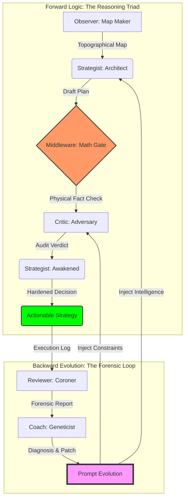

# ⚖️ 真相 · 逻辑 · 审计

> **“不预测行情，只测绘逻辑。”**

这是一个基于 **物理真相** 与 **对抗性演化** 构建的多智能体交易系统。它通过“三路推理 (Reasoning Triad)”架构，将极度不确定的市场博弈转化为确定性的物理地形测绘与逻辑审计。每一张单子都是物理事实与对抗性逻辑的结晶，是对市场脆弱性的精确爆破。

---

## 🗺️ 物理地形 · 演化枢纽

系统通过 **前向推理 (Forward Reasoning)** 与 **后向演化 (Backward Evolution)** 构建了一个具备自我修复能力的闭环生态：



---

## 🧬 逻辑审计 · 共识协议

基于明确的物理地形边界与逻辑主权隔离，各组件在协作交接中始终维持着不可逾越的“法医级”逻辑严谨度：

| 智能实体 | 职能模型 | 枢纽逻辑 | 演化产物 |
| :--- | :--- | :--- | :--- |
| **Observer** | **测绘师** | **物理景观聚合**：识别宏微观地形共振 并量化趋势强度 | 地形全景数据 |
| **Strategist (A)** | **架构师** | **交易蓝图构建**：锚定高成交量节点 (HVN) 并预设物理执行轨迹 | 逻辑草案 |
| **Middleware** | **真理校验门** | **物理解耦公证**：强制锁定 RR 与 ATR 参数，彻底消除 AI 幻觉 | 物理事实底座 |
| **Critic** | **对抗审判官** | **生存压力测试**：基于《怀疑论》模型进行对抗性审计，识别流动性陷阱 | 审计判决书 |
| **Strategist (B)** | **觉醒者** | **风险硬化收敛**：整合审计意见，执行深度入场防御 (DLE) 或强制弃权 | 最终执行方案 |
| **Reviewer** | **法医鉴定师** | **尸检溯源对比**：精准对齐成交事实，捕捉逻辑与现实的“真值偏离” | 法医复盘报告 |
| **Coach** | **演化合伙人** | **认知偏差修正**：诊断系统性盲区，合成多智能体进化的底层逻辑补丁 | 逻辑补丁 |

---

## 🛡️ 逻辑盾牌

为了确保系统在极高波动的加密市场中生存，我们部署了三层“逻辑护甲”：

### 第一层：物理真实网关
核心逻辑：剥离 AI 的数学解释权。 强制由后端 Python 计算确定性的盈亏比 (RR)、波动幅度 (ATR) 与时间效率 (Temporal Efficiency)，并作为系统的唯一法定事实注入。此举彻底消除了 LLM 在复杂计算中的幻觉，确保逻辑基座的绝对真实。

### 第二层：多模态视觉证伪
核心逻辑：特征引用与视觉存证。 拒绝由于纯数字漂移导致的盲目决策。所有推理必须显式引用视觉快照（Snapshot）中的地形特征（如“特定价格坐标的影线阻力”）。这建立了一种**“证据对齐”**机制，确保决策逻辑在物理空间中是有迹可循的。

### 第三层：递归状态机
核心逻辑：原子化状态切换。 废弃复杂的会话状态（Context）管理，采用原子化的相位探测逻辑（检测 Draft 是否存在来自动切换 Phase A/B）。这使得系统保持完全无状态（Stateless），极大提升了在分布式、高频环境下的推理可预测性与部署弹性。

---

## 📈 跨域缩放 · 硬化准则

> [!IMPORTANT]
> **“持仓周期 (Holding Period)” 是系统的核心权重，而非简单的环境参数。** 调整持仓目标会导致系统产生“多阶维度”的偏移，必须配套以下硬化逻辑。

### 1. 缩放路线图 (Strategy Scaling Logic)
针对系统在 **“时间跨度周期对齐” (Temporal Alignment)** 上的局限性，提供如下缩放配置：

| 目标策略 | Macro / Micro | 核心改动 (Config) | 核心改动 (Prompt) |
| :--- | :--- | :--- | :--- |
| **Swing (1周内)** | 1h / 15m | `funding_lookback`: 168h | `min_temporal_efficiency`: 0.3 |
| **Position (1月内)**| **4h / 1h** | `resolution_bins`: 800+ | `Dynamic RR`: Trend >= 3.0x |
| **Logic (Scalp)** | 15m / 1m | `wick_skew_period`: 1 | `confidence`: High Fill Priority |

### 2. 多维审计要点 (Deep Audit Points)
*   **物理几何崩溃**: 当 `macro_interval` 拉长至周/月级别时，分桶数 (Bins) 必须呈 **对数级增加**。否则，高成交量节点（墙）的厚度会吞没系统预留的止损缓冲区。
*   **线性公式失效**: `holding_time_hours` 的线性算法在月度持仓中会导致预测值脱靶。长线策略必须在 Prompt 中引入 **“波动率预期衰减”** 的权重。
*   **数据孤岛风险**: 对于长线级别，`fetch_liquidations` 无法捕获数周前的关键强平簇，必须通过本地持久化来对抗 API 数据丢失。

---

## 🚀 运行手册

系统采用模块化架构，实现从物理地形探测、策略法医审计到逻辑演化补偿的全生命周期闭环。

### Phase 0: 部署与核心环境
```bash
python3 -m venv venv && source venv/bin/activate
pip install -r requirements.txt
# 在 .env 中配置以下关键凭证：
# GEMINI_API_KEY="..."
```

### Phase 1: 策略执行与回测验证
*   **单点实时预测**: `python3 strategist.py --symbol BTCUSDT prod`
*   **历史抽样回测**: `python3 backtest.py --sampling 12 --mode regime --start T-24d backtest`
*   **策略演化回放**: `python3 strategist_replay.py backtest --file [JSON_PATH]`

### Phase 2: 法医调查与看板分析
*   **法医报告生成**: `python3 reviewer.py prod`
*   **盲测复盘回放**: `python3 reviewer_replay.py prod --file [JSON_PATH]`
*   **策略逆向导出**: `python3 export_strategy.py [env] --file [REVIEW_JSON_PATH]`
*   **可视化看板**: `python3 forensic_dashboard.py --symbol BTCUSDT [env]`

### Phase 3: 自动化演化循环
*   **全自动化编排**: `python3 pipeline_orchestrator.py --symbol BTCUSDT --interval 1 live`
*   **诊断与进化合成**: `python3 coach.py --symbol BTCUSDT [prod|live|backtest]`
*   **应用逻辑补丁**: `python3 apply_patch.py --file [PATCH_JSON_PATH]`
