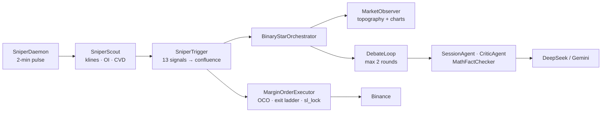
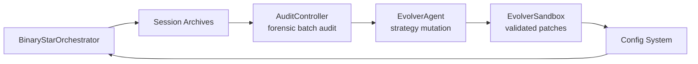
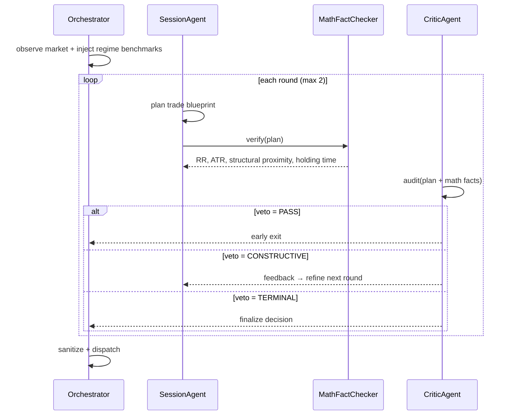
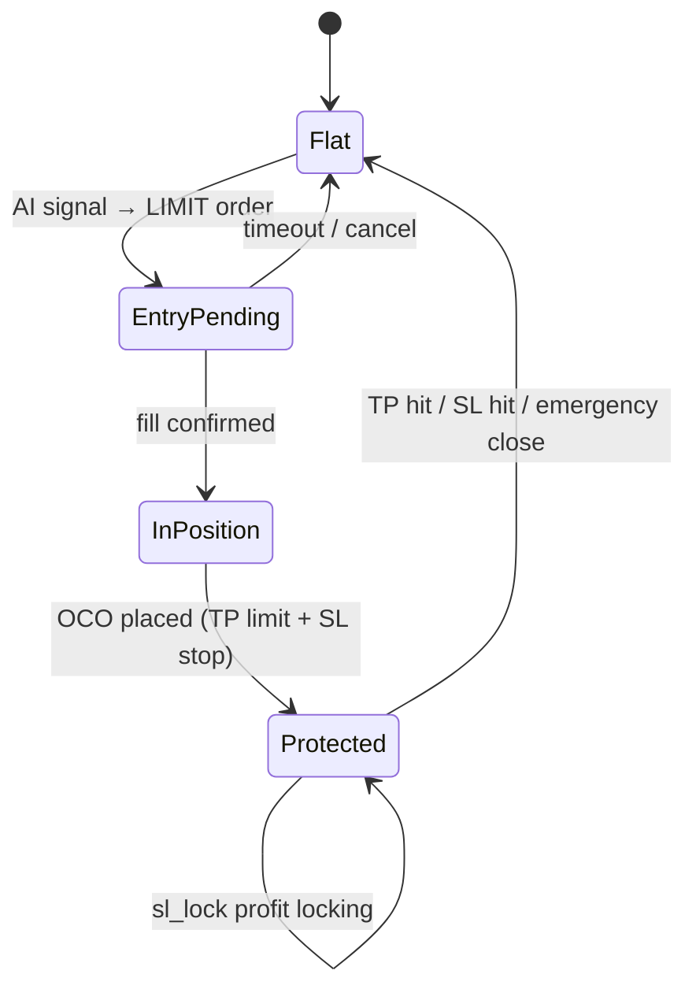

# Singularity

[](https://www.python.org/downloads/)

AI-driven crypto quant trading engine. **Binary Star adversarial protocol** — two LLM agents debate in rounds to converge on trade decisions, anchored by deterministic math verification. A lightweight **Sniper daemon** monitors 13 market signals at 2-minute pulses, activating the heavyweight AI only when signal confluence crosses a regime-adaptive threshold.

---

## Architecture

Two independent flows — separated to keep every line straight.

### Signal Pipeline



### Evolution Loop



Config patches feed back into the signal pipeline on the next pulse.

### Layers

| Layer | Key Modules | Role |
|-------|-------------|------|
| **Entry** | `run.py`, `run_sniper.py`, `run_session.py` | CLI + daemon entry |
| **Orchestration** | `BinaryStarOrchestrator`, `SniperDaemon` | Signal → debate → trade lifecycle |
| **Reasoning** | `SessionAgent`, `CriticAgent`, `DebateLoop` | Adversarial debate with math anchoring |
| **Sniper** | `SniperScout`, `SniperTrigger`, `MarginOrderExecutor` | Pulse monitoring, signal stack, position protection |
| **Analyzer** | `MarketObserver`, `VolumeProfile`, `MarketRegime`, `ChartGenerator` | Topography, regime detection, kline rendering |
| **Infrastructure** | `BinanceFuturesClient`, `BinanceMarginClient` | Exchange API (futures + cross-margin) |
| **AI** | `DeepSeekAdapter`, `GeminiAdapter`, `AIFactory` | Provider-agnostic LLM interface |
| **Evolution** | `AuditController`, `EvolverAgent`, `EvolverSandbox` | Forensic audit → config mutation |
| **Config** | `Loader`, `SymbolResolver`, `SubConfigs` | YAML resolution with per-symbol overrides |
| **Dashboard** | `FastAPI server`, `SessionHTMLRenderer` | Live sessions, backtest, audit UI |

---

## Binary Star Protocol

Two agents, adversarial debate, deterministic math verification. The Session Analyst proposes; the Critic audits; the MathFactChecker anchors both to physical reality.



### Audit Dimensions

| Dimension | Check |
|-----------|-------|
| **D1 Topographical Armor** | Is the stop-loss shielded by a structural anchor (HVN, VAH, POC)? |
| **D2 Regime Sync** | Does the trade direction align with CVD flow, trend, and regime? |
| **D3 Temporal Physics** | Are holding/waiting times consistent with ATR velocity and dilation? |
| **Math Verification** | RR ratio, ATR distances, structural proximity — computed deterministically |

---

## Sniper System

2-minute pulses. 13 signal detectors across 5 categories. Confluence scoring with regime-adaptive thresholds. Cooldown prevents retrigger spam.

### Signal Stack

| Category | Signal | Weight |
|----------|--------|--------|
| **FLOW** | `cvd_momentum` | 0.65 |
| | `cvd_divergence` | 0.70 |
| | `cvd_absorption` | 0.65 |
| | `taker_imbalance` | 0.60 |
| **ENERGY** | `volatility_surge` | 0.55 |
| | `squeeze` | 0.75 |
| **STRUCTURAL** | `boundary_test` | 0.50 |
| | `poc_gravity` | 0.55 |
| | `liquidation_hunt` | 0.60 |
| | `trend_pullback` | 0.75 |
| **POSITIONING** | `retail_extreme` | 0.42 |
| | `oi_divergence` | 0.70 |
| | `oi_surge` | 0.55 |
| **CROSS-SYMBOL** | `leader_sync` | 0.40 |

Config: `trigger_threshold=0.34`, `emergency_threshold=0.80`. Regime modifiers: trending ×0.85, ranging ×1.00, squeeze ×0.75, chaos ×1.50. Cooldown: `base_multiplier=2.5`.

### Order Lifecycle



### Exit Ladder

Three TP-relative levels. All share a consistent 40% buffer between trigger and locked stop-loss position.

| Level | Target | Partial Close | SL Lock |
|-------|--------|---------------|---------|
| L1 | 44% toward TP | 24% of position | 4% (near entry) |
| L2 | 64% toward TP | 24% of position | 24% |
| L3 | 84% toward TP | 24% of position | 44% |

Formula: `SL = entry + (TP − entry) × sl_lock`. Trigger: `progress = deviation / TP_distance ≥ target`.

---

## Installation

```bash
git clone <repo> && cd crypto
pip install -e .
cp .env.example .env    # add API key for your provider
```

**Requires:** Python 3.12+, Binance API credentials, provider API key.

---

## Commands

```bash
# ── Sessions ─────────────────────────────────────────────────
python run.py session --symbol BTC -p data/prod                  # Live trading session
python run.py session --symbol XAUT -p data/prod --historical    # Historical replay

# ── Sniper ───────────────────────────────────────────────────
python run.py sniper --symbol BTC,XAUT -p data/prod              # Monitor only
python run.py sniper --symbol BTC,XAUT -p data/prod --trade 640  # Live trading

# ── Audit & Evolution ────────────────────────────────────────
python run.py audit -p data/prod                                 # Forensic batch audit
python run.py evolve -p data/prod --population 8                 # Strategy evolution

# ── Dashboard ────────────────────────────────────────────────
python run.py dashboard -p data/prod                             # Web UI at localhost:8000
```

---

## AI Providers

| Provider | Model | Vision | Context Cache |
|----------|-------|--------|---------------|
| DeepSeek | `deepseek-v4-pro` | — | — |
| Gemini | `gemini-3.5-flash` | Yes | Yes |

**Agent temps:** Session 0.5 (thinking=high), Critic 0.1 (deterministic), Evolver 0.3 (thinking=max).
**Config:** `llm.active_provider` + per-agent `temperature`/`reasoning_effort`.

---

## Key Invariants

- **OCO lifecycle** (`order_executor.py`): Every filled position gets an OCO (TP limit + SL stop) within one pulse. Naked positions are an emergency condition.
- **Exit ladder is sequential** (`order_executor.py`): L1 must fire before L2. SL lock only activates after the corresponding level triggers.
- **Cooldown prevents spam** (`trigger.py`): A triggered symbol enters regime-based cooldown (2.5× multiplier). Only emergency threshold (0.80) or stacked break (≥3 signals) overrides.
- **Config resolution** (`loader.py`): `symbol_config.yaml` overrides deep-merge into `global_config.yaml`. Evolution patches sit at the highest priority.
