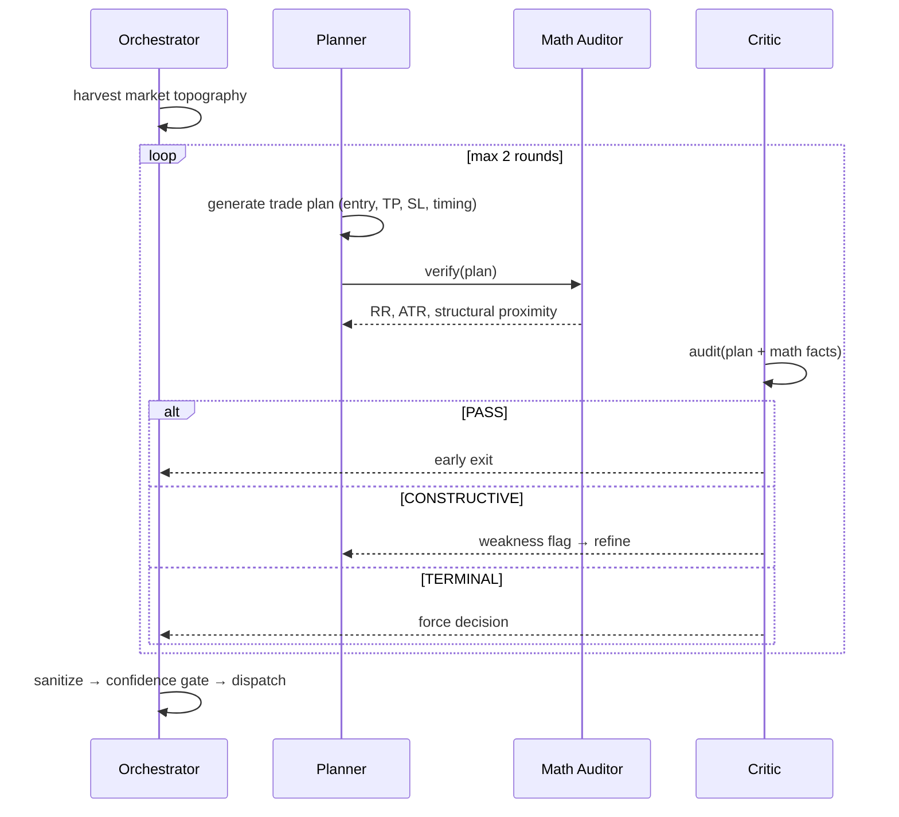
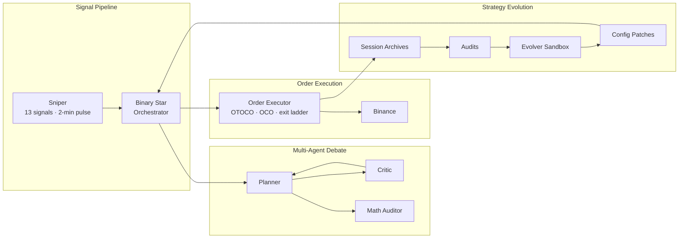

# Singularity

[](https://www.python.org/downloads/)

AI-driven crypto quant trading engine built around the **Binary Star multi-agent debate protocol** — Planner proposes, Critic audits, Math Auditor verifies. Agents collaborate adversarially across rounds to converge on physically-anchored trade decisions. A lightweight signal monitor activates the heavyweight AI only when market confluence crosses a regime-adaptive threshold.

---

## Binary Star Protocol

Three agents collaborate adversarially to produce every trade decision — no single model calls the shots.



**Planner** generates a complete trade blueprint: entry price, stop-loss, take-profit, projected holding time, RR ratio, and a scored confidence breakdown. It reads market topography — volume profile anchors, liquidation clusters, CVD flow, regime classification — and constructs a structurally-shielded position.

**Math Auditor** deterministically verifies RR ratio, ATR distances, structural proximity (betweenness), and temporal physics. No LLM — pure computation. The Planner cannot submit a plan that fails math verification.

**Critic** audits against an 18-condition code table, issuing one of four veto levels:

| Veto | Meaning |
|------|---------|
| **PASS** | Plan is sound — early exit, no further rounds |
| **WEAK** | Minor concerns — accepted with caveats, exit |
| **CONSTRUCTIVE** | Fixable flaws — feedback loop, Planner refines |
| **TERMINAL** | Unfixable — forced convergence, plan accepted as-is |

The debate converges in at most 2 rounds. PASS on round 1 skips the second round entirely.

### Confidence Scoring

Every plan carries a 0-100 confidence score across three dimensions:

| Dimension | Weight | What it measures |
|-----------|--------|-----------------|
| **D1 Topographical Armor** | 40 | Stop-loss shielded by structural anchor (HVN, VAH)? Betweenness satisfied? |
| **D2 Regime Sync** | 30 | Trade direction aligned with CVD flow, trend, and market regime? |
| **D3 Temporal Physics** | 30 | Holding/waiting times consistent with ATR velocity and dilation? |

Scores below the confidence threshold (50) are rejected at the trade gate. Debate penalties from CONSTRUCTIVE rounds reduce the final score — the system penalizes plans that needed correction.

---

## Architecture



Two loops: the **signal pipeline** (left) triggers AI debate and executes trades in real-time. The **evolution loop** (right) runs offline, auditing sessions and generating config patches that feed back into the next cycle.

---

## Sniper

A local signal stack monitors 13 market signals across 5 categories (flow, energy, structural, positioning, cross-symbol). A regime-adaptive confluence engine determines when market conditions warrant activation. Its purpose is providing high-quality entry timing for the Binary Star debate system.

Config: `trigger_threshold=0.34` (modulated by regime), `emergency_threshold=0.80`. Adaptive cooldown with `neutral_multiplier=0.5` for non-trade sessions. Cooldown breaks on stacked signals (≥3) or 1.8× strength ratio.

---

## Order Management

| Phase | Mechanism |
|-------|-----------|
| Entry | OTOCO — atomic limit entry with nested TP/SL, zero naked window |
| Protection | Guardian OCO — every filled position is wrapped in TP limit + SL stop within one pulse |
| Profit-taking | 3-level exit ladder — 24% partial close at 44/64/84% TP progress |
| Stop migration | Dynamic trailing SL — locks in profit as each ladder level fires (4% → 24% → 44% of TP distance) |

---

## Evolution

A sandboxed strategy evolution loop runs offline, evaluating candidate configurations against historical session audits. Successful variants produce config patches — updated strategy logic and parameter overrides — consumed by Binary Star on the next signal cycle.

---

## AI Providers

| Provider | Model | Vision | Temperature |
|----------|-------|--------|-------------|
| DeepSeek | `deepseek-v4-pro` | — | Session 0.5, Critic 0.1 |
| Gemini | `gemini-3.5-flash` | Yes | Session 0.5, Critic 0.1 |

Planner uses high reasoning effort (`thinking=high`). Critic runs at null reasoning (deterministic audit). Evolver uses max reasoning. DeepSeek is the active provider; Gemini available as fallback with vision support for chart-aware sessions.

---

## Config System

```
config/
├── global_config.yaml       # Binary Star, Sniper, Guardian, LLM, Sandbox
├── strategy_config.yaml     # Regime detection, temporal physics, risk parameters
├── symbol_config.yaml       # Per-symbol precision, min qty, buffer overrides
└── prompts/                 # AI role prompts (Planner, Critic, Evolver)
```

Resolution order: `global_config` → `strategy_config` → `symbol_config` overrides → evolution patches (highest priority).

---

## Installation

```bash
git clone <repo> && cd crypto
pip install -e .
cp .env.example .env    # add API key for your provider
```

**Requires:** Python 3.12+, Binance API credentials, provider API key.

---

## Commands

```bash
# ── Sessions ─────────────────────────────────────────────────
python run.py session --symbol BTC -p data/prod                  # Live trading session
python run.py session --symbol XAUT -p data/prod --historical    # Historical replay

# ── Sniper ───────────────────────────────────────────────────
python run.py sniper --symbol BTC,XAUT -p data/prod              # Monitor only (no AI, no trade)
python run.py sniper --symbol BTC,XAUT -p data/prod --llm        # Monitor + AI session dispatch
python run.py sniper --symbol BTC,XAUT -p data/prod --trade 640  # Live trading ($640 manual balance)

# ── Backtest ─────────────────────────────────────────────────
python run.py backtest-run --symbol BTCUSDT --start 2026-01-01 --samples 100

# ── Audit & Evolution ────────────────────────────────────────
python run.py audit -p data/prod                                 # Forensic batch audit
python run.py audit -p data/prod -f <session.json>               # Single session audit
python run.py evolution --symbol BTC --samples 50 -p data/prod   # Strategy evolution
python run.py patch -f <proposal.json> --symbol BTC              # Apply evolution patch

# ── Dashboard ────────────────────────────────────────────────
python run.py dashboard -p data/prod                             # Web UI at localhost:8000

# ── Utilities ────────────────────────────────────────────────
python scripts/market_recon.py --symbol BTC --path data/prod --email   # Market reconnaissance
python scripts/archive_sessions.py -p data/prod --version 26.7.8       # Archive sessions
```
