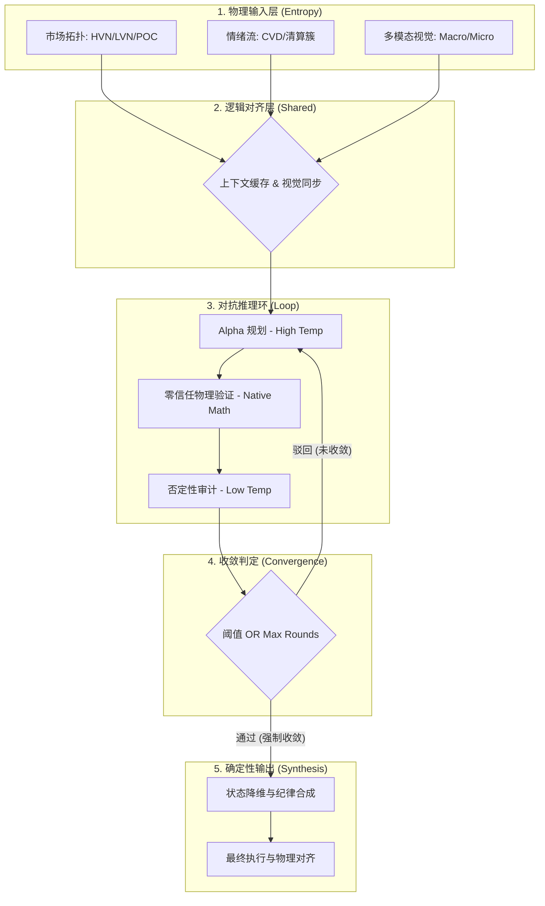

# 🌌 Singularity 跨代交易会话引擎 (v6.5)

[](https://www.python.org/downloads/)

---

> **"交易不是预测未来的游戏，而是生存于当下的博弈。"**
> 
> Singularity 是一个高保真、多智能体的量化架构，旨在通过 **对抗式推理 (Adversarial Reasoning)** 消除人类偏见。它能将复杂的市场混沌状态转化为冷静、确定性的执行指令。

---

## ⚖️ 系统架构：双子星对抗协议 (The Binary Star Protocol)

Singularity 的内核是一个多智能体对抗系统，模拟了极高标准的法庭辩论与审判过程。每一笔交易提案都必须在 **真理总线 (Truth Bus)** 的物理锚定下，经历多轮“创意-审计-硬化”的迭代循环，最终将市场的高熵混沌提纯为低熵的、确定性的执行指令。

### 🛡️ 推理三元组 (The Reasoning Triad)

1.  **📂 证人 (Market Observer)**：**物理锚定 (The Anchor)**。事实驱动。负责实时捕捉市场拓扑结构（成交量分布、ATR 波动率、CVD 情绪），并生成不可篡改的多模态物理快照 (Forensic Charts)，为博弈各方提供绝对一致的物理观测基准，杜绝 AI 常见的数据幻觉。
2.  **🤺 辩方 (Session Analyst)**：**启发演化 (The Thesis)**。创意驱动。基于观察快照提出具备不对称风险收益比的交易假设。它负责在复杂混沌中执行启发式搜索，捕捉隐藏在流动性失衡与波动率挤压中的 Alpha 机会。
3.  **🔍 控方 (Skeptical Critic)**：**逻辑审计 (The Antithesis)**。负向驱动。执行零信任维度的“安全性审计”。它以极低温度 (Temperature) 的冷逻辑探测提案中的数学逻辑漏洞、结构性风险和情绪化偏见，拥有在收敛失败时的一票否决权 (Veto)。

---

## 🛡️ 核心能力：取证驱动的进化流水线 (Forensics-Driven Pipeline)

Singularity 提供了一套从物理取证到自我进化的全栈流水线，确保每一行执行指令都经过“实验室级”的压力测试：

*   **⚡ 高保真物理取证 (High-Fidelity Forensics)**：深度提取市场拓扑（支撑/阻力节点）与情绪流（CVD/清算簇），通过 **Forensic Charts** 为智能体构建具备物理一致性的分析语境，杜绝任何数据幻觉。
*   **🔄 对抗式逻辑硬化 (Adversarial Hardening)**：基于 **Binary Star 协议**，利用 Critic 智能体对交易提案进行多轮否定性审计，强制识别并消除数学漏洞、结构风险及交易员的情绪偏见。
*   **🧪 闭环回溯取证 (Post-Mortem Audit)**：在交易终点自动执行“物理对敲”，比对交易假设与市场实际走势，通过取证报告识别“逻辑偏差”与“关键遗漏”。
*   **🧬 元进化 DNA 引擎 (Meta-Evolution)**：将审计日志转化为进化指令，由 Evolver 智能体自动迭代系统的配置参数（DNA）与 Prompt 逻辑，实现跨周期的自我硬化。
*   **📊 交互式法庭账本 (Forensic Ledger)**：生成专业级 HTML 仪表盘，不仅展示权益增长曲线与最大回撤，更记录了每一笔交易从“提案”到“收敛”的全流程取证足迹。

---

## 🌟 双子星内核 (Binary Star Core): 逻辑收敛与熵减机制

双子星系统是 Singularity 的计算心脏，其核心职能是通过多智能体的高强度对抗博弈，将高熵的市场混沌态（模糊、嘈杂、不可预测）提纯为低熵的、可执行的精细指令。

### 1. 共享真理总线 (Shared Truth Bus): 消除认知漂移的“统一场”
为了防止分布式智能体在推理过程中产生“幻觉”或“逻辑漂移”，系统建立了一份强制性的 **物理观测准则**：
- **物理时间锚定 (Temporal Anchoring)**：基于 ISO-8601 高精度时间戳，锁定物理现实的某一个瞬间，确保所有智能体对“当下”这一秒拥有绝对共识。
- **视觉一致性同步 (Visual Consistency)**：所有智能体共享完全一致的多模态 **Forensic Charts** 资产。这种视觉上的“原子级对齐”彻底排除了文本数据传输中可能存在的非对称性误读。

### 2. 迭代硬化引擎 (The Convergence Engine): 从混沌假设到精密输出
系统的决策过程本质上是一个 **逻辑熵减** 的过程。通过多轮对抗，将模糊的 Alpha 假设转化为坚固的执行方案：




---

### 🔬 核心共识机制：收敛引擎 (The Convergence Engine)

收敛引擎是 Singularity 的“重型逻辑提纯仪”，通过物理与逻辑同步，将高熵的市场混沌转化为低熵的确定性结果：

#### 1. 多模态视觉锚定 (Visual & Temporal Anchoring)
通过 **Shared Truth Bus** 在内存中锁定高保真 **Forensic Charts**。所有博弈智能体共享同一秒的物理现实与视觉快照，从底层杜绝了 AI 常见的“逻辑漂移”与“数据幻觉”，确保所有推理都锚定在真实的 K 线拓扑之上。

#### 2. 零信任物理审计 (Zero-Trust Physics)
系统对所有数学推理实施“外部核验”。每一轮提案中的盈亏比 (RR)、ATR 距离及结构化隔离度，都会由 **MathTools (Python 原生工具集)** 进行无差别重核。逻辑只有在完全通过物理细节比对后，才被允许进入下一轮博弈。

#### 3. 动态收敛判定 (Logical Hardening & Convergence)
收敛不仅是轮次的终点，更是逻辑强度的“压测终点”。系统动态驱动决策演化：
- **瞬时锁定 (Early Alignment)**：若逻辑在早期环节即达成高度共识，系统将执行“瞬时锁定”，在确保精度的同时优化计算熵。
- **强制对齐 (Adversarial Settlement)**：若对抗进入深度僵持，系统将强制终止“发散搜索”，驱动 Orchestrator 在所有历史质疑的“重围”中，寻找那条唯一符合所有物理约束的防御性生还路径。

#### 4. 结构化硬化：逻辑精馏与生存交集
Singularity 的博弈是**具备状态记忆**的累积演化。每一轮新的提案都被强制要求在之前所有“失败”的废墟上进行重建，这是一场 **“搜索数学交集的生存游戏”**：
- **累积性逻辑精馏**：系统不仅是总结历史，而是在利用之前的否决记录来不断裁剪错误的预测路径。
  * **案例 A (结构安全锚定)**：若第一轮辩论确定了“止损位必须锚定在远端成交量堡垒”，那么后续所有提案的坐标都再也无法逃脱这个物理约束。
  * **案例 B (数学盈亏比优化)**：若由于止损位移导致盈亏比不足，系统必须自动演化出更深的入场策略，在不破坏安全界限的前提下，强行抠出数学上的生存空间。
- **最终形态**：通过不断剔除被证伪的假设，系统最终产出的不是一个“推测”，而是一个通过了所有压力测试的、唯一的“逻辑窄门”。

#### 5. 确定性指令收敛：状态降维
终局决策不是平平无奇的文字总结，而是一次逻辑上的 **高压状态降维**，负责把繁杂的脑暴瞬间提纯为冷直的执行代码：
- **逻辑叠图与修剪**：这是决策的最后关头。Orchestrator 将 Analyst 的“进场蓝图”与 Critic 的“风险红线”进行强行叠图。它会毫不留情地切掉所有形容词，只保留经过原生数学工具集核算后的参数。
- **纪律化收敛**：如果多方辩论无法找到那个“公约数交集”，系统将由 Orchestrator 输出 `NEUTRAL` (中立) 指令。这种“有纪律的放弃”远比一次模糊的冒险更具进化价值。
- **物理指令对齐**：将多轮对抗记录，浓缩为一组极简、精准、直接对齐生产环境需求的 JSON 执行报文，实现从“逻辑博弈”到“机器指令”的质变。


---

## 🛠 安装与操作手册

### 0. 环境准备 (重要)
在运行任何脚本之前，请确保你的虚拟环境已激活。这是保证依赖项正确加载的前提：
```bash
source venv/bin/activate
```

### 1. 市场推理 (Session Engine)
系统会自动根据 CLI 参数识别运行模式（Once, Backtest, 或 Live）。

*   **单次分析 (Once)**：对市场进行单次对抗推理（默认结果存入 `data/once/sessions`）。
```bash
python run_session.py
python run_session.py -ts 2026-01-24T15:42:00Z
```

*   **批量回测 (Backtest)**：在历史样本点上进行保真的批量推理（默认结果存入 `data/backtest/sessions`）。
```bash
python run_session.py --start T-29d --end T-15d --samples 24
python run_session.py --start T-15d --end T-1d --samples 24
```

*   **实时监控 (Live)**：按固定脉冲频率（分钟）持续运行（默认结果存入 `data/live/sessions`）。
```bash
python run_session.py --pulse 60
```

### 2. 取证审计 (Forensic Audit)
对 Session(s) 日志进行深度取证，并将结果存入审计库以供进化学习。
```bash
python run_audit.py -p data/backtest
python run_audit.py -p data/backtest --file data/backtest/sessions/{symbol}_session_{timestamp}.json
```

### 3. DNA 引擎 (Meta-Evolution)
基于 Audit(s) 报告，对系统的判定逻辑进行“基因突变”式优化（补丁存入 `data/backtest/evolution/proposals`）。
```bash
python run_evolution.py -p data/backtest
```

### 4. 沙盒压测 (Sandbox Validation)
对生成的进化提案进行“逻辑压测”。系统会临时应用补丁，并在历史审计案例上进行影子测试，通过横向比对确保新逻辑不会导致胜率退化或回归风险。分类补丁文件去`data/backtest/evolution/sandbox_{accepted/rejected}`（结果存入 `data/backtest/evolution/sandbox_results/{symbol}_evolution_sandbox_{timestamp}.json`）。
```bash
python run_sandbox.py -p data/backtest -f .../{symbol}_evolution_{timestamp}.json
```

### 5. 物理同步 (Patching)
正式将补丁“硬化”到系统。它会自动同步更新系统的配置文件与提示词。
```bash
python run_patch.py -f .../{symbol}_evolution_{timestamp}.json
```

### 6. 账本看板 (Ledger Dashboard)
系统的可视化看板。它支持对“Audit(s) 审计报告” 或 “Sandbox 报告”（解析里面包含的Audit(s) 审计报告）进行 HTML 渲染：
```bash
python tools/session_ledger.py -p data/backtest
python tools/session_ledger.py -p data/backtest --f .../{symbol}_evolution_sandbox_{timestamp}.json
```

---