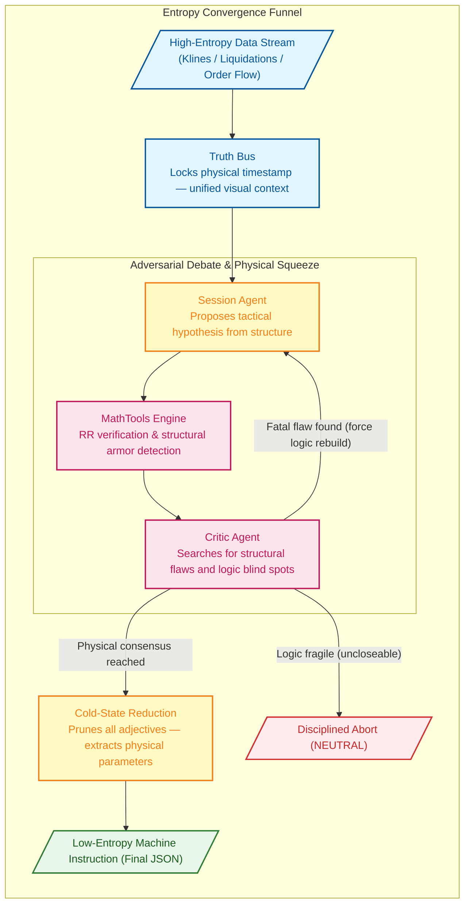

# Singularity

[](https://www.python.org/downloads/)

AI-driven crypto quantitative trading engine. Its core innovation is the **Binary Star adversarial protocol**: two LLM agents (Session Analyst proposing trades, Critic Agent auditing them) debate in rounds to converge on zero-entropy trade decisions. A third agent (Evolver) uses audit results to mutate strategy parameters.

---

## Architecture

```
Entry Points (run.py)
  → Dashboard (src/dashboard/)           FastAPI + HTML, reads session JSON
  → Orchestration (src/agent/)           DebateLoop, BinaryStarOrchestrator
  → Agents (src/agent/)                  SessionAgent, CriticAgent, EvolverAgent
  → AI Backend (src/infrastructure/ai/)  AbstractAIClient → Gemini/DeepSeek/Qwen/Ollama adapters
  → Market Analysis (src/analyzer/)      MarketObserver, VolumeProfile, MarketRegime, LiquidationRadar
  → Data Layer (src/infrastructure/)     AbstractExchangeClient → Binance, models (KlineData, etc.)
  → Config (src/config/)                 Sub-config dataclasses + YAML loaders
```

### AI backend (key design pattern)

`AbstractAIClient` is the contract — mirrors the `AbstractExchangeClient` pattern for LLM providers. All agents depend on the interface, not any SDK. `AIFactory.create_client()` returns the right adapter based on `global_config.yaml` → `llm.active_provider`.

OpenAI-compatible providers (DeepSeek, Qwen) share a single `OpenAICompatibleAdapter` base class. Only `GeminiAdapter` touches Gemini SDK types — the orchestrator and agents use provider-agnostic `VisualPart` for multimodal content.

### Adversarial debate flow

1. `MarketObserver.observe()` collects klines, OI, liquidations, CVD → `observation` dict
2. `BinaryStarOrchestrator.execute_flow()`:
   - Injects regime benchmarks into observation
   - Optionally creates Gemini context cache (Truth Bus)
   - `DebateLoop.run()` alternates: SessionAgent proposes → MathFactChecker verifies → CriticAgent audits → repeat until PASS/TERMINAL or `max_rounds`
   - Final synthesis at cold temperature, sanitized against math truth
3. Result archived as JSON in `<data_root>/sessions/`

---

## The Binary Star Protocol

Binary Star is a high-precision, multi-agent quantitative analysis engine. Its kernel simulates a rigorous debate process, eliminating trading bias and hallucination through **adversarial reasoning**.

Every final trade instruction must survive this high-pressure game — purifying chaotic market conditions into calm, deterministic low-entropy parameters.

- **Truth Bus**: Multimodal market topography is cached once and shared across the reasoning triad to eliminate context drift and cost.
- **Physical Verification**: AI proposals are cross-referenced against Python-native math fact-checks to prevent hallucination in trade geometry.
- **Adversarial Hardening**: Iterative debate rounds ensure the final trade blueprint is logically sound and structurally shielded.



### The Zero-Entropy Logic Matrix

To achieve physically-enforced convergence, all multi-channel data is mapped into a strict set of **logical checkpoints and abort conditions**:

| Audit Dimension | Identifier | Core Logic |
| :--- | :--- | :--- |
| **Order Physics** | `[ORDER_PHYSICS]` | Entry legality: verify entry price hasn't been breached; stop-loss direction is physically correct. |
| **Anchor Violation** | `[ANCHOR_VIOLATION]` | Stop-loss must be shielded by HVN/POC or liquidation clusters. No "naked" stops. |
| **Structural Trap** | `[STRUCTURAL_TRAP]` | Avoid volume vacuums (LVN zones) where price can frictionlessly slide. |
| **Math Violation** | `[MATH_VIOLATION]` | RR ratio and ATR tolerance enforced by the physics engine. Sub-threshold proposals are downgraded. |
| **Gravity Exhaustion** | `[GRAVITY_EXHAUSTION]` | Mean-reversion pressure: prohibit chasing price beyond the gravity limit of the value area. |
| **CVD Absorption** | `[CVD_ABSORPTION]` | Wall detection: extreme CVD pulses absorbed without price movement signal iceberg orders. |
| **Retail Squeeze** | `[RETAIL_LONG_SQUEEZE]` `[RETAIL_SHORT_SQUEEZE]` | Polar reversal: when retail positioning is heavily one-sided, seek the opposite opportunity. |
| **Opportunity Cost** | `[INACTION_BIAS]` `[OPPORTUNITY_DENIAL]` | Missed-move penalty: when consensus is confirmed and structure is clear, unjustified retreat is prohibited. |
| **Trend Starvation** | `[TREND_STARVATION]` | Trend capture: detect expanding volatility with strong trend when the system is flat. |
| **Liquidity Void** | `[LIQUIDITY_VOID]` | Proximity check: nearest LVN distance is too close — risk of violent price movement. |
| **Protocol Violation** | `[PROTOCOL_VIOLATION]` | Dead-loop protection: prohibit repeating the same failed proposal on the same evidence. |
| **Endgame** | `[PRISTINE]` `[JUSTIFIED_INACTION]` | Holy grail: fully compliant entry (green light), or disciplined abstention based on physical facts. |

---

## Sniper Trading System

The Sniper is a two-phase monitoring and trading automaton: a fast, lightweight market scanner identifies "noteworthy" conditions (Phase 1), and an on-demand AI reasoning engine generates precise trade blueprints (Phase 2). Trade execution is managed by a deterministic state machine that cross-references current positions against the AI's fresh opinion.

### Architecture

```
run_sniper.py (SniperDaemon)
  ├── SniperScout (src/sniper/scout.py)         Lightweight market data harvester
  ├── SniperTrigger (src/sniper/trigger.py)     Three-type signal evaluator
  ├── SessionEngine (run_session.py)            Binary Star AI reasoning (on-demand)
  └── MarginOrderExecutor (src/agent/order_executor.py)  Order lifecycle + Guardian
```

### Signal Types (Phase 1: Trigger)

Every 2 minutes, `SniperTrigger.evaluate()` scores three signal types — the strongest wins.

| Type | Sub-Type | Condition | Key Gate |
|------|----------|-----------|----------|
| **TYPE_A** (Breakout) | Volatility Expansion + Volume Surge | Vol > 1.25× baseline **and** Volume Participation > 1.5× | Vol must be **accelerating** (>3% pulse-over-pulse growth), not just sustained |
| **TYPE_A** (Breakout) | Physical Squeeze | Squeeze Factor < 0.75 | Squeeze must be **intensifying** (>2% tighter); 8h state lock |
| **TYPE_B** (Asymmetry) | CVD Divergence | Price↑ + CVD↓ (distribution) or Price↓ + CVD↑ (accumulation), delta > 0.20 | Requires previous-pulse data |
| **TYPE_B** (Asymmetry) | CVD Impulse | Single large taker order, delta > 0.30 | Large trader raid detection |
| **TYPE_B** (Asymmetry) | CVD Absolute Momentum | CVD intensity > 0.1 **and** growing > 1.4× | Growth-gated re-trigger |
| **TYPE_B** (Asymmetry) | Retail Sentiment Extreme | L/S ratio > 1.5 or < 0.6; Funding > 0.0005 | 8h state lock per key |
| **TYPE_C** (Structural) | VAH/VAL Boundary Collision | Price within 0.70 ATR of VAH/VAL + Volume Participation > 1.0× | Must be **approaching** the boundary |
| **TYPE_C** (Structural) | POC Magnet | Price within 0.50 ATR of POC | Must be **approaching** POC |
| **TYPE_C** (Structural) | Liquidation Cluster Magnet | Price within 0.40 ATR of long/short liquidation clusters | Long liq: price must be **falling**; Short liq: price must be **rising** |

**Global gates** (evaluated before any signal):
- **Cooldown**: 45 min after last trigger → `GLOBAL_COOLDOWN`
- **Chaos Mute**: Volatility > 2.2× extreme ratio **and** within 90 min of last trigger → `CHAOS_MUTE`

### Complete Decision Tree (Phase 2: AI + Execution)

```
                      ┌─────────────────────────┐
                      │  Scan every 2 minutes     │
                      │  Guardian ALWAYS runs first│
                      └────────────┬────────────┘
                                   │
                    ┌──────────────▼──────────────┐
                    │  GUARDIAN: Protect open positions │
                    │  • Entry timeout? → Cancel         │
                    │  • Filled but no OCO? → Place OCO  │
                    │  • Has OCO? → Migrate trailing stop│
                    │  • Time-stop? → Market close       │
                    └──────────────┬──────────────┘
                                   │
                    ┌──────────────▼──────────────┐
                    │  Evaluate Trigger (A/B/C signals) │
                    └──────┬──────────┬───────────┘
                           │          │
                    No trigger    Trigger hit
                           │          │
              ┌────────────▼──┐  ┌───▼──────────────────┐
              │ Sleep until     │  │ Has position already? │
              │ next pulse      │  └──┬─────────────────┬──┘
              └───────────────┘     │ YES             │ NO
                         ┌──────────▼──────┐  ┌───────▼──────────────┐
                         │ Skip AI entirely  │  │ Run Binary Star AI   │
                         │ Guardian manages   │  │ Debate → final decision │
                         │ the position       │  └───────┬──────────────┘
                         └─────────────────┘          │
                                          ┌───────────▼───────────┐
                                          │ Trade Gates:            │
                                          │ • BULLISH/BEARISH?      │
                                          │ • Confidence ≥ 60%?     │
                                          │ • Has entry/TP/SL?      │
                                          └─────┬────────┬────────┘
                                                │ PASS   │ FAIL
                                     ┌──────────▼──┐  ┌──▼──────┐
                                     │ sync_with_   │  │ Skip    │
                                     │ opinion()    │  └─────────┘
                                     └──┬──┬──┬───┘
                                        │  │  │
                         FLAT ──────────┘  │  └────────── SAME DIRECTION
                         • Cancel stale     │              • Pick best TP/SL
                         • LIMIT entry      │              • Wrap into OCO
                         • Return order_id  │              • Return None
                                            │
                                    PIVOT ──┘
                                    ├─ Unprotected: Force-close + new entry
                                    └─ Protected: Adjust TP + hang new entry
```

### Position State Machine (`sync_with_opinion()`)

| Current State | AI Opinion | Action |
|---------------|------------|--------|
| **FLAT** (no position) | BULLISH/BEARISH | Cancel stale orders → Place LIMIT entry → Return `order_id` for Guardian tracking |
| **LONG** | BULLISH (same) | Merge best TP (higher) + best SL (higher) → Wrap entire net qty in new OCO → Return `None` |
| **SHORT** | BEARISH (same) | Merge best TP (lower) + best SL (lower) → Wrap entire net qty in new OCO → Return `None` |
| **LONG** | BEARISH (pivot) | **Protected** (has SL): Adjust existing TP to new entry price → Re-hang OCO → Place new SHORT LIMIT entry. **Unprotected** (no SL): Market-close LONG → Place new SHORT LIMIT entry |
| **SHORT** | BULLISH (pivot) | **Protected** (has SL): Adjust existing TP to new entry price → Re-hang OCO → Place new LONG LIMIT entry. **Unprotected** (no SL): Market-close SHORT → Place new LONG LIMIT entry |

**Pivot-Preserve mechanism**: When pivoting a protected position, the existing position's take-profit is moved to the new entry price. This creates a seamless flip — when the old position hits breakeven, the new entry fills at the same price, achieving net-zero-slippage reversal.

### Guardian: Per-Pulse Position Protection

The Guardian runs **every** pulse (regardless of trigger state) and manages the full position lifecycle:

```
trade_state empty? ────────────────────────► Return (nothing to protect)

Has position (net qty)?
  ├── NO (entry pending):
  │     • Elapsed > projected_waiting_hours? → Cancel order, clear state
  │     • Otherwise → Still waiting, do nothing
  │
  ├── YES, but direction mismatch (manual position):
  │     • Robot does NOT adopt — keeps tracking its own entry
  │
  ├── YES, direction matches, NO OCO:
  │     • Price breached SL? → EMERGENCY market close
  │     • Otherwise → Cancel stale entry orders → Place OCO (TP + SL-Limit)
  │     • Record entry_filled_at for time-stop tracking
  │
  └── YES, direction matches, HAS OCO:
        • Check time-stop: elapsed > projected_holding × 1.5? → Market close
        • Progressive trailing stop migration (forward-only):
          Level 1 (≥1.5 ATR profit): SL → entry (breakeven)
          Level 2 (≥2.5 ATR profit): SL → entry + 0.5 ATR (LONG) / entry - 0.5 ATR (SHORT)
          Level 3 (≥4.0 ATR profit): SL → entry + 1.5 ATR (LONG) / entry - 1.5 ATR (SHORT)
        • On OCO re-place failure → EMERGENCY market close (never stay naked)
```

### Position Sizing

```
qty = (Total Equity × 0.4%) / |entry_price - stop_loss|
```

Risk per trade is capped at 0.4% of total equity. Quantity is precision-rounded and floored at the symbol's minimum order size.

### Emergency Close Fallback (Risk Control)

When OCO re-placement fails after cancelling existing orders (in Pivot-Preserve and Same-Direction paths), the position would be left **naked** — all protective orders cancelled with no new OCO in place. The system now performs an **emergency market close** in this scenario:

| Path | Failure Point | Recovery |
|------|--------------|----------|
| **Pivot-Preserve** | OCO re-place fails after cancel | Emergency close existing position → still place new entry (AI opinion still valid) |
| **Same-Direction** | OCO re-place fails after cancel | Emergency close position → return sentinel (-1) → clear `trade_state` |

This matches the existing emergency-close pattern in the **Trailing Stop Migration** path, ensuring no position ever sits unprotected.

### Dual-Instrument Calibration (BTC + XAUT)

The system supports both `BTCUSDT` and `XAUTUSDT` from a single config. Core analysis parameters in `strategy_config.yaml` are instrument-agnostic — CVD ratios, ATR-normalized distances, and volume participation ratios apply identically to both. Only **timing parameters** are tuned for balance:

| Parameter | Original (BTC-oriented) | Balanced (current) | Rationale |
|-----------|------------------------|---------------------|-----------|
| **Cooldown** | 60 min | **45 min** | Midpoint — responsive enough for XAUT's rare signals, long enough to prevent BTC spam |
| **Chaos Mute** | 120 min | **90 min** | Proportional to cooldown (45 × 2.0). Extends protection during vol spikes |
| **State Lockout** | 8.0 hours | **6.0 hours** | Between 4h (XAUT-optimal) and 8h (BTC-optimal). Prevents spam without missing setups |

**Why CVD/volatility/squeeze thresholds are NOT per-instrument:**

| Parameter | Why instrument-agnostic |
|-----------|------------------------|
| `cvd_divergence_tick_delta` (0.20) | CVD ratio = net_taker / total_volume — already normalized. A 20% directional swing means the same thing for any instrument. |
| `cvd_impulse_tick_delta` (0.30) | Same normalization logic. 30% single-pulse dominance is extreme regardless of book depth. |
| `volatility_baseline_ratio` (1.25) | ATR-relative — measures expansion vs. the instrument's own baseline, not an absolute value. |
| `squeeze_trigger_multiplier` (0.75) | Bollinger/Keltner relationship is a mathematical construct independent of price level. |
| `proximity_vah_val_atr` (0.70) | All ATR-denominated — structural proximity is measured in the instrument's own volatility units. |
| `cvd_intensity_threshold` (0.10) | Used by AI agents + debate loop + sniper trigger. Changing it shifts the entire reasoning pipeline's baseline for "significant flow." |

> **Future enhancement**: Per-symbol config overrides (e.g., `sniper.BTCUSDT.cvd_divergence_tick_delta`) would allow instrument-specific tuning without duplicating config files.

### Key Configuration

| Parameter | Value | Purpose |
|-----------|-------|---------|
| `pulse_interval_minutes` | 2.0 | Scan frequency |
| `pulse_cooldown_multiplier` | 3.0 | Post-trigger silence (15m × 3 = 45 min) |
| `chaos_cooldown_multiplier` | 2.0 | Extreme vol silence (45m × 2 = 90 min) |
| `state_lockout_hours` | 6.0 | Structural/sentiment repeat suppression |
| `session_confidence_threshold` | 60 | Minimum AI confidence for execution |
| `risk_per_trade` | 0.004 | Maximum loss per trade (0.4% equity) |
| `trailing_profit_atr_level_1/2/3` | 1.5/2.5/4.0 | Trailing stop migration thresholds |
| `time_stop_multiplier` | 1.5 | Max hold time = projected_holding × 1.5 |

---

## Installation

### Prerequisites

- Python 3.12+
- A supported LLM provider API key (Gemini, DeepSeek, Qwen, or local Ollama)

### Setup

```bash
git clone <repo-url> && cd singularity
pip install -e .              # core dependencies
pip install -e ".[dev]"       # include pytest, coverage
```

Or with Conda:

```bash
conda activate ai
pip install -e .
```

### Configuration

1. Copy `.env.example` (or create `.env`) with your API key:
   ```bash
   GEMINI_API_KEY="your-key-here"    # or DEEPSEEK_API_KEY / QWEN_API_KEY
   ```

2. Edit `config/global_config.yaml` to set your active provider:
   ```yaml
   llm:
     active_provider: "gemini"  # gemini | deepseek | qwen | ollama
   ```

3. Review `config/strategy_config.yaml` for trading parameters, regime thresholds, and analysis windows.

---

## Commands

All entry points are consolidated under `run.py`:

```bash
# Live analysis
python run.py session

# Single historical snapshot
python run.py session -ts 2026-01-24T15:42:00Z

# Backtest (sampled historical points)
python run.py session --start T-30d --end T-2d --samples 14 --sampling-mode sniper
python run.py session --start T-30d --end T-2d --samples 14 --symbol XAUTUSDT -p data/backtest/xautusdt

# Real-time monitoring daemon
python run.py sniper --trigger --email
python run.py sniper --trigger --email --trade

# Forensic audit
python run.py audit -p data/prod
python run.py audit -p data/backtest --file data/backtest/sessions/BTCUSDT_session_20260101_120000.json

# Meta-evolution (strategy optimization from audit results)
python run.py evolution -p data/backtest --samples 20

# Apply evolution patch
python run.py patch -f data/backtest/evolution/proposals/BTCUSDT_evolution_20260101_120000.json

# Start dashboard (http://localhost:8080)
python -m src.dashboard.server
python -m src.dashboard.server -p data/prod --port 8080

```

### Running tests

```bash
python -m pytest tests/ -v
python -m pytest tests/ --cov=src --cov-report=term-missing
```

---

## AI Providers

The system supports 4 providers through a unified `AbstractAIClient` interface. Switch providers by changing `active_provider` in `global_config.yaml` — no code changes needed.

| Provider | Adapter | Vision | Context Cache | Cost |
|----------|---------|--------|---------------|------|
| **Gemini** | `GeminiAdapter` | Yes | Yes (Truth Bus) | $$$ |
| **DeepSeek** | `DeepSeekAdapter` → `OpenAICompatibleAdapter` | — | — | $ |
| **Qwen** | `QwenAdapter` → `OpenAICompatibleAdapter` | Yes (VL models) | — | $ |
| **Ollama** | `OllamaAdapter` | Model-dependent | — | Free |

All providers support function calling + JSON mode. DeepSeek and Qwen share a single `OpenAICompatibleAdapter` base class — adding a new OpenAI-compatible provider is a ~10-line subclass.

### Provider-specific setup

**Gemini** (default — only provider with context caching):
```yaml
llm:
  active_provider: "gemini"
  gemini:
    context_cache:
      enable: true
      expiration_minutes: 10
```

**DeepSeek** (best cost-performance ratio):
```yaml
llm:
  active_provider: "deepseek"
  deepseek:
    base_url: "https://api.deepseek.com"
    model: "deepseek-v4-flash"
```

**Qwen** (Alibaba Cloud — strong Chinese-language understanding):
```yaml
llm:
  active_provider: "qwen"
  qwen:
    base_url: "https://dashscope.aliyuncs.com/compatible-mode/v1"
    model: "qwen-plus"
```

**Ollama** (local — fully offline, privacy-preserving):
```yaml
llm:
  active_provider: "ollama"
  ollama:
    base_url: "http://localhost:11434"
    model: "gemma4:e4b"
```

---

## Config System

- `config/strategy_config.yaml` — trading parameters, regime thresholds, analysis windows
- `config/global_config.yaml` — system settings, LLM provider config, visuals, sniper
- `config/prompts/*.md` — LLM system prompts (sensitive system logic)
- `src/config/sub_configs.py` — `RegimeConfig`, `TemporalConfig`, `RiskConfig`, `AuditConfig`, `VisualConfig` (frozen dataclasses)
- `src/config/loader.py` — builds sub-configs from YAML dicts

---

## Key Invariants

- `BinaryStarOrchestrator.execute_flow(observation, symbol)` — public signature must not change
- `GeminiCacheManager` requires `GeminiAdapter` (only Gemini supports context caching); gated by `enable_context_cache`
- `run_evolution.py` must use `AIFactory.create_client()`, not raw SDK clients
- Non-Gemini adapters return `False` for `supports_context_cache`
