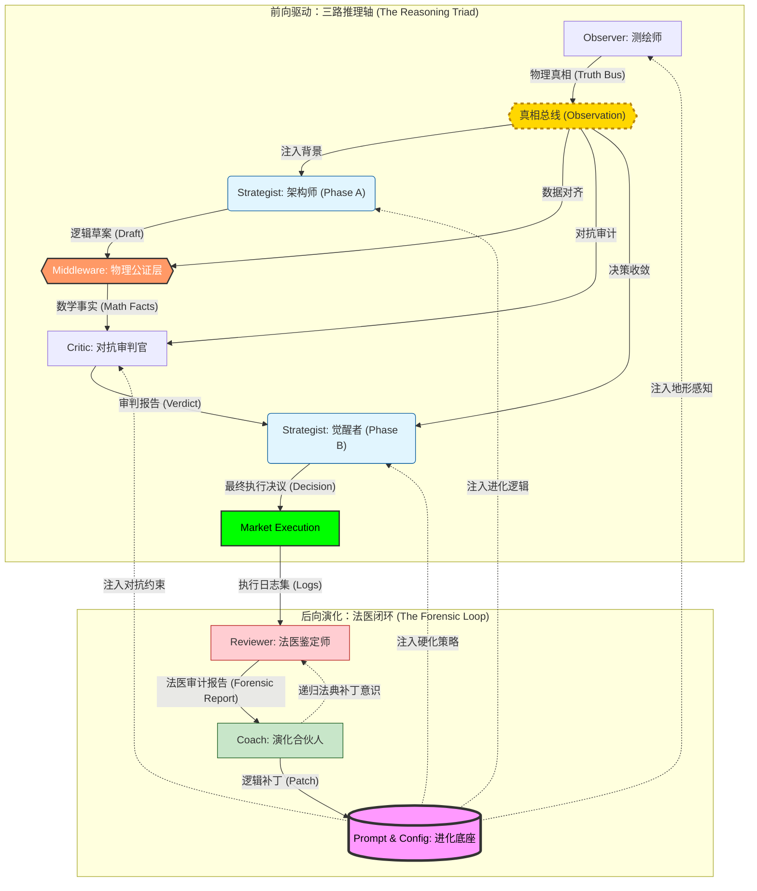

# ⚖️ 真相 · 逻辑 · 审计

> **“不预测行情，只测绘逻辑。”**

这是一个基于 **物理真相** 与 **对抗性演化** 构建的多智能体交易系统。它通过“三路推理 (Reasoning Triad)”架构，将极度不确定的市场博弈转化为确定性的物理地形测绘与逻辑审计。每一张单子都是物理事实与对抗性逻辑的结晶，是对市场脆弱性的精确爆破。

---

## 🗺️ 物理地形 · 演化枢纽

系统通过 **前向推理 (Forward Reasoning)** 与 **后向演化 (Backward Evolution)** 构建了一个具备自我修复能力的闭环生态：

---

## 🧬 逻辑审计 · 共识协议

基于明确的物理地形边界与逻辑主权隔离，各组件在协作交接中始终维持着不可逾越的“法医级”逻辑严谨度：

| 智能实体 | 职能模型 | 枢纽逻辑 | 演化产物 |
| :--- | :--- | :--- | :--- |
| **Observer** | **测绘师** | **物理景观聚合**：识别宏微观地形共振，构建“真相总线” | 地形全景数据 |
| **Strategist (A)** | **架构师** | **交易蓝图构建**：锚定高成交量节点 (HVN) 并预设物理执行轨迹 | 逻辑草案 |
| **Middleware** | **真理校验门** | **物理解耦公证**：通过真相总线锁定 RR 与 ATR 参数，彻底消除幻觉 | 物理事实底座 |
| **Critic** | **对抗审判官** | **生存压力测试**：基于真相总线识别流动性陷阱，进行对抗性审计 | 审计判决书 |
| **Strategist (B)** | **觉醒者** | **风险硬化收敛**：整合审计意见，执行深度入场防御 (DLE) 或强制弃权 | 最终决议 |
| **Reviewer** | **法医鉴定师** | **尸检溯源对比**：精准对齐成交事实，捕捉逻辑与现实的“真值偏离” | 法医复盘报告 |
| **Coach** | **演化合伙人** | **认知偏差修正**：诊断系统性盲区，合成多智能体进化的底层逻辑补丁 | 逻辑补丁 |

---

## 🛡️ 逻辑盾牌

为了确保系统在极高波动的加密市场中生存，我们部署了五层“物理保护伞”：

### 第一层：物理真实网关 (Physical Realism)
**核心逻辑：剥离 AI 的数学解释权。** 强制由后端 Python 计算确定性的盈亏比 (RR)、波动幅度 (ATR) 与时间价值，作为系统唯一法定事实注入。彻底消除 LLM 在复算中的幻觉。

### 第二层：信息主权等级 (Information Sovereignty)
**核心逻辑：地形决定论。** 系统在冲突信号中遵循：1. 物理地形 (POC/VAH) > 2. 流动性形态 (Flow/CVD) > 3. AI 感知。确保即使博弈信号混乱，也能基于物理边界进行攻击。

### 第三层：法医审计隔离 (Forensic Isolation)
**核心逻辑：忽略中间态，只审计物理终态。** Reviewer 强制忽略中间过程的草案和草稿数字。Reviewer 直接使用 `[Pass-3 SYNTHESIS]` 最终执行坐标与 `T0` 环境原件进行重新建模，防止“过程幸存者偏差”。

### 第四层：多模态视觉证伪 (Visual Verification)
**核心逻辑：特征引用与视觉存证。** 拒绝纯数字漂移的盲目决策。所有推理必须显式引用视觉快照（Snapshot）中的地形特征（如“特定价格坐标的影线阻力”）。这建立了一种**“证据对齐”**机制，确保决策逻辑在物理空间中是有迹可循的。

### 第五层：递归状态机 (Atomic Switch)
**核心逻辑：原子化状态切换。** 废弃复杂的会话状态管理。系统根据 Draft 的存在与否自动触发职能相位探测。真相总线（Observation）作为唯一上下文，确保从草稿到审计、再到终稿的逻辑一致性。

---

## 💎 参数大师课 · 全量工业级配置

> ⚙️ **时域缩放 (Temporal Scaling) 是参数演化的核心动力源。**
> 当你修改了 Macro 时间周期（如 1h -> 4h）时，下列 10 个模块的参数必须产生联动效应。

### 1. 基础时域与全局采样 (Context)
| 变量名 | 大白话解释 | 时域联动影响 |
| :--- | :--- | :--- |
| `macro_analysis_context` | **大局观**的时间尺子，看大趋势。 | 长线单必须拉长采样（1h -> 4h）。 |
| `historical_lookback_candles` | **记忆深度**，往回翻多少根线。 | 维持 300+ 根。跨度越大，历史节点参考价值越高。 |
| `volatility_intensity_lookback` | **波动率感知圈**。 | **必须对齐**。防止用 15m 的波动去配置 4h 的止损位。 |

### 2. 地形分辨率 (VP & Mapping)
| 变量名 | 大白话解释 | 时域联动影响 |
| :--- | :--- | :--- |
| `volume_profile_price_bucket_count` | **地形精度**，价格切得有多细。 | **关键**：大周期波动大，格子必须多（800+），否则 POC 定位会模糊。 |
| `volume_profile_value_area_width` | **核心成交区**横切占比。 | 默认 75%。极端高波市可调低以收缩防御区。 |
| `min_price_gap_between_nodes` | **节点间距下限**，太近就合并。 | Macro 线越长，间距应成倍放大，否则目标会太碎。 |

### 3. 技术波动因子 (TA Channels)
| 变量名 | 大白话解释 | 时域联动影响 |
| :--- | :--- | :--- |
| `average_true_range_period` | **通用的度量衡**，衡量当下波动。 | 止损和止盈的核心计算基准单位。 |
| `wick_skewness_period` | **插针偏移量**，判断最近博弈方向。 | 影线单核心。不宜太长，防止信号被平滑掉。 |
| `bollinger_bands_std_dev` | **离群门槛**。 | 判断价格是否进入“极端真空区”的探测器。 |

### 4. 流动性与爆仓热图 (Clusters)
| 变量名 | 大白话解释 | 时域联动影响 |
| :--- | :--- | :--- |
| `order_flow_lookback_hours` | **盯盘时长**，回看最近多久的博弈。 | 日内设 1h，长线波段对应放大到 4-8h。 |
| `liquidation_cluster_atr_multiplier` | **清算区磁吸半径**。 | **联动**：采样跨度越大，洗盘深度越深，半径须放大。 |

### 5. 市场态势判定阈值 (Regime Logic)
| 变量名 | 大白话解释 | 逻辑暗示 |
| :--- | :--- | :--- |
| `regime_trend_intensity_threshold` | **入场趋势门槛**。 | 想要更稳，就调高这个值以过滤随机波动。 |
| `regime_poc_gravity_atr_distance` | **POC 磁力距离**。 | 强趋势下调大它，否则系统由于贪恋均值而不敢追单。 |
| `regime_volatility_expansion_ratio` | **波动爆发倍率**。 | 15m 级别的爆发属于常见，4h 级别这属于天劫。 |

### 6. 执行与风险硬化 (Decision Guards)
| 变量名 | 大白话解释 | 执行逻辑 |
| :--- | :--- | :--- |
| `min_trade_velocity` | **跑得够不够快**。 | 短线追求爆发（0.5+），长线可容忍阴跌（0.1）。 |
| `stop_loss_buffer_min / max` | **止损位背后的空气层**。 | 结构防御位后留的冗余。日内窄，长线宽。 |

### 7. 对抗性大脑配置 (Triad Brains)
| 变量名 | 大白话解释 | 调参指南 |
| :--- | :--- | :--- |
| `model_temperature_draft` | **脑暴草案放飞度**。 | 建议 0.7。给系统捕捉不完美机会的灵感。 |
| `threshold_skepticism_constructive` | **强制修改红线**。 | 高过这个怀疑值，Critic 会逼 Strategist 改方案。 |

### 8. 法医评分法典 (Forensic Benchmarks)
| 变量名 | 大白话解释 | 法医逻辑 |
| :--- | :--- | :--- |
| `execution_timeframe_interval` | **法医分辨率**。 | 复盘必须用 1m，无论你大方向看多长，都要看微观瞬间。 |
| `score_mae_pinpoint_limit` | **老司机的入场误差线**。 | 判定你进场那一刻是不是被行情反复打脸。 |
| `score_opportunity_cost_limit` | **踏空惩罚线**。 | 防止 AI 由于过度谨慎在单边行情中反复空仓。 |

### 9. 违规处罚与纪律 (Compliance)
| 变量名 | 解释 | 后果 |
| :--- | :--- | :--- |
| `penalty_compliance_breach` | **纪律死刑**。 | 违反写死的协议（如 RR）直接判除执行死刑 (-100)。 |
| `point_penalty_logic_failure` | **逻辑裂缝**。 | 推理和物理数据的错位。反映系统性幻觉。 |

### 10. 系统演化感知 (Evolution)
| 变量名 | 解析 | 联动 |
| :--- | :--- | :--- |
| `coach.model_parameters` | **教练的“洞见水平”**。 | 决定了逻辑补丁的生成质量和系统迭代速度。 |

---

## ⏳ 时域硬化 · 缩放实例库

系统通过“法医审计”不断沉淀在不同时间跨度下的最优配置。

#### 微观：日内高频波动中的物理插针 (Intraday)
| 变量 | 演化参考 | 逻辑目标 |
| :--- | :--- | :--- |
| `macro/micro` | `1h / 15m` | 环境快速刷新 |
| `vp_bucket_count` | `300` | 聚焦单根节点 |
| `sl_buffer_min` | `0.2` | 防守层极窄 |

#### 宏观：波段与结构反转 (Swing)
| 变量 | 演化参考 | 逻辑目标 |
| :--- | :--- | :--- |
| `macro/micro` | `4h / 1h` | 对齐大周期结构 |
| `vp_bucket_count` | `800` | 宏观地图精度 |
| `sl_buffer_min` | `0.6` | 允许震荡洗盘 |

---

## 🚀 运行手册

### Phase 1: 策略执行与回测验证
*   **实时预测**: `python3 strategist.py prod --symbol BTCUSDT`
*   **抽样回测**: `python3 backtest.py backtest --sampling 12`
*   **策略演化回放**: `python3 strategist_replay.py backtest --file [JSON_PATH]`

### Phase 2: 法医调查与看板分析
*   **全量尸检**: `python3 reviewer.py prod`
*   **定向法医复盘**: `python3 reviewer_replay.py prod --file [JSON_PATH]`
*   **策略逆向导出**: `python3 export_strategy.py prod --file [REVIEW_JSON_PATH]`
*   **可视化看板**: `python3 forensic_dashboard.py prod --symbol BTCUSDT`

### Phase 3: 自动化演化循环
*   **全自动化编排**: `python3 pipeline_orchestrator.py live --symbol BTCUSDT --interval 1`
*   **诊断与进化合成**: `python3 coach.py prod --symbol BTCUSDT`
*   **应用逻辑补丁**: `python3 apply_patch.py --file [PATCH]`
