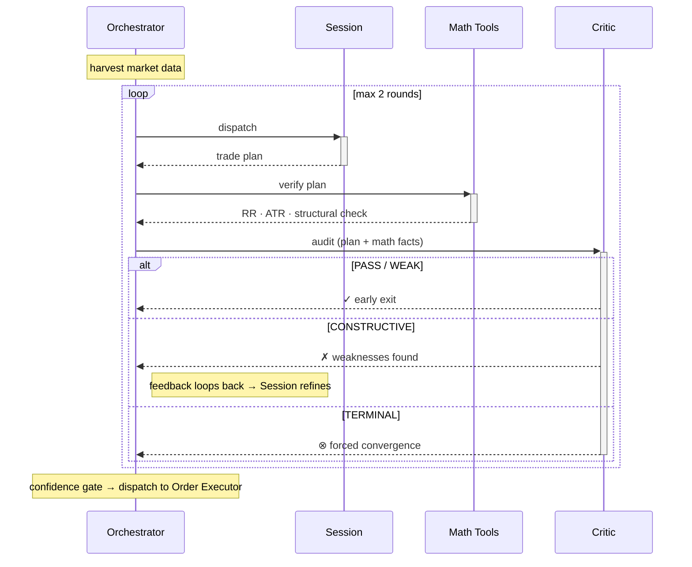
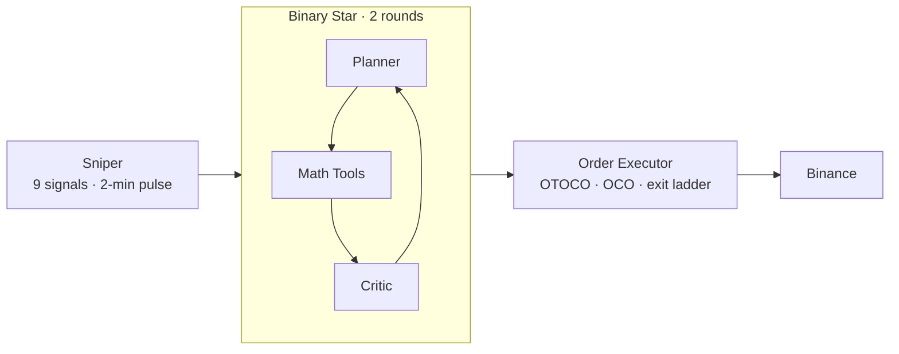
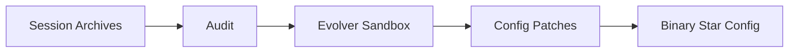

# Singularity

[](https://www.python.org/downloads/)

What if two LLMs debated your trade before it hit the market? **Binary Star** pits a Planner against a Critic — one proposes, the other tears it apart. A Math Tools (no LLM, pure computation) anchors both to reality. The debate converges in at most two rounds; if they can't agree, the system forces a decision. Below the confidence threshold, the trade never fires.

---

## Binary Star Protocol



### Veto Levels

| Veto | Effect |
|------|--------|
| **PASS** | Plan is sound — early exit, no further rounds |
| **WEAK** | Minor concern — early exit, plan accepted as-is |
| **CONSTRUCTIVE** | Fixable flaws — feedback loop, Planner refines |
| **TERMINAL** | Unfixable — forced convergence, plan accepted as-is |

Each proposal carries a 0–100 confidence score across three dimensions: topographical armor, regime sync, and temporal physics. Scores below threshold are rejected — the debate produces a decision, but the gate refuses to act on it. Two LLM backends (DeepSeek, Gemini) power the debate via a shared config.

---

## Architecture





---

## Sniper

A local signal stack (**9 signals, 5 categories**) monitors the market every 2 minutes. A regime-adaptive confluence engine weights directional agreement and cancels opposing noise, adjusting its effective threshold per regime (trending 0.29, ranging 0.34, squeeze 0.26, chaos 0.51). Any single signal exceeding 0.80 overrides cooldown and threshold entirely. Its sole job is timing — it does not trade.

---

## Order Management

| Phase | Mechanism |
|-------|-----------|
| Entry | OTOCO — atomic limit entry with nested TP/SL |
| Protection | Guardian OCO — every position wrapped in TP + SL |
| Profit-taking | 3-level exit ladder — ascending partial close with progressive SL lock |
| Stop migration | Dynamic trailing SL as ladder levels fire |

---

## Evolution

An offline sandbox replays historical sessions against proposed config patches, scoring fitness against actual outcomes. Winners produce config patches that feed back into the Sniper's signal weights and Binary Star's debate thresholds.

---

## Installation

```bash
pip install -e .
cp .env.example .env  # add your exchange + LLM API keys
```

---

## Commands

```bash
# ── Sessions ────────────────────────────────────────────
python run.py session --symbol BTC

# ── Sniper ──────────────────────────────────────────────
python run.py sniper --symbol BTC,XAUT --llm --trade 500

# ── Backtest ────────────────────────────────────────────
python run.py backtest-run --symbol BTCUSDT --start 2025-01-01 --samples 100

# ── Audit & Evolution ───────────────────────────────────
python run.py audit --symbol BTC -p data/prod
python run.py evolution --symbol BTC --samples 50 -p data/prod
python run.py patch -f proposals/BTC_evolution.json --symbol BTC
```
