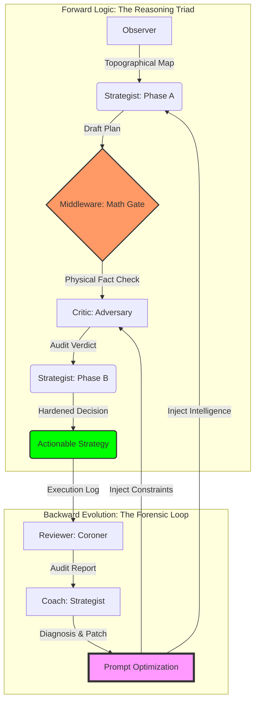

# Strategic Alpha Ledger: The Forensic Trading Machine

> **“不预测行情，只测绘逻辑。”**

这是一个基于物理真相（Physic Truth）与对抗性演化（Adversarial Evolution）构建的多智能体交易系统。它通过“三路推理 (Reasoning Triad)”架构，将极度不确定的市场博弈转化为确定性的物理地形测绘与逻辑审计。

---

## 🏗 架构全景：闭环演化与逻辑枢纽 (The Evolutionary Hub)

系统通过 **前向预测 (Forward Prediction)** 与 **后向演化 (Backward Evolution)** 构建了一个具备自我修复能力的闭环生态：



---

## 🧬 智理引擎：多智能体决策协作协议 (Agentic Collaboration Protocol)

系统各组件通过确定的物理边界与逻辑主权，确保每一棒交接都具备“法医级”的严谨性：

| 执行角色 | 输入信号 (INPUT) | 核心逻辑 (LOGIC?) | 输出产出 (OUTPUT) |
| :--- | :--- | :--- | :--- |
| **Observer** (测绘师) | 原始 K 线 / 流动性资产 | **景观聚合**：识别宏微观地形 Confluence，计算趋势强度。 | 物理地形快照 (Observation) |
| **Strategist (A)** (设计师) | Topographical Map | **构思逻辑**：寻找 HVN 锚点，根据地形初步设计入场轨迹。 | 决策草案 (Draft Plan) |
| **Middleware** (校验门) | Draft + Observation | **物理公证**：计算确定性 RR 与 ATR 距离，强制抹除 LLM 幻觉。 | 数学事实 (Math Fact Check) |
| **Critic** (审判官) | Draft + Math Facts | **对抗审计**：基于《怀疑论》进行压力测试，识别吸收陷阱。 | 审计标签 (Audit Verdict) |
| **Strategist (B)** (觉醒者) | Draft + Critique | **风险收敛**：融合审计意见，执行 DLE 硬化或强制 NEUTRAL。 | 最终执行方案 (Final Decision) |
| **Reviewer** (复盘官) | Decision + T1 Truth | **尸检对比**：量化 PnL 效率，捕捉“逻辑与现实”的偏离。 | 法医复盘报告 (Forensic Report) |
| **Coach** (遗传学家) | Forensic Archives | **进化合成**：识别系统性偏见，生成指令集 (Prompt) 优化方案。 | 演化补丁 (Prompt Patch) |

---

## 📊 深度演化分析：持仓周期与缩放指南 (The Deep Evolution Audit)

> [!IMPORTANT]
> **“持仓周期 (Holding Period)” 是系统的核心权重，而非简单的环境参数。** 调整持仓目标会导致系统产生“多阶维度”的偏移，必须配套以下硬化逻辑。

### 1. 缩放路线图 (Strategy Scaling Logic)
针对系统在 **“时间跨度周期对齐” (Temporal Alignment)** 上的局限性，提供如下缩放配置：

| 目标策略 | Macro / Micro | 核心改动 (Config) | 核心改动 (Prompt) |
| :--- | :--- | :--- | :--- |
| **Swing (1周内)** | 1h / 15m | `funding_lookback`: 168h | `min_temporal_efficiency`: 0.3 |
| **Position (1月内)**| **4h / 1h** | `resolution_bins`: 800+ | `Dynamic RR`: Trend >= 3.0x |
| **Logic (Scalp)** | 15m / 1m | `wick_skew_period`: 1 | `confidence`: High Fill Priority |

### 2. 数学逻辑审计 (Pass 2 Analysis)
*   **物理几何崩溃**: 当 `macro_interval` 拉长至周/月级别时，分桶数 (Bins) 必须呈 **对数级增加**。否则，高成交量节点（墙）的厚度会吞没系统预留的止损缓冲区。
*   **线性公式失效**: `holding_time_hours` 的线性算法在月度持仓中会导致预测值脱靶。长线策略必须在 Prompt 中引入 **“波动率预期衰减”** 的权重。

### 3. 架构压力与 API 极限 (Pass 3 Analysis)
*   **数据孤岛风险**: 对于月线级别，`fetch_liquidations` (Limit=100) 无法捕获 2 周前的关键清算集群，导致 AI 生成的“反向扫荡”预测失效。
*   **计算摩擦**: 800+ Bins 会显著增加 Telemetry 的 JSON 密度，虽然不影响 Gemini 的 1M 窗口，但可能导致任务聚焦度（Attentional Drift）偏差。

---

## 🛡 核心硬化盾牌 (Forensic Hardening Mechanism)

为了确保系统在极高波动的加密市场中生存，我们部署了三层“逻辑护甲”：

### 第一层：物理事实真理网关
> **Hallucination Killer**: 禁止 AI 进行任何关键数学计算。由后端 Python 逻辑注入确定性的 RR (盈亏比)、ATR 距离与 Temporal Efficiency (时间效率)，作为 Critic 审计的唯一法定依据。

### 第二层：多模态视觉证伪体系
> **Visual Anchoring**: 所有的推理必须引用视觉快照（Snapshot）中的特征。AI 必须回答：“我看到了 K 线影线在 X 位置的阻力”，而非盲目信任数字，确立“单点真实来源”。

### 第三层：无状态递归相位侦测
> **Deterministic State Machine**: 策略师不再通过复杂的 Context 管理状态，而是直接递归检测 `Draft` 的存在。这使得 Prompt 保持静态且可预测，极大提升了分布式部署的稳定性。

---

## 🚀 运行手册 (Operational Manual)

### 1. 环境准备
```bash
python3 -m venv venv && source venv/bin/activate
pip install -r requirements.txt
# 在 .env 中配置
# BINANCE_API_KEY="..."
# BINANCE_API_SECRET="..."
# GEMINI_API_KEY="..."
# EMAIL_ADDRESS="...@gmail.com"
# EMAIL_APP_PASSWORD="..."
# EMAIL_SMTP_SERVER="smtp.gmail.com"
# EMAIL_SMTP_PORT="587"
```

### 2. 策略执行与回测 (Strategy & Backtest)
*   **单点预测 (Live/Manual)**:
    ```bash
    python3 strategist.py --symbol BTCUSDT live
    ```
*   **历史抽样回测 (Backtest)**:
    ```bash
    python3 backtest.py --sampling 12 --mode regime --start T-24d backtest
    ```
*   **策略回放 (Strategy Replay)**:
    ```bash
    python3 strategist_replay.py backtest --file [JSON_PATH]
    ```

### 3. 法医复盘与取证 (Review & Forensics)
*   **批量生成审计报告**:
    ```bash
    python3 reviewer.py backtest
    ```
*   **复盘回放 (Review Replay)**:
    ```bash
    python3 reviewer_replay.py backtest --file [JSON_PATH]
    ```
*   **策略逆向导出 (Strategy Export)**:
    ```bash
    python3 export_strategy.py [prod|test|live|backtest] --file [REVIEW_JSON_PATH]
    ```
*   **可视化看板 (Analytics)**:
    ```bash
    python3 forensic_dashboard.py --symbol BTCUSDT backtest
    ```

### 4. 自动化演化循环 (Evolution Loop)
*   **启动无人守值编排器 (Orchestrator)**:
    ```bash
    python3 pipeline_orchestrator.py --symbol BTCUSDT --interval 1 live
    ```
*   **诊断进化 (Diagnosis)**:
    ```bash
    python3 coach.py --symbol BTCUSDT backtest
    ```
*   **应用补丁 (Apply Patch)**:
    ```bash
    python3 apply_patch.py --file [PATCH_JSON_PATH]
    ```

---

## 📓 系统演化笔记 (Evolution Notebook)

### 🗓 2026-03-27: 多周期弹性与长线演化大审计

#### 1. 系统哲学与背景
本次审计聚焦于“时间跨度僵化”问题。系统在 24h 尺度下表现完美，但在 1 个月尺度下会出现“宏观盲视”。

#### 2. 核心调整建议
*   **结构性容忍度 (Strategic Forgiveness)**: 
    - 止损上限从 `0.5x` 提升至 `1.2x` ATR。
    - **实装方案**: 已将 `sl_structural_buffer_floor` 和 `sl_structural_buffer_ceiling` 抽离至 `agent_config.yaml`。
*   **清算记忆层 (Liquidation Memory)**: 
    - 建议建立 `liquidation_store.json` 以记录历史强平簇，充当长线“价格磁铁”。
*   **几何分辨率 (Geometric Resolution)**: 
    - 必须在长线模式下将 `volume_profile_price_buckets_count` 提升至 800+ 以维持结构精度。

#### 3. 数学模型审计
*   `holding_time_hours` 公式在月线级别存在线性退化，建议引入波动率衰减因子，并下调 `min_temporal_efficiency` 指标。

#### 4. 基础设施压力预测
*   Binance API 的 `force_orders` 100条限制是唯一的单点故障点，必须通过本地持久化来对抗数据丢失。

---

*(注：此部分将记录系统所有的深度分析与演化历程，作为项目长期维护的活文档。)*

---

## ⚖️ 我们的哲学
系统不通过“预测”未来获利，而是通过“**精确测绘当前的逻辑陷阱**”获利。每一张单子都是物理事实与对抗性逻辑的结晶。
