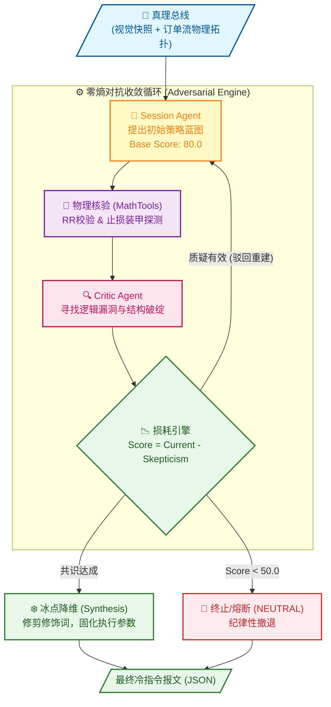

# Singularity 跨代交易会话引擎 (v7.0)

[](https://www.python.org/downloads/)

---

> Singularity 是一个高保真、多智能体量化架构，通过 **对抗式推理 (Adversarial Reasoning)** 消除人类偏见。它能将复杂的市场混沌状态转化为冷静、确定性的执行指令。

---

## ⚖️ 零熵架构：双子星对抗协议 (The Binary Star Protocol)

Singularity 的内核是一个多智能体对抗系统，模拟了极高标准的法庭辩论与审判过程。其核心哲学是通过引入强烈的“负向驱动”来消除 AI 常见的幻觉与交易员的情绪偏见。

*   **📂 真理总线 (Truth Bus)**：系统底层建立的物理观测准则。通过锁定高精度的物理时间戳 (ISO-8601) 和多模态图表 (Forensic Charts)，为所有智能体提供绝对一致的、不可篡改的“法庭证据”。
*   **🤺 辩方 (Session Agent)**：**决策铁砧 (The Anvil)**。需求驱动，负责在真理总线的基础上，提出具备战略潜力的交易策略。
*   **🔍 控方 (Skeptical Critic)**：**审计重锤 (The Hammer)**。负向驱动，执行零信任维度的“双重取证”审计，专门负责寻找逻辑漏洞、结构破坏，并否决高风险动作。

---

## 🪐 决策收敛：从混沌假设到机器指令 (The Convergence Engine)
> `[GROUND_TRUTH]: config/strategy_config.yaml`

系统的决策过程本质上是一个 **“逻辑熵减”** 的过程。每一次最终输出的交易订单，都必须在一场高压的生存游戏中，经历从高熵假设到低熵指令的提纯。



### 收敛路径解析 (The Path to Execution)

1. **初始置信度 (Initial Hypothesis)**：每一笔新的提案起点最高为 **`80.0`** 分。剩下的 20% 空间预留给物理规律的先天缺失与不可知性。
2. **零信任核验 (Zero-Trust Physics)**：AI 不负责计算。提案中的盈亏比 (RR) 和止损隔火层 (Structural Armor) 会由 **Python 原生工具集 (MathTools)** 进行无差别硬核算，失败则直接打回重写。
3. **线性损耗 (Adversarial Attrition)**：每一次 Critic 提出的有效质疑 (Skepticism Score)，都会转化为对 Base 分数的物理损耗。
4. **硬化与熔断 (Hardening or Halt)**：如果逻辑足够坚硬，系统会在多轮辩论中找到“数学交集”并存活下来；如果逻辑脆弱，历经损耗后置信度跌破 **`50.0`**，系统将无条件触发 **NEUTRAL (中立回避)**。
5. **冰点降维 (Deterministic Synthesis)**：对于存活下来的策略，系统会执行最后的高压降维——切掉所有分析语言，将多轮对抗的战术共识，提纯为一组极简、可以直接写入交易所 API 的 JSON 指令。

---

## 🛠 安装与操作手册

### 0. 环境准备 (重要)

```bash
# crypto 是 Conda 环境名称
conda activate crypto
# pip install -r requirements.txt
```

### 1. 市场推理 (Session Engine)

*   **单次/批量分析 (Prod)**：对当前市场或指定时间点进行对抗推理。结果存入 `data/prod/sessions`。
```bash
python run_session.py
python run_session.py -ts 2026-01-24T15:42:00Z
```

*   **智联回测 (Backtest)**：在历史样本点上进行采样推理。推荐使用 `--sampling-mode sniper` 以捕捉异动。
```bash
python run_session.py --start T-30d --end T-16d --samples 20 --sampling-mode sniper
python run_session.py --start T-16d --end T-2d --samples 20 --sampling-mode spaced
```

*   **实时监控 (Sniper Mode)**：基于“零熵觉醒矩阵”探测异动。系统现在完全驱动自 `global_config.yaml`，无需手动指定 pulse。 
```bash
python run_sniper.py --trigger --email
```

### 2. 取证审计 (Forensic Audit)
对 Session(s) 进行深度审计并生成报告。同步更新 `data_root` 指向。
```bash
python run_audit.py -p data/prod
python run_audit.py -p data/backtest --file data/backtest/sessions/{symbol}_session_{timestamp}.json
```

### 3. 账本看板 (Ledger Dashboard)
系统的可视化看板。它支持对“Audit(s) 审计报告” 或 “Sandbox 报告”（解析里面包含的Audit(s) 审计报告）进行 HTML 渲染：
```bash
python scripts/session_ledger.py -p data/backtest
python scripts/session_ledger.py -p data/backtest --f .../{symbol}_evolution_sandbox_{timestamp}.json
```

### 4. DNA 引擎 (Meta-Evolution)
基于 Audit(s) 报告，对系统的判定逻辑进行“基因突变”式优化（补丁存入 `data/backtest/evolution/proposals`）。
```bash
python run_evolution.py -p data/backtest
```

### 5. 物理同步 (Patching)
正式将补丁“硬化”到系统。它会自动同步更新系统的配置文件与提示词。
```bash
python run_patch.py -f .../{symbol}_evolution_{timestamp}.json
```

---