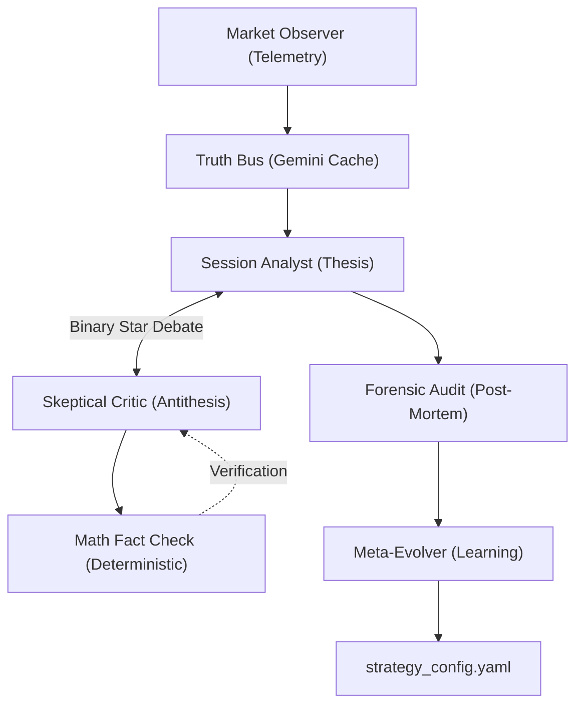

# Singularity Session Engine (v6.1)

[](https://www.python.org/downloads/)
[](LICENSE)
[]()

> **The Singularity Session Engine** is an industrial-grade, multi-agent quantitative trading system designed for high-fidelity market topography analysis and self-evolving strategic execution. It achieves 100% mathematical determinism by anchoring neural reasoning to physical market reality.

---

## 🌌 Core Architecture: The Adversarial Triad

Singularity eliminates "Black Box Hallucination" through a **Truth Bus** protocol, where all agents share a single, multimodal context cache derived from precise topographical telemetry.



### 1. The Session Analyst (Strategist)
- **Role**: Primary Thesis Generator.
- **Protocol**: Transforms topographical telemetry into a structured strategic plan (Limit Entry, TP, SL).
- **Hardening**: Synthesizes adversarial feedback to refine "Deep Limit Entry" (DLE) placement.

### 2. The Skeptical Critic (Adversarial Auditor)
- **Role**: Risk Stress-Tester.
- **Logic**: Performs a high-fidelity audit of the Session Analyst's thesis, identifying structural traps and directional bias.
- **Truth Layer**: Contrasts all neural drafts against deterministic `MathTools` results (RR, ATR, Isolation).

### 3. The Meta-Evolver (Darwinian Learning)
- **Role**: System Architect.
- **Logic**: Ingests forensic audit reports to identify systematic logic gaps between T0 (Plan) and T1 (Execution).
- **Output**: Generates atomic configuration patches to harden the system's "Physical Laws."

---

## 🛠 Operational Manual (v6.1)

### 1. Market Session (Real-time Analysis)
Executes a full adversarial debate cycle for a specific symbol.
```bash
python run_session.py once --symbol BTCUSDT --data_root prod
```
*Options:*
- `--mode live`: Continuous polling mode for autonomous discovery.
- `--email`: Dispatches high-conviction alerts with local timezone localization.

### 2. Forensic Audit (Multi-Session Review)
Performs a physically deterministic review of completed sessions. Supports batch processing.
```bash
# Batch mode: Audit all sessions in a specific environment
python run_audit.py once --email

# Single mode: Review a specific session record
python run_audit.py --file data/prod/sessions/BTCUSDT_session_TIMESTAMP.json
```
*v6.1 Highlights:*
- **T1 Visual Capture**: Automatically captures live Macro/Micro snapshots at audit time for visual proof.
- **Justified Surrender**: Quantifies if neutrality was the mathematically correct path.

### 3. Meta-Evolution (The Feedback Loop)
Ingests recent forensic reports and mutates the system configuration.
```bash
python run_evolution.py --samples 5 --env once
```

---

## 🔬 Technical Protocols

### 🛰 The Truth Bus (Context Caching)
To achieve zero-entropy logic parity and minimize API overhead, Singularity utilizes **Semantic Context Caching**. 
- Multimodal data (Images + Topography JSON) is cached once per session.
- Both Session and Critic agents interact with the **exact same immutable data block**, ensuring no divergence in "The Truth."

### 📐 Physical Determinism
Singularity offloads all geometric calculations to the Python **MathTools** layer:
- **Risk-Reward (RR)**: Deterministic calculation of potential efficiency.
- **Structural Proximity**: Measures SL isolation behind Volume POC, VAH, and VAL in ATR units.
- **Synthetic Velocity**: Predicts holding time based on Macro ATR and Regime Intensity.

### 🖼 Visual Forensics (T0 vs T1)
Forensic reports now include a **Comparative Visual Gallery**:
- **T0 (The Plan)**: Snapshots of the market topography at the time of decision.
- **T1 (The Result)**: Real-time snapshots captured during the audit.
- *Ensures absolute traceability for "Logic Gap" detection.*

---

## 📋 System Requirements

- **Python**: 3.9+ (Python 3.11+ Recommended)
- **API Access**: Google Gemini 1.5/2.0 API; Binance Futures API.
- **Key Files**: 
    - `config/global_config.yaml`: System architecture and API routing.
    - `config/strategy_config.yaml`: The evolving tactical parameters.

---

*© 2026 Singularity Quant Labs. All Rights Reserved. Engineered for 100% Logical Convergence.*
