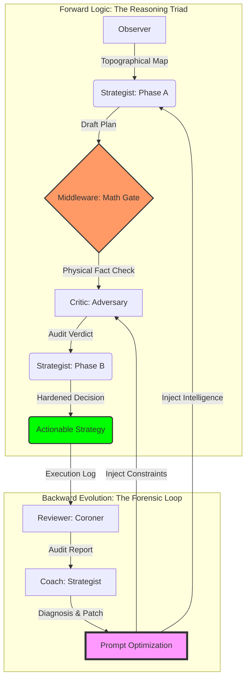

# Strategic Alpha Ledger: The Forensic Trading Machine

> **“不预测行情，只测绘逻辑。”**

这是一个基于物理真相（Physic Truth）与对抗性演化（Adversarial Evolution）构建的多智能体交易系统。它通过“三路推理 (Reasoning Triad)”架构，将极度不确定的市场博弈转化为确定性的物理地形测绘与逻辑审计。

---

## 🏗 架构全景：闭环演化与逻辑枢纽 (The Evolutionary Hub)

系统通过 **前向预测 (Forward Prediction)** 与 **后向演化 (Backward Evolution)** 构建了一个具备自我修复能力的闭环生态：



---

## 🧬 智理引擎：多智能体决策协作协议 (Agentic Collaboration Protocol)

系统各组件通过确定的物理边界与逻辑主权，确保每一棒交接都具备“法医级”的严谨性：

| 执行角色 | 输入信号 (INPUT) | 核心逻辑 (LOGIC?) | 输出产出 (OUTPUT) |
| :--- | :--- | :--- | :--- |
| **Observer** (测绘师) | 原始 K 线 / 流动性资产 | **景观聚合**：识别宏微观地形 Confluence，计算趋势强度。 | 物理地形快照 (Observation) |
| **Strategist (A)** (设计师) | Topographical Map | **构思逻辑**：寻找 HVN 锚点，根据地形初步设计入场轨迹。 | 决策草案 (Draft Plan) |
| **Middleware** (校验门) | Draft + Observation | **物理公证**：计算确定性 RR 与 ATR 距离，强制抹除 LLM 幻觉。 | 数学事实 (Math Fact Check) |
| **Critic** (审判官) | Draft + Math Facts | **对抗审计**：基于《怀疑论》进行压力测试，识别吸收陷阱。 | 审计标签 (Audit Verdict) |
| **Strategist (B)** (觉醒者) | Draft + Critique | **风险收敛**：融合审计意见，执行 DLE 硬化或强制 NEUTRAL。 | 最终执行方案 (Final Decision) |
| **Reviewer** (复盘官) | Decision + T1 Truth | **尸检对比**：量化 PnL 效率，捕捉“逻辑与现实”的偏离。 | 法医复盘报告 (Forensic Report) |
| **Coach** (遗传学家) | Forensic Archives | **进化合成**：识别系统性偏见，生成指令集 (Prompt) 优化方案。 | 演化补丁 (Prompt Patch) |

---

## 🛡 核心硬化盾牌 (Forensic Hardening Mechanism)

为了确保系统在极高波动的加密市场中生存，我们部署了三层“逻辑护甲”：

### 第一层：物理事实真理网关
> **Hallucination Killer**: 禁止 AI 进行任何关键数学计算。由后端 Python 逻辑注入确定性的 RR (盈亏比)、ATR 距离与 Temporal Efficiency (时间效率)，作为 Critic 审计的唯一法定依据。

### 第二层：多模态视觉证伪体系
> **Visual Anchoring**: 所有的推理必须引用视觉快照（Snapshot）中的特征。AI 必须回答：“我看到了 K 线影线在 X 位置的阻力”，而非盲目信任数字，确立“单点真实来源”。

### 第三层：无状态递归相位侦测
> **Deterministic State Machine**: 策略师不再通过复杂的 Context 管理状态，而是直接递归检测 `Draft` 的存在。这使得 Prompt 保持静态且可预测，极大提升了分布式部署的稳定性。

---

## 🚀 运行手册 (Operational Manual)

### 1. 环境准备
```bash
python3 -m venv venv && source venv/bin/activate
pip install -r requirements.txt
# 在 .env 中配置
# BINANCE_API_KEY="..."
# BINANCE_API_SECRET="..."
# GEMINI_API_KEY="..."
# EMAIL_ADDRESS="...@gmail.com"
# EMAIL_APP_PASSWORD="..."
# EMAIL_SMTP_SERVER="smtp.gmail.com"
# EMAIL_SMTP_PORT="587"
```

### 2. 策略执行与回测 (Strategy & Backtest)
*   **单点预测 (Live/Manual)**:
    ```bash
    python3 strategist.py --symbol BTCUSDT --data_root data/live
    ```
*   **历史抽样回测 (Backtest)**:
    ```bash
    # Regime 模式：按市场分层抽样
    python3 backtest.py --sampling 12 --mode regime --start T-24d --data_root data/backtest
    ```
*   **策略回放 (Strategy Replay)**:
    ```bash
    python3 strategist_replay.py --data_root data/backtest --file [JSON_PATH]
    ```

### 3. 法医复盘与取证 (Review & Forensics)
*   **批量生成审计报告**:
    ```bash
    python3 reviewer.py --data_root data/backtest
    ```
*   **复盘回放 (Review Replay)**:
    ```bash
    python3 reviewer_replay.py --data_root data/backtest --file [JSON_PATH]
    ```
*   **可视化看板 (Analytics)**:
    ```bash
    python3 forensic_dashboard.py --symbol BTCUSDT --data_root data/backtest
    ```

### 4. 自动化演化循环 (Evolution Loop)
*   **启动无人守值编排器 (Orchestrator)**:
    ```bash
    # 每 1 小时自动运行一次 观察-决策草案-审计-决策 循环
    python3 pipeline_orchestrator.py --symbol BTCUSDT --interval 1 --data_root data/live
    ```
*   **诊断进化 (Diagnosis)**:
    ```bash
    python3 coach.py --symbol BTCUSDT --data_root data/backtest
    ```
*   **应用补丁 (Apply Patch)**:
    ```bash
    python3 apply_patch.py --file [PATCH_JSON_PATH]
    ```

---

## ⚖️ 我们的哲学
系统不通过“预测”未来获利，而是通过“**精确测绘当前的逻辑陷阱**”获利。每一张单子都是物理事实与对抗性逻辑的结晶。

---

## 📊 持仓策略与演化分析 (Holding Strategy & Evolution Analysis)

### 1. 系统核心逻辑架构 (Logical Pivot)
你的系统是一个典型的 **“观察-推理-风控-审计”** 四位一体的闭环演化模型。
*   **观察层 (Observer)**: 负责“单一口径真理 (Single Source of Truth)”的构建。它不仅提取 OHLCV，还通过 **Volume Profile (成交量分布)** 和 **Market Regime (市场环境分析)** 将非结构化数据转化为“地形图”。
*   **推理层 (Strategist)**: 系统的核心执行引擎。它的逻辑枢纽在于 **ATR-Macro (波动率锚点)**。所有的进场、止损、止盈以及 `holding_time_hours` 的预测，其底层的数学分母都是波动率。
*   **风控层 (Critic)**: 充当了“负面审计”，利用 `hidden_risk` 和 `DLE (深度限价进场)` 机制强制进行数学边缘测试。
*   **演化层 (Coach)**: 利用 `Reviewer` 的 `evaluation_score` 反馈，动态修正 `Strategist.md` 中的判定阈值，实现闭环演化。

### 2. 场景分析 1：持仓时间 < 1 周 (168h)
| 修改点 | 调整细节 | 为什么？ | 重要性 |
| :--- | :--- | :--- | :--- |
| **config: macro_lookback** | 从 336 (14d) 增加到 672+ (28d) | 1周的持仓属于跨周交易。14天的数据只能看到上一个波段，看不出月线级别的结构位。如果不增大，系统会由于不了解更远端的 HVN (高成交量区) 而设置了错误的止盈。 | **High (高)** |
| **config: trend_intensity_duration** | 从 24h 增加到 72h 或 168h | 24小时的趋势强度在1周持仓面前只是“噪声”。你需要知道整个周线级别是否在趋势中。否则你会因为小级别的反弹误判大级别的反向趋势。 | **Medium (中)** |
| **Strategist: min_temporal_efficiency** | 评估是否需要下调 (0.4 -> 0.3) | 持仓时间越长，市场实现预期目标的“效率”通常越低。如果效率门槛太高，系统会算出一个非常短的持仓时间，导致 Reviewer 在结算时给出 `Temporal Failure` (时间效率低下) 的失分。 | **Low (低)** |

### 3. 场景分析 2：持仓时间 < 1 个月 (720h)
如果你将目标设定为 1 个月持仓，而保持目前的配置，**系统的演化闭环将会断裂**。
| 修改点 | 调整细节 | 为什么？ | 重要性 |
| :--- | :--- | :--- | :--- |
| **config: macro_interval** | **必须** 从 1h 改为 4h 或 1d | 1h 级别的数据在 1 个月尺度上不具备宏观统计意义。你无法通过 14 天的小时线看清未来 30 天可能遇到的结构。这会导致系统在“迷雾”中持仓。 | **Critical (极致重要)** |
| **config: micro_interval** | 建议 从 15m 改为 1h | 15m 线对于 1 个月的持仓进场过于精细，会包含大量被剥头皮算法干扰的假信号。 | **Medium (高)** |
| **observer.py: funding_rate** | 增加 Fetch 窗口 (目前 hardcoded 24h) | 持仓 1 个月，资金费率 (Funding Rate) 的多寡将直接决定你的持仓成本及 Alpha。24小时的快照无法代表 30 天的 Carry Cost。如果不改，系统可能选了一个长期高扣费的品种，吃掉所有利润。 | **High (高)** |
| **Strategist: RR (盈亏比) Law** | 提高 Trending 模式的最小 RR (>= 3.0x) | 长期持仓面临的时间风险 (Time At Risk) 更大（黑天鹅风险增加）。如果没有更高的盈亏比补偿，闭环演化最终会导向亏损，因为 SL 的触发概率随时间呈非线性增长。 | **Medium (中)** |

### 4. 系统压力预测 (Stress Prediction)
*   **数据与 API 压力**: `VolumeProfileAnalyzer` 的 bin 分桶逻辑在数据量增加 10 倍（例如小时线看 3 个月）时，计算开销呈线性增长。
*   **逻辑超负荷与 Bug 风险**: `holding_time_hours` 的线性公式在月度级别可能失效，且某些硬编码周期（如 `vol_intensity_lookback`）需随时间跨度调整。

### 5. 弹性 (Flexibility) 与困惑深度分析
你的系统在 **“相对估值”** 上极具弹性（ATR 驱动），但在 **“时间跨度对齐”** 上存在刚性断层。建议构建“多时域感知层”，根据持仓目标自动匹配不同比例尺的地形图。
