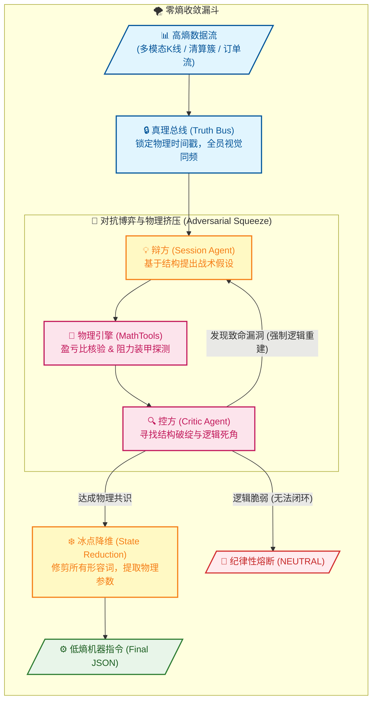

# Singularity 跨代交易会话引擎

[](https://www.python.org/downloads/)

---

## ⚖️ 零熵架构：双子星对抗协议 (The Binary Star Protocol)

Singularity 是一个高保真、多智能体量化架构。它的内核模拟了极高标准的法庭辩论与审判过程，通过 **对抗式推理 (Adversarial Reasoning)** 来彻底消除人类交易员的主观偏见与 AI 智能体的数据幻觉。

每一次最终输出的交易指令，都必须在这场高压的生存游戏中，经历从复杂的市场混沌状态，到冷静、确定性的低熵参数的提纯。其核心机制如下：

- **统一场 (Truth Bus)**：**消除幻觉。** 将市场的多重维度（多模态图表、订单流、情绪极值）硬性锚定在同一秒的物理切片上，构建不可篡改的“法庭证据”，要求博弈各方“眼见为实”。
- **物理挤压 (The Squeeze)**：**消除偏见。** 辩方 (Session Agent) 负责提出战略蓝图，而控方 (Critic Agent) 则执行致命的交叉盘问。收敛不是妥协，而是**强制逼近**。一旦发现结构破绽，系统会被强制放入“物理引擎”中进行逻辑重建（例如被“挤压”出极深的 DLE 限价单以满足盈亏比）。
- **状态降维 (State Reduction)**：**固化指令。** 当对抗各方终于逼近狭窄的“数学交集”后，系统将抛弃大语言模型的“人文修饰词”，在绝对理性的低温度下，将共识瞬间冷凝为可直接执行的低熵机器参数 (JSON)。



---

## 🛠 安装与操作手册

### 0. 环境准备 (重要)

```bash
# crypto 是 Conda 环境名称
conda activate crypto
# pip install -r requirements.txt
```

### 1. 市场推理 (Session Engine)

*   **单次/批量分析 (Prod)**：对当前市场或指定时间点进行对抗推理。结果存入 `data/prod/sessions`。
```bash
python run_session.py
python run_session.py -ts 2026-01-24T15:42:00Z
```

*   **智联回测 (Backtest)**：在历史样本点上进行采样推理。推荐使用 `--sampling-mode sniper` 以捕捉异动。
```bash
python run_session.py --start T-30d --end T-16d --samples 20 --sampling-mode sniper
python run_session.py --start T-16d --end T-2d --samples 20 --sampling-mode spaced
```

*   **实时监控 (Sniper Mode)**：基于“零熵觉醒矩阵”探测异动。系统现在完全驱动自 `global_config.yaml`，无需手动指定 pulse。 
```bash
python run_sniper.py --trigger --email
```

### 2. 取证审计 (Forensic Audit)
对 Session(s) 进行深度审计并生成报告。同步更新 `data_root` 指向。
```bash
python run_audit.py -p data/prod
python run_audit.py -p data/backtest --file data/backtest/sessions/{symbol}_session_{timestamp}.json
```

### 3. 账本看板 (Ledger Dashboard)
系统的可视化看板。它支持对“Audit(s) 审计报告” 或 “Sandbox 报告”（解析里面包含的Audit(s) 审计报告）进行 HTML 渲染：
```bash
python scripts/session_ledger.py -p data/backtest
python scripts/session_ledger.py -p data/backtest --f .../{symbol}_evolution_sandbox_{timestamp}.json
```

### 4. DNA 引擎 (Meta-Evolution)
基于 Audit(s) 报告，对系统的判定逻辑进行“基因突变”式优化（补丁存入 `data/backtest/evolution/proposals`）。
```bash
python run_evolution.py -p data/backtest
```

### 5. 物理同步 (Patching)
正式将补丁“硬化”到系统。它会自动同步更新系统的配置文件与提示词。
```bash
python run_patch.py -f .../{symbol}_evolution_{timestamp}.json
```

---