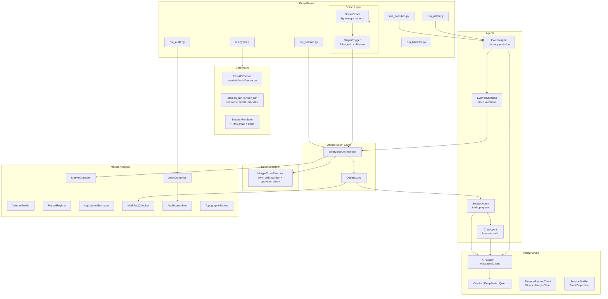
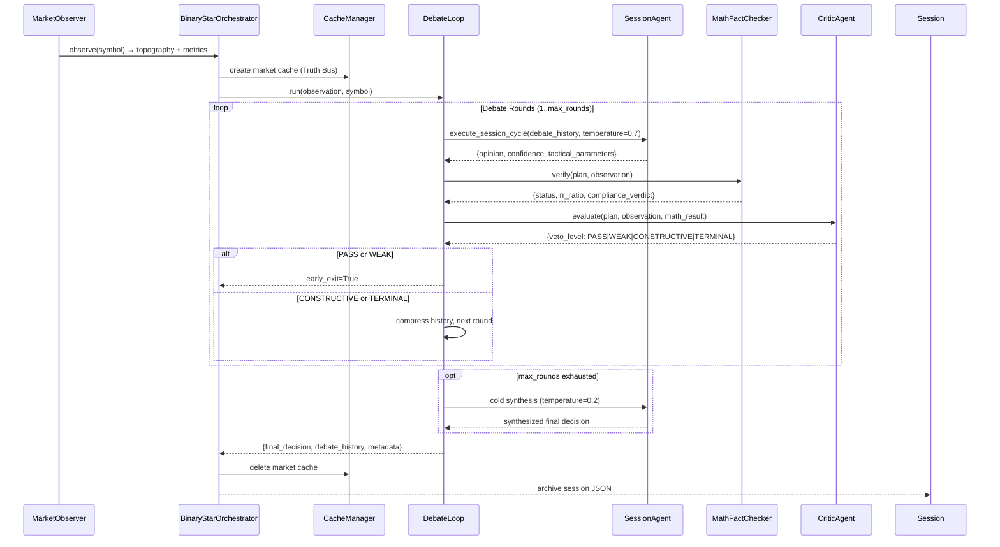
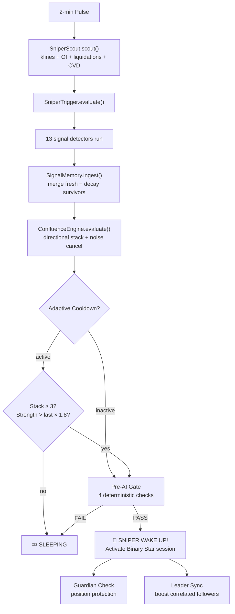
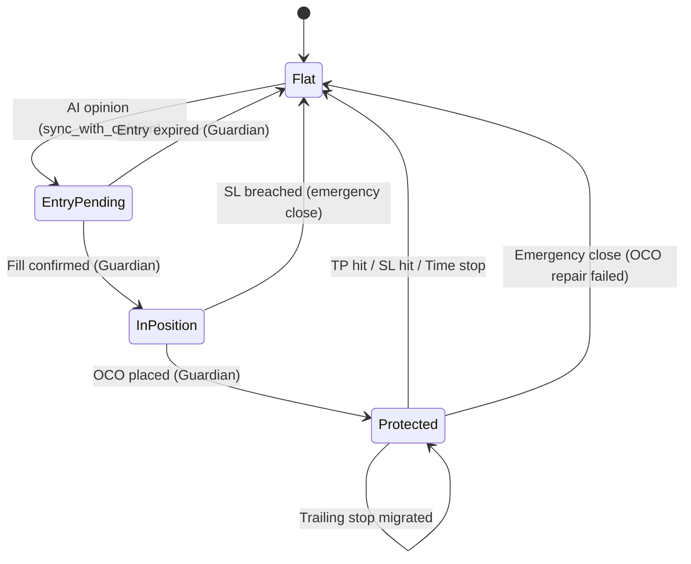
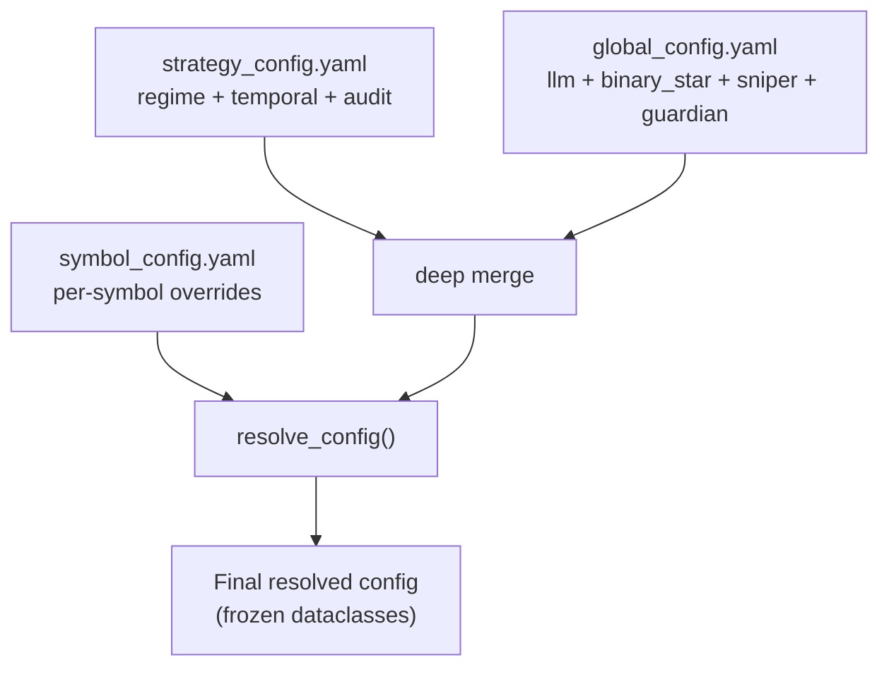

# Singularity

[](https://www.python.org/downloads/)

AI-driven crypto quantitative trading engine. Its core innovation is the **Binary Star adversarial protocol**: two LLM agents (Session Analyst proposing trades, Critic Agent auditing them) debate in rounds to converge on zero-entropy trade decisions. A third agent (Evolver) uses forensic audit results to mutate strategy parameters via sandbox-validated evolutionary patches.

---

## Architecture



### Layer Descriptions

| Layer | Module | Role |
|-------|--------|------|
| **Entry Points** | `run.py`, `run_*.py` | CLI + standalone scripts; each `run_*.py` is independently invocable |
| **Dashboard** | `src/dashboard/` | FastAPI server, Jinja2 templates, REST API for session/sniper/audit/backtest |
| **Orchestration** | `src/agent/binary_star_orchestrator.py` | Wires Observer → DebateLoop → MathFactChecker → SessionAgent → CriticAgent |
| **Agents** | `src/agent/session_agent.py`, `critic_agent.py`, `evolver_agent.py` | LLM agents for trade proposal, adversarial critique, and strategy evolution |
| **Sniper** | `src/sniper/` | Lightweight pulse monitor: Scout harvests market data, Trigger evaluates 14-signal confluence |
| **Trade Execution** | `src/agent/order_executor.py` | MarginOrderExecutor: position cross-referencing, synthetic OCO, Guardian trailing stops |
| **Market Analysis** | `src/analyzer/` | Volume profile, regime detection, math fact-checking, forensic audit assembly, topography |
| **AI Backend** | `src/infrastructure/ai_client.py`, `ai_factory.py`, `ai/` | Provider-agnostic `AbstractAIClient` → Gemini, DeepSeek, Qwen adapters |
| **Exchange** | `src/infrastructure/binance/` | Futures (market data) + Margin (trade execution) clients |
| **Config** | `src/config/` | Frozen dataclasses (sub_configs.py), YAML loaders, symbol-aware resolution + patching |
| **Utilities** | `src/utils/` | Math tools, datetime, evolution patching, fitness evaluation, rate limiting, logging |

---

## The Binary Star Protocol

Every final trade instruction must survive adversarial debate — purifying chaotic market conditions into deterministic low-entropy parameters.



### Audit Dimensions

The CriticAgent evaluates every trade proposal across these axes:

| Dimension | Check |
|-----------|-------|
| **Risk-Reward** | RR ratio ≥ regime-adaptive minimum (trending: 1.12, ranging: 1.0, chaos: discounted) |
| **Structural Shielding** | Stop-loss anchored behind POC, VAH/VAL, or HVN — not floating in vacuum |
| **Entry Feasibility** | Entry distance from current price ≤ max_entry_distance_atr (1.6 ATR) |
| **Directional Sanity** | Counter-trend trades require CVD confirmation; trend pullbacks verified |
| **Chaos Survival** | Directional momentum signals blocked in chaos regime (VII > 2.2) |
| **Physical Plausibility** | MathFactChecker: pure-Python verification of RR, ATR metrics, structural proximity |

---

## Sniper System

The Sniper is a lightweight daemon that monitors market topography at 2-minute pulses. It only activates the heavyweight Binary Star reasoning engine when signal confluence exceeds a regime-adaptive threshold — saving LLM tokens during quiet markets.

### Signal Stack (14 Detectors × 5 Categories)

| # | Signal | Category | Weight | Description |
|---|--------|----------|--------|-------------|
| 1 | `cvd_momentum` | FLOW | 0.65 | CVD intensity exceeds threshold, growing vs previous pulse |
| 2 | `cvd_divergence` | FLOW | 0.70 | CVD-price divergence: smart money vs retail direction mismatch |
| 3 | `cvd_absorption` | FLOW | 0.65 | Extreme CVD with flat price — iceberg absorption detected |
| 4 | `taker_imbalance` | FLOW | 0.60 | Taker buy/sell ratio derived from CVD intensity |
| 5 | `volatility_surge` | ENERGY | 0.55 | VII > baseline, VPR > threshold, growing (damped) |
| 6 | `squeeze` | ENERGY | 0.75 | Bollinger Band squeeze factor below threshold — breakout precursor |
| 7 | `boundary_test` | STRUCTURAL | 0.50 | Price approaching VAH/VAL within proximity threshold |
| 8 | `poc_gravity` | STRUCTURAL | 0.55 | Price pulled toward POC — mean-reversion magnet active |
| 9 | `liquidation_hunt` | STRUCTURAL | 0.60 | Price moving toward liquidation cluster within proximity |
| 10 | `trend_pullback` | STRUCTURAL | 0.75 | Price pulling back to HVN in strong trend direction |
| 11 | `retail_extreme` | POSITIONING | 0.42 | LS ratio or funding rate at extreme — contrarian signal |
| 12 | `oi_divergence` | POSITIONING | 0.70 | OI-price divergence: open interest vs price moving opposite directions |
| 13 | `oi_surge` | POSITIONING | 0.55 | OI and price moving same direction — trend continuation |
| 14 | `leader_sync` | CROSS_SYMBOL | 0.40 | Correlated leader (ETH, XAUT) triggered — boost follower |

### Confluence Engine

Signals stack directionally using the formula **1 − ∏(1 − sᵢ · wᵢ)**, with noise cancellation via cross-direction product. Regime-adaptive thresholds:

| Regime | Modifier | Effective Threshold | Rationale |
|--------|----------|--------------------|-----------|
| `squeeze` | 0.75 | 0.26 | Lowest — compression is breakout precursor, position early |
| `trending` | 0.85 | 0.30 | Trend has inertia — lower bar for high-conviction signals |
| `ranging` | 1.00 | 0.35 | Neutral — noise is symmetric, no bias |
| `chaos` | 1.50 | 0.53 | Near-lockout — only emergency override (strength ≥ 0.80) breaks through |

### Pulse Flow



### Adaptive Cooldown

After a trigger, cooldown prevents spam. Duration adapts to regime:

| Regime | Cooldown | Break Conditions |
|--------|----------|-----------------|
| `trending` | 25 min | 3+ stacked signals, or strength > last × 1.8 |
| `ranging` | 45 min | Same break conditions |
| `squeeze` | 25 min | Same break conditions |
| `chaos` | 60 min | Emergency override only (strength ≥ 0.80) |

Absolute minimum gap between triggers: **10 minutes**.

### Guardian: Position Protection

Every pulse cycle, Guardian checks and protects open positions — no AI involvement:

| State | Action |
|-------|--------|
| **Flat, no trade state** | No-op |
| **Entry pending, not expired** | Wait (elapsed < projected_waiting_hours) |
| **Entry expired** | Cancel entry order, clear trade state |
| **Position filled, unprotected** | Check SL not already breached → place synthetic OCO (TP limit + SL limit). If price already crossed SL: emergency market close |
| **Position filled, protected** | Proceed to trailing stop migration check |
| **SL breached** | Emergency market close |
| **Partial SL fill** | Rebuild OCO with remaining qty |
| **Position flat (was filled)** | Cancel all orders, clear state |

### Trailing Stop Migration (3-Tier)

When profit exceeds ATR-based thresholds, Guardian progressively migrates the stop-loss:

| Tier | Profit (ATR) | SL Position | Rationale |
|------|-------------|-------------|-----------|
| Level 1 | ≥ 1.5 ATR | SL → entry (breakeven) | Lock in safety |
| Level 2 | ≥ 2.5 ATR | SL → entry ± 0.5 ATR | Capture partial profit |
| Level 3 | ≥ 4.0 ATR | SL → entry ± 1.5 ATR | Trail aggressively |

**Time Stop** (ATR-adaptive): Holding limit adjusts to volatility changes. If `current ATR > entry ATR` (rising vol), the limit compresses proportionally — a 2× ATR increase halves the allowed holding time. Formula: `max_hold = (projected_holding_hours / atr_ratio) × time_stop_multiplier`. When elapsed exceeds this limit, the position is market-closed regardless of profit.

### Order Lifecycle



---

## AI Providers

`AbstractAIClient` defines the provider-agnostic contract. `AIFactory.create_client()` resolves the active provider from `global_config.yaml` → `llm.active_provider`.

| Provider | Adapter | Model | Vision | Context Cache | Notes |
|----------|---------|-------|--------|---------------|-------|
| **DeepSeek** | `deepseek_adapter.py` | `deepseek-v4-pro` | No | No | OpenAI-compatible; thinking models supported via `reasoning_content` |
| **Gemini** | `gemini_adapter.py` | `gemini-3.5-flash` | Yes | Yes | Context cache (Truth Bus) for multi-turn debate efficiency |
| **Qwen** | `qwen_adapter.py` | `qwen3.7-max` | No (configurable) | No | OpenAI-compatible; set `supports_vision: true` for VL models |

### Provider-Agnostic Data Types

```python
@dataclass
class AIResponse:
    text: str
    tool_calls: list[ToolCall] | None
    usage: UsageMetadata | None
    reasoning_content: str | None  # DeepSeek thinking models

@dataclass
class VisualPart:           # Provider-agnostic image/chart
    mime_type: str
    data: bytes
    label: str | None
```

---

## Config System

### File Tree

```
config/
├── global_config.yaml       # LLM providers, binary_star, sniper, guardian, sandbox, evolver
├── strategy_config.yaml     # Regime detection, temporal physics, audit thresholds, topography
├── symbol_config.yaml       # Per-symbol trade params + overrides (BTCUSDT, XAUTUSDT, ETHUSDT)
├── visual_config.yaml       # Chart rendering colors, DPI
├── auth/                    # Exchange API credentials
└── prompts/
    ├── binary_star.md       # Shared system instruction
    ├── session.md           # SessionAgent role prompt
    ├── critic.md            # CriticAgent role prompt
    └── evolver.md           # EvolverAgent role prompt
```

### Resolution Order



**Rule**: Symbol overrides win on conflict. If a symbol has `overrides.regime_parameters.trend.trend_intensity_min_expansion: 0.08`, it replaces the base value. Unknown sections are silently skipped. Original config is never mutated.

### Sub-Config Dataclasses (Frozen)

| Dataclass | Source Section | Key Fields |
|-----------|---------------|------------|
| `RegimeConfig` | `regime_parameters` | trend thresholds, volatility ratios, squeeze, CVD, imbalance |
| `TemporalConfig` | `temporal_parameters` | velocity floor, regime-specific dilation + weights |
| `RiskConfig` | `regime_parameters.risk` | min RR, structural buffer, chaos discount, max holding hours |
| `AuditConfig` | `audit_review` | MAE thresholds (pinpoint/standard/luck), missed opportunity, slippage |
| `VisualConfig` | `visual_config.yaml` | render DPI, up/down/POC/VAH/VAL colors |

### Per-Symbol Overrides

```yaml
# symbol_config.yaml
XAUTUSDT:
  precision_qty: 3
  precision_price: 1
  min_order_qty: 0.01
  sl_slippage_buffer: 0.5
  overrides:
    regime_parameters:
      trend:
        trend_intensity_min_expansion: 0.08
    sniper:
      probes:
        cvd_divergence_tick_delta: 0.18
```

---

## Installation & Setup

```bash
# Clone
git clone <repo-url> && cd crypto

# Virtual environment
python -m venv venv && source venv/bin/activate

# Install
pip install -e .

# Configure
cp .env.example .env
# Edit .env — set at least one API key:
#   DEEPSEEK_API_KEY=sk-...
#   GEMINI_API_KEY=...
#   QWEN_API_KEY=...

# Set active provider in config/global_config.yaml → llm.active_provider

# Exchange credentials in config/auth/ (Binance API key + secret)

# Verify setup
python run.py --version
```

---

## Commands

All commands support both `python run.py <command>` and direct `python run_<module>.py` invocation. The `run_*.py` scripts are independent entry points — they do not import `run.py`.

### Session

Run a single Binary Star analysis cycle (live market data).

```bash
# Via unified CLI
python run.py session --symbol BTC -p data/prod

# Via standalone script
python run_session.py --symbol BTC

# With status file for dashboard polling
python run.py session --symbol BTC --write_status -p data/prod
```

| Flag | Required | Default | Description |
|------|----------|---------|-------------|
| `--symbol` | Yes | — | Trading pair prefix (`BTC`, `ETH`, `XAUT`) |
| `-p` / `--path` | No | `data/prod` | Data root directory |
| `--write_status` | No | `false` | Write progress to `.session_run_status.json` |

### Sniper

Run the real-time monitoring daemon. Lightweight pulse (2-min) → signal evaluation → AI session only on trigger.

```bash
# Observe-only (signals logged, no LLM spend)
python run.py sniper --symbol BTC,ETH,XAUT -p data/prod

# Enable AI sessions on trigger
python run.py sniper --symbol BTC,ETH,XAUT --llm -p data/prod

# Enable automated trading (implies --llm)
python run.py sniper --symbol BTC,ETH,XAUT --trade -p data/prod

# With manual balance override
python run.py sniper --symbol BTC,ETH,XAUT --trade 1000 -p data/prod
```

| Flag | Required | Default | Description |
|------|----------|---------|-------------|
| `--symbol` | Yes | — | Trading pair prefix(es), CSV for multiple |
| `--llm` | No | `false` | Enable AI session dispatch on trigger |
| `--trade` | No | `false` | Enable automated margin trading (implies `--llm`). Optional float value = manual balance USDT |
| `-p` / `--path` | No | `data/prod` | Data root directory |

### Backtest

Run session cycles against historical timestamps. Three mutually exclusive modes:

```bash
# Dashboard mode (reads timestamps from .backtest_status.json)
python run.py backtest-run --symbol BTC --run-id 1 -p data/prod

# Single historical point
python run.py backtest-run --symbol BTC --timestamp "2026-06-15T14:00:00Z" -p data/prod

# Batch range with sniper-based sampling
python run.py backtest-run --symbol BTC --start T-30d --samples 20 -p data/prod

# Batch with custom end date
python run.py backtest-run --symbol BTC --start 2026-01-01 --end 2026-06-01 --samples 50 -p data/prod
```

| Flag | Required | Default | Description |
|------|----------|---------|-------------|
| `--symbol` | Yes | — | Trading pair prefix |
| `--run-id` | Mode A | — | Dashboard mode: read timestamps from status file |
| `--timestamp` | Mode B | — | Single ISO-8601 timestamp |
| `--start` | Mode C | — | Start date (`YYYY-MM-DD` or `T-30d`) |
| `--end` | No | `now` | End date for batch range |
| `--samples` | With `--start` | — | Number of samples to collect |
| `--write-status` | No | `false` | Write progress to `.backtest_status.json` |
| `-p` / `--path` | No | `data/prod` | Data root directory |

### Audit

Forensic audit on completed sessions. Batch mode (all sessions in directory) or single file. Parallel execution via `ProcessPoolExecutor`.

```bash
# Audit a single session file
python run.py audit -f data/prod/sessions/BTCUSDT_20260615_140000.json -p data/prod

# Batch audit all sessions for a symbol
python run.py audit --symbol BTC -p data/prod

# Force re-audit (bypass dedup + maturity checks)
python run.py audit --symbol BTC --force -p data/prod
```

| Flag | Required | Default | Description |
|------|----------|---------|-------------|
| `-f` / `--file` | No | — | Path to a specific session JSON |
| `--symbol` | No | — | Filter batch by symbol prefix |
| `--force` | No | `false` | Bypass deduplication and maturity checks |
| `-p` / `--path` | **Yes** | — | Data root directory |

### Evolution

Meta-evolution cycle: ingest audit reports → AI proposes mutations → sandbox validates → generates proposal JSON.

```bash
python run.py evolution --symbol BTC --samples 10 -p data/prod
```

| Flag | Required | Default | Description |
|------|----------|---------|-------------|
| `--symbol` | Yes | — | Trading pair prefix |
| `--samples` | Yes | — | Number of audit reports to ingest |
| `-p` / `--path` | **Yes** | — | Data root directory |

### Patch

Apply a validated evolution proposal to config files and prompt templates.

```bash
# Patch strategy_config.yaml (no symbol)
python run.py patch -f data/prod/evolution/proposals/BTCUSDT_evolution_20260615.json

# Patch symbol_config.yaml overrides for a specific symbol
python run.py patch -f proposal.json --symbol XAUT
```

| Flag | Required | Default | Description |
|------|----------|---------|-------------|
| `-f` / `--file` | Yes | — | Path to validated evolution proposal JSON |
| `--symbol` | No | — | Target symbol for symbol_config.yaml override patching |

### Utility Scripts

| Script | Description |
|--------|-------------|
| `scripts/calculate_qty.py` | Position size calculator: equity, risk%, entry, SL → qty |
| `scripts/check_margin_state.py` | Inspect current Binance margin account state |
| `scripts/clean_neutral_sessions.py` | Batch-delete neutral/no-op session files from data directory |
| `scripts/export_session.py` | Export a session JSON to readable markdown summary |
| `scripts/market_recon.py` | Standalone market reconnaissance (topography snapshot) |
| `scripts/render_email_html.py` | Render session result as HTML email |
| `scripts/sandbox_offline.py` | Offline sandbox: replay audit with patch, no live API calls |
| `scripts/sandbox_online.py` | Online sandbox: full Binary Star replay with live AI |

---

## Key Invariants

These are hard constraints enforced at runtime — violations trigger aborts, not warnings:

- **Symbol Whitelist**: `MarginOrderExecutor` rejects any symbol not in `symbol_config.yaml`. No trade can execute for unconfigured symbols.
- **Config Immutability**: `resolve_config()` returns a new dict — never mutates the original. Sub-config dataclasses are frozen.
- **Emergency Close on OCO Failure**: If synthetic OCO placement fails during a pivot, the position is market-closed immediately (sentinel `-1`). Naked positions are not tolerated.
- **Circuit Breaker**: `SessionEngine` halts after `llm.max_consecutive_failures` (default: 3) consecutive cycle failures in live mode.
- **Entry Expiry**: Entries expire after `projected_waiting_hours`. Guardian cancels stale entry orders.
- **Time Stop** (ATR-adaptive): Positions held beyond `(projected_holding_hours / atr_ratio) × time_stop_multiplier` are market-closed — rising volatility compresses the holding limit proportionally.
- **Structural Shielding**: Stop-loss must be anchored behind at least one structural level (POC, VAH/VAL, HVN). MathFactChecker enforces this.
- **Chaos Survival**: Directional momentum signals are blocked in chaos regime (VII > `volatility_extreme_ratio`).
- **Regime-Gated RR**: Minimum RR adapts to regime — trending requires 1.12, chaos discounts to 0.78, ranging uses 1.0.
- **Adaptive Cooldown**: Sniper cannot re-trigger within cooldown window unless emergency override (strength ≥ 0.80) or stacked break (3+ signals).
- **Supersede Detection**: Backtest dashboard mode checks `run_id` before each sample — superseded runs are discarded mid-flight.

---

## Development

```bash
# Run full test suite
python -m pytest tests/ -v

# Run specific test file
python -m pytest tests/unit/test_sniper_daemon.py -v

# Run with coverage
python -m pytest tests/ --cov=src --cov-report=term-missing
```

**Test suite**: 166 tests across unit, integration, system, and analyzer layers. All tests use mocked external dependencies (exchange clients, AI adapters). Live API tests are skipped unless real API keys are configured.
