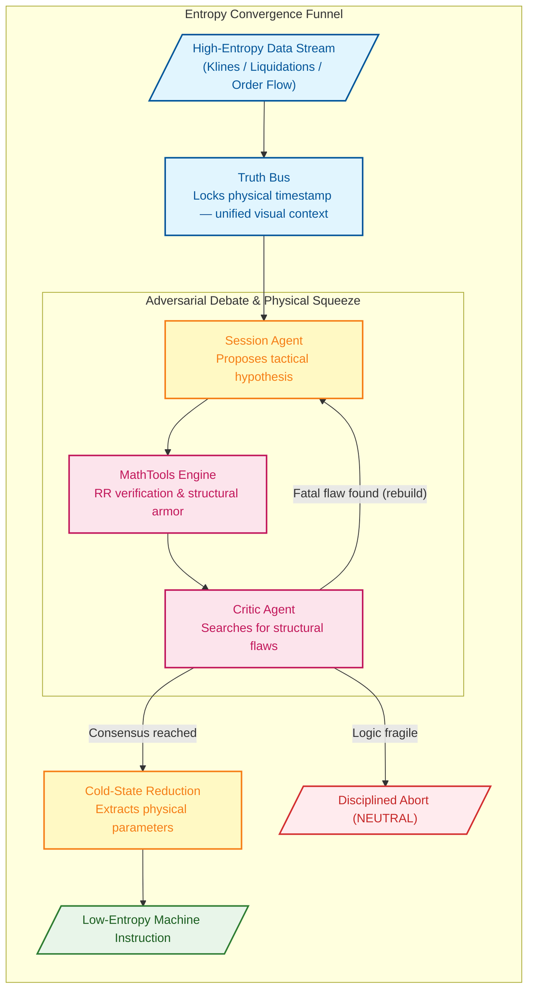

# Singularity

[](https://www.python.org/downloads/)

AI-driven crypto quantitative trading engine. Its core innovation is the **Binary Star adversarial protocol**: two LLM agents (Session Analyst proposing trades, Critic Agent auditing them) debate in rounds to converge on zero-entropy trade decisions. A third agent (Evolver) uses audit results to mutate strategy parameters.

---

## Architecture

```
Entry Points (run.py + standalone run_*.py)
  → Dashboard (src/dashboard/)           FastAPI + Jinja2 templates, API routers, SessionRenderer (HTML email)
  → Sniper (src/sniper/)                 SniperScout (market harvest), SniperTrigger + ConfluenceEngine (14-signal stack)
  → Orchestration (src/agent/)           DebateLoop, BinaryStarOrchestrator
  → Agents (src/agent/)                  SessionAgent, CriticAgent, EvolverAgent, EvolverSandbox
  → Trade Execution (src/agent/)         MarginOrderExecutor (order lifecycle + Guardian position protection)
  → AI Backend (src/infrastructure/)     AbstractAIClient + AIFactory at root; adapters in ai/ (Gemini, DeepSeek, Qwen)
  → Exchange (src/infrastructure/)       AbstractExchangeClient → Binance (binance/), models (exchange/models.py)
  → Notifications (src/infrastructure/)  SessionNotifier, EmailDispatcher, AlertEmailTemplate
  → Market Analysis (src/analyzer/)      MarketObserver, VolumeProfile, MarketRegime, LiquidationEstimator,
                                         MathFactChecker, AuditAssembler, AuditController, ChartVisualRenderer,
                                         TopographyEngine, SniperSampler
  → Config (src/config/)                 Sub-config dataclasses + YAML loaders
  → Utilities (src/utils/)               CongestionController, FitnessEvaluator,
                                         ConfigPatcher + PromptDistiller, exceptions, math tools
```

### AI Backend

`AbstractAIClient` (`src/infrastructure/ai_client.py`) is the contract — mirrors the `AbstractExchangeClient` pattern for LLM providers. `AIFactory.create_client()` returns the right adapter based on `global_config.yaml` → `llm.active_provider`. OpenAI-compatible providers (DeepSeek, Qwen) share `OpenAICompatibleAdapter`; only `GeminiAdapter` touches Gemini SDK types. Provider-agnostic `VisualPart` is used for multimodal content throughout the orchestrator and agents.

### Adversarial Debate Flow

1. `MarketObserver.observe()` collects klines, OI, liquidations, CVD → `observation` dict
2. `BinaryStarOrchestrator.execute_flow()`:
   - Injects regime benchmarks, optionally creates Gemini context cache (Truth Bus)
   - `DebateLoop.run()` alternates: SessionAgent proposes → MathFactChecker verifies → CriticAgent audits → repeat until PASS/WEAK or `max_rounds`
   - Cold synthesis produces final decision if max rounds reached without consensus
3. Result archived as JSON in `<data_root>/sessions/`

---

## The Binary Star Protocol

Every final trade instruction must survive adversarial debate — purifying chaotic market conditions into deterministic low-entropy parameters.

- **Truth Bus**: Multimodal market topography cached once, shared across the reasoning triad — eliminates context drift and cost.
- **Physical Verification**: AI proposals cross-referenced against Python-native math fact-checks to prevent hallucination in trade geometry.
- **Adversarial Hardening**: Iterative debate rounds ensure the final trade blueprint is logically sound and structurally shielded.



### Audit Dimensions (Zero-Entropy Logic Matrix)

| Dimension | Identifier | Logic |
|:---|:---|:---|
| **Order Physics** | `[ORDER_PHYSICS]` | Entry price not breached; stop-loss direction physically correct |
| **Anchor Violation** | `[ANCHOR_VIOLATION]` | SL must be shielded by HVN/POC or liquidation clusters |
| **Structural Trap** | `[STRUCTURAL_TRAP]` | Avoid volume vacuums (LVN zones) where price slides frictionlessly |
| **Math Violation** | `[MATH_VIOLATION]` | RR ratio and ATR tolerance enforced by physics engine |
| **Gravity Exhaustion** | `[GRAVITY_EXHAUSTION]` | Prohibit chasing price beyond value area gravity limit |
| **CVD Absorption** | `[CVD_ABSORPTION]` | Extreme CVD pulses with flat price → iceberg order detection |
| **Retail Squeeze** | `[RETAIL_LONG/SHORT_SQUEEZE]` | Heavily one-sided retail positioning → contrarian opportunity |
| **Opportunity Cost** | `[INACTION_BIAS]` / `[OPPORTUNITY_DENIAL]` | Consensus confirmed + structure clear → retreat is prohibited |
| **Trend Starvation** | `[TREND_STARVATION]` | Expanding volatility + strong trend when system is flat |
| **Liquidity Void** | `[LIQUIDITY_VOID]` | Proximity to nearest LVN too close |
| **Protocol Violation** | `[PROTOCOL_VIOLATION]` | Dead-loop protection: no repeating same failed proposal |
| **Endgame** | `[PRISTINE]` / `[JUSTIFIED_INACTION]` | Fully compliant entry, or disciplined abstention |

---

## Sniper Trading System

Two-phase monitoring and trading automaton: a fast market scanner identifies "noteworthy" conditions (Phase 1), and on-demand Binary Star AI generates precise trade blueprints (Phase 2). Trade execution is managed by a deterministic state machine that cross-references current positions against AI opinions.

### Architecture

```
run.py sniper (SniperDaemon)
  ├── SniperScout        Lightweight market data harvester
  ├── SniperTrigger      ConfluenceEngine — 14 signals across 5 categories
  ├── SessionEngine      Binary Star AI reasoning (on-demand)
  └── MarginOrderExecutor  Order lifecycle + Guardian position protection
```

### Signal Types (Phase 1: Trigger)

Every 2 minutes, `SniperTrigger.evaluate()` scores 14 signals across 5 categories. The **ConfluenceEngine** stacks signals directionally — reinforcing signals compound, contradictory signals create noise penalty.

| Category | Signal | Direction | Detection |
|----------|--------|-----------|-----------|
| **FLOW** | CVD Momentum | Sign of CVD | `abs(cvd) > 0.10` growing pulse-over-pulse |
| **FLOW** | CVD Divergence | Opposite to price | Price↑ CVD↓ → BEARISH / Price↓ CVD↑ → BULLISH |
| **FLOW** | CVD Absorption | Opposite to CVD | Extreme CVD + flat price → iceberg orders |
| **FLOW** | Taker Imbalance | Sign of CVD | From `cvd_intensity_ratio` (mathematically equivalent) |
| **ENERGY** | Volatility Surge | From CVD/trend | VII > 1.25 + volume confirmation |
| **ENERGY** | Squeeze | NEUTRAL | BB-KC squeeze intensifying pulse-over-pulse |
| **STRUCTURAL** | Boundary Test | Toward VAH/VAL | Within 0.70 ATR + volume + approaching |
| **STRUCTURAL** | POC Gravity | Toward POC | Within 0.50 ATR + approaching |
| **STRUCTURAL** | Liquidation Hunt | Toward cluster | Within 0.40 ATR + moving toward liq cluster |
| **STRUCTURAL** | Trend Pullback | Trend direction | Strong trend + price retracing to HVN |
| **POSITIONING** | Retail Extreme | Contrarian | LS ratio > 1.5 or < 0.6; or funding extreme |
| **POSITIONING** | OI Divergence | Opposite to price | OI↓ + Price↑ = short squeeze exhaustion |
| **POSITIONING** | OI Surge | Price direction | OI spike aligned with price → continuation fuel |
| **CROSS-SYMBOL** | Leader Sync | Inherited | Leader symbol triggers → boost correlated followers |

**Trigger formula**: `confluence_score ≥ trigger_threshold (0.35) × regime_modifier`, or any single signal ≥ `emergency_threshold` (0.85). Cooldown is adaptive (25–60 min by regime, breaks on 3+ stacked signals). A pre-trigger gate filters untradeable setups before spending LLM tokens.

**CLI modes:**
```bash
python run.py sniper --symbol BTC,XAUT               # observe only (zero LLM cost)
python run.py sniper --symbol BTC,XAUT --llm         # + AI sessions on trigger
python run.py sniper --symbol BTC,XAUT --trade       # + AI + trade (--trade implies --llm)
```

### Pulse Flow & Order Lifecycle

Every 2-minute pulse runs through a fixed sequence. The **Guardian** runs first every pulse regardless of trigger state. The **Trade Gate** fires only when an AI session completes.

**1. Guardian (every pulse, always first)**

| Condition | Action |
|-----------|--------|
| No `trade_state` | Return — nothing to protect |
| Entry pending, within `projected_waiting_hours` | Wait — log elapsed |
| Entry pending, timed out | Cancel order → clear `trade_state` |
| Position filled, no OCO | Place synthetic OCO (TP LIMIT + SL STOP_LIMIT) |
| Position + OCO active | Time-stop check + trailing stop migration |
| OCO re-place failure (any path) | **Emergency market close** — never leave position naked |
| Direction mismatch (manual vs robot) | Do not adopt — robot tracks its own intent |

**2. Trigger Evaluation**
`SniperTrigger.evaluate()` → ConfluenceEngine over 14 signals. No trigger → sleep until next pulse.

**3. AI Session (trigger + no active position)**
Binary Star debate → final decision with opinion, confidence, and tactical parameters.

**4. Trade Gate (3 checks)**
Gate 1: Opinion is BULLISH/BEARISH? Gate 2: Confidence ≥ 50%? Gate 3: Entry + TP + SL all present?

**5. sync_with_opinion() — position cross-reference**

| Current State | AI Opinion | Action |
|---------------|------------|--------|
| **FLAT** | BULLISH/BEARISH | Cancel stale orders → Place LIMIT entry → Return `order_id` |
| **LONG** | BULLISH (same) | Merge best TP (`max`) + best SL (`max`) → Re-wrap OCO over net qty |
| **SHORT** | BEARISH (same) | Merge best TP (`min`) + best SL (`min`) → Re-wrap OCO over net qty |
| **LONG** | BEARISH (pivot) | Protected (has SL): preserve position, TP→entry, new entry. Unprotected: force close → new entry |
| **SHORT** | BULLISH (pivot) | Mirror of above |

**TP/SL arbitration** (same-direction): never blindly replace. TP always widens (`max` for LONG, `min` for SHORT), SL always tightens (`max` for LONG, `min` for SHORT). Protection only improves — one-way ratchet.

**6. Guardian protection (ongoing, every pulse after fill)**

| Dimension | Logic | Config |
|-----------|-------|--------|
| **Time-stop** | `elapsed > projected_holding × 1.5 / (ATR_now / ATR_entry)` → market close | `time_stop_multiplier: 1.5` |
| **Trailing stop L1** | Profit ≥ 1.5 ATR → SL to entry (breakeven) | `trailing_profit_atr_level_1: 1.5` |
| **Trailing stop L2** | Profit ≥ 2.5 ATR → SL to entry ± 0.5 ATR | Level 2.5, offset 0.5 |
| **Trailing stop L3** | Profit ≥ 4.0 ATR → SL to entry ± 1.5 ATR | Level 4.0, offset 1.5 |

SL only migrates **forward** — `target_level ≤ current_level` → skip. Migration = cancel old OCO → place new OCO → if re-place fails → emergency market close.

**Synthetic OCO**: Binance Spot Margin (SAPI) lacks native OCO/OTOCO. Two independent LIMIT orders (TP + SL) are cross-managed by Guardian. TP fills → cancel SL. SL fills → cancel TP. The cancel→re-place window is the critical risk — emergency close is the universal fallback.

### Position Sizing

```
qty = (Total Equity × 0.4%) / |entry_price - stop_loss|
```

Risk per trade capped at 0.4% equity. Quantity precision-rounded and floored at the symbol's minimum order size.

### Key Configuration

| Parameter | Value | Purpose |
|-----------|-------|---------|
| `pulse_interval_minutes` | 2.0 | Scan frequency |
| `signal_stack.trigger_threshold` | 0.35 | Base confluence score to fire AI |
| `signal_stack.emergency_threshold` | 0.85 | Single-signal override |
| `signal_stack.gate.max_price_to_structure_atr` | 4.0 | Max price distance to nearest HVN |
| `signal_stack.cooldown.stacked_break_count` | 3 | Same-direction signals to break cooldown |
| `muting.state_lockout_hours` | 8.0 | Structural/sentiment repeat suppression |
| `binary_star.session_confidence_threshold` | 50 | Minimum AI confidence for trade |
| `risk_per_trade` | 0.004 | Max loss per trade (0.4% equity) |
| `trailing_profit_atr_level_1/2/3` | 1.5 / 2.5 / 4.0 | Trailing stop tiers |
| `time_stop_multiplier` | 1.5 | Max hold = projected_holding × 1.5 |

### Multi-Symbol Architecture

Supports any number of pairs from a single config via `--symbol BTC,XAUT` (prefix format). Independent scout → trigger → guardian loop per symbol. Cross-symbol **Leader Sync** amplifies follower signals when a correlated leader triggers.

Parameters are instrument-agnostic by design (CVD ratios, ATR-normalized distances apply identically). Per-symbol tuning via `symbol_config.yaml` overrides is deep-merged at resolution time and never touched by evolution:

```yaml
# config/symbol_config.yaml — per-symbol operational tuning (NOT evolved)
XAUTUSDT:
  precision_qty: 3
  overrides:
    sniper:
      probes:
        cvd_divergence_tick_delta: 0.18      # thinner books → smaller CVD swings
      signal_stack:
        gate:
          max_price_to_structure_atr: 2.0    # XAUT structure closer than BTC
```

---

## Installation

### Prerequisites

- Python 3.12+
- A supported LLM provider API key (Gemini, DeepSeek, or Qwen)

### Setup

```bash
git clone <repo-url> && cd crypto
pip install -e .              # core dependencies
pip install -e ".[dev]"       # include pytest, coverage
```

### Configuration

1. Create a `.env` file with your API key:
   ```bash
   GEMINI_API_KEY="your-key-here"    # or DEEPSEEK_API_KEY / QWEN_API_KEY
   ```
2. Edit `config/global_config.yaml` to set your active provider:
   ```yaml
   llm:
     active_provider: "gemini"  # gemini | deepseek | qwen
   ```
3. Review `config/strategy_config.yaml` for trading parameters and `config/symbol_config.yaml` for per-instrument overrides.

---

## Commands

All entry points consolidated under `run.py`. `--symbol` accepts prefix format (BTC, XAUT); quote currency from `global_config.yaml` (default: USDT). Data root (`-p`/`--path`) is required for most commands.

```bash
# ── Binary Star Sessions ──────────────────────────────────────────
python run.py session -p data/prod --symbol BTC                        # Live analysis
python run.py session -p data/prod --symbol BTC -ts 2026-06-01T12:34:00Z  # Historical snapshot
python run.py session --start T-15d --end T-1d --samples 14 --symbol BTC -p data/backtest/v26.6.24_r14  # Backtest

# ── Sniper Daemon ─────────────────────────────────────────────────
python run.py sniper -p data/prod --symbol BTC,XAUT                    # Observe only (zero LLM cost)
python run.py sniper -p data/prod --symbol BTC,XAUT --llm              # + AI sessions on trigger
python run.py sniper -p data/prod --symbol BTC,XAUT --trade            # + AI + trade (live balance, --trade implies --llm)
python run.py sniper -p data/prod --symbol BTC,XAUT --trade 1000       # + AI + trade ($1000 fixed balance)

# ── Audit & Evolution ─────────────────────────────────────────────
python run.py audit -p data/prod                                       # Batch audit all sessions
python run.py audit -p data/prod --symbol BTC                          # Batch, filter by symbol
python run.py audit -p data/backtest --file data/backtest/.../BTCUSDT_session_....json  # Single session
python run.py audit -p data/prod --force                               # Bypass dedup + maturity checks
python run.py evolution -p data/prod --symbol BTC --samples 100        # Evolve from audit reports
python run.py patch -f data/prod/evolution/proposals/BTCUSDT_evolution_....json           # No symbol
python run.py patch -f data/backtest/.../XAUTUSDT_evolution_....json --symbol XAUT        # Per-symbol

# ── Dashboard ─────────────────────────────────────────────────────
python -m src.dashboard.server --host 127.0.0.1 --port 8080 -p data/prod

# ── Utilities ─────────────────────────────────────────────────────
python scripts/calculate_qty.py -b 1000 -f data/prod/sessions/XAUTUSDT_session_....json
python scripts/clean_neutral_sessions.py -p data/prod --symbol BTC,XAUT
python scripts/clean_neutral_sessions.py -p data/prod --dry-run        # Preview without deleting
python scripts/market_recon.py --symbol BTC -p data/prod
python scripts/market_recon.py --symbol BTC -p data/prod -ts 2026-06-01T12:34:00Z --email  # Historical + notify
python scripts/render_email_html.py -p data/prod -f data/prod/sessions/BTCUSDT_session_....json
python scripts/render_email_html.py -p data/prod -f .../BTCUSDT_session_....json --open     # + open in browser
python scripts/export_session.py -p data/prod -f data/prod/audits/BTCUSDT_audit_....json
python scripts/check_margin_state.py --symbol BTC
python scripts/sandbox_offline.py -p data/prod -f data/prod/evolution/sandbox_results/BTCUSDT_evolution_sandbox_....json
python scripts/sandbox_online.py -p data/prod -f data/prod/evolution/proposals/BTCUSDT_evolution_....json
python scripts/diagnostic_models.py
```

### Running Tests

```bash
python -m pytest tests/ -v
python -m pytest tests/ --cov=src --cov-report=term-missing
```

---

## AI Providers

Unified `AbstractAIClient` interface. Switch providers via `global_config.yaml` — no code changes.

| Provider | Adapter | Vision | Context Cache | Cost |
|----------|---------|--------|---------------|------|
| **Gemini** | `GeminiAdapter` | Yes | Yes (Truth Bus) | $$$ |
| **DeepSeek** | `DeepSeekAdapter` → `OpenAICompatibleAdapter` | — | — | $ |
| **Qwen** | `QwenAdapter` → `OpenAICompatibleAdapter` | Yes (VL models) | — | $ |

All support function calling + JSON mode. Adding a new OpenAI-compatible provider is a ~10-line subclass.

### Provider Setup

```yaml
# Gemini (default — only provider with context caching)
llm:
  active_provider: "gemini"
  gemini:
    context_cache:
      enable: true
      expiration_minutes: 10

# DeepSeek (best cost-performance)
llm:
  active_provider: "deepseek"
  deepseek:
    base_url: "https://api.deepseek.com"
    model: "deepseek-v4-flash"

# Qwen (Alibaba Cloud)
llm:
  active_provider: "qwen"
  qwen:
    base_url: "https://dashscope.aliyuncs.com/compatible-mode/v1"
    model: "qwen-plus"
```

---

## Config System

```
config/
├── strategy_config.yaml    # trading parameters, regime thresholds (evolvable)
├── global_config.yaml      # system, LLM, sniper, guardian, sandbox
├── visual_config.yaml      # chart appearance, color themes
├── symbol_config.yaml      # per-instrument precision + overrides — NOT evolved
├── prompts/                # LLM system prompts
│   ├── binary_star.md
│   ├── session.md
│   ├── critic.md
│   └── evolver.md
└── auth/
    └── users.json          # dashboard access control
```

**Config resolution**: base config + `symbol_config.yaml → <SYMBOL>.overrides` → deep-merge (symbol overrides win). Override structure mirrors the original config exactly.

**Evolution patching**: `--symbol XAUT` patches `symbol_config.yaml` overrides first, then falls back to `strategy_config.yaml`. Per-symbol overrides in `symbol_config.yaml` are never touched by evolution.

---

## Key Invariants

- `BinaryStarOrchestrator.execute_flow(observation, symbol)` — public signature must not change
- `GeminiCacheManager` requires `GeminiAdapter` (only Gemini supports context caching); gated by `enable_context_cache`
- `run_evolution.py` and `run_sniper.py` must use `AIFactory.create_client()`, not raw SDK clients
- Non-Gemini adapters return `False` for `supports_context_cache`
- `MarginOrderExecutor` — `sync_with_opinion()` and Guardian must never leave a position naked; emergency market-close is the universal fallback
- `CongestionController` — all Binance API calls must go through rate limiting
