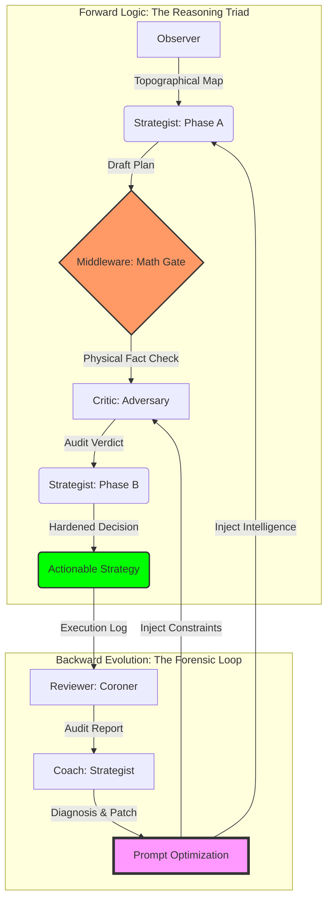

# Strategic Alpha Ledger: The Forensic Trading Machine

> **“不预测行情，只测绘逻辑。”**

这是一个基于物理真相（Physic Truth）与对抗性演化（Adversarial Evolution）构建的多智能体交易系统。它通过“三路推理 (Reasoning Triad)”架构，将极度不确定的市场博弈转化为确定性的物理地形测绘与逻辑审计。

---

## 🏗 架构全景：闭环演化与逻辑枢纽 (The Evolutionary Hub)

系统通过 **前向预测 (Forward Prediction)** 与 **后向演化 (Backward Evolution)** 构建了一个具备自我修复能力的闭环生态：



---

## 🧬 智理引擎：多智能体决策协作协议 (Agentic Collaboration Protocol)

系统各组件通过确定的物理边界与逻辑主权，确保每一棒交接都具备“法医级”的严谨性：

| 执行角色 | 输入信号 (INPUT) | 核心逻辑 (LOGIC?) | 输出产出 (OUTPUT) |
| :--- | :--- | :--- | :--- |
| **Observer** (测绘师) | 原始 K 线 / 流动性资产 | **景观聚合**：识别宏微观地形 Confluence，计算趋势强度。 | 物理地形快照 (Observation) |
| **Strategist (A)** (设计师) | Topographical Map | **构思逻辑**：寻找 HVN 锚点，根据地形初步设计入场轨迹。 | 决策草案 (Draft Plan) |
| **Middleware** (校验门) | Draft + Observation | **物理公证**：计算确定性 RR 与 ATR 距离，强制抹除 LLM 幻觉。 | 数学事实 (Math Fact Check) |
| **Critic** (审判官) | Draft + Math Facts | **对抗审计**：基于《怀疑论》进行压力测试，识别吸收陷阱。 | 审计标签 (Audit Verdict) |
| **Strategist (B)** (觉醒者) | Draft + Critique | **风险收敛**：融合审计意见，执行 DLE 硬化或强制 NEUTRAL。 | 最终执行方案 (Final Decision) |
| **Reviewer** (复盘官) | Decision + T1 Truth | **尸检对比**：量化 PnL 效率，捕捉“逻辑与现实”的偏离。 | 法医复盘报告 (Forensic Report) |
| **Coach** (遗传学家) | Forensic Archives | **进化合成**：识别系统性偏见，生成指令集 (Prompt) 优化方案。 | 演化补丁 (Prompt Patch) |

---

## 🛡 核心硬化盾牌 (Forensic Hardening Mechanism)

为了确保系统在极高波动的加密市场中生存，我们部署了三层“逻辑护甲”：

### 第一层：物理事实真理网关
> **Hallucination Killer**: 禁止 AI 进行任何关键数学计算。由后端 Python 逻辑注入确定性的 RR (盈亏比)、ATR 距离与 Temporal Efficiency (时间效率)，作为 Critic 审计的唯一法定依据。

### 第二层：多模态视觉证伪体系
> **Visual Anchoring**: 所有的推理必须引用视觉快照（Snapshot）中的特征。AI 必须回答：“我看到了 K 线影线在 X 位置的阻力”，而非盲目信任数字，确立“单点真实来源”。

### 第三层：无状态递归相位侦测
> **Deterministic State Machine**: 策略师不再通过复杂的 Context 管理状态，而是直接递归检测 `Draft` 的存在。这使得 Prompt 保持静态且可预测，极大提升了分布式部署的稳定性。

---

## 🚀 运行手册 (Operational Manual)

### 1. 环境准备
```bash
python3 -m venv venv && source venv/bin/activate
pip install -r requirements.txt
# 在 .env 中配置
# BINANCE_API_KEY="..."
# BINANCE_API_SECRET="..."
# GEMINI_API_KEY="..."
# EMAIL_ADDRESS="...@gmail.com"
# EMAIL_APP_PASSWORD="..."
# EMAIL_SMTP_SERVER="smtp.gmail.com"
# EMAIL_SMTP_PORT="587"
```

### 2. 策略执行与回测 (Strategy & Backtest)
*   **单点预测 (Live/Manual)**:
    ```bash
    python3 strategist.py --symbol BTCUSDT --data_root data/live
    ```
*   **历史抽样回测 (Backtest)**:
    ```bash
    # Regime 模式：按市场分层抽样
    python3 backtest.py --sampling 12 --mode regime --start T-24d --data_root data/backtest
    ```
*   **策略回放 (Strategy Replay)**:
    ```bash
    python3 strategist_replay.py --data_root data/backtest --file [JSON_PATH]
    ```

### 3. 法医复盘与取证 (Review & Forensics)
*   **批量生成审计报告**:
    ```bash
    python3 reviewer.py --data_root data/backtest
    ```
*   **复盘回放 (Review Replay)**:
    ```bash
    python3 reviewer_replay.py --data_root data/backtest --file [JSON_PATH]
    ```
*   **可视化看板 (Analytics)**:
    ```bash
    python3 forensic_dashboard.py --symbol BTCUSDT --data_root data/backtest
    ```

### 4. 自动化演化循环 (Evolution Loop)
*   **启动无人守值编排器 (Orchestrator)**:
    ```bash
    # 每 1 小时自动运行一次 观察-决策草案-审计-决策 循环
    python3 pipeline_orchestrator.py --symbol BTCUSDT --interval 1 --data_root data/live
    ```
*   **诊断进化 (Diagnosis)**:
    ```bash
    python3 coach.py --symbol BTCUSDT --data_root data/backtest
    ```
*   **应用补丁 (Apply Patch)**:
    ```bash
    python3 apply_patch.py --file [PATCH_JSON_PATH]
    ```

---

## ⚖️ 我们的哲学
系统不通过“预测”未来获利，而是通过“**精确测绘当前的逻辑陷阱**”获利。每一张单子都是物理事实与对抗性逻辑的结晶。
