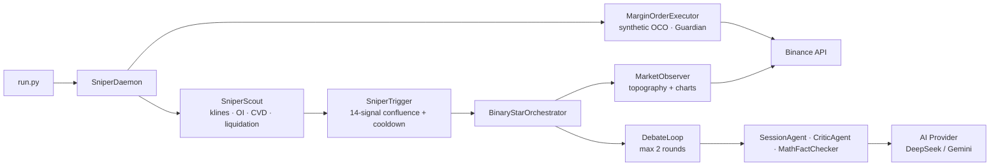
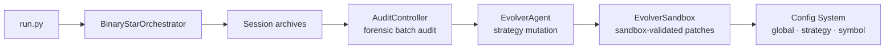
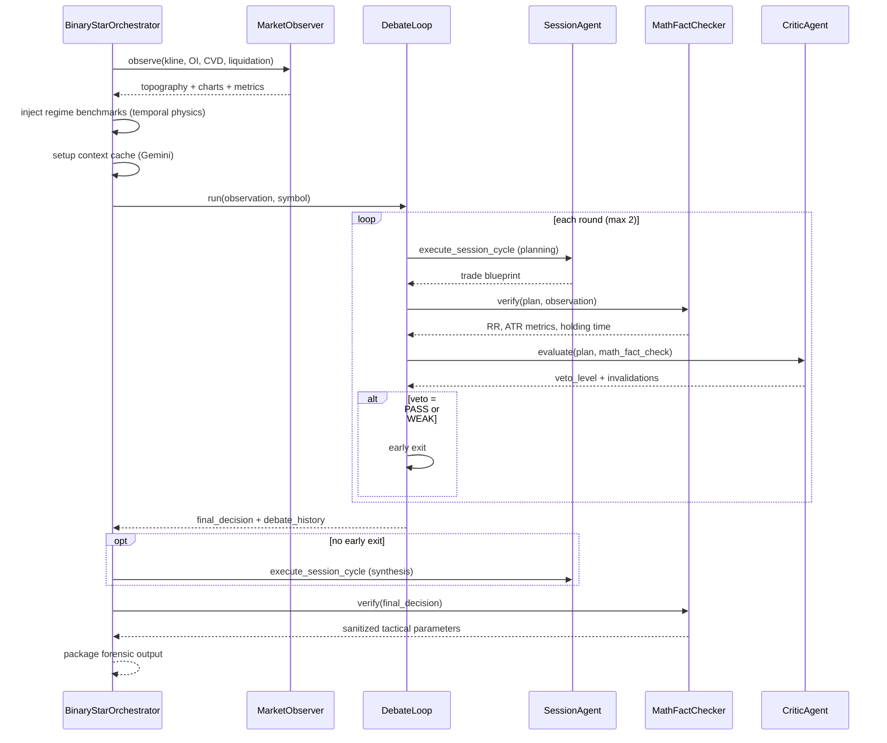
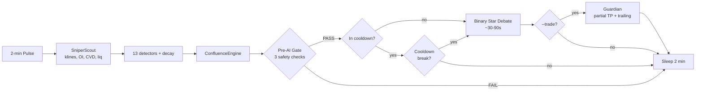
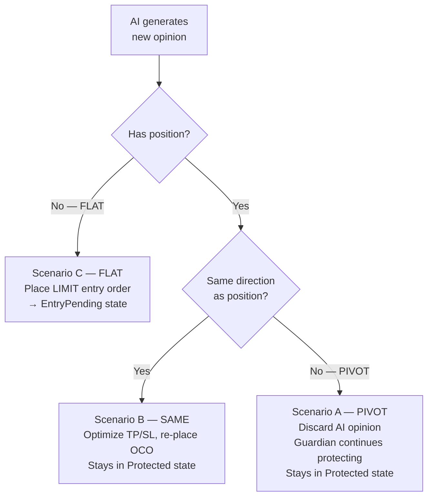
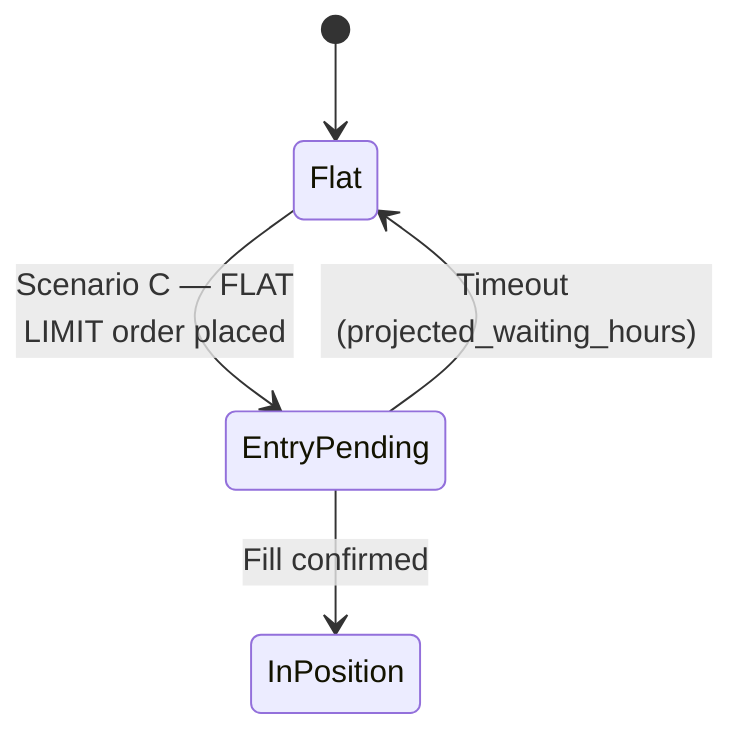
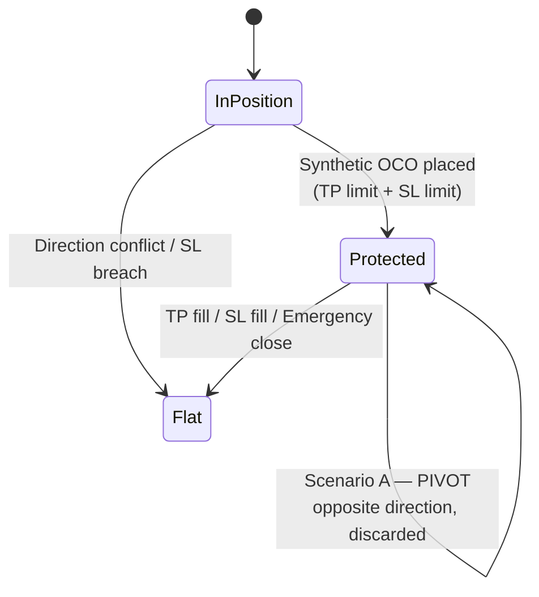
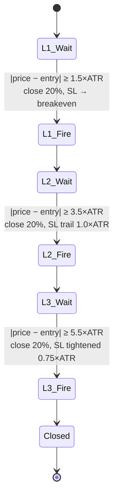
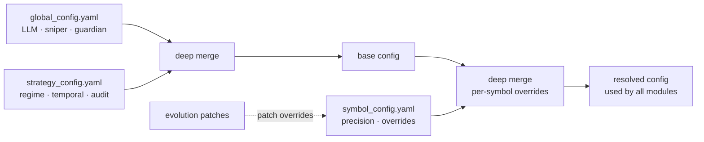

# Singularity

[](https://www.python.org/downloads/)

AI-driven crypto quantitative trading engine. Core innovation is the **Binary Star adversarial protocol**: two LLM agents — a Session Analyst proposing trades and a Critic Agent auditing them — debate in rounds to converge on zero-entropy trade decisions. A lightweight **Sniper daemon** monitors 14 market signals at 2-minute pulses, only activating the heavyweight reasoning engine when signal confluence exceeds a regime-adaptive threshold.

---

## Architecture

Two complementary flows — a signal pipeline and a reasoning/evolution cycle — with no crossed lines in either.

### Signal Pipeline



### Evolution Loop



Config patches feed back into BSO and SniperDaemon on the next pulse.

### Layer Descriptions

| Layer | Module | Role |
|-------|--------|------|
| **Entry** | `run.py`, `run_*.py`, `scripts/` | CLI subcommands, standalone scripts |
| **Orchestration** | `BinaryStarOrchestrator`, `SniperDaemon` | Central wiring of observer → debate → trade lifecycle |
| **Reasoning** | `SessionAgent`, `CriticAgent`, `DebateLoop`, `MathFactChecker` | Adversarial debate with deterministic math anchoring |
| **Sniper** | `SniperScout`, `SniperTrigger`, `MarginOrderExecutor` | Lightweight monitoring, signal stack, position protection |
| **Analyzer** | `MarketObserver`, `VolumeProfile`, `MarketRegime`, `LiquidationEstimator`, `TopographyEngine`, `ChartGenerator` | Market data harvesting and topography computation |
| **Data** | `BinanceFuturesClient`, `BinanceMarginClient`, `AbstractExchangeClient` | Exchange API abstraction (futures + cross-margin) |
| **AI** | `AIFactory`, `DeepSeekAdapter`, `GeminiAdapter` | Provider-agnostic LLM interface with `VisualMode` enum; caching is adapter-internal via `begin_session`/`end_session` |
| **Evolution** | `AuditController`, `AuditAssembler`, `EvolverAgent`, `EvolverSandbox` | Forensic audit → strategy patches |
| **Config** | `Loader`, `SymbolResolver`, `SubConfigs` | YAML resolution with per-symbol overrides |
| **Dashboard** | `server.py` (FastAPI), `api/`, `SessionHTMLRenderer` | Web UI for performance, live sessions, backtest, audit |
| **Utils** | `MathUtils`, `Exceptions`, `RateLimiter`, `Logger`, `Datetime`, `Pipeline` | Cross-cutting utilities |

---

## Binary Star Protocol

The adversarial reasoning engine that produces trade decisions. A Session Analyst proposes, a Critic audits, and a deterministic math checker anchors the debate to verifiable market reality.



### Audit Dimensions

| Dimension | Check | Verdict |
|-----------|-------|---------|
| **RR Ratio** | `\|TP - Entry\| / \|Entry - SL\|` | PASS / FAIL / WARNING |
| **ATR Metrics** | SL distance in ATR, TP distance in ATR | Realistic / Extended / Extreme |
| **Structural Proximity** | SL relative to POC/VAH/VAL | Anchored / Floating / Exposed |
| **Holding Time** | Physics-projected hours to reach TP | Within projected window / Extended |
| **Theta/MAE** | Maximum adverse excursion stress test | Passed / Stressed / Failed |

### Veto Levels

| Level | Meaning | Action |
|-------|---------|--------|
| **PASS** | Plan is logically sound and structurally shielded | Early exit, use as final |
| **WEAK** | Minor concerns, no fatal flaws | Early exit, use as final |
| **OBJECTION** | Material flaw in thesis or risk geometry | Continue debate (send feedback to Session) |
| **VETO** | Fatal logical error, structural violation, or hallucinated prices | Continue debate with strong correction |

---

## Sniper System

A 2-minute pulse daemon that monitors 14 market signals and only activates the Binary Star reasoning engine when signal confluence exceeds a regime-adaptive threshold. When `--trade` is enabled, the Guardian protects open positions with synthetic OCOs, partial take-profits, and dynamic trailing stops.

### Signal Stack (14 Signals × 5 Categories)

| # | Category | Signal | Direction | Confidence | Decay |
|---|----------|--------|-----------|------------|-------|
| 1 | **FLOW** | CVD Momentum | Directional | 0.65 | 15 min |
| 2 | **FLOW** | CVD Divergence | Counter-price | 0.70 | 4 min |
| 3 | **FLOW** | CVD Absorption | Counter-CVD | 0.65 | 10 min |
| 4 | **FLOW** | Taker Imbalance | Directional | 0.60 | 4 min |
| 5 | **ENERGY** | Volatility Surge | CVD/trend-aligned | 0.55 | 20 min |
| 6 | **ENERGY** | Squeeze | Neutral | 0.75 | 20 min |
| 7 | **STRUCTURAL** | Boundary Test | Toward VAH/VAL | 0.50 | 10 min |
| 8 | **STRUCTURAL** | POC Gravity | Toward POC | 0.55 | 10 min |
| 9 | **STRUCTURAL** | Liquidation Hunt | Toward cluster | 0.60 | 10 min |
| 10 | **STRUCTURAL** | Trend Pullback | With trend | 0.75 | 10 min |
| 11 | **POSITIONING** | Retail Extreme | Counter-retail | 0.42 | 60 min |
| 12 | **POSITIONING** | OI Divergence | Counter-price | 0.70 | 15 min |
| 13 | **POSITIONING** | OI Surge | With price+OI | 0.55 | 20 min |
| 14 | **CROSS-SYMBOL** | Leader Sync | Leader-aligned | 0.40 | 8 min |

### Confluence Engine

Signals stack directionally using a **1 − ∏(1 − s·c)** formula — multiple weak signals can reach threshold, while a single strong signal can trigger alone. A noise-cancellation factor `(1 − bullish·bearish)` suppresses contradirectional noise.

**Regime-adaptive thresholds:**

| Regime | Modifier | Effective Threshold | Cooldown |
|--------|----------|--------------------|----------|
| Trending | ×0.85 | 0.289 | 25 min |
| Ranging | ×1.00 | 0.340 | 45 min |
| Squeeze | ×0.75 | 0.255 | 25 min |
| Chaos | ×1.50 | 0.510 | 60 min |

**Outcome-aware cooldown:** The cooldown duration adapts based on the last trigger type:

| Session Outcome | Trigger Type | Cooldown Effect |
|----------------|-------------|-----------------|
| Capital deployed (BULLISH/BEARISH + `--trade`) | `TRADED` | Full regime cooldown (25–60 min) |
| Active position already open | `ACTIVE_POSITION` | Full regime cooldown — Guardian manages |
| AI ran but opinion = NEUTRAL | `NEUTRAL` | **×0.5** shortened (12.5–30 min) — no capital at risk |
| `--llm` observe-only mode | `OBSERVE_ONLY` | **×0.5** shortened — no capital at risk |

**Cooldown break conditions** (bypass remaining cooldown):
- **Stacked signals:** ≥ 3 fresh signals in the same direction (`stacked_break_count`)
- **Strength ratio:** Any fresh signal's weighted score > 1.8× last trigger score (`break_on_strength_ratio`)
- **Minimum gap:** 10 minutes must have elapsed since last trigger (`break_min_gap_minutes`) — hard floor

**Emergency override:** Any single signal with raw strength ≥ 0.80 bypasses cooldown and threshold entirely.

**Cooldown auto-reset:** When the Guardian clears a trade state (entry expired or position closed), cooldown is immediately reset — the bot has no capital at risk and is ready for new signals on the next pulse. Emergency close paths do NOT trigger this reset.

### Trigger Diagnostics

Every pulse logs a compact **SIGNAL DIAG** line showing all detector key metrics — fired strength for active detectors, rejection reason (vs threshold) for silent ones. Enables tuning without re-running full traces.

### Sniper Pulse Flow



### Guardian: Position Protection

Every pulse with `--trade` enabled, the Guardian runs for each symbol with an open position:

| Case | Condition | Action |
|------|-----------|--------|
| — | No trade state (daemon restart) | Reconstruct from exchange — detect pending LIMIT orders or existing OCO |
| 1 | No position — entry pending | Cancel if timeout exceeded (`projected_waiting_hours`) |
| 2 | Direction conflict (intent ≠ net_qty sign) | Cancel all orders; next pulse Case 3 emergency-closes the position |
| 3 | Position unprotected (no OCO) | Place synthetic OCO (TP limit + SL limit). **SL-breach guard:** skip if ticker = 0 or None; emergency close if price already past SL |
| 4 | Position protected | OCO qty re-alignment → multi-level partial TP → dynamic trailing SL |

**Partial TP Levels** (sequential, fire when `\|price − entry\| ≥ N × ATR`):

| Level | ATR Threshold | Close % | SL Behavior |
|-------|---------------|---------|-------------|
| L1 | 1.5 × ATR | 20% | SL → breakeven (entry) |
| L2 | 3.5 × ATR | 20% | SL trailing (1.0 × ATR distance) |
| L3 | 5.5 × ATR | 20% | SL tightened (0.75 × ATR distance) |

**Dynamic trailing:** `new_sl = max(current_sl, price − N×ATR)` for LONG, `min(current_sl, price + N×ATR)` for SHORT. Distance `N` comes from the active partial-TP level's `sl_distance_atr`.

**Emergency-close invariant:** Any OCO cancellation that fails to re-place triggers an immediate market close. No position is ever left naked — the sentinel `-1` return value signals the daemon to clear trade state.

### Order Lifecycle

When the AI generates a new opinion, the system follows one of three scenarios:



The state transitions below show the detailed mechanics. TP progression is in the next section.

#### Entry Flow



#### Position Management



Partial take-profit closes from the Protected state are detailed in the next diagram.

#### Partial TP Sequence (3 progressive levels)



### Cross-Symbol Leader Sync

When a symbol triggers, correlated followers receive a boost signal:
- **XAUTUSDT** → correlation 0.40 with BTCUSDT

The boost re-evaluates confluence for the follower — if it tips over threshold, the follower also triggers an AI session.

---

## Installation & Setup

```bash
# 1. Clone and install
git clone <repo-url> && cd crypto

# 2. Create virtual environment
python3.12 -m venv venv && source venv/bin/activate

# 3. Install project (editable mode) + dependencies from pyproject.toml
pip install -e .

# Optional: include dev dependencies (pytest, etc.)
# pip install -e ".[dev]"

# 4. Configure environment
cp .env.example .env
# Edit .env with your keys:
#   BINANCE_API_KEY, BINANCE_API_SECRET
#   DEEPSEEK_API_KEY / GEMINI_API_KEY
#   EMAIL_* (optional, for session notifications)

# 5. Configure per-symbol trading parameters
# Edit config/symbol_config.yaml — ensure precision_qty, precision_price,
# min_order_qty, and sl_slippage_buffer are set for each symbol you trade.
```

**Data directory structure** (auto-created under `data/prod/`):
```
data/prod/
├── sessions/        # Session JSON archives
├── klines/          # Chart PNGs
├── audits/          # Audit reports
├── evolution/       # Evolution proposals and sandbox results
├── html/            # Rendered email previews
├── market/          # Historical market observation snapshots
├── session.log      # Session engine logs
├── sniper.log       # Sniper daemon logs
├── audit.log        # Audit worker logs
├── .sniper_alive.json           # Lightweight heartbeat (zero API calls)
├── .sniper_heartbeat.json       # Guardian heartbeat (balance + positions)
├── .sniper_daemon_status.json   # Daemon status (runtime metadata)
├── .session_run_status.json     # Session run progress
└── .backtest_status.json        # Backtest run progress
```

---

## Commands

### `run.py` — Unified CLI

```bash
# Live Binary Star analysis cycle
python run.py session --symbol BTC -p data/prod
python run.py session --symbol BTC --write_status -p data/prod

# Sniper monitoring daemon
python run.py sniper --symbol BTC -p data/prod                          # observe-only
python run.py sniper --symbol BTC --llm -p data/prod                    # AI sessions, no trade
python run.py sniper --symbol BTC --trade -p data/prod                  # live margin trading
python run.py sniper --symbol BTC --trade 1000 -p data/prod            # manual balance override
python run.py sniper --symbol "BTC,XAUT" --trade -p data/prod      # multi-symbol

# Historical backtest
python run.py backtest-run --symbol BTCUSDT --timestamp "2025-01-15T14:00:00Z" -p data/prod
python run.py backtest-run --symbol BTCUSDT --start T-30d --end now --samples 50 -p data/prod
python run.py backtest-run --symbol BTCUSDT --write_status -p data/prod     # dashboard mode

# Forensic audit
python run.py audit -p data/prod                                        # batch all sessions
python run.py audit -f data/prod/sessions/BTCUSDT_20250115.json -p data/prod  # single
python run.py audit --symbol BTC -p data/prod                           # filter by symbol
python run.py audit --symbol BTC --force -p data/prod                   # bypass dedup

# Strategy evolution
python run.py evolution --symbol BTC --samples 100 -p data/prod

# Apply evolution patches
python run.py patch -f data/prod/evolution/proposal_001.json
python run.py patch -f data/prod/evolution/proposal_001.json --symbol XAUT
```

### Standalone Scripts

```bash
# Direct invocation (same args as run.py subcommands)
python run_session.py --symbol BTC -p data/prod
python run_sniper.py --symbol BTC --trade -p data/prod
python run_backtest.py --symbol BTCUSDT --start T-30d --end now --samples 50 -p data/prod
python run_audit.py -p data/prod
python run_evolution.py --symbol BTC --samples 100 -p data/prod
python run_patch.py -f data/prod/evolution/proposal_001.json --symbol BTC
```

### Utility Scripts (`scripts/`)

| Script | Description |
|--------|-------------|
| `scripts/archive_sessions.py -p <path> -v <version>` | Archive old session JSONs to versioned subdirectories |
| `scripts/calculate_qty.py -f <session.json> -b <balance>` | Calculate position size from session tactical parameters |
| `scripts/check_margin_state.py --symbol BTC` | Inspect Binance cross-margin state, positions, orders |
| `scripts/clean_neutral_sessions.py -p <path>` | Remove sessions where opinion was NEUTRAL (cleanup) |
| `scripts/clean_version_sessions.py -p <path> -v <version>` | Remove sessions from a specific software version |
| `scripts/clean_orphan_artifacts.py -p <path>` | Delete kline/audit/HTML files with no matching session |
| `scripts/export_session.py -f <report.json> -p <path>` | Extract a session from a forensic report |
| `scripts/market_recon.py --symbol BTC -p <path>` | Quick topography snapshot without AI inference |
| `scripts/render_email_html.py -f <session.json> -p <path>` | Render session notification HTML for debugging |
| `scripts/sandbox_offline.py -f <sandbox.json> -p <path>` | Re-run sandbox validation offline |
| `scripts/sandbox_online.py -f <proposal.json> -p <path>` | Run evolver sandbox against live paper account |

### Dashboard

A web UI served by FastAPI at `http://localhost:8080`:

```bash
python -m src.dashboard.server --host 127.0.0.1 --port 8080 --data-root data/prod
```

| Page | Route | Description |
|------|-------|-------------|
| Performance | `/performance` | Aggregated KPIs, PnL, win rate, equity curve |
| Live | `/live` | Live daemon status, active sessions, guardian state |
| Development | `/development` | Development diagnostics and controls |
| Sessions | `/sessions/{filename}` | Individual session detail reports |
| Audits | `/audits/{filename}` | Individual audit detail reports |

The dashboard requires user authentication via `config/auth/users.json` with role-based permissions. Access the API directly at `/api/*` endpoints for sessions, audits, sniper, and backtest operations.

---

## AI Providers

| Provider | Model | Vision | Context Cache | Architecture | Notes |
|----------|-------|--------|---------------|-------------|-------|
| **DeepSeek** (active) | `deepseek-v4-pro` | ❌ | ❌ | OpenAI-compatible (`DeepSeekAdapter`) | Thinking/reasoning models (`reasoning_effort: high`), lowest cost |
| **Gemini** | `gemini-3.5-flash` | ✅ | ✅ (internal) | Native `google-genai` SDK | Native multimodal; caching via `begin_session`/`end_session` lifecycle |

Provider is selected via `llm.active_provider` in `config/global_config.yaml`. Temperature is configured per-agent under `binary_star` (`session_temperature`, `critic_temperature`) and `evolver` (`evolver_temperature`), not per-provider. All agents are provider-agnostic — no agent code imports a provider SDK.

**Provider-agnostic types:** `AbstractAIClient.generate_content()` returns `AIResponse` containing `text`, `tool_calls`, `usage`, and optional `reasoning_content` (DeepSeek thinking models). Each adapter declares its `VisualMode` (NONE/TEXT/IMAGE) — the orchestrator reads this to decide how to deliver chart data. Visual data is passed as `VisualPart` (mime_type + raw bytes). Session lifecycle is managed via `begin_session()` / `end_session()` — adapters use these for cache creation/teardown without the orchestrator knowing the caching mechanism.

---

## Config System

```
config/
├── global_config.yaml     # LLM, trade management, sniper, guardian, binary_star, evolver, sandbox
├── strategy_config.yaml   # Analysis windows, topography, regime, temporal physics, audit
├── symbol_config.yaml     # Per-symbol precision + strategy overrides
├── visual_config.yaml     # Chart colors, rendering parameters, liquidation heatmap
├── prompts/
│   ├── binary_star.md     # Shared system instruction (both agents)
│   ├── session.md         # Session Analyst role prompt
│   ├── critic.md          # Critic Agent role prompt
│   └── evolver.md         # Evolver Agent role prompt
├── auth/                  # API credentials / user permissions (gitignored)
```

### Resolution Order



**Per-symbol overrides:** `symbol_config.yaml` entries (e.g., `XAUTUSDT.overrides`) are deep-merged onto the corresponding base config sections. This allows per-instrument tuning of regime thresholds, volatility parameters, CVD sensitivity, and sniper probe thresholds without duplicating config files. Override keys mirror the base config structure exactly.

---

## Key Invariants

### OCO Lifecycle
- Entry → LIMIT order placed, Guardian tracks by `entry_order_id`
- Fill → synthetic OCO placed (TP limit + SL limit, two independent orders)
- Protection → Guardian cross-manages: if one fills, cancel the other
- Trailing → cancel old SL → place new SL → if fail, emergency market close
- **OCO replace:** Cancel old OCO first → verify position → place new OCO. If cancel fails → original protection remains. If cancel succeeds but new OCO fails → emergency market close. A brief naked window exists between cancel and re-place; the emergency-close path is the safety net

### Guardian
- **No naked positions.** Any OCO re-place failure triggers immediate market close
- **SL breach on protection:** If price has already passed SL when OCO is about to be placed, market close. **Guard:** ticker_price == 0 skips SL-breach check (defers to next pulse)
- **Direction sanity:** If `trade_state.direction` disagrees with actual position (`net_qty` sign), all orders are cancelled — the position goes naked, next pulse re-protects or emergency-closes
- **Partial TP is sequential.** Level N fires only after Level N−1. Multiple levels can fire in a single pulse
- **SL migrates to breakeven after L1.** Then trails with distance from the active level's config
- **`find_level_and_sync_sl`** returns `0` after emergency close — daemon resets level tracking rather than storing stale state
- **Post-restart reconstruction:** On daemon restart with empty `trade_state`, Guardian detects pending LIMIT orders or existing positions on the exchange and reconstructs trade state from exchange data

### Circuit Breaker
- 3 consecutive session failures → `RuntimeError`, pipeline halted, alert notification sent
- Per-symbol trade state is in-memory only — lost on daemon restart, reconstructed from exchange on next pulse

### State Lockouts
- Structural signals (boundary test, POC gravity) locked for 8 hours after firing → prevents spam loops
- Liquidation clusters locked per price zone (nearest $100) for 8 hours
- Ambient sentiment (retail extreme) locked for 8 hours

### Entry Timeout
- If an entry LIMIT order doesn't fill within `projected_waiting_hours` (from session agent), Guardian cancels it, clears trade state, and resets cooldown

### Synthetic OCO (not native)
- Binance Spot Margin (SAPI) does not expose OCO/OTOCO endpoints. The system places two independent LIMIT orders and cross-manages them in Guardian

### Config Safety
- Symbols not in `symbol_config.yaml` are rejected by the order executor — no implicit defaults
- `net_qty_tolerance` (1e-5) defines FLAT: positions below this are considered closed

### FIFO Entry Price
- Average entry price is calculated FIFO via trade history. BUYs open lots, SELLs close oldest lots first. Cached per symbol, invalidated when `net_qty` changes
