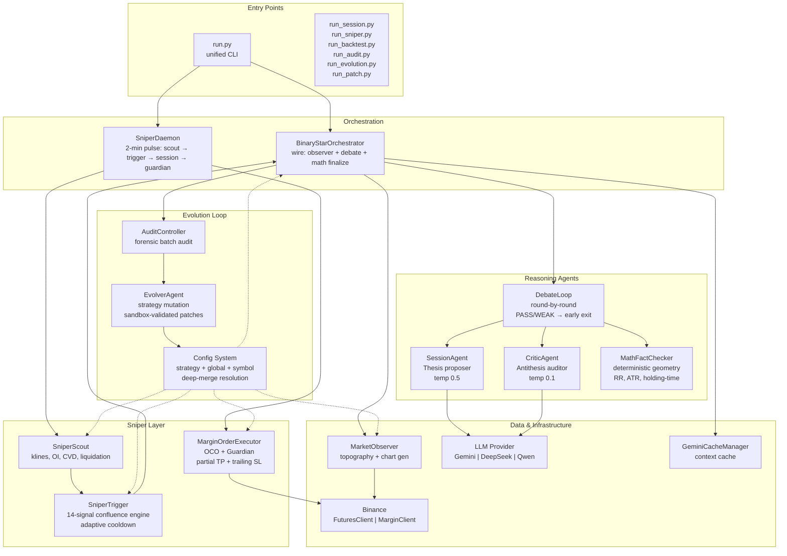
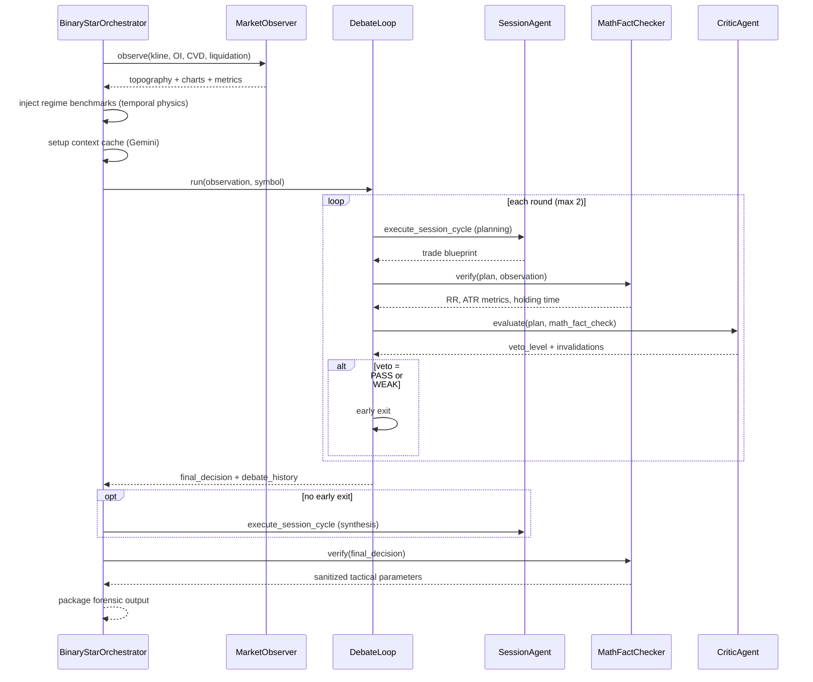
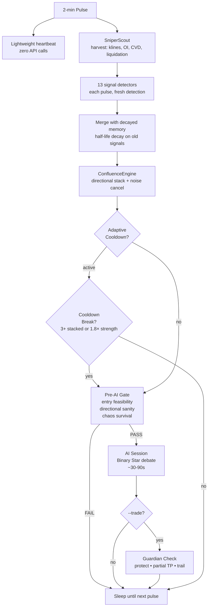
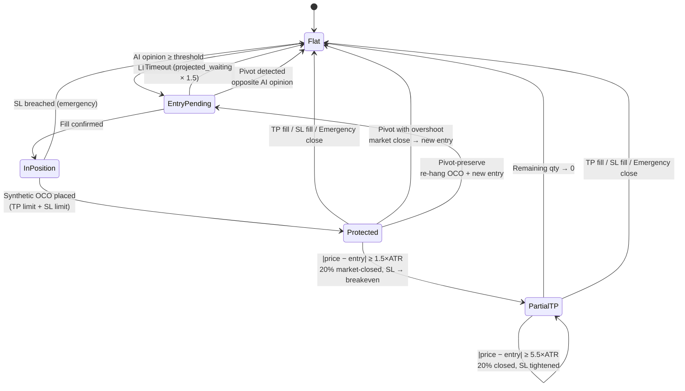
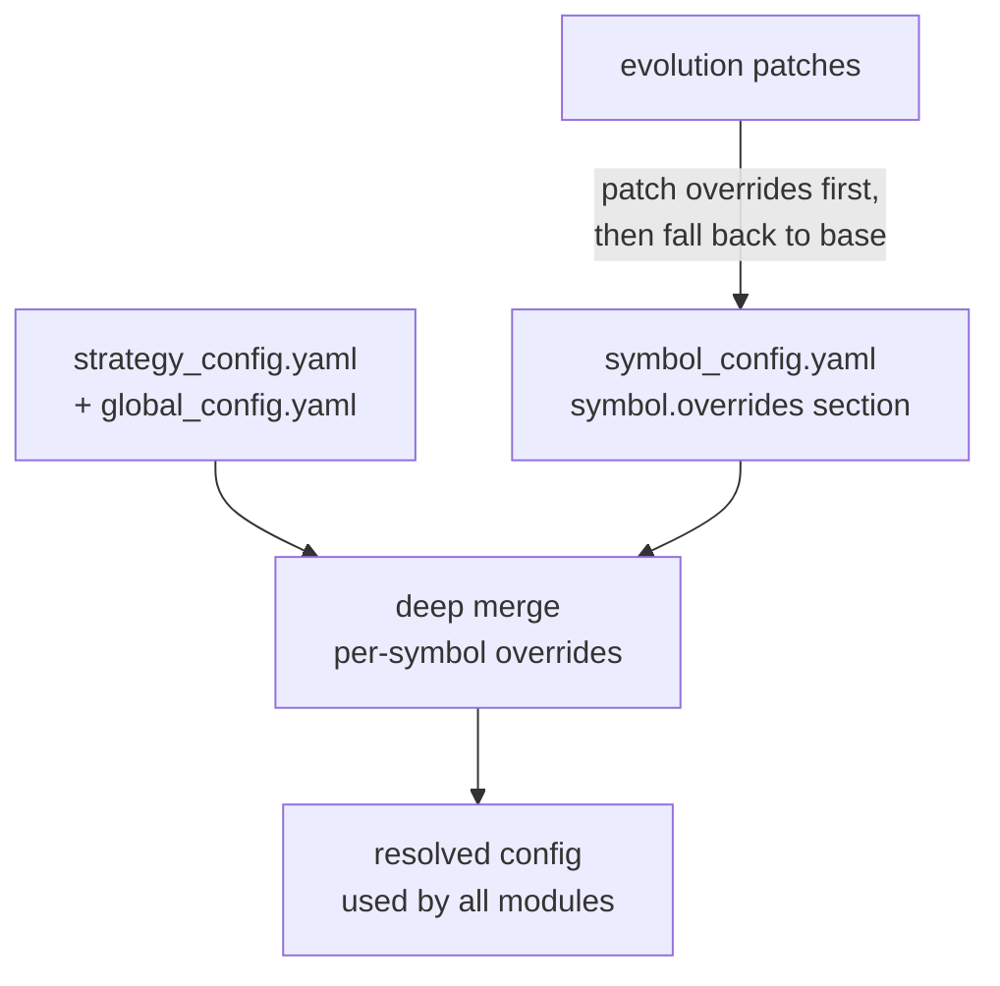

# Singularity

[](https://www.python.org/downloads/)

AI-driven crypto quantitative trading engine. Core innovation is the **Binary Star adversarial protocol**: two LLM agents — a Session Analyst proposing trades and a Critic Agent auditing them — debate in rounds to converge on zero-entropy trade decisions. A lightweight **Sniper daemon** monitors 14 market signals at 2-minute pulses, only activating the heavyweight reasoning engine when signal confluence exceeds a regime-adaptive threshold.

---

## Architecture



### Layer Descriptions

| Layer | Module | Role |
|-------|--------|------|
| **Entry** | `run.py`, `run_*.py`, `scripts/` | CLI subcommands, standalone scripts |
| **Orchestration** | `BinaryStarOrchestrator`, `SniperDaemon` | Central wiring of observer → debate → trade lifecycle |
| **Reasoning** | `SessionAgent`, `CriticAgent`, `DebateLoop`, `MathFactChecker` | Adversarial debate with deterministic math anchoring |
| **Sniper** | `SniperScout`, `SniperTrigger`, `MarginOrderExecutor` | Lightweight monitoring, signal stack, position protection |
| **Analyzer** | `MarketObserver`, `VolumeProfile`, `MarketRegime`, `LiquidationEstimator`, `TopographyEngine`, `ChartGenerator` | Market data harvesting and topography computation |
| **Data** | `BinanceFuturesClient`, `BinanceMarginClient`, `AbstractExchangeClient` | Exchange API abstraction |
| **AI** | `AIFactory`, adapters for Gemini/DeepSeek/Qwen, `GeminiCacheManager` | Provider-agnostic LLM interface, context caching |
| **Evolution** | `AuditController`, `AuditAssembler`, `EvolverAgent`, `EvolverSandbox` | Forensic audit → strategy patches |
| **Config** | `Loader`, `SymbolResolver`, `SubConfigs` | YAML resolution with per-symbol overrides |
| **Dashboard** | `server.py`, `api/`, `SessionHTMLRenderer` | Web UI for session/sniper/backtest/audit |
| **Utils** | `MathUtils`, `Exceptions`, `RateLimiter`, `Logger`, `Datetime`, `Pipeline` | Cross-cutting utilities |

---

## Binary Star Protocol

The adversarial reasoning engine that produces trade decisions. A Session Analyst proposes, a Critic audits, and a deterministic math checker anchors the debate to verifiable market reality.



### Audit Dimensions

| Dimension | Check | Verdict |
|-----------|-------|---------|
| **RR Ratio** | `|TP - Entry| / |Entry - SL|` | PASS / FAIL / WARNING |
| **ATR Metrics** | SL distance in ATR, TP distance in ATR | Realistic / Extended / Extreme |
| **Structural Proximity** | SL relative to POC/VAH/VAL | Anchored / Floating / Exposed |
| **Holding Time** | Physics-projected hours to reach TP | Within projected window / Extended |
| **Theta/MAE** | Maximum adverse excursion stress test | Passed / Stressed / Failed |

### Veto Levels

| Level | Meaning | Action |
|-------|---------|--------|
| **PASS** | Plan is logically sound and structurally shielded | Early exit, use as final |
| **WEAK** | Minor concerns, no fatal flaws | Early exit, use as final |
| **OBJECTION** | Material flaw in thesis or risk geometry | Continue debate (send feedback to Session) |
| **VETO** | Fatal logical error, structural violation, or hallucinated prices | Continue debate with strong correction |

---

## Sniper System

A 2-minute pulse daemon that monitors 14 market signals and only activates the Binary Star reasoning engine when signal confluence exceeds a regime-adaptive threshold. When `--trade` is enabled, the Guardian protects open positions with synthetic OCOs, partial take-profits, and dynamic trailing stops.

### Signal Stack (14 Signals × 5 Categories)

| # | Category | Signal | Direction | Confidence | Decay |
|---|----------|--------|-----------|------------|-------|
| 1 | **FLOW** | CVD Momentum | Directional | 0.65 | 15 min |
| 2 | **FLOW** | CVD Divergence | Counter-price | 0.70 | 4 min |
| 3 | **FLOW** | CVD Absorption | Counter-CVD | 0.65 | 10 min |
| 4 | **FLOW** | Taker Imbalance | Directional | 0.60 | 4 min |
| 5 | **ENERGY** | Volatility Surge | CVD/trend-aligned | 0.55 | 20 min |
| 6 | **ENERGY** | Squeeze | Neutral | 0.75 | 20 min |
| 7 | **STRUCTURAL** | Boundary Test | Toward VAH/VAL | 0.50 | 10 min |
| 8 | **STRUCTURAL** | POC Gravity | Toward POC | 0.55 | 10 min |
| 9 | **STRUCTURAL** | Liquidation Hunt | Toward cluster | 0.60 | 10 min |
| 10 | **STRUCTURAL** | Trend Pullback | With trend | 0.75 | 10 min |
| 11 | **POSITIONING** | Retail Extreme | Counter-retail | 0.42 | 60 min |
| 12 | **POSITIONING** | OI Divergence | Counter-price | 0.70 | 15 min |
| 13 | **POSITIONING** | OI Surge | With price+OI | 0.55 | 20 min |
| 14 | **CROSS-SYMBOL** | Leader Sync | Leader-aligned | 0.40 | 8 min |

### Confluence Engine

Signals stack directionally using a **1 − ∏(1 − s·c)** formula — multiple weak signals can reach threshold, while a single strong signal can trigger alone. A noise-cancellation factor `(1 − bullish·bearish)` suppresses contradirectional noise.

**Regime-adaptive thresholds:**

| Regime | Modifier | Effective Threshold | Cooldown |
|--------|----------|--------------------|----------|
| Trending | ×0.85 | 0.298 | 25 min |
| Ranging | ×1.00 | 0.350 | 45 min |
| Squeeze | ×0.75 | 0.263 | 25 min |
| Chaos | ×1.50 | 0.525 | 60 min |

**Emergency override:** Any single signal with raw strength ≥ 0.80 bypasses cooldown and threshold.

### Sniper Pulse Flow



### Guardian: Position Protection

Every pulse with `--trade` enabled, the Guardian runs for each symbol with an open position:

| Step | Check | Action |
|------|-------|--------|
| 1 | Entry order pending | Cancel if timeout exceeded |
| 2 | Position unprotected (no OCO) | Place synthetic OCO (TP limit + SL limit) |
| 3 | SL breached (price past SL) | Emergency market close |
| 4 | Position protected | Multi-level partial TP + dynamic trailing SL |

**Partial TP Levels** (sequential, fire when `|price − entry| ≥ N × ATR`):

| Level | ATR Threshold | Close % | SL Behavior |
|-------|---------------|---------|-------------|
| L1 | 1.5 × ATR | 20% | SL → breakeven (entry) |
| L2 | 3.5 × ATR | 20% | SL trailing (1.0 × ATR distance) |
| L3 | 5.5 × ATR | 20% | SL tightened (0.75 × ATR distance) |

**Dynamic trailing:** `new_sl = max(current_sl, price − N×ATR)` for LONG, `min(current_sl, price + N×ATR)` for SHORT. Distance `N` comes from the active partial-TP level's `sl_distance_atr`.

**Emergency-close invariant:** Any OCO cancellation that fails to re-place triggers an immediate market close. No position is ever left naked — the sentinel `-1` return value signals the daemon to clear trade state.

### Order Lifecycle



### Cross-Symbol Leader Sync

When a symbol triggers, correlated followers receive a boost signal:
- **ETHUSDT** → correlation 0.75 with BTC
- **XAUTUSDT** → correlation 0.40 with BTC

The boost re-evaluates confluence for the follower — if it tips over threshold, the follower also triggers an AI session.

---

## Installation & Setup

```bash
# 1. Clone and install
git clone <repo-url> && cd crypto

# 2. Create virtual environment
python3.12 -m venv venv && source venv/bin/activate
pip install -r requirements.txt

# 3. Configure environment
cp .env.example .env
# Edit .env with your keys:
#   BINANCE_API_KEY, BINANCE_API_SECRET
#   GEMINI_API_KEY / DEEPSEEK_API_KEY / QWEN_API_KEY
#   EMAIL_* (optional, for session notifications)

# 4. Configure per-symbol trading parameters
# Edit config/symbol_config.yaml — ensure precision_qty, precision_price,
# min_order_qty, and sl_slippage_buffer are set for each symbol you trade.
```

**Data directory structure** (auto-created under `data/prod/`):
```
data/prod/
├── sessions/        # Session JSON archives
├── klines/           # Chart PNGs
├── audits/           # Audit reports
├── evolution/        # Evolution proposals
├── session.log       # Session engine logs
├── sniper.log        # Sniper daemon logs
├── audit.log         # Audit worker logs
├── .sniper_alive.json      # Lightweight heartbeat
├── .sniper_heartbeat.json  # Guardian heartbeat
└── .sniper_daemon_status.json  # Daemon status
```

---

## Commands

### `run.py` — Unified CLI

```bash
# Live Binary Star analysis cycle
python run.py session --symbol BTC -p data/prod
python run.py session --symbol BTC --write_status -p data/prod

# Sniper monitoring daemon
python run.py sniper --symbol BTC -p data/prod                          # observe-only
python run.py sniper --symbol BTC --llm -p data/prod                    # AI sessions, no trade
python run.py sniper --symbol BTC --trade -p data/prod                  # live margin trading
python run.py sniper --symbol BTC --trade 1000 -p data/prod            # manual balance override
python run.py sniper --symbol "BTC,ETH,XAUT" --trade -p data/prod      # multi-symbol

# Historical backtest
python run.py backtest-run --symbol BTC --timestamp "2025-01-15T14:00:00Z" -p data/prod
python run.py backtest-run --symbol BTC --start T-30d --end now --samples 50 -p data/prod
python run.py backtest-run --symbol BTC --write_status -p data/prod     # dashboard mode

# Forensic audit
python run.py audit -p data/prod                                        # batch all sessions
python run.py audit -f data/prod/sessions/BTCUSDT_20250115.json -p data/prod  # single
python run.py audit --symbol BTC -p data/prod                           # filter by symbol
python run.py audit --symbol BTC --force -p data/prod                   # bypass dedup

# Strategy evolution
python run.py evolution --symbol BTC --samples 100 -p data/prod

# Apply evolution patches
python run.py patch -f data/prod/evolution/proposal_001.json
python run.py patch -f data/prod/evolution/proposal_001.json --symbol XAUT
```

### Standalone Scripts

```bash
# Direct invocation (same args as run.py subcommands)
python run_session.py --symbol BTC -p data/prod
python run_sniper.py --symbol BTC --trade -p data/prod
python run_backtest.py --symbol BTC --start T-30d --end now --samples 50 -p data/prod
python run_audit.py -p data/prod
python run_evolution.py --symbol BTC --samples 100 -p data/prod
python run_patch.py -f data/prod/evolution/proposal_001.json --symbol BTC
```

### Utility Scripts (`scripts/`)

| Script | Description |
|--------|-------------|
| `scripts/archive_sessions.py` | Archive old session JSONs to dated subdirectories |
| `scripts/calculate_qty.py --symbol BTC --entry 90000 --sl 89500` | Calculate position size from risk parameters |
| `scripts/check_margin_state.py --symbol BTC` | Inspect Binance cross-margin state, positions, orders |
| `scripts/clean_neutral_sessions.py` | Remove sessions where opinion was NEUTRAL (cleanup) |
| `scripts/export_session.py` | Export a session JSON to readable format |
| `scripts/market_recon.py` | Quick topography snapshot without AI inference |
| `scripts/render_email_html.py` | Render session notification HTML for debugging |
| `scripts/sandbox_offline.py` | Run evolver sandbox simulations offline |
| `scripts/sandbox_online.py` | Run evolver sandbox against live paper account |

---

## AI Providers

| Provider | Model | Vision | Context Cache | Notes |
|----------|-------|--------|---------------|-------|
| **Gemini** | `gemini-3.5-flash` | ✅ | ✅ | Native multimodal, context caching for lower cost |
| **DeepSeek** | `deepseek-v4-pro` | ❌ | ❌ | Thinking/reasoning models, lowest cost |
| **Qwen** | `qwen3.7-max` | ❌ | ❌ | Strong on structured JSON output |

Provider is selected via `llm.active_provider` in `config/global_config.yaml`. Each provider has independent model, temperature, and timeout settings.

**Abstract interface:** All providers implement `AbstractAIClient.generate_content()` — agents are decoupled from SDKs via provider-agnostic `AIResponse`, `ToolCall`, `VisualPart`, and `UsageMetadata` types.

---

## Config System

```
config/
├── global_config.yaml     # LLM, sniper, guardian, binary_star, evolver, sandbox, trade
├── strategy_config.yaml   # Analysis windows, topography, regime, structural nodes
├── symbol_config.yaml     # Per-symbol precision + strategy overrides
├── visual_config.yaml     # Chart colors, rendering parameters
├── prompts/
│   ├── binary_star.md     # Shared system instruction (both agents)
│   ├── session.md         # Session Analyst role prompt
│   ├── critic.md          # Critic Agent role prompt
│   └── evolver.md         # Evolver Agent role prompt
└── auth/                  # API credentials (gitignored)
```

### Resolution Order



**Per-symbol overrides:** `symbol_config.yaml` entries (e.g., `XAUTUSDT.overrides`) are deep-merged onto the corresponding base config sections. This allows per-instrument tuning of regime thresholds, volatility parameters, CVD sensitivity, and sniper probe thresholds without duplicating config files.

---

## Key Invariants

### OCO Lifecycle
- Entry → LIMIT order placed, Guardian tracks by `entry_order_id`
- Fill → synthetic OCO placed (TP limit + SL limit, two independent orders)
- Protection → Guardian cross-manages: if one fills, cancel the other
- Trailing → cancel old SL → place new SL → if fail, emergency market close

### Guardian
- **No naked positions.** Any OCO re-place failure triggers immediate market close
- **SL breach on protection:** If price has already passed SL when OCO is about to be placed, market close
- **Partial TP is sequential.** Level N fires only after Level N−1. Multiple levels can fire in a single pulse
- **SL migrates to breakeven after L1.** Then trails with distance from the active level's config

### Circuit Breaker
- 3 consecutive session failures → `RuntimeError`, pipeline halted, alert notification sent
- Per-symbol trade state is in-memory only — lost on daemon restart, reconstructed from exchange on next pulse

### State Lockouts
- Structural signals (boundary test, POC gravity) locked for 8 hours after firing → prevents spam loops
- Liquidation clusters locked per price zone (nearest $100) for 8 hours
- Ambient sentiment (retail extreme) locked for 8 hours

### Entry Timeout
- If an entry LIMIT order doesn't fill within `projected_waiting_hours`, Guardian cancels it and clears trade state
- Hard timeout: projected_holding × 1.5 further enforced by time-stop check

### Synthetic OCO (not native)
- Binance Spot Margin (SAPI) does not expose OCO/OTOCO endpoints. The system places two independent LIMIT orders and cross-manages them in Guardian

### Config Safety
- Symbols not in `symbol_config.yaml` are rejected by the order executor — no implicit defaults
- `net_qty_tolerance` (1e-5) defines FLAT: positions below this are considered closed

---

## Dashboard

A web UI (Bottle server) accessible at `http://localhost:8080`:

| Page | Route | Description |
|------|-------|-------------|
| Sessions | `/` | Session history, detailed reports, charts |
| Sniper | `/sniper` | Live daemon status, heartbeats, active session progress |
| Backtest | `/backtest` | Batch backtest controls and results |
| Audit | `/audit` | Audit report browser |

Start with: `python -m src.dashboard.server` (serves from `data/prod/`).
