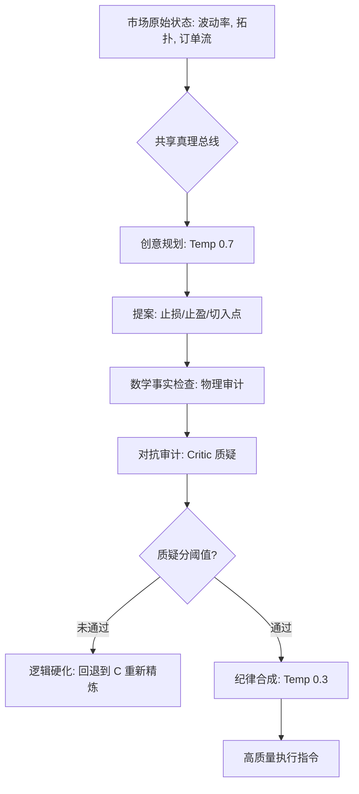

# 🌌 Singularity Session Engine (v6.1)

[](https://www.python.org/downloads/)

> **"Trading is not a game of predicting the future; it is a game of surviving the present."**
> 
> Singularity is a multi-agent quantitative architecture that eliminates human bias through **Adversarial Reasoning**. It doesn't just "guess" where the price goes—it puts every trade on trial before a single dollar is risked.

---

## ⚖️ System Design: The Adversarial Courtroom

Singularity operates like a high-stakes courtroom trial. A trade only moves from an idea to an execution if it survives a rigorous cross-examination.

### 1. 📂 The Witness (Market Observer)
*   **Role**: Gathers the physical facts.
*   **Action**: Scans the market's "topography"—identifying where the big money is sitting (Volume Profile), how fast the price is moving (Volatility), and who is in control (CVD Sentiment).

### 2. 🛡️ The Defense (Session Analyst)
*   **Role**: Proposes a "Thesis" (The Trade).
*   **Action**: Looks at the facts and argues: *"We should go Long at 66,500 because we are at a major support level."*

### 3. 🔍 The Prosecution (Skeptical Critic)
*   **Role**: The Logical Auditor.
*   **Action**: Its only job is to **find holes** in the Session Analyst's plan.

### 4. 📐 The Evidence (Math Fact Check)
*   **Role**: The Immutable Law.
*   **Action**: A cold, Python-based calculator that checks the agents' work with 100% mathematical precision.

---

## 🌟 双子星系统 (Binary Star System): 深度逻辑与收敛机制

双子星系统是 Singularity 的核心决策引擎，旨在通过多智能体的对抗博弈，将模糊的市场状态收敛为高质量、高确定性的执行方案。

### 1. 核心架构：共享真理总线 (Shared Truth Bus)
为了防止智能体在推理过程中产生“幻觉”或“逻辑漂移”，系统引入了 **Truth Bus (共享上下文缓存)**：
- **多模态对齐**：所有的市场拓扑数据（Volume Profile, ATR, CVD）和 K 线图视觉资产在一次性读取后被缓存。
- **物理锚定**：Session Analyst 和 Critic Agent 共享完全相同的物理环境快照，确保辩论建立在同一套“物理规律”之上。

### 2. 对抗性博弈逻辑 (Adversarial Debate Protocol)
系统的决策过程并非单次推理，而是一个循环迭代的硬化过程：
- **Phase A (Planning)**：Session Agent (Thesis) 提出初始战术方案，使用 **创意模式 (Temp 0.7)** 寻找潜在套利空间。
- **Phase B (Auditing)**：Critic Agent (Antithesis) 对方案进行“横向盘问”，专门识别结构性陷阱、数学漏洞或情绪化偏差。
- **Forensic Stack**：每一轮辩论的历史都会被存入 `debate_history_json`，迫使智能体在下一轮逻辑中必须正面回应上一轮的质疑。

### 3. 物理性验证 (Math Fact Check)
这是防止 AI 逻辑崩溃的最后一道防线：
- 系统不信任 AI 对 RR（盈亏比）或 ATR 距离的直觉。
- 每一轮方案都会经过 **Python 原生数学工具集** 的强制审计，计算确定性的“盔甲强度 (Structural Armor)”和“执行漂移”。
- 如果数学审计不达标，方案会被自动打回，直至物理参数完全符合安全标准。

### 4. 收敛引擎：从混沌到高品质结果 (The Convergence Engine)
系统如何通过市场状态收敛出高质量结果？



**关键细节讲解：**
*   **熵减过程 (Entropy Reduction)**：初始提案允许一定的自由度（Alpha），但每经过一轮 Critic 的质疑和 Math Fact Check 的物理锚定，逻辑上的“熵”就会减少，方案会不断逼近市场结构的物理核心。
*   **温度差策略 (Temperature-Shift Strategy)**：系统在 Planning 阶段使用 `0.7` 的温度以保持灵活性，而在最后的 Synthesis (合成) 阶段强行切换到 `0.3` 的“冷温度”。这确保了无论之前的辩论多么激烈，最后的输出都是一个冷酷、确定、去情绪化的执行指令。
*   **质疑分驱动 (Skepticism Score)**：Critic 会给出一个量化的质疑分。只有当逻辑漏洞被逐一堵塞，得分低于预设阈值（Halt Limit）时，系统才认为达成了“逻辑共识”。

---

## 🚀 Key Innovations

### 🛰️ The Truth Bus (Context Caching)
To prevent the AIs from "drifting" or seeing different realities, they are plugged into a shared **Truth Bus**. They share the exact same snapshot of the market, ensuring 100% logical convergence.

### 🔄 Polarity Pivot (The Counter-Strike)
If the Critic identifies a "Retail Squeeze" (everyone is going one way and a trap is set), the Session Analyst is instructed to perform a **Polarity Pivot**.

### 🧬 Meta-Evolution (The Feedback Loop)
After every session, the **Evolver** agent performs a forensic audit. It updates the system's "DNA" (Strategy Config) to ensure the system is smarter for the next market cycle.

---

## 🛠 Operation Manual

### 1. Market Session (Live Analysis)
Analyze a specific symbol in real-time.
```bash
python run_session.py once --symbol BTCUSDT --data_root once
```

### 2. Forensic Audit (Review)
Review a specific session to see exactly why it succeeded or failed.
```bash
python run_audit.py --file data/once/sessions/BTCUSDT_session_TIMESTAMP.json
```

### 3. Meta-Evolution (The Self-Correcting DNA)
Analyze forensic audits to genetically mutate the system's logic and configuration.
```bash
python run_evolution.py --samples 20
```

---

## 🏗 Data Architecture: The Black Box

| Directory | Purpose | Retention |
| :--- | :--- | :--- |
| `data/once/sessions` | Raw agent debate logs and final decisions. | 30 Days |
| `data/once/audits` | High-fidelity forensic reports for SL_HIT or misses. | Permanent |
| `data/once/evolution/proposals` | Generated neural mutation candidates (JSON). | Permanent |
| `data/once/evolution/applied_patches` | Successfully merged and validated logic updates. | Versioned |

---

## 📖 Glossary for Non-Experts

| Term | In Plain English | Technical Meaning |
| :--- | :--- | :--- |
| **Topography** | The "Lay of the Land" | The relationship between price and volume levels. |
| **POC (Point of Control)** | The fair price | The level where the most trading occurred. |
| **HVN (High Volume Node)** | A "Fortress" | A price area with heavy historical trading (Support/Resistance). |
| **ATR (Volatility)** | The "Wind Speed" | How much the price usually moves in a given time. |
| **Squeeze** | A "Coiling Spring" | When the market is quiet, anticipating a violent breakout. |
| **DLE (Deep Entry)** | Buying the "Dip" | Placing an entry deep into a support zone for safety. |

---