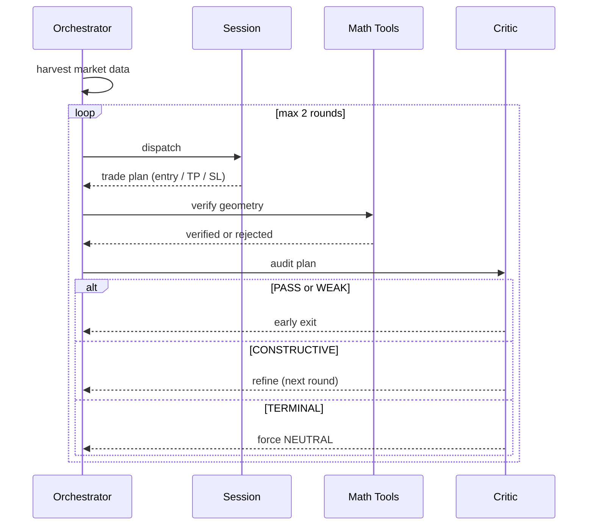
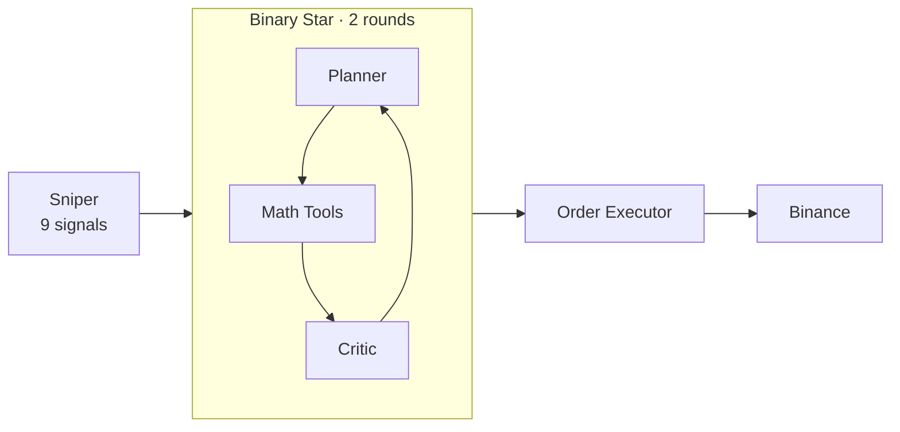
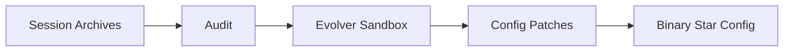

# BinaryStar

[](https://www.python.org/downloads/)

What if two LLMs debated your trade before it hit the market? **Binary Star** pits a Planner against a Critic — one proposes, the other tears it apart. Math Tools (deterministic, no LLM) anchors both to reality. The debate converges in at most two rounds; if they can't agree and the Critic's last verdict is TERMINAL, the system aborts to NEUTRAL rather than forcing a broken trade.

## Binary Star Protocol


```mermaid
sequenceDiagram
    participant BSO as Orchestrator
    participant S as Session
    participant M as Math Tools
    participant C as Critic

    BSO->>BSO: harvest market data
    loop max 2 rounds
        BSO->>S: dispatch
        S-->>BSO: trade plan (entry / TP / SL)
        BSO->>M: verify geometry
        M-->>BSO: verified or rejected
        BSO->>C: audit plan
        alt PASS or WEAK
            C-->>BSO: early exit
        else CONSTRUCTIVE
            C-->>BSO: refine (next round)
        else TERMINAL
            C-->>BSO: force NEUTRAL
        end
    end
```

**Session** proposes a trade thesis with entry, TP, SL, and regime analysis. **Math Tools** deterministically verifies the geometry — RR ratio, ATR distance, structural shielding — before the Critic ever sees it. **Critic** audits across four veto levels:

| Veto | Tags | Effect |
|------|------|--------|
| **PASS** | `PRISTINE`, `JUSTIFIED_INACTION` | Debate ends — trade approved or NEUTRAL accepted |
| **WEAK** | `CVD_ABSORPTION` | Debate ends — minor concern, not worth another round |
| **CONSTRUCTIVE** | `MATH_VIOLATION`, `INACTION_BIAS`, `TREND_STARVATION`, `RETAIL_SQUEEZE`, … | Plan needs revision — another round |
| **TERMINAL** | `ORDER_PHYSICS`, `STRUCTURAL_TRAP`, `ANCHOR_VIOLATION`, `PROTOCOL_VIOLATION` | Plan is unsafe — force NEUTRAL |

Confidence scoring is Python-computed (not LLM-generated) — a 0–100 survival score across 13 sub-dimensions spanning topographical armor, regime & gravity, and temporal & sentiment, plus a debate-history penalty. NEUTRAL always scores 0.

The debate runs on DeepSeek or Gemini (2 adapters), selected via `global_config.yaml` (currently DeepSeek).

## Architecture

**Runtime pipeline** — Sniper finds the moment, Binary Star debates the trade, Guardian protects it:


```mermaid
graph LR
    subgraph Debate["Binary Star · 2 rounds"]
        Planner["Planner"]
        Critic["Critic"]
        Math["Math Tools"]
        Planner --> Math
        Math --> Critic
        Critic --> Planner
    end

    Sniper["Sniper<br/>9 signals"] --> Debate
    Debate --> Executor["Order Executor"]
    Executor --> Binance["Binance"]
```

**Evolution loop** — offline: sessions are audited, patterns are learned, config is improved:


```mermaid
graph LR
    Archives["Session Archives"] --> Audit["Audit"]
    Audit --> Evolver["Evolver Sandbox"]
    Evolver --> Patches["Config Patches"]
    Patches --> Config["Binary Star Config"]
```

## Sniper

9 signals across 5 categories (FLOW, SIZE, ENERGY, STRUCTURAL, POSITIONING) scan on 2-minute pulses. A confluence engine stacks weak signals — `1 − ∏(1 − s)` per direction — toward a regime-adaptive threshold: base 0.34 × per-regime modifier (trending 0.85 → 0.29, ranging 1.0 → 0.34, squeeze 0.75 → 0.26, chaos 1.50 → 0.51). Any single signal at ≥ 0.80 bypasses all cooldown; otherwise an adaptive cooldown (20–60 min) scales with market regime. Sniper's job is entry timing — Binary Star decides the trade.

## Order Management

| Phase | Mechanism |
|-------|-----------|
| Entry | OTOCO — atomic limit entry with nested TP/SL |
| Protection | Guardian OCO — every position wrapped in TP + SL |
| Breakeven | Fee-aware partial close at `rr_target` — SL never moves, remainder exits flat after fees |
| Exit ladder | TP-relative levels — partial TP close, SL locked to a TP-relative offset |
| Trailing | Dynamic trailing SL as ladder levels fire (never loosens) |

## Evolution

Sandboxed meta-evolution ingests audit reports and scores fitness (TP_HIT: 100, disciplined NEUTRAL: 50, SL_HIT: 30, plus forensic modifiers for logic failures, luck, slow capital locks). Winners emit config patches plus semantic prompt refinements that feed back into Binary Star.

## Installation

```bash
pip install -e .
cp .env.example .env   # add BINANCE_API_KEY, BINANCE_API_SECRET, DEEPSEEK_API_KEY
```

## Commands

### Sessions

```bash
python run.py session --symbol BTC -p data/prod
python run.py session --symbol XAUT --write_status -p data/prod   # with dashboard polling
```

### Sniper

```bash
python run.py sniper --symbol BTC,XAUT --llm -p data/prod         # monitor + AI
python run.py sniper --symbol XAUT --trade -p data/prod           # full auto-trading
python run.py sniper --symbol BTC --trade 1000 --risk-per-trade 0.01 -p data/prod
```

### Backtest

```bash
python run.py backtest-run --symbol BTCUSDT --timestamp "2025-06-15T14:30:00Z" -p data/prod
python run.py backtest-run --symbol XAUTUSDT --start T-7d --samples 20 -p data/prod
```

### Audit & Evolution

```bash
python run.py audit -p data/prod                                  # batch audit all sessions
python run.py audit -f sessions/BTCUSDT_20250615.json --force -p data/prod
python run.py evolution --symbol BTC --samples 20 -p data/prod
python run.py patch -f proposals/proposal_20250615.json --symbol XAUT
```
