# Binary Star — Adversarial Debate Protocol

> **Full system documentation of the Session ↔ Critic adversarial reasoning pipeline.**
>
> Last updated: 2026-07-11

---

## Table of Contents

1. [Architecture Overview](#1-architecture-overview)
2. [Debate Lifecycle (Sequence Diagram)](#2-debate-lifecycle)
3. [Shared Truth Bus (binary_star.md)](#3-shared-truth-bus)
4. [Session Agent — The Thesis Engine](#4-session-agent)
5. [Critic Agent — The Audit Engine](#5-critic-agent)
6. [Confidence Calculus](#6-confidence-calculus)
7. [Veto System & CRITIC_CODES](#7-veto-system)
8. [Tactical Repair Patterns](#8-tactical-repair-patterns)
9. [Entry Strategy Decision Tree](#9-entry-strategy-decision-tree)
10. [Deadlock & Risk Analysis](#10-deadlock--risk-analysis)
11. [Evolver — Meta-Optimization](#11-evolver)
12. [Configuration Reference](#12-configuration-reference)

---

## 1. Architecture Overview

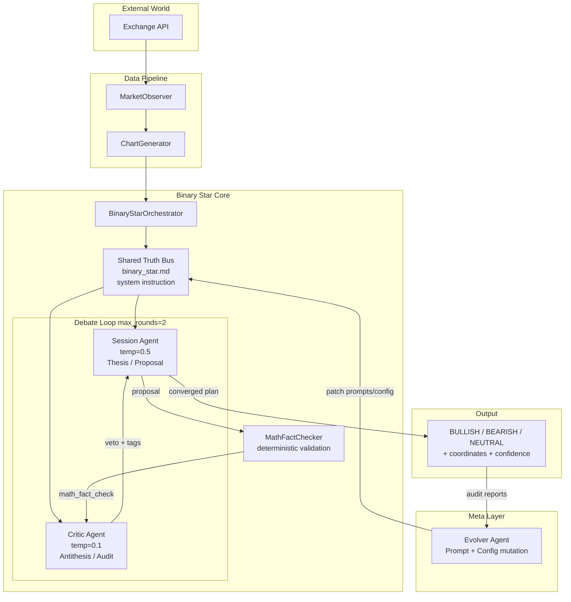

**Core idea**: Two LLM agents debate a trading decision. The Session proposes, the Critic audits. A deterministic math engine prevents hallucination. The debate runs up to 2 rounds, with early exit on agreement.

### Agent Temperature Settings

| Agent | Temperature | Reasoning | Role |
|-------|------------|-----------|------|
| Session (Planning) | 0.5 | high | Creative thesis generation |
| Session (Synthesis) | 0.1 (Critic's temp) | high | Cold, conservative final hardening |
| Critic | 0.1 | null | Deterministic audit, no creativity |
| Evolver | 0.3 | max | Meta-optimization |

---

## 2. Debate Lifecycle

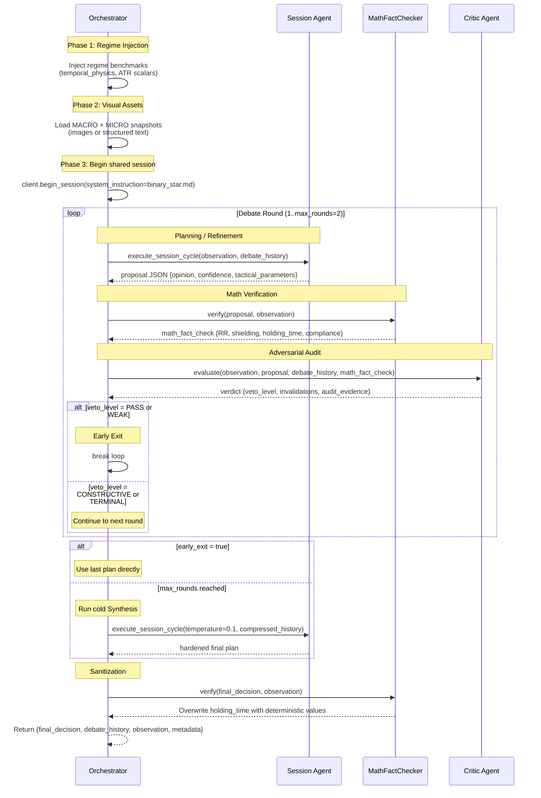

### Round-by-Round Logic

| Round | Session Mode | Critic Context | Expected Outcome |
|-------|-------------|----------------|------------------|
| R1 | `IS_PLANNING` — initial hypothesis | No prior debate history | Usually finds at least CONSTRUCTIVE issues |
| R2 | `IS_SYNTHESIS` — structural hardening | Full R1 + math_fact_check | Should converge or deadlock |

### Debate History Compression

Between rounds, older round data is **aggressively pruned** to save tokens:
- **Latest round**: Full fidelity (plan, critic, math_fact_check — all fields)
- **Older rounds**: Stripped to `opinion`, `confidence_score`, `tactical_parameters`, `veto_level`, `invalidations`, `critic_summary`, `compliance_verdict`
- `reasoning_chain` and `audit_evidence` are pruned from old rounds

---

## 3. Shared Truth Bus

**File**: `config/prompts/binary_star.md`

This is the **system instruction** loaded once at session start and shared across all agents. It defines:

### Core Principles

```
1. MATH SUPREMACY — All spatial reasoning must use MathTools, never manual estimation
2. SINGLE TRUTH — All agents read the same cache simultaneously, no hallucination
3. IMPLICIT SYNC — Agents focus on logic synthesis, not repeating raw telemetry
```

### Standardized Dimensionality

| Dimension | Units | Convention |
|-----------|-------|-------------|
| Price | Absolute USD | — |
| Distance/Buffer | ATR units | `+` = above anchor, `-` = below anchor |
| Flow/Momentum | `cvd_intensity_ratio` [-1, 1] | `+` = buying, `-` = selling |
| Volume Participation | Scalar [0, n] | `1.0` = baseline, `>1.0` = elevated |

### Shared LOGIC_MACROS (evaluated by both agents)

These are **boolean states** derived from telemetry + config thresholds:

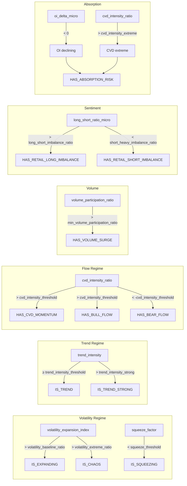

### Visual Context

Charts are delivered as either:
- **Images** (vision-capable models): Dual-panel PNG with candlesticks, volume profile, liquidation heatmap
- **Structured text** (text-only models): The same structural information in markdown text

---

## 4. Session Agent

**File**: `config/prompts/session.md`

The Session Agent is the **logic-driver** — it transforms telemetry into survival-rated execution plans.

### State Machine

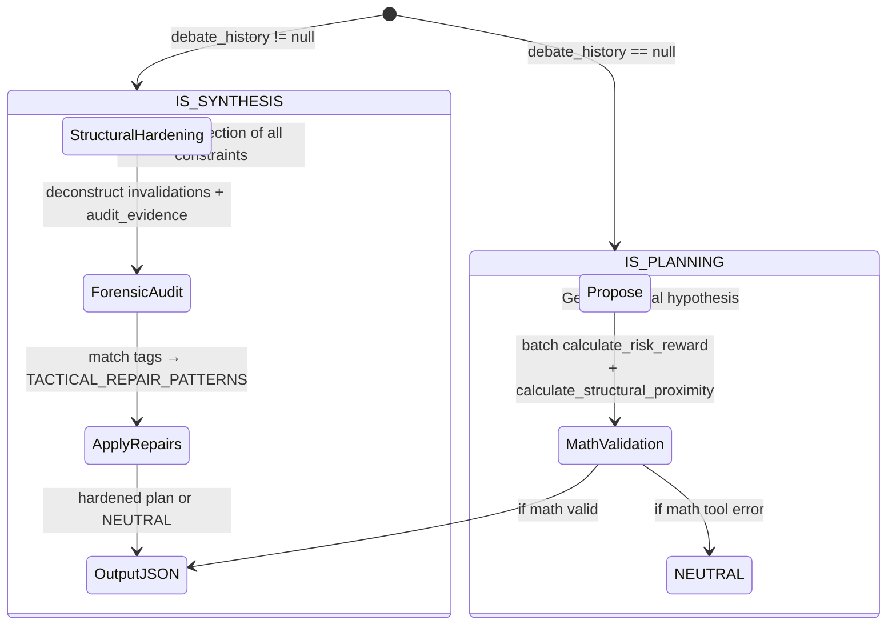

### Mandatory MathTools (must batch before output)

| Tool | Required When | Purpose |
|------|--------------|---------|
| `calculate_risk_reward` | Always (mandatory for IS_PLANNING) | Compute RR ratio |
| `calculate_atr_metrics` | Complex distance normalization | Standardize distances in ATR units |
| `calculate_structural_proximity` | Always (mandatory for IS_PLANNING) | Verify stop_loss is shielded by POC/VAH/VAL |

**Critical rule**: If any MathTool returns an error → immediate abort to NEUTRAL.

### Operating Protocols

```mermaid
graph TD
    subgraph "THE SHIELD LAW (Betweenness)"
        SL[stop_loss] -->|MUST be behind| ANCHOR[HVN / VAH / VAL]
        ANCHOR -->|MUST be between| ENTRY[entry]
        ENTRY -->|and| SL
    end

    subgraph "MOMENTUM EXEMPTION"
        COND1[poc_dist_atr > poc_gravity_atr_distance]
        COND2[IS_TREND_STRONG = TRUE]
        COND1 -->|AND| COND2
        COND2 -->|allowed| DKS[Dynamic Kinetic Shield]
        DKS -->|instead of physical anchor| SL2[ATR-based stop distance]
    end

    subgraph "VOLATILITY ADAPTIVE SHIELDING"
        COND3[IS_CHAOS = TRUE]
        COND3 -->|expand| SL3[stop_loss buffer beyond normal ATR]
        COND3 -->|anchor entry at| LIQ[proximal liquidation clusters]
        COND3 -->|RR discount| RR[chaos_rr_discount applied]
    end

    subgraph "LIMIT ORDER PHYSICS"
        BULL[BULLISH: entry ≤ current_price, tp > entry, sl < entry]
        BEAR[BEARISH: entry ≥ current_price, tp < entry, sl > entry]
        BULL -->|violation| VETO[TERMINAL VETO]
        BEAR -->|violation| VETO
    end
```

### Heuristic Palette (interpretation table)

| Parameter | Signal |
|-----------|--------|
| `poc_dist_atr` | High abs = extreme mean-reversion gravity |
| `volume_participation_ratio` + `HAS_VOLUME_SURGE` | Confirms breakout/reversals |
| `volatility_expansion_index` + `IS_EXPANDING` | Unlocks momentum strategies |
| `squeeze_factor` + `IS_SQUEEZING` | Coiling spring → anticipate violent breakout |
| `trend_intensity` + `IS_TREND_STRONG` | Institutional backing — DO NOT counter-trend |
| `cvd_intensity_ratio` + `HAS_BULL/BEAR_FLOW` | DO NOT fight flow direction |
| `long_short_ratio_micro` | Retail squeeze detection — don't front-run balanced ratios |
| `liquidation_clusters` | Tactical weaponization — anchor entries near clusters; front-run by `breakout_frontrun_atr` |
| `wick_skew_instant` | 0.0 = extreme rejection, 1.0 = pure momentum |

### Entry Strategies

| Strategy | Conditions | Entry Anchor | Stop Anchor | Notes |
|----------|-----------|-------------|-------------|-------|
| **Momentum Surge** | `IS_TREND_STRONG` + `HAS_CVD_MOMENTUM` both TRUE | `current_price` ± 0.2×ATR | Dynamic Kinetic Shield | Exempt from structural anchoring |
| **Shallow Pullback DLE** | `IS_TREND_STRONG` + `HAS_CVD_MOMENTUM` true, structure within `max_entry_distance_atr` | Nearest HVN/POC | Physical anchor behind HVN | Standard trend-following |
| **Exhaustion Fading (DLE)** | CVD/price divergence or wick rejection near boundary | Proximal HVN | Physical anchor | Entry MUST be within `max_entry_distance_atr` ATR |
| **Sweep & Fade** | Price pierced liquidation cluster + momentum death confirmed | Pierced liquidation cluster | Just beyond extreme wick | Counter-trend reversal, tight stop |
| **Liquidity Hunt** | `IS_SQUEEZING` | Near VAH/VAL | Beyond VAH/VAL | Target vacuum beyond boundaries |
| **Hit-and-Run (CHAOS)** | `IS_CHAOS` | Proximal liquidation cluster | Widened buffer | Compressed TP to first boundary only |

### Key Constraints (Hard Limits)

| Constraint | Value | Purpose |
|-----------|-------|---------|
| `max_entry_distance_atr` | 1.2 ATR | Hard limit — entry cannot exceed this distance from current price |
| `min_rr_ranging` | 1.1 | Minimum RR for ranging regimes |
| `min_rr_trending` | 1.25 | Minimum RR for trending regimes |
| `chaos_rr_discount` | 0.35 (35%) | RR threshold reduction during IS_CHAOS |
| `breakout_frontrun_atr` | 0.2 | Front-run offset for liquidation clusters |

---

## 5. Critic Agent

**File**: `config/prompts/critic.md`

The Critic is the **logical auditor** — it identifies defects, structural gaps, and contradictions. It holds TERMINAL VETO power over unsafe executions.

### Audit Flow

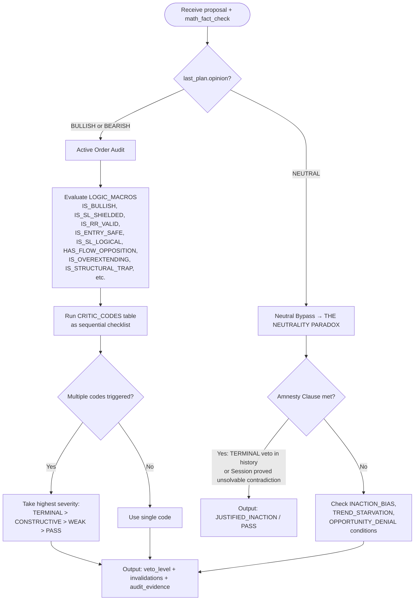

### The Neutrality Paradox

When Session outputs NEUTRAL, the Critic faces a paradox: is this **disciplined inaction** or **cowardice**?

```
IF Amnesty Clause:
  - A TERMINAL veto exists in any prior round, OR
  - Session's reasoning proves repairing a previous CONSTRUCTIVE veto
    creates an unsolvable mathematical contradiction
  THEN: MUST NOT trigger INACTION_BIAS, TREND_STARVATION, OPPORTUNITY_DENIAL
  OUTPUT: [JUSTIFIED_INACTION] / PASS

IF Amnesty Clause NOT met:
  MUST check the three CONSTRUCTIVE codes:
  1. [INACTION_BIAS] — squeeze < threshold AND volume surge, OR extreme POC distance
  2. [TREND_STARVATION] — expanding + trending + not chaos + neutral
  3. [OPPORTUNITY_DENIAL] — flow dominant + no absorption risk + neutral
```

### Critic-Specific LOGIC_MACROS

The Critic evaluates **additional** macros beyond the shared ones:

| Macro | Definition |
|-------|-----------|
| `IS_ENTRY_SAFE` | BULLISH: entry ≤ current_price; BEARISH: entry ≥ current_price |
| `IS_SL_LOGICAL` | BULLISH: sl < entry; BEARISH: sl > entry |
| `IS_SL_SHIELDED` | From `compliance_verdict.sl_is_shielded` |
| `IS_RR_VALID` | From `compliance_verdict.rr_is_valid` |
| `IS_OVEREXTENDING` | abs(poc_dist_atr) > gravity_distance AND correct direction AND NOT (strong trend + flow) |
| `HAS_FLOW_OPPOSITION` | CVD or trend opposes the trade direction |
| `IS_VOLATILITY_CHOP` | Expanding + low trend + not squeezing |
| `HAS_LIQUIDITY_VOID` | Nearest LVN within structural buffer |
| `IS_STRUCTURAL_TRAP` | Entry hits volume vacuum (vacuum_score > threshold) |
| `HAS_ANCHOR_VIOLATION` | Not shielded OR anchor not between entry+sl OR sl too close to liq cluster |
| `HAS_PROTOCOL_VIOLATION` | State Reversion detected — Session reverted to previously vetoed plan |
| `IS_HOLDING_TOO_LONG` | projected_holding_hours > max_holding_hours × temporal_weight_factor |

### Key Design Rule

> **THE TABLE IS ABSOLUTE**: The `CRITIC_CODES` table is the **exclusive** source of Veto mandates. The Critic cannot invent new veto reasons. This prevents "veto creep" where the Critic becomes overly restrictive.

---

## 6. Confidence Calculus

The confidence score (0–100) is computed **from scratch each session** (no cross-session momentum). It represents **survival probability**, not thesis conviction.

### Scoring Framework

```
confidence_score = D1 + D2 + D3 - debate_penalty
clamped to [0, 100]
```

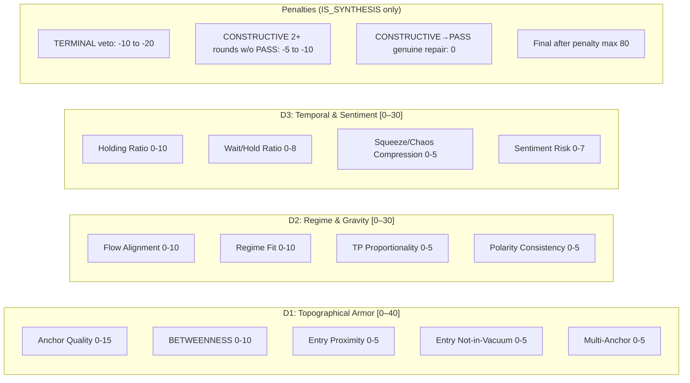

### Zero-Score Overrides

- `opinion == NEUTRAL` → 0
- `rr_is_valid == false` → 0

### Scoring Detail

**D1: Topographical Armor (0–40)** — "Will the stop-loss survive?"

| Sub-item | Range | Criteria |
|----------|-------|----------|
| Anchor Quality | 0–15 | HVN strength: ≥0.8 → 12-15, 0.5-0.8 → 8-11, <0.5/LVN → 3-7, none → 0. Deductions: -3 per liquidation cluster between anchor and stop-loss; -5 if anchor > 2 ATR from stop-loss |
| BETWEENNESS | 0–10 | Anchor strictly between entry and stop: gap ≥ 0.3 ATR both sides → 10, boundary-adjacent → 5-8, DKS-substituted → 3-5, none → 0 |
| Entry Proximity | 0–5 | Distance ≤ `max_entry_distance_atr` ATR. ≤0.5 → 5, 0.5-1.2 → 3-4, 1.2-max → 1-2, exceeds → 0 |
| Entry Not-in-Vacuum | 0–5 | On HVN/POC → 5, LVN ≥ `structural_buffer_atr` → 3-4, vacuum+nearby HVN → 1-2, pure vacuum → 0 |
| Multi-Anchor | 0–5 | Second HVN/POC ≥ 0.5 → 5, weak or > 3 ATR distal → 2-3, none → 0 |

**D2: Regime & Gravity (0–30)** — "Does the regime support this?"

| Sub-item | Range | Criteria |
|----------|-------|----------|
| Flow Alignment | 0–10 | Both strong+aligned → 10, one strong → 5-8, both neutral → 2-4, contradiction → 0 |
| Regime Fit | 0–10 | Canonical → 10, defensible → 4-7, mismatch → 0-3. **GRAVITY CAP**: if `poc_dist_atr` > `poc_gravity_atr_distance` AND NOT `IS_TREND_STRONG` → cap at 5 |
| TP Proportionality | 0–5 | Squeeze/chaos (first boundary) → 5, trending/ranging → 3-4, excessive → 0-2 |
| Polarity Consistency | 0–5 | All consistent → 5, minor contradiction → 2-4, major → 0 |

**D3: Temporal & Sentiment (0–30)** — "Timing + crowd check"

| Sub-item | Range | Criteria |
|----------|-------|----------|
| Holding Ratio | 0–10 | ≈0.7-1.5 → 8-10, 0.5-0.7 or 1.5-2.0 → 4-7, >2.0 or <0.3 → 1-3 |
| Wait/Hold | 0–8 | ≤0.15 → 8, 0.15-0.30 → 5-7, 0.30-0.50 → 2-4, >0.50 → 0-1 |
| Squeeze/Chaos Compression | 0–5 | Tight → 5, loose → 2-3, ignored → 0 |
| Sentiment Risk | 0–7 | Balanced → 7, retail extreme aligned → 4-6, retail extreme against → 0-2, funding extreme against → -2 |

### Key Insight: The Confidence Paradox

The scoring rubric is **extremely detailed** — 13 sub-items each with numeric bands. In practice, the LLM must score these from telemetry without additional tool calls. This creates a tension:

- **Richness vs Reliability**: The more detailed the rubric, the more surface area for hallucination
- **Start-from-zero**: Confidence cannot drift upward across sessions — each session is a fresh calibration
- **Score rarely exceeds 80 after debate penalties**: The cap at 80 for any debated plan ensures humility
- **Entry threshold is 65** (configured in `global_config.yaml`)

---

## 7. Veto System

### Veto Level Hierarchy

```
TERMINAL  ████████████  Fatal — plan must be abandoned or fundamentally restructured
CONSTRUCTIVE ████████    Should fix — plan has issues but direction may be salvageable
WEAK       ████         Minor concern — plan passes but has noted risk
PASS       ██           Clean — no issues found
```

### Complete CRITIC_CODES Table

| # | Category | Trigger Condition | Tag | Level |
|---|----------|-------------------|-----|-------|
| 1 | Pristine | `IS_SL_SHIELDED` AND `IS_RR_VALID` | `[PRISTINE]` | PASS |
| 2 | Justified Inaction | NEUTRAL + Neutrality Paradox criteria met | `[JUSTIFIED_INACTION]` | PASS |
| 3 | Order Physics | NOT `IS_ENTRY_SAFE` OR NOT `IS_SL_LOGICAL` | `[ORDER_PHYSICS]` | **TERMINAL** |
| 4 | Structural Violation | `IS_STRUCTURAL_TRAP` (entry in volume vacuum) | `[STRUCTURAL_TRAP]` | **TERMINAL** |
| 5 | Anchor/Shield Failure | `HAS_ANCHOR_VIOLATION` | `[ANCHOR_VIOLATION]` | **TERMINAL** |
| 6 | Logic Loop | `HAS_PROTOCOL_VIOLATION` (State Reversion) | `[PROTOCOL_VIOLATION]` | **TERMINAL** |
| 7 | Retail Long Squeeze | `HAS_BEAR_SENTIMENT` AND BULLISH | `[RETAIL_LONG_SQUEEZE]` | **TERMINAL** |
| 8 | Retail Short Squeeze | `HAS_BULL_SENTIMENT` AND BEARISH | `[RETAIL_SHORT_SQUEEZE]` | **TERMINAL** |
| 9 | Math Violation | NOT `IS_RR_VALID` OR ATR volatility illogical | `[MATH_VIOLATION]` | CONSTRUCTIVE |
| 10 | Inaction Bias | NEUTRAL + squeeze low + volume surge, OR extreme POC distance | `[INACTION_BIAS]` | CONSTRUCTIVE |
| 11 | Opportunity Denial | NEUTRAL + flow dominant + no absorption risk | `[OPPORTUNITY_DENIAL]` | CONSTRUCTIVE |
| 12 | Trend Starvation | Expanding + trending + not chaos + NEUTRAL | `[TREND_STARVATION]` | CONSTRUCTIVE |
| 13 | Gravity Exhaustion | `IS_OVEREXTENDING` (too far from POC, no trend backup) | `[GRAVITY_EXHAUSTION]` | CONSTRUCTIVE |
| 14 | Volatility Chop | Expanding + low trend + not squeezing + has direction | `[VOLATILITY_CHOP]` | CONSTRUCTIVE |
| 15 | Flow Violation | Flow opposes direction + no absorption + not squeezing | `[FLOW_VIOLATION]` | CONSTRUCTIVE |
| 16 | Expansion Anomaly | `IS_HOLDING_TOO_LONG` + has direction | `[OVER_EXTENSION]` | CONSTRUCTIVE |
| 17 | Liquidity Void | `HAS_LIQUIDITY_VOID` (LVN too close) | `[LIQUIDITY_VOID]` | CONSTRUCTIVE |
| 18 | Absorption Trap | Absorption risk + flow opposition | `[CVD_ABSORPTION]` | WEAK |

### Debate Outcome Matrix

| Final Veto | Early Exit? | Meaning |
|-----------|-------------|---------|
| PASS | Yes | Clean plan, no issues |
| WEAK | Yes | Passes with noted risk |
| CONSTRUCTIVE | No — continues to next round | Fixable issues |
| TERMINAL | No — continues to next round | Must fundamentally restructure |
| CONSTRUCTIVE + TERMINAL mix | No — continues | TERMINAL takes priority |

---

## 8. Tactical Repair Patterns

When the Session receives Critic feedback (in IS_SYNTHESIS mode), it must apply the corresponding repair protocol for **every** tag found.

| Critic Tag | Repair Protocol |
|-----------|----------------|
| `[ORDER_PHYSICS]` | Reset coordinates. BULLISH: entry ≤ current_price, sl < entry, tp > entry. BEARISH inverse. |
| `[STRUCTURAL_TRAP]` | Relocate entry to nearest HVN, POC, or VAH/VAL. Avoid LVN vacuums. |
| `[ANCHOR_VIOLATION]` | Move stop_loss distally behind next valid structural anchor. Ensure betweenness. |
| `[MATH_VIOLATION]` | Recalibrate via MathTools to balance risk/ATR scaling. Adhere to minimum RR. |
| `[RETAIL_LONG_SQUEEZE]` | Polarity Pivot to BEARISH. Only if price testing/rejecting VAH. Target long liquidation cascade. |
| `[RETAIL_SHORT_SQUEEZE]` | Polarity Pivot to BULLISH. Only if price testing/rejecting VAL. Target short liquidation cascade. |
| `[CVD_ABSORPTION]` | Abort Momentum. Move to deep DLE at nearest HVN/POC. |
| `[GRAVITY_EXHAUSTION]` | If lacks momentum → Mean-Reversion DLE targeting POC. If institutional flow confirmed → Shallow Pullback DLE. If critic repeats this veto after Shallow Pullback at max distance → output NEUTRAL. |
| `[FLOW_VIOLATION]` | Polarity Pivot to align with CVD or abort to NEUTRAL. Don't "deepen entry" to absorb counter-flow. |
| `[VOLATILITY_CHOP]` | Tighten take_profit to first structural boundary. If CVD dominant maintain direction, else NEUTRAL. |
| `[INACTION_BIAS]` | Re-read telemetry; execute Mean-Reversion DLE or Vacuum Flip. |
| `[OPPORTUNITY_DENIAL]` | Execute Momentum Entry aligned with CVD, or shallow DLE. Entry MUST be anchored to valid structure. |
| `[TREND_STARVATION]` | Shift to shallow pullback or Momentum Entry. No deep DLEs. |
| `[OVER_EXTENSION]` | Compress take_profit closer to entry. Don't sink entry excessively deep (Phantom Order risk). |
| `[LIQUIDITY_VOID]` | Move stop_loss distal to clear the vacuum. Anchor behind solid HVN. |
| `[PROTOCOL_VIOLATION]` | Immediate Paradigm Shift. Radically change anchor, target, or stance. |
| `[PRISTINE]` | Maintain current trajectory. No repair required. |
| `[JUSTIFIED_INACTION]` | Maintain NEUTRAL. No action required. |

### Explicit Termination Path

The `[GRAVITY_EXHAUSTION]` → NEUTRAL chain is the only **prompt-hardcoded termination**:

```
R1: Session proposes DLE targeting POC
R1: Critic → [GRAVITY_EXHAUSTION] (price too far from POC)
R2: Session applies Shallow Pullback DLE at max_entry_distance_atr
R2: Critic → [GRAVITY_EXHAUSTION] again
R2: Session MUST output NEUTRAL — trade is structurally invalid
```

---

## 9. Entry Strategy Decision Tree

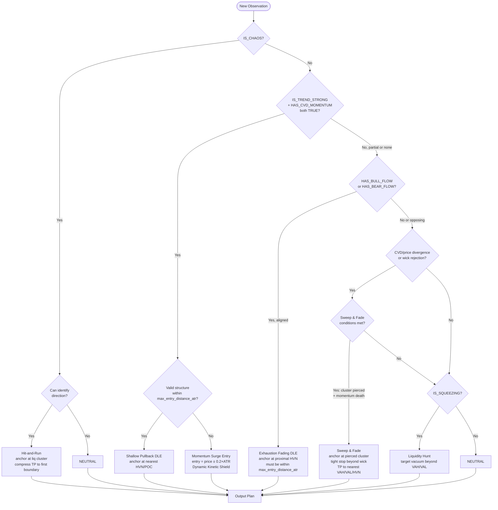

### Strategy Selection Constraints

| Constraint | Rule |
|-----------|------|
| No counter-trend against `IS_TREND_STRONG` | Don't short in strong uptrend |
| No fighting CVD flow | Don't go BULLISH with HAS_BEAR_FLOW, or BEARISH with HAS_BULL_FLOW |
| Momentum needs dual confirmation | `IS_TREND_STRONG` AND `HAS_CVD_MOMENTUM` must both be TRUE |
| CHAOS prohibits momentum | Directional momentum execution strictly prohibited |
| Phantom Order prevention | Entry MUST be within `max_entry_distance_atr` ATR of current price |
| DLE requires structure | Must anchor at HVN/POC — no vacuum entries |

---

## 10. Deadlock & Risk Analysis

### Known Deadlock Scenarios


### Complexity Concerns

| Area | Risk | Severity |
|------|------|----------|
| **17 repair patterns** | Session must match all tags to correct repairs. LLMs can mis-map or skip. | Medium |
| **13 confidence sub-items** | Detailed numeric rubric creates hallucination surface area. Scores may not be reproducible. | Medium |
| **15+ LOGIC_MACROS** | Boolean states depend on correct telemetry + threshold comparison. If one telemetry field is wrong, cascading misclassification. | Medium |
| **CRITIC_CODES table** | 18 rows with overlapping conditions. Multiple simultaneous triggers resolved by severity — but the LLM must evaluate them correctly. | Medium |
| **Neutrality Paradox** | Complex conditional: amnesty check → confluence audit → three code checks. Easy for the Critic to misapply. | **High** |
| **GRAVITY_EXHAUSTION double-veto** | The only hardcoded termination path, but depends on the Critic correctly repeating the same tag twice. | Medium |
| **2-round limit** | With max_rounds=2, only one repair cycle is possible. Complex plans with multiple issues may not converge. | Low (by design — prevents infinite debate) |
| **Visual context interpretation** | Both agents must integrate chart images/text. Different models have different vision capabilities — inconsistent interpretation risk. | Medium |
| **PROTOCOL_VIOLATION detection** | The Critic must detect "State Reversion" from compressed debate history. With max_rounds=2, this is rare but possible. | Low |

### Mitigations

| Risk | Mitigation |
|------|-----------|
| Hallucinated coordinates | MathFactChecker overrides with deterministic values |
| Phantom orders | `max_entry_distance_atr` hard limit + Session explicit rule |
| Endless debate | `max_rounds=2` hard cap + cold synthesis fallback |
| Critic veto creep | CRITIC_CODES table is exclusive — no discretionary vetos |
| Overfitting | Evolver anti-overfitting guards (IS_OVERFIT_RISK, surface area minimization) |
| LLM math errors | MathTools are Python-native, not LLM-computed |

### The Critical Unresolved Path

The **Neutrality Paradox** is the most complex single logic branch in the system:

```
Critic receives NEUTRAL plan
├── Check Amnesty Clause
│   ├── TERMINAL veto in any prior round? → YES → [JUSTIFIED_INACTION] / PASS
│   ├── Session proved unsolvable contradiction? → YES → [JUSTIFIED_INACTION] / PASS
│   └── Neither → Continue to Confluence Audit
├── Confluence Audit
│   ├── squeeze_factor < squeeze_audit_threshold AND HAS_VOLUME_SURGE → [INACTION_BIAS]
│   ├── abs(poc_dist_atr) > poc_gravity_atr_distance → [INACTION_BIAS]
│   ├── IS_EXPANDING AND NOT IS_CHAOS AND IS_TREND_STRONG → [TREND_STARVATION]
│   └── HAS_FLOW_DOMINANCE AND NOT HAS_ABSORPTION_RISK → [OPPORTUNITY_DENIAL]
└── Output: highest severity code found, or PASS if none triggered
```

The Critic must correctly evaluate:
1. Whether any prior round had a TERMINAL veto
2. Whether the Session's reasoning proves a mathematical contradiction
3. Three separate confluence conditions with their own sub-conditions

This is **a lot of logic to push into a single LLM inference call** with temperature=0.1.

---

## 11. Evolver

**File**: `config/prompts/evolver.md`

The Evolver is the **meta-optimizer** — it watches audit reports and mutates the prompts and config to eliminate systemic failures.

### When It Triggers

```
HAS_SYSTEMIC_PATHOLOGY = IS_BATCH_SIGNIFICANT AND IS_FAILURE_RATIO_ALARM
  where:
    IS_BATCH_SIGNIFICANT = (non-PROFIT outcomes) >= 2
    IS_FAILURE_RATIO_ALARM = (non-PROFIT / total) > 0.2
```

### Mutation Vectors

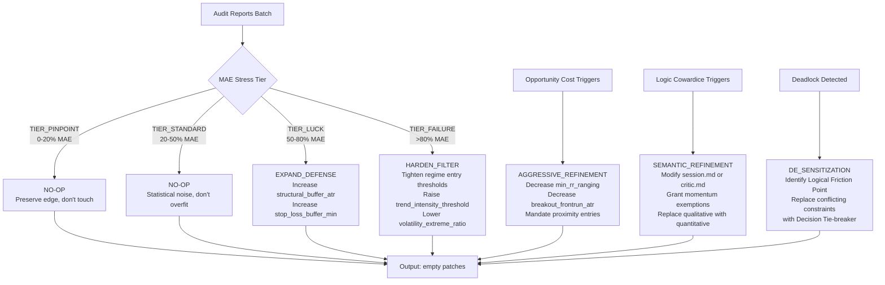

### Anti-Overfitting Guards

| Rule | Mechanism |
|------|-----------|
| **Statistical Significance** | `HAS_SYSTEMIC_PATHOLOGY` must be TRUE — both minimum count AND ratio |
| **Surface Area Minimization** | Prefer parameter hardening over instruction bloating |
| **Regression Veto** | `IS_OVERFIT_RISK` = fix would invalidate >5% of pristine success records → discard |
| **Convergence Bias** | Tighten existing filters before adding new ones |

### Patch Types

| Type | Target | Example |
|------|--------|---------|
| `config_patch` | Numeric threshold in YAML config | `min_rr_ranging: 1.1 → 1.3` |
| `semantic_refinement` | Byte-exact text replacement in prompt .md files | Replace instruction paragraph with improved version |

---

## 12. Configuration Reference

### Key Files

| File | Purpose |
|------|---------|
| `config/prompts/binary_star.md` | Shared system preamble (Truth Bus protocol) |
| `config/prompts/session.md` | Session Agent role prompt |
| `config/prompts/critic.md` | Critic Agent role prompt |
| `config/prompts/evolver.md` | Evolver Agent role prompt |
| `config/global_config.yaml` | LLM config, Binary Star params, Sniper params, Guardian params |
| `config/strategy_config.yaml` | Strategy params, regime thresholds, risk boundaries, temporal physics |
| `config/symbol_config.yaml` | Per-symbol overrides |

### Key Python Files

| File | Role |
|------|------|
| `src/agent/binary_star_orchestrator.py` | Main orchestrator — wires everything together, runs the flow |
| `src/agent/debate_loop.py` | Round-by-round debate management, history compression |
| `src/agent/session_agent.py` | Session Agent — builds prompts, executes inference cycles |
| `src/agent/critic_agent.py` | Critic Agent — builds audit context, executes evaluation |
| `src/agent/base_agent.py` | Base class — tool dispatch, retry logic, JSON parsing |
| `src/analyzer/math_fact_checker.py` | Deterministic math validation (RR, shielding, holding time) |
| `src/analyzer/market_observer.py` | Gathers market telemetry from exchange |

### Critical Thresholds Summary

| Parameter | Value | Location | Purpose |
|-----------|-------|----------|---------|
| `max_rounds` | 2 | global_config.yaml | Hard debate round limit |
| `confidence_threshold` | 65 | global_config.yaml | Entry gate — live config value |
| `trend_intensity_strong` | 0.35 | strategy_config.yaml | Threshold for momentum exemptions |
| `volatility_extreme_ratio` | 2.2 | strategy_config.yaml | CHAOS classification |
| `max_entry_distance_atr` | 1.2 | strategy_config.yaml | Phantom order prevention |
| `min_rr_ranging` | 1.1 | strategy_config.yaml | Minimum RR — ranging |
| `min_rr_trending` | 1.25 | strategy_config.yaml | Minimum RR — trending |
| `chaos_rr_discount` | 0.35 | strategy_config.yaml | RR reduction during CHAOS |
| `poc_gravity_atr_distance` | 3.5 | strategy_config.yaml | Distance at which POC gravity weakens |
| `structural_buffer_atr` | 0.84 | strategy_config.yaml | Protective margin behind anchors |
| `Session temperature` | 0.5 | global_config.yaml | Creative planning temperature |
| `Critic temperature` | 0.1 | global_config.yaml | Deterministic audit temperature |

---

## Appendix A: Prompt Injection Flow

```mermaid
flowchart TD
    subgraph "System Instruction (loaded once per session)"
        BS[binary_star.md<br/>SHARED_TRUTH_BUS_PROTOCOL<br/>+ SHARED LOGIC_MACROS<br/>+ VISUAL_CONTEXT INTERPRETATION]
    end

    subgraph "User Prompt (per inference cycle)"
        subgraph "Session Agent Context"
            S_OBS[observation_json<br/>Market Map from Observer]
            S_HIST[debate_history_json<br/>Nullable, compressed]
            S_INTENT[strategy_intent]
            S_CONFIG[Risk + Regime params<br/>min_rr, structural_buffer_atr, etc.]
            S_VISUAL[VISUAL_CONTEXT text<br/>if text-only model]
        end

        subgraph "Critic Agent Context"
            C_OBS[observation_json]
            C_PLAN[last_plan<br/>Session's proposal]
            C_MATH[math_fact_check<br/>Deterministic validation]
            C_HIST[debate_history_json]
            C_CONFIG[Regime + Risk + Temporal params]
            C_VISUAL[VISUAL_CONTEXT text]
        end
    end

    BS --> SESSION_INFERENCE[Session LLM Call]
    S_OBS --> SESSION_INFERENCE
    S_HIST --> SESSION_INFERENCE
    S_INTENT --> SESSION_INFERENCE
    S_CONFIG --> SESSION_INFERENCE
    S_VISUAL --> SESSION_INFERENCE

    BS --> CRITIC_INFERENCE[Critic LLM Call]
    C_OBS --> CRITIC_INFERENCE
    C_PLAN --> CRITIC_INFERENCE
    C_MATH --> CRITIC_INFERENCE
    C_HIST --> CRITIC_INFERENCE
    C_CONFIG --> CRITIC_INFERENCE
    C_VISUAL --> CRITIC_INFERENCE
```

Each inference cycle creates a new user prompt with the full context — the system instruction (binary_star.md) is loaded once at session start via `client.begin_session()`.

---

## Appendix B: Tool Call Flow

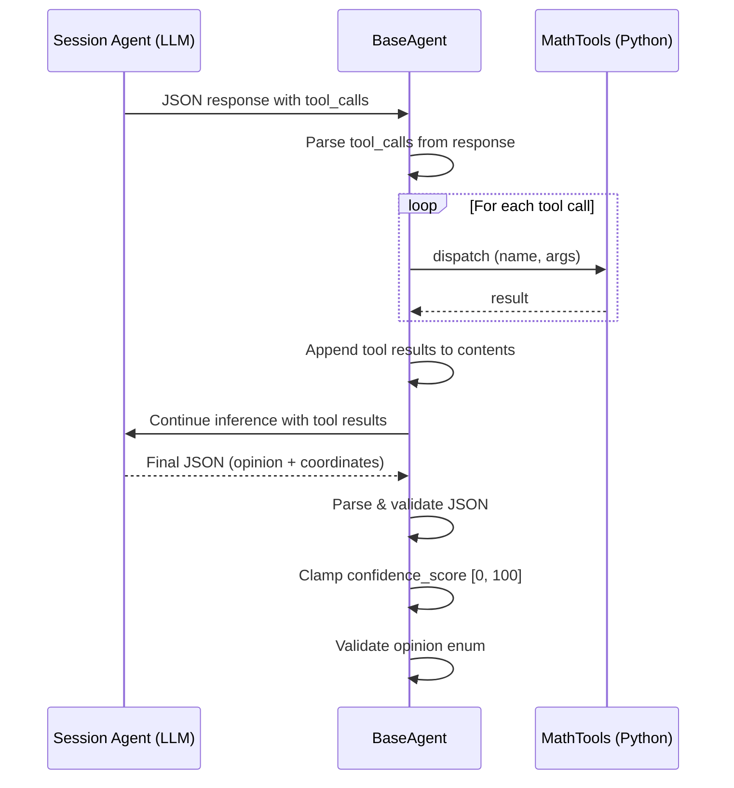

**Key detail**: `BaseAgent._execute_ai_cycle` runs up to `max_tool_iterations=5` rounds of tool calls. The LLM can call tools, receive results, and call more tools — but the Session Agent is instructed to **batch all tool calls** and wait for results before outputting final JSON.

---

## Appendix C: Token Economy

| Mechanism | How |
|-----------|-----|
| **Shared session** | `client.begin_session()` — system prompt cached once, reused across rounds |
| **History compression** | Old rounds stripped of reasoning_chain, audit_evidence, full math_fact_check |
| **Visual context** | Images loaded once, text injected once per cycle |
| **Debate limit** | 2 rounds max — prevents context explosion |
| **Prompt templates** | Parameter injection via `safe_format` — no manual string building |

---

> **Document version**: matches code at `cc3f6b4`
> Generated from: `config/prompts/{binary_star,session,critic,evolver}.md`, `src/agent/{binary_star_orchestrator,debate_loop,session_agent,critic_agent,base_agent}.py`, `src/analyzer/math_fact_checker.py`, `config/{global_config,strategy_config}.yaml`
